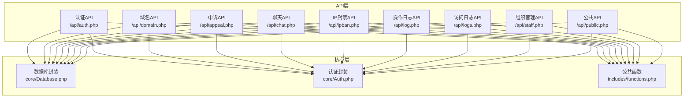
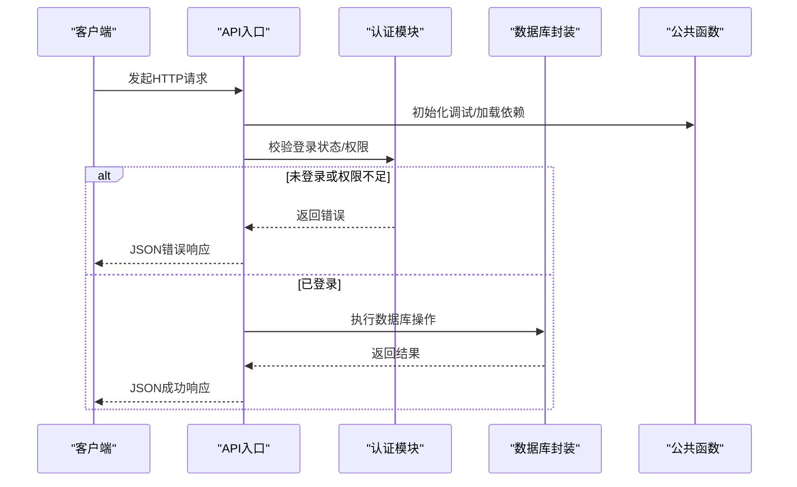
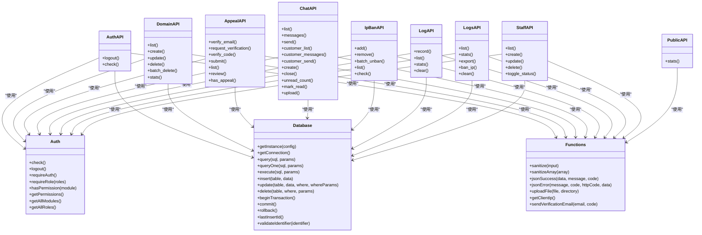

# API接口文档

<cite>
**本文档引用的文件**
- [auth.php](file://public/api/auth.php)
- [domain.php](file://public/api/domain.php)
- [appeal.php](file://public/api/appeal.php)
- [chat.php](file://public/api/chat.php)
- [ipban.php](file://public/api/ipban.php)
- [log.php](file://public/api/log.php)
- [logs.php](file://public/api/logs.php)
- [staff.php](file://public/api/staff.php)
- [public.php](file://public/api/public.php)
- [Database.php](file://core/Database.php)
- [Auth.php](file://core/Auth.php)
- [functions.php](file://includes/functions.php)
</cite>

## 目录
1. [简介](#简介)
2. [项目结构](#项目结构)
3. [核心组件](#核心组件)
4. [架构总览](#架构总览)
5. [详细组件分析](#详细组件分析)
6. [依赖关系分析](#依赖关系分析)
7. [性能考虑](#性能考虑)
8. [故障排查指南](#故障排查指南)
9. [结论](#结论)
10. [附录](#附录)

## 简介
本文件为“DNS拦截响应平台”的完整API接口文档，涵盖认证、域名管理、申诉处理、聊天通信、IP封禁、日志管理、用户管理等模块的REST接口规范。文档提供HTTP方法、URL模式、请求参数、响应格式、错误处理、分页查询、数据验证、速率限制、CSRF防护等通用规则，并给出调用示例与客户端集成建议。

## 项目结构
系统采用PHP单入口API设计，核心位于public/api目录，业务逻辑按模块拆分；核心基础设施位于core目录（数据库、认证、速率限制等），公共函数位于includes/functions.php。

图表来源
- [auth.php:1-126](file://public/api/auth.php#L1-L126)
- [domain.php:1-539](file://public/api/domain.php#L1-L539)
- [appeal.php:1-789](file://public/api/appeal.php#L1-L789)
- [chat.php:1-800](file://public/api/chat.php#L1-L800)
- [ipban.php:1-404](file://public/api/ipban.php#L1-L404)
- [log.php:1-454](file://public/api/log.php#L1-L454)
- [logs.php:1-595](file://public/api/logs.php#L1-L595)
- [staff.php:1-442](file://public/api/staff.php#L1-L442)
- [public.php:1-87](file://public/api/public.php#L1-L87)
- [Database.php:1-400](file://core/Database.php#L1-L400)
- [Auth.php:1-272](file://core/Auth.php#L1-L272)
- [functions.php:1-998](file://includes/functions.php#L1-L998)

章节来源
- [auth.php:1-126](file://public/api/auth.php#L1-L126)
- [domain.php:1-539](file://public/api/domain.php#L1-L539)
- [appeal.php:1-789](file://public/api/appeal.php#L1-L789)
- [chat.php:1-800](file://public/api/chat.php#L1-L800)
- [ipban.php:1-404](file://public/api/ipban.php#L1-L404)
- [log.php:1-454](file://public/api/log.php#L1-L454)
- [logs.php:1-595](file://public/api/logs.php#L1-L595)
- [staff.php:1-442](file://public/api/staff.php#L1-L442)
- [public.php:1-87](file://public/api/public.php#L1-L87)
- [Database.php:1-400](file://core/Database.php#L1-L400)
- [Auth.php:1-272](file://core/Auth.php#L1-L272)
- [functions.php:1-998](file://includes/functions.php#L1-L998)

## 核心组件
- 认证与权限：基于SSO的管理员认证，支持角色与模块级权限控制。
- 数据库封装：统一的PDO封装，提供查询、插入、更新、删除、事务等能力。
- 公共函数：输入清理、CSRF防护、文件上传、JSON响应、邮件发送等工具函数。
- 速率限制：基于数据库的限流器，用于验证码、提交、消息发送等场景。
- 日志系统：操作日志与访问日志双轨记录，支持审计与导出。

章节来源
- [Auth.php:1-272](file://core/Auth.php#L1-L272)
- [Database.php:1-400](file://core/Database.php#L1-L400)
- [functions.php:1-998](file://includes/functions.php#L1-L998)

## 架构总览
系统采用前后端分离的API设计，所有接口返回JSON格式响应，管理员接口均需登录认证。核心流程如下：

图表来源
- [auth.php:1-126](file://public/api/auth.php#L1-L126)
- [domain.php:1-539](file://public/api/domain.php#L1-L539)
- [appeal.php:1-789](file://public/api/appeal.php#L1-L789)
- [chat.php:1-800](file://public/api/chat.php#L1-L800)
- [ipban.php:1-404](file://public/api/ipban.php#L1-L404)
- [log.php:1-454](file://public/api/log.php#L1-L454)
- [logs.php:1-595](file://public/api/logs.php#L1-L595)
- [staff.php:1-442](file://public/api/staff.php#L1-L442)
- [public.php:1-87](file://public/api/public.php#L1-L87)
- [Database.php:1-400](file://core/Database.php#L1-L400)
- [Auth.php:1-272](file://core/Auth.php#L1-L272)
- [functions.php:1-998](file://includes/functions.php#L1-L998)

## 详细组件分析

### 认证API（/api/auth.php）
- 功能：管理员退出、登录状态检查。
- 认证方式：SSO登录，不支持密码登录。
- CSRF防护：所有修改类请求均需CSRF校验。
- 速率限制：check接口建议添加限流（注释中给出建议）。

接口定义
- POST /api/auth.php?action=logout
  - 方法：POST
  - 参数：无
  - 响应：成功返回{"success": true, "code": 0, "message": "已退出登录", "data": null}
  - 错误：403（CSRF失败）、500（系统错误）

- GET /api/auth.php?action=check
  - 方法：GET
  - 参数：无
  - 响应：{"success": true, "code": 0, "message": "已登录"/"未登录", "data": {"logged_in": true/false, "user_info": {...}}}
  - 错误：405（方法不允许）、500（系统错误）

章节来源
- [auth.php:1-126](file://public/api/auth.php#L1-L126)

### 域名管理API（/api/domain.php）
- 功能：域名的增删改查、批量删除、统计查询。
- 认证：管理员登录。
- CSRF防护：所有修改类请求均需CSRF校验。
- 分页：支持page、per_page参数，默认每页20条，最大100条。
- 过滤：支持type/expired、status、search等筛选。

接口定义
- GET /api/domain.php?action=list
  - 参数：page、per_page、type、status、search
  - 响应：{"success": true, "data": {"domains": [...], "total": n, "page": n, "per_page": n}}

- POST /api/domain.php?action=create
  - 参数：domain_name、type(expired|violation)、expire_date、customer_email、violation_reason
  - 响应：{"success": true, "data": {"id": 新建ID}}
  - 错误：400（参数无效）、409（域名已存在）、500（系统错误）

- PUT /api/domain.php?action=update&id=ID
  - 参数：id必需，其余字段可选（domain_name、expire_date、customer_email、customer_name、notes、violation_reason、status、review_date、delete_date）
  - 响应：{"success": true}
  - 错误：400（参数无效）、404（域名不存在）、500（系统错误）

- POST/DELETE /api/domain.php?action=delete&id=ID
  - 参数：id
  - 响应：{"success": true}
  - 错误：403（CSRF失败）、404（域名不存在）、500（系统错误）

- POST /api/domain.php?action=batch_delete
  - 参数：ids（数组，最多100个）
  - 响应：{"success": true, "data": {"deleted_count": n}}
  - 错误：400（参数无效/超限）、403（CSRF失败）、500（系统错误）

- GET /api/domain.php?action=stats
  - 响应：{"success": true, "data": {"total": n, "expired_count": n, "violation_count": n, "review_count": n, "released_count": n, "week_new_count": n, "month_new_count": n}}

章节来源
- [domain.php:1-539](file://public/api/domain.php#L1-L539)

### 申诉API（/api/appeal.php）
- 功能：邮箱验证、验证码发送与校验、申诉提交、申诉列表查询、申诉审核。
- 客户接口：无需登录，但需CSRF校验。
- 管理员接口：需登录认证。
- 速率限制：验证码发送、申诉提交、消息发送等均有频率限制。
- 文件上传：支持PDF、DOC、XLS、ZIP、图片等格式。

接口定义
- POST /api/appeal.php?action=verify_email
  - 参数：email、domain_id
  - 响应：{"success": true, "data": {"valid": true, "email": "...", "appeal": {...}|null}}

- POST /api/appeal.php?action=request_verification
  - 参数：domain_id、customer_email
  - 响应：{"success": true, "data": {"expires_in": 600}}
  - 错误：429（频率限制）、500（系统错误）

- POST /api/appeal.php?action=verify_code
  - 参数：domain_id、customer_email、code
  - 响应：{"success": true, "data": {"verification_token": "...", "expires_in": 3600}}

- POST /api/appeal.php?action=submit
  - 参数：domain_id、customer_email、appeal_content、customer_name、customer_phone、evidence（文件）
  - 响应：{"success": true, "data": {"appeal_id": n}}
  - 错误：429（频率限制）、500（系统错误）

- GET /api/appeal.php?action=list
  - 认证：管理员
  - 参数：domain_id、domain_name、status、page、per_page
  - 响应：{"success": true, "data": {"appeals": [...], "stats": {...}, "pagination": {...}}}

- POST /api/appeal.php?action=review
  - 认证：管理员
  - 参数：appeal_id、status(approved|rejected)、review_note
  - 响应：{"success": true, "data": {"appeal_id": n, "status": "..."}}

- GET /api/appeal.php?action=has_appeal
  - 参数：domain_id
  - 响应：{"success": true, "data": {"has_appeal": true/false, "appeal": {...}|null}}

章节来源
- [appeal.php:1-789](file://public/api/appeal.php#L1-L789)

### 聊天API（/api/chat.php）
- 功能：会话管理、消息收发、文件上传、未读消息计数、会话列表查询。
- 客户接口：通过verification_token或customer_email验证。
- 管理员接口：需登录认证。
- 自动关闭：10分钟无消息且无未读消息自动关闭会话。
- 速率限制：客户消息发送每分钟最多5条。

接口定义
- GET /api/chat.php?action=list
  - 认证：管理员
  - 参数：page、per_page、search、status
  - 响应：{"success": true, "data": {"conversations": [...], "total": n, "page": n, "per_page": n}}

- GET /api/chat.php?action=messages&conversation_id=ID
  - 认证：管理员
  - 响应：{"success": true, "data": {"messages": [...], "total": n, "page": n, "per_page": n, "conversation_id": ID}}

- POST /api/chat.php?action=send
  - 认证：管理员
  - 参数：conversation_id、message、message_type(text|image|video|file)、file（可选）
  - 响应：{"success": true, "data": {"message_id": n, "conversation_id": ID, "message_type": "...", "file_path": "..."}}

- GET /api/chat.php?action=customer_list&verification_token=TOKEN
  - 参数：verification_token、customer_email
  - 响应：{"success": true, "data": {"conversations": [...], "total": n}}

- GET /api/chat.php?action=customer_messages&conversation_id=ID&verification_token=TOKEN
  - 参数：conversation_id、verification_token、customer_email
  - 响应：{"success": true, "data": {"messages": [...], "conversation_id": ID}}

- POST /api/chat.php?action=customer_send
  - 参数：conversation_id、message、message_type、verification_token、customer_email、file（可选）
  - 响应：{"success": true, "data": {"message_id": n, "conversation_id": ID, "message_type": "...", "file_path": "..."}}

- POST /api/chat.php?action=create
  - 认证：管理员
  - 参数：domain_id、customer_email
  - 响应：{"success": true, "data": {"conversation_id": n}}

- POST /api/chat.php?action=close&id=ID
  - 认证：管理员
  - 响应：{"success": true}

- GET /api/chat.php?action=unread_count
  - 认证：管理员
  - 响应：{"success": true, "data": {"total": n}}

- POST /api/chat.php?action=mark_read
  - 认证：管理员
  - 响应：{"success": true}

- POST /api/chat.php?action=upload
  - 认证：管理员
  - 参数：file
  - 响应：{"success": true, "data": {"file_path": "..."}}

章节来源
- [chat.php:1-800](file://public/api/chat.php#L1-L800)

### IP封禁API（/api/ipban.php）
- 功能：添加封禁、解除封禁、批量解封、封禁列表查询、封禁状态检查。
- 权限：需要ipban模块权限（super_admin或具备相应角色）。
- CSRF防护：所有修改类请求均需CSRF校验。
- 批量限制：单次批量解封最多100个。

接口定义
- POST /api/ipban.php?action=add
  - 认证：管理员
  - 参数：ip、ban_type(temporary|permanent)、reason
  - 响应：{"success": true, "data": {"ban_id": n, "ip": "..."}}

- POST /api/ipban.php?action=remove
  - 认证：管理员
  - 参数：ban_id或id
  - 响应：{"success": true}

- POST /api/ipban.php?action=batch_unban
  - 认证：管理员
  - 参数：ids（JSON数组）
  - 响应：{"success": true, "data": {"success_count": n, "failed_count": n}}

- GET /api/ipban.php?action=list
  - 认证：管理员
  - 参数：page、per_page
  - 响应：{"success": true, "data": {"bans": [...], "total": n, "page": n, "per_page": n}}

- GET /api/ipban.php?action=check
  - 参数：ip（仅允许查询当前请求者自身IP）
  - 响应：{"success": true, "data": {"banned": true/false, "ban": {"expires_at": "..."}|null}}

章节来源
- [ipban.php:1-404](file://public/api/ipban.php#L1-L404)

### 操作日志API（/api/log.php）
- 功能：记录操作日志、查询日志列表、统计信息、清空日志。
- 权限：管理员；清空日志需super_admin。
- CSRF防护：记录日志需CSRF校验。
- 速率限制：日志记录每分钟最多60条。

接口定义
- POST /api/log.php?action=record
  - 认证：管理员
  - 参数：action、module、description、target_type、target_id、target_name、request_url、request_method、response_code、duration、result、error_msg、request_data（可选）
  - 响应：{"success": true}

- GET /api/log.php?action=list
  - 认证：管理员
  - 参数：page、per_page、date_from、date_to、user_type、action、module、user_name、ip、target_type、result、keyword
  - 响应：{"success": true, "data": {"list": [...], "total": n, "page": n, "per_page": n, "last_page": n}}

- GET /api/log.php?action=stats
  - 认证：管理员
  - 响应：{"success": true, "data": {"today_total": n, "today_admin": n, "today_customer": n, "today_failure": n, "module_stats": [...], "action_stats": [...], "all_total": n}}

- POST /api/log.php?action=clear
  - 认证：super_admin
  - 参数：date_from、date_to（可选）
  - 响应：{"success": true, "data": {"deleted_count": n}}

章节来源
- [log.php:1-454](file://public/api/log.php#L1-L454)

### 访问日志API（/api/logs.php）
- 功能：访问日志查询、统计、导出（CSV/JSON）、清理旧日志、封禁IP。
- 权限：管理员；清理日志需super_admin。
- CSRF防护：导出、封禁IP、清理日志均为状态变更操作，需CSRF校验并消耗令牌。
- 导出限制：最多导出10000条。

接口定义
- GET /api/logs.php?action=list
  - 认证：管理员
  - 参数：page、per_page、date_from、date_to、ip、domain、browser、domain_id
  - 响应：{"success": true, "data": {"logs": [...], "total": n, "page": n, "per_page": n}}

- GET /api/logs.php?action=stats
  - 认证：管理员
  - 响应：{"success": true, "data": {"today_count": n, "week_count": n, "total": n, "today_unique_ips": n, "total_unique_ips": n, "top_ips": [...], "top_domains": [...], "top_browsers": [...], "trend_data": [...], "hourly_today": [...]}

- POST /api/logs.php?action=export
  - 认证：管理员
  - 参数：format(csv|json)、date_from、date_to、ip、domain、browser、domain_id、limit（默认10000）
  - 响应：根据format返回CSV或JSON文件下载

- POST /api/logs.php?action=ban_ip
  - 认证：具备ipban权限
  - 参数：ip、ban_type(temporary|permanent)、reason
  - 响应：{"success": true}

- POST /api/logs.php?action=clean
  - 认证：super_admin
  - 参数：days（1-365，默认30，最小7）
  - 响应：{"success": true, "data": {"deleted_count": n, "before_total": n, "clean_days": n}}

章节来源
- [logs.php:1-595](file://public/api/logs.php#L1-L595)

### 组织管理API（/api/staff.php）
- 功能：管理员列表、创建、更新、启用/禁用、删除。
- 权限：仅super_admin可操作。
- 软删除：禁用管理员时将状态设为禁用而非物理删除。

接口定义
- GET /api/staff.php?action=list
  - 认证：super_admin
  - 响应：{"success": true, "data": {"list": [...], "roles": {...}, "modules": {...}}}

- POST /api/staff.php?action=create
  - 认证：super_admin
  - 参数：username、email、role、permissions（JSON数组或*）
  - 响应：{"success": true}

- POST /api/staff.php?action=update
  - 认证：super_admin
  - 参数：id、username、email、role、permissions
  - 响应：{"success": true}

- POST /api/staff.php?action=delete
  - 认证：super_admin
  - 参数：id
  - 响应：{"success": true}

- POST /api/staff.php?action=toggle_status
  - 认证：super_admin
  - 参数：id
  - 响应：{"success": true, "data": {"new_status": 0/1, "status_text": "已启用"/"已禁用"}}

章节来源
- [staff.php:1-442](file://public/api/staff.php#L1-L442)

### 公共API（/api/public.php）
- 功能：无需认证的公共统计接口。
- 缓存：响应头包含Cache-Control: public, max-age=60。

接口定义
- GET /api/public.php?action=stats
  - 响应：{"success": true, "data": {"domains": {"total": n, "expired": n, "violation": n}, "bans": {"active": n}, "logs": {"today": n}}}

章节来源
- [public.php:1-87](file://public/api/public.php#L1-L87)

## 依赖关系分析

图表来源
- [Database.php:1-400](file://core/Database.php#L1-L400)
- [Auth.php:1-272](file://core/Auth.php#L1-L272)
- [functions.php:1-998](file://includes/functions.php#L1-L998)
- [auth.php:1-126](file://public/api/auth.php#L1-L126)
- [domain.php:1-539](file://public/api/domain.php#L1-L539)
- [appeal.php:1-789](file://public/api/appeal.php#L1-L789)
- [chat.php:1-800](file://public/api/chat.php#L1-L800)
- [ipban.php:1-404](file://public/api/ipban.php#L1-L404)
- [log.php:1-454](file://public/api/log.php#L1-L454)
- [logs.php:1-595](file://public/api/logs.php#L1-L595)
- [staff.php:1-442](file://public/api/staff.php#L1-L442)
- [public.php:1-87](file://public/api/public.php#L1-L87)

章节来源
- [Database.php:1-400](file://core/Database.php#L1-L400)
- [Auth.php:1-272](file://core/Auth.php#L1-L272)
- [functions.php:1-998](file://includes/functions.php#L1-L998)

## 性能考虑
- 分页与限制：默认每页20条，最大100条；批量操作限制（批量删除最多100条，批量解封最多100个，导出最多10000条）。
- 速率限制：验证码发送、申诉提交、消息发送、日志记录等均有数据库限流器保护。
- 缓存：公共统计接口带60秒缓存头。
- 数据库优化：访问日志清理建议在低峰期执行，避免锁表影响。

## 故障排查指南
- 认证失败
  - 确认已通过SSO登录，会话有效。
  - 管理员接口需登录认证，否则返回401。
  - CSRF失败返回403，需刷新页面获取新令牌。

- 参数错误
  - 检查必填字段与格式（邮箱、域名、日期等）。
  - 超出长度限制或超出批量限制会返回400/429。

- 数据库异常
  - 统一捕获异常并返回500，查看系统日志定位具体SQL与参数。

- 上传失败
  - 检查文件类型、大小限制与上传目录权限。
  - 图片文件会进行内容验证，扩展名与MIME不匹配会被拒绝。

章节来源
- [auth.php:1-126](file://public/api/auth.php#L1-L126)
- [domain.php:1-539](file://public/api/domain.php#L1-L539)
- [appeal.php:1-789](file://public/api/appeal.php#L1-L789)
- [chat.php:1-800](file://public/api/chat.php#L1-L800)
- [ipban.php:1-404](file://public/api/ipban.php#L1-L404)
- [log.php:1-454](file://public/api/log.php#L1-L454)
- [logs.php:1-595](file://public/api/logs.php#L1-L595)
- [staff.php:1-442](file://public/api/staff.php#L1-L442)
- [functions.php:1-998](file://includes/functions.php#L1-L998)

## 结论
本API文档覆盖了DNS拦截响应平台的主要业务接口，提供了统一的认证、权限、分页、速率限制、错误处理与日志记录机制。建议在生产环境中结合注释中的安全建议（如check接口限流、公共API限流、ban_ip与clean消耗CSRF令牌等）完善部署策略。

## 附录

### 通用规则
- 响应格式：统一为{"success": true/false, "code": n, "message": "...", "data": ...}
- 状态码：200成功，400参数错误，401未登录，403权限不足，404资源不存在，405方法不允许，429请求过于频繁，500系统错误
- 分页：page从1开始，per_page默认20，最大100
- CSRF：所有修改类请求均需CSRF校验
- 速率限制：验证码发送、申诉提交、消息发送、日志记录等均有数据库限流器保护

### 调用示例（路径参考）
- 管理员退出：POST /api/auth.php?action=logout
- 获取域名列表：GET /api/domain.php?action=list&page=1&per_page=20
- 提交申诉：POST /api/appeal.php?action=submit（需CSRF）
- 客户发送消息：POST /api/chat.php?action=customer_send（需verification_token或customer_email）
- 添加IP封禁：POST /api/ipban.php?action=add（需CSRF与ipban权限）
- 记录操作日志：POST /api/log.php?action=record（需CSRF与管理员）
- 访问日志导出：POST /api/logs.php?action=export（需CSRF与管理员）