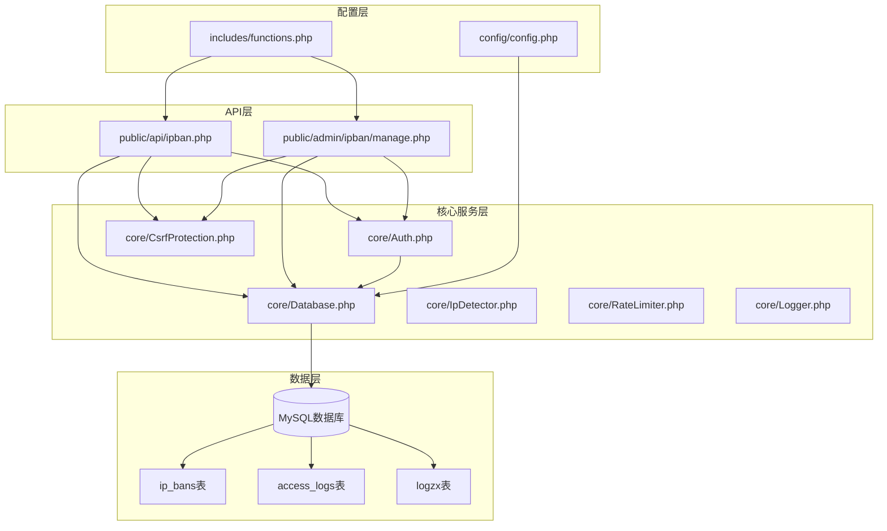
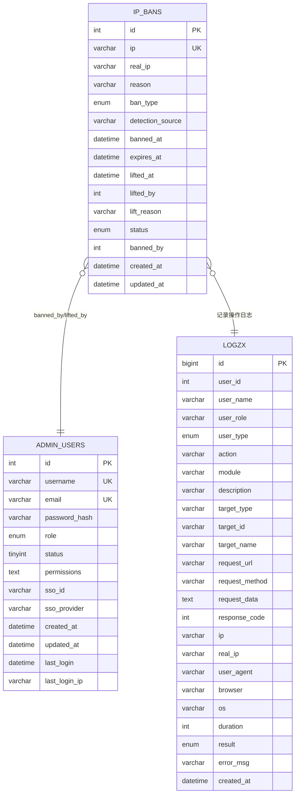
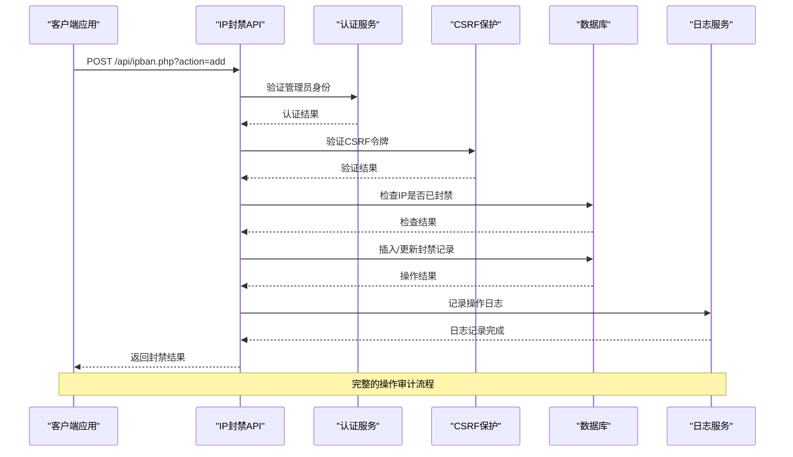
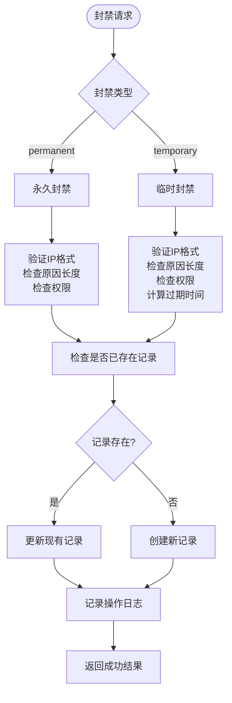
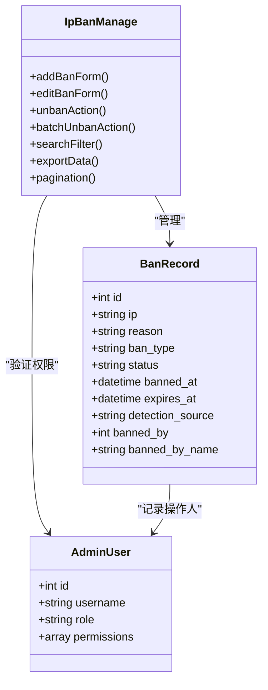
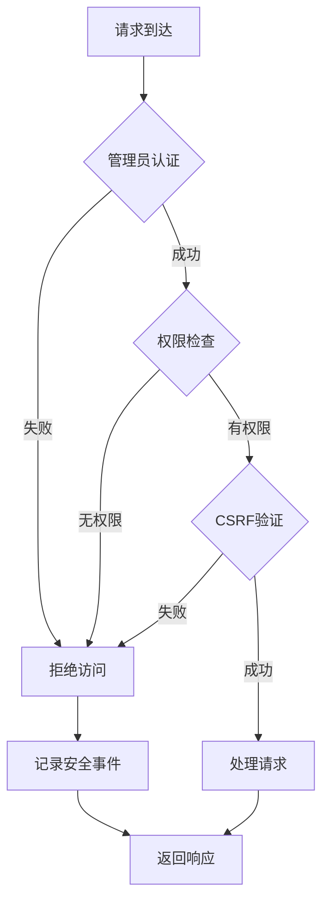
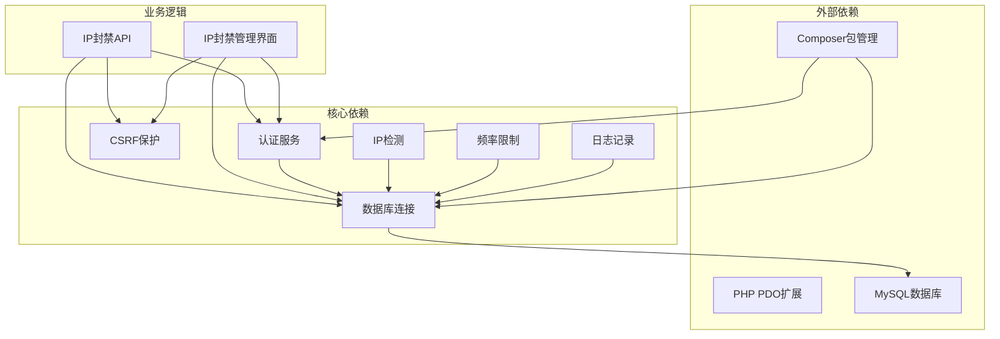

# IP封禁API

<cite>
**本文档引用的文件**
- [public/api/ipban.php](file://public/api/ipban.php)
- [public/admin/ipban/manage.php](file://public/admin/ipban/manage.php)
- [core/IpDetector.php](file://core/IpDetector.php)
- [core/RateLimiter.php](file://core/RateLimiter.php)
- [core/Auth.php](file://core/Auth.php)
- [core/Database.php](file://core/Database.php)
- [core/CsrfProtection.php](file://core/CsrfProtection.php)
- [core/Logger.php](file://core/Logger.php)
- [sql/init.sql](file://sql/init.sql)
- [includes/functions.php](file://includes/functions.php)
- [config/config.php](file://config/config.php)
</cite>

## 目录
1. [简介](#简介)
2. [项目结构](#项目结构)
3. [核心组件](#核心组件)
4. [架构概览](#架构概览)
5. [详细组件分析](#详细组件分析)
6. [依赖关系分析](#依赖关系分析)
7. [性能考虑](#性能考虑)
8. [故障排除指南](#故障排除指南)
9. [结论](#结论)

## 简介

IP封禁API是灯塔DNS拦截响应平台的核心安全组件，提供完整的IP地址封禁管理功能。该系统支持管理员对恶意IP地址进行实时封禁，包括永久封禁和临时封禁两种策略，具备完善的权限控制、日志记录和批量操作能力。

系统采用前后端分离的设计，提供RESTful API接口供外部系统集成，同时内置Web管理界面便于人工操作。所有操作都经过严格的身份验证和授权检查，确保只有具备相应权限的管理员才能执行封禁操作。

## 项目结构



**图表来源**
- [public/api/ipban.php:1-404](file://public/api/ipban.php#L1-L404)
- [core/Auth.php:1-272](file://core/Auth.php#L1-L272)
- [core/Database.php:1-400](file://core/Database.php#L1-L400)

**章节来源**
- [public/api/ipban.php:1-404](file://public/api/ipban.php#L1-L404)
- [public/admin/ipban/manage.php:1-780](file://public/admin/ipban/manage.php#L1-L780)

## 核心组件

### 数据库表结构

系统使用专门的IP封禁表来存储封禁信息：



**图表来源**
- [sql/init.sql:66-89](file://sql/init.sql#L66-L89)
- [sql/init.sql:116-121](file://sql/init.sql#L116-L121)
- [sql/init.sql:218-252](file://sql/init.sql#L218-L252)

### 核心数据模型

#### IP封禁实体
- **唯一标识**: 自增ID
- **IP地址**: 唯一约束，支持IPv4和IPv6
- **封禁类型**: permanent(永久)、temporary(临时)
- **封禁状态**: active(已封禁)、lifted(已解封)、expired(已过期)
- **检测来源**: manual(手动)、auto(自动)、cdn_header、tencent_cloud、aliyun_esa
- **有效期管理**: 临时封禁支持过期时间自动解除

#### 权限模型
系统采用基于角色的权限控制：
- **super_admin**: 超级管理员，拥有所有权限
- **admin**: 管理员，拥有所有权限
- **security**: 安全专员，专门负责IP封禁管理
- **其他角色**: 有限权限，不包含IP封禁操作

**章节来源**
- [sql/init.sql:66-89](file://sql/init.sql#L66-L89)
- [core/Auth.php:179-195](file://core/Auth.php#L179-L195)

## 架构概览



**图表来源**
- [public/api/ipban.php:50-154](file://public/api/ipban.php#L50-L154)
- [core/Auth.php:55-62](file://core/Auth.php#L55-L62)
- [core/CsrfProtection.php:144-161](file://core/CsrfProtection.php#L144-L161)

## 详细组件分析

### API接口规范

#### 基础信息
- **基础URL**: `/api/ipban.php`
- **支持方法**: GET、POST
- **认证要求**: 管理员登录
- **权限要求**: 必须具有`ipban`模块权限
- **CSRF保护**: 所有状态变更操作都需要CSRF令牌

#### 封禁类型



**图表来源**
- [public/api/ipban.php:71-134](file://public/api/ipban.php#L71-L134)
- [public/admin/ipban/manage.php:66-121](file://public/admin/ipban/manage.php#L66-L121)

#### 添加IP封禁接口

**请求方式**: POST  
**请求URL**: `/api/ipban.php?action=add`  
**请求头**: `Content-Type: application/x-www-form-urlencoded`

**请求参数**:
- `ip` (必需): IP地址，支持IPv4和IPv6
- `ban_type` (可选): 封禁类型，默认`temporary`
- `reason` (必需): 封禁原因，最大500字符

**响应格式**:
```json
{
  "success": true,
  "code": 0,
  "message": "IP封禁成功",
  "data": {
    "ban_id": 123,
    "ip": "192.168.1.100"
  }
}
```

**错误响应**:
- 缺少IP地址: `{"success": false, "code": 1, "message": "缺少IP地址"}`
- IP格式无效: `{"success": false, "code": 1, "message": "IP地址格式无效"}`
- 无权限: `{"success": false, "code": -1, "message": "无权执行此操作", "http_code": 403}`
- 未登录: `{"success": false, "code": -1, "message": "未登录或会话已过期", "http_code": 401}`

#### 解除IP封禁接口

**请求方式**: POST  
**请求URL**: `/api/ipban.php?action=remove`  
**请求参数**:
- `ban_id` (必需): 封禁记录ID

**响应格式**:
```json
{
  "success": true,
  "code": 0,
  "message": "IP封禁已解除",
  "data": null
}
```

#### 批量解封接口

**请求方式**: POST  
**请求URL**: `/api/ipban.php?action=batch_unban`  
**请求参数**:
- `ids` (必需): JSON数组，包含多个封禁ID

**响应格式**:
```json
{
  "success": true,
  "code": 0,
  "message": "成功解除 5 个IP封禁",
  "data": {
    "success_count": 5,
    "failed_count": 0
  }
}
```

#### 获取封禁列表接口

**请求方式**: GET  
**请求URL**: `/api/ipban.php?action=list`  
**查询参数**:
- `page` (可选): 页码，默认1
- `per_page` (可选): 每页数量，默认20，最大100

**响应格式**:
```json
{
  "success": true,
  "code": 0,
  "message": "获取成功",
  "data": {
    "bans": [
      {
        "id": 1,
        "ip": "192.168.1.100",
        "reason": "恶意扫描行为",
        "ban_type": "temporary",
        "status": "active",
        "banned_at": "2024-01-15 10:30:00",
        "expires_at": "2024-01-16 10:30:00",
        "banned_by": 1,
        "banned_by_name": "admin_user"
      }
    ],
    "total": 150,
    "page": 1,
    "per_page": 20
  }
}
```

#### 检查IP封禁状态接口

**请求方式**: GET  
**请求URL**: `/api/ipban.php?action=check`  
**查询参数**:
- `ip` (必需): 要检查的IP地址

**响应格式**:
```json
{
  "success": true,
  "code": 0,
  "message": "检查完成",
  "data": {
    "banned": true,
    "ban": {
      "banned": true,
      "expires_at": "2024-01-16 10:30:00"
    }
  }
}
```

**章节来源**
- [public/api/ipban.php:47-398](file://public/api/ipban.php#L47-L398)

### Web管理界面

#### 管理界面功能

Web管理界面提供了完整的IP封禁管理功能：



**图表来源**
- [public/admin/ipban/manage.php:66-224](file://public/admin/ipban/manage.php#L66-L224)
- [public/admin/ipban/manage.php:400-469](file://public/admin/ipban/manage.php#L400-L469)

#### 界面特性
- **实时搜索**: 支持按IP地址、状态、来源过滤
- **批量操作**: 支持批量解封，最多100个IP同时解封
- **权限控制**: 仅显示当前用户有权限的操作
- **导出功能**: 支持CSV和JSON格式导出
- **分页导航**: 支持大数据量的分页浏览

**章节来源**
- [public/admin/ipban/manage.php:297-494](file://public/admin/ipban/manage.php#L297-L494)

### 安全机制

#### 认证和授权

系统采用多层安全防护：



**图表来源**
- [core/Auth.php:55-62](file://core/Auth.php#L55-L62)
- [core/Auth.php:153-195](file://core/Auth.php#L153-L195)
- [core/CsrfProtection.php:144-161](file://core/CsrfProtection.php#L144-L161)

#### CSRF防护
- **令牌生成**: 基于加密安全的随机数生成
- **多令牌支持**: 支持同时存在多个有效令牌
- **自动清理**: 过期令牌自动清理，最多保留5个
- **时序攻击防护**: 使用`hash_equals()`进行安全比较

#### 输入验证
- **IP地址验证**: 使用`FILTER_VALIDATE_IP`进行格式检查
- **参数清理**: 使用`sanitize()`函数进行多层清理
- **SQL注入防护**: 使用预处理语句和参数绑定
- **XSS防护**: 输出时进行适当的HTML转义

**章节来源**
- [core/CsrfProtection.php:40-66](file://core/CsrfProtection.php#L40-L66)
- [core/Database.php:189-206](file://core/Database.php#L189-L206)
- [includes/functions.php:97-118](file://includes/functions.php#L97-L118)

### 日志记录

#### 操作日志

系统为所有IP封禁操作记录详细的审计日志：

| 字段名 | 类型 | 描述 | 示例 |
|--------|------|------|------|
| `action` | varchar | 操作类型 | `ban`, `unban`, `batch_unban` |
| `module` | varchar | 功能模块 | `ipban` |
| `description` | varchar | 操作描述 | `封禁IP: 192.168.1.100 (temporary)` |
| `target_type` | varchar | 目标类型 | `ip` |
| `target_id` | varchar | 目标ID | `123` |
| `target_name` | varchar | 目标名称 | `192.168.1.100` |
| `result` | enum | 操作结果 | `success`, `failure` |

#### 日志查询

支持按多种条件查询操作日志：
- 按操作类型过滤
- 按时间范围过滤  
- 按操作人过滤
- 按目标类型过滤

**章节来源**
- [public/api/ipban.php:133-143](file://public/api/ipban.php#L133-L143)
- [public/admin/ipban/manage.php:112-119](file://public/admin/ipban/manage.php#L112-L119)

## 依赖关系分析



**图表来源**
- [core/Auth.php:17-32](file://core/Auth.php#L17-L32)
- [core/Database.php:13-46](file://core/Database.php#L13-L46)

### 外部依赖

#### PHP扩展
- **PDO**: 数据库抽象层，支持多种数据库
- **cURL**: HTTP请求和安全连接
- **OpenSSL**: SSL/TLS加密通信
- **APCu**: 本地缓存支持

#### 第三方库
- **Logto SDK**: SSO认证集成
- **Guzzle HTTP**: HTTP客户端库

### 内部依赖

#### 核心服务
- **认证服务**: 处理管理员身份验证和权限检查
- **数据库服务**: 提供统一的数据库访问接口
- **CSRF保护**: 防止跨站请求伪造攻击
- **IP检测**: 获取客户端真实IP地址
- **频率限制**: 防止API滥用
- **日志服务**: 记录系统操作和安全事件

**章节来源**
- [core/Database.php:13-46](file://core/Database.php#L13-L46)
- [core/Auth.php:17-32](file://core/Auth.php#L17-L32)

## 性能考虑

### 数据库优化

#### 索引设计
- **ip_bans表索引**:
  - 主键索引: `id`
  - 唯一索引: `ip`
  - 普通索引: `status`, `expires_at`

#### 查询优化
- **封禁状态查询**: 使用`status = 'active'`和`expires_at > NOW()`条件
- **分页查询**: 使用LIMIT和OFFSET进行分页
- **批量操作**: 使用IN子句进行批量解封

### 缓存策略

#### IP检测缓存
- **地理位置缓存**: 使用APCu或文件缓存，1小时有效期
- **IP检测结果缓存**: 避免重复的CDN头部解析

#### CSRF令牌缓存
- **多令牌管理**: 支持同时存在多个有效令牌
- **自动清理**: 过期令牌自动清理，最多保留5个

### 性能监控

#### 关键指标
- **数据库连接池**: 最大连接数和连接复用
- **查询响应时间**: 关键查询的平均响应时间
- **内存使用**: 应用程序内存占用情况
- **并发处理**: 同时处理的请求数量

## 故障排除指南

### 常见问题

#### 认证失败
**症状**: 返回401未授权错误  
**可能原因**:
- 会话过期或失效
- 管理员账户被禁用
- SSO认证配置错误

**解决方案**:
1. 检查管理员登录状态
2. 验证账户权限设置
3. 确认SSO配置正确性

#### 权限不足
**症状**: 返回403权限不足错误  
**可能原因**:
- 用户角色不包含`ipban`权限
- 自定义权限配置错误
- 角色模板权限限制

**解决方案**:
1. 检查用户角色权限
2. 验证自定义权限配置
3. 联系超级管理员调整权限

#### CSRF验证失败
**症状**: 返回403 CSRF验证失败  
**可能原因**:
- CSRF令牌过期
- 令牌格式错误
- 请求头缺失

**解决方案**:
1. 重新获取CSRF令牌
2. 检查请求头设置
3. 确认令牌使用方式正确

#### 数据库连接错误
**症状**: 数据库连接失败  
**可能原因**:
- 数据库配置错误
- 网络连接问题
- 权限不足

**解决方案**:
1. 验证数据库连接配置
2. 检查网络连通性
3. 确认数据库用户权限

### 调试技巧

#### 启用调试模式
在配置文件中设置：
```php
'debug' => [
    'enabled' => true,
    'log_dir' => BASEPATH . '/storage/logs/debug/',
    'log_queries' => true,
    'log_auth' => true,
    'log_api' => true,
],
```

#### 日志分析
- **访问日志**: 查看`access_logs`表了解系统使用情况
- **操作日志**: 查看`logzx`表了解管理员操作历史
- **错误日志**: 查看`storage/logs/`目录下的错误文件

**章节来源**
- [config/config.php:123-133](file://config/config.php#L123-L133)
- [core/Database.php:104-122](file://core/Database.php#L104-L122)

## 结论

IP封禁API为灯塔DNS拦截响应平台提供了强大的安全防护能力。系统采用多层次的安全设计，包括严格的认证授权、CSRF防护、输入验证和审计日志，确保所有操作的可追溯性和安全性。

主要优势包括：
- **完整的功能覆盖**: 支持添加、解除、批量操作和状态查询
- **灵活的封禁策略**: 支持永久和临时封禁，满足不同场景需求
- **完善的权限控制**: 基于角色的细粒度权限管理
- **强大的审计能力**: 详细的操作日志记录和查询功能
- **友好的用户体验**: 提供Web管理界面和API双重访问方式

建议的最佳实践：
1. 定期审查封禁列表，及时清理过期封禁
2. 监控封禁操作日志，及时发现异常行为
3. 合理设置临时封禁的时长，平衡安全性和用户体验
4. 建立封禁申诉机制，处理误封情况
5. 定期备份封禁数据，防止数据丢失

通过合理使用IP封禁API，可以有效提升系统的安全防护水平，保护DNS服务免受恶意攻击和滥用行为的影响。