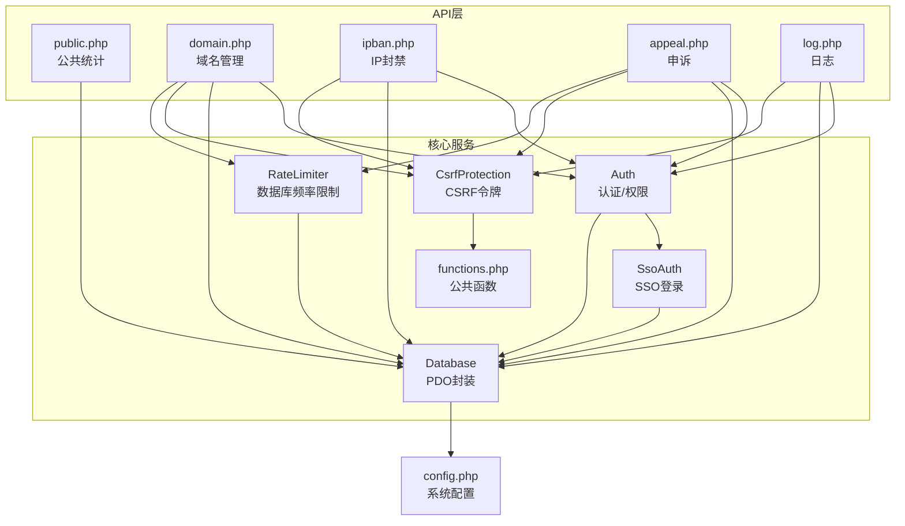
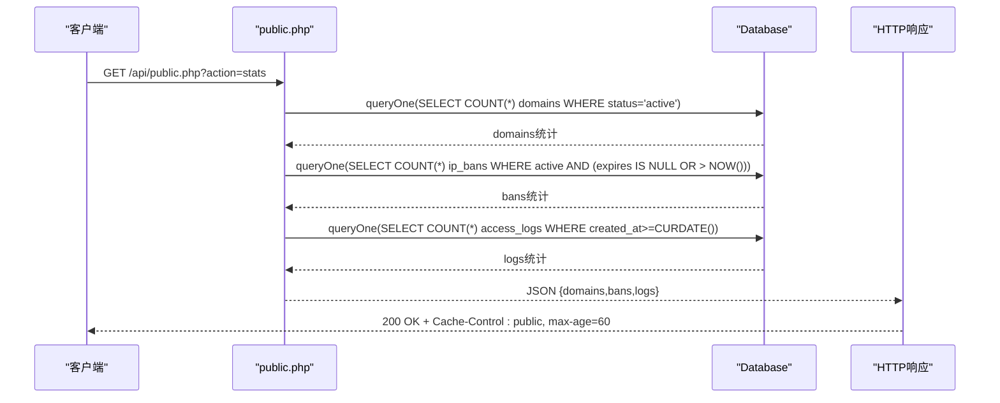
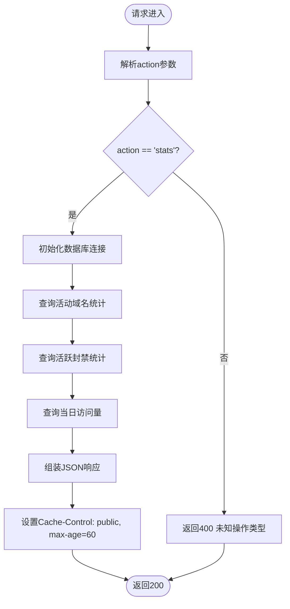
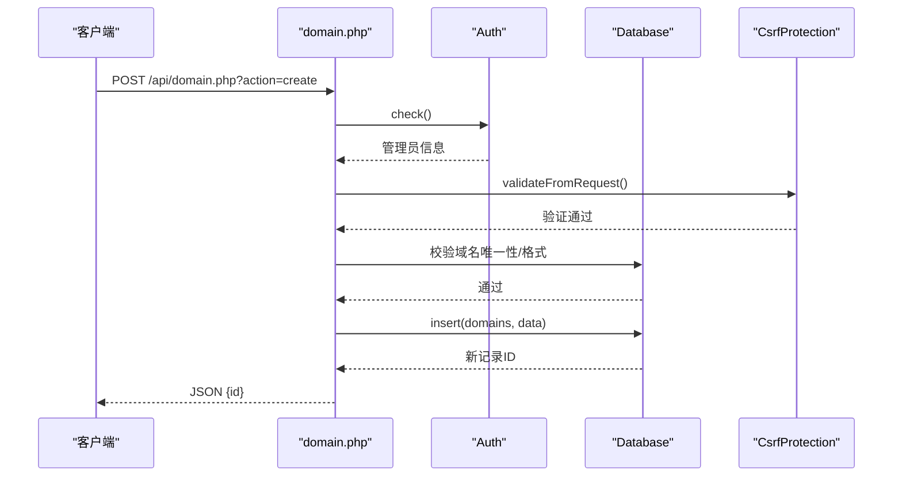
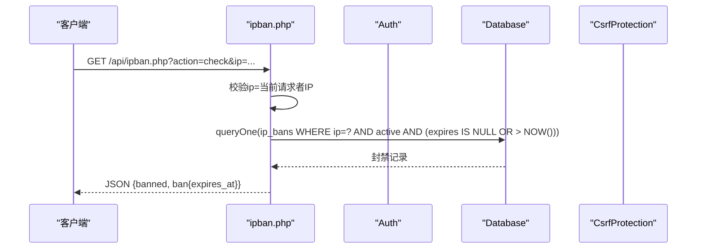
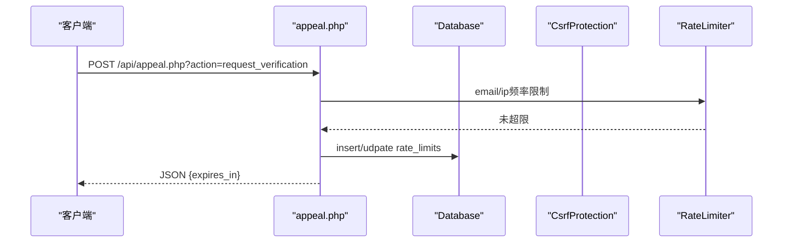
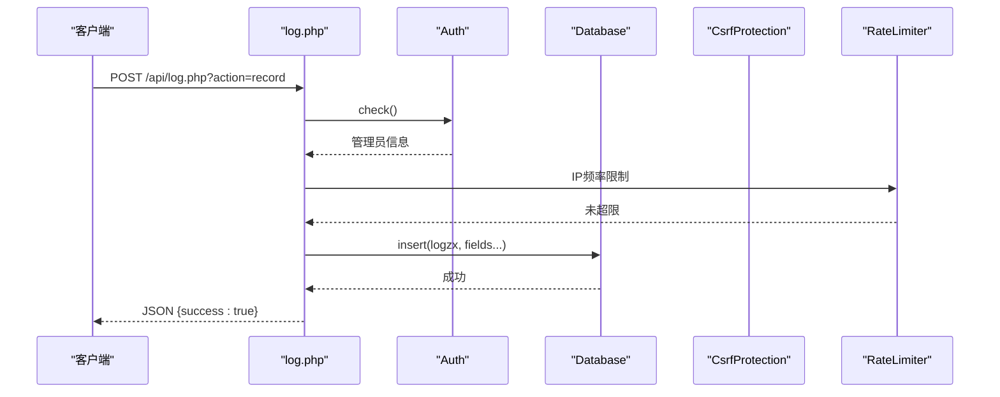
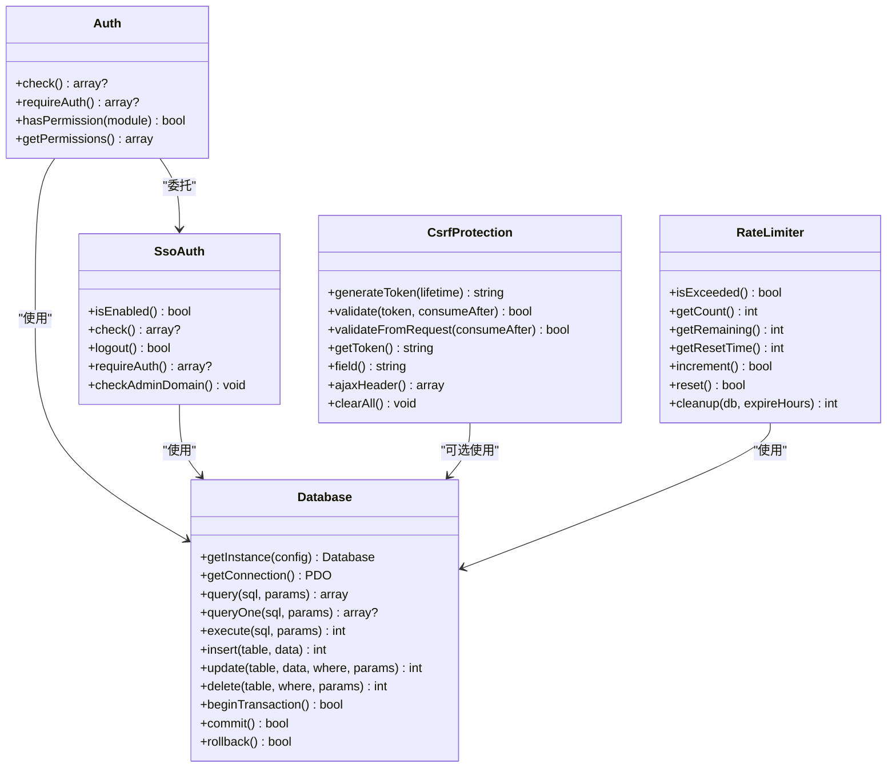

# 公共接口API

<cite>
**本文引用的文件**
- [public/api/public.php](file://public/api/public.php)
- [public/api/domain.php](file://public/api/domain.php)
- [public/api/ipban.php](file://public/api/ipban.php)
- [public/api/appeal.php](file://public/api/appeal.php)
- [public/api/log.php](file://public/api/log.php)
- [config/config.php](file://config/config.php)
- [includes/functions.php](file://includes/functions.php)
- [core/Auth.php](file://core/Auth.php)
- [core/Database.php](file://core/Database.php)
- [core/CsrfProtection.php](file://core/CsrfProtection.php)
- [core/RateLimiter.php](file://core/RateLimiter.php)
- [core/SsoAuth.php](file://core/SsoAuth.php)
</cite>

## 目录
1. [简介](#简介)
2. [项目结构](#项目结构)
3. [核心组件](#核心组件)
4. [架构总览](#架构总览)
5. [详细组件分析](#详细组件分析)
6. [依赖关系分析](#依赖关系分析)
7. [性能考量](#性能考量)
8. [故障排查指南](#故障排查指南)
9. [结论](#结论)
10. [附录](#附录)

## 简介
本文件面向客户端与集成开发者，系统性梳理本项目的公共接口API，重点覆盖无需管理员认证的只读接口与公共统计能力，同时阐述拦截规则获取、系统状态监控、域名状态查询、拦截配置获取、系统健康检查等常用功能的接口规范。文档还涵盖访问权限、数据格式、缓存策略、版本管理与兼容性、错误处理、性能与安全限制等通用规则，并提供客户端使用示例与集成指南。

## 项目结构
- API入口位于 public/api 目录，按功能划分：
  - public.php：公共只读接口（统计）
  - domain.php：域名管理接口（管理员）
  - ipban.php：IP封禁管理接口（管理员）
  - appeal.php：申诉接口（客户/管理员）
  - log.php：操作日志接口（管理员）
- 核心基础设施：
  - config/config.php：系统配置（数据库、会话、安全、日志、SSO等）
  - includes/functions.php：公共函数库（输入清理、CSRF、响应、文件上传、邮件发送等）
  - core/*：核心类库（认证、数据库、CSRF、频率限制、SSO）

图表来源
- [public/api/public.php:1-87](file://public/api/public.php#L1-L87)
- [public/api/domain.php:1-539](file://public/api/domain.php#L1-L539)
- [public/api/ipban.php:1-404](file://public/api/ipban.php#L1-L404)
- [public/api/appeal.php:1-789](file://public/api/appeal.php#L1-L789)
- [public/api/log.php:1-454](file://public/api/log.php#L1-L454)
- [core/Auth.php:1-272](file://core/Auth.php#L1-L272)
- [core/SsoAuth.php:1-505](file://core/SsoAuth.php#L1-L505)
- [core/Database.php:1-400](file://core/Database.php#L1-L400)
- [core/CsrfProtection.php:1-298](file://core/CsrfProtection.php#L1-L298)
- [core/RateLimiter.php:1-309](file://core/RateLimiter.php#L1-L309)
- [config/config.php:1-152](file://config/config.php#L1-L152)
- [includes/functions.php:1-800](file://includes/functions.php#L1-L800)

章节来源
- [public/api/public.php:1-87](file://public/api/public.php#L1-L87)
- [config/config.php:1-152](file://config/config.php#L1-L152)
- [includes/functions.php:1-800](file://includes/functions.php#L1-L800)

## 核心组件
- 公共统计接口（public.php）
  - 作用：提供无需认证的公共统计数据，如域名总数、过期/违规域名数量、活跃封禁数、当日访问量等
  - 访问方式：GET /api/public.php?action=stats
  - 缓存策略：HTTP缓存头 Cache-Control: public, max-age=60
- 域名管理接口（domain.php）
  - 作用：域名的增删改查、批量操作、统计
  - 访问方式：GET/POST/PUT/DELETE /api/domain.php?action={list,create,update,delete,batch_delete,stats}
  - 认证：管理员登录认证
- IP封禁接口（ipban.php）
  - 作用：添加封禁、解除封禁、封禁列表、封禁检查
  - 访问方式：GET/POST /api/ipban.php?action={add,remove,list,check}
  - 认证：管理员登录认证
- 申诉接口（appeal.php）
  - 作用：客户邮箱验证、验证码发送/校验、申诉提交；管理员查看/审核申诉
  - 访问方式：GET/POST /api/appeal.php?action={verify_email,request_verification,verify_code,submit,list,review,has_appeal}
  - 认证：客户接口无需管理员认证；管理员接口需要登录认证
- 日志接口（log.php）
  - 作用：记录操作日志、查询日志列表、统计、清空日志
  - 访问方式：GET/POST /api/log.php?action={record,list,stats,clear}
  - 认证：管理员登录认证（清空日志需super_admin）

章节来源
- [public/api/public.php:1-87](file://public/api/public.php#L1-L87)
- [public/api/domain.php:1-539](file://public/api/domain.php#L1-L539)
- [public/api/ipban.php:1-404](file://public/api/ipban.php#L1-L404)
- [public/api/appeal.php:1-789](file://public/api/appeal.php#L1-L789)
- [public/api/log.php:1-454](file://public/api/log.php#L1-L454)

## 架构总览
- 认证与权限
  - 管理员认证采用SSO（Logto）集成，支持域名白名单限制
  - 客户接口无需管理员认证，但具备CSRF防护与频率限制
- 数据访问
  - 统一通过Database类（PDO封装）访问MySQL，内置SQL注入防护与调试日志
- 安全与防护
  - CSRF令牌机制（多令牌、时间安全比较、可消费令牌）
  - 数据库频率限制器（基于表的滑动窗口计数）
  - 输入清理与输出转义（遵循“输出时转义”原则）
  - 安全响应头配置（CSP、X-Frame-Options等）
- 缓存与性能
  - 公共统计接口提供60秒浏览器缓存
  - 分页参数限制与SQL优化（LIMIT/OFFSET）
  - 事务支持与批量写入上限控制

图表来源
- [public/api/public.php:40-86](file://public/api/public.php#L40-L86)
- [core/Database.php:144-181](file://core/Database.php#L144-L181)

章节来源
- [core/Auth.php:1-272](file://core/Auth.php#L1-L272)
- [core/SsoAuth.php:1-505](file://core/SsoAuth.php#L1-L505)
- [core/Database.php:1-400](file://core/Database.php#L1-L400)
- [core/CsrfProtection.php:1-298](file://core/CsrfProtection.php#L1-L298)
- [core/RateLimiter.php:1-309](file://core/RateLimiter.php#L1-L309)

## 详细组件分析

### 公共统计接口（public.php）
- 接口定义
  - 方法：GET
  - 路径：/api/public.php?action=stats
  - 认证：无需管理员认证
  - 缓存：HTTP Cache-Control: public, max-age=60
- 数据结构
  - domains.total：活动域名总数
  - domains.expired：活动域名中过期类型数量
  - domains.violation：活动域名中违规类型数量
  - bans.active：活跃封禁总数
  - logs.today：当日访问量
- 错误处理
  - 未知操作类型：400
  - 系统初始化失败：500
  - 查询异常：500
- 性能与安全
  - 60秒浏览器缓存，降低数据库压力
  - 无CSRF令牌需求（只读接口）
  - 输入清理与异常捕获

图表来源
- [public/api/public.php:31-86](file://public/api/public.php#L31-L86)

章节来源
- [public/api/public.php:1-87](file://public/api/public.php#L1-L87)

### 域名管理接口（domain.php）
- 接口定义
  - 方法：GET/POST/PUT/DELETE
  - 路径：/api/domain.php?action={list,create,update,delete,batch_delete,stats}
  - 认证：管理员登录认证
  - CSRF：除查询类外均需CSRF验证
- 关键功能
  - list：分页、筛选（type/status/search）、总数统计
  - create：新增域名（校验格式、类型、唯一性、可选邮箱）
  - update：更新域名信息（校验格式、唯一性、状态合法性）
  - delete：删除域名（外键级联）
  - batch_delete：批量删除（限制数量、检查活跃申诉）
  - stats：域名统计（总数、过期/违规/待审/已释放、近7/30天新增）
- 错误处理
  - 方法不允许：405
  - 未登录/会话过期：401
  - CSRF失败：403
  - 业务参数错误：400
  - 资源不存在：404
  - 冲突：409
  - 未知操作：400
  - 系统异常：500

图表来源
- [public/api/domain.php:44-230](file://public/api/domain.php#L44-L230)
- [core/Auth.php:55-62](file://core/Auth.php#L55-L62)
- [core/CsrfProtection.php:144-161](file://core/CsrfProtection.php#L144-L161)
- [core/Database.php:211-227](file://core/Database.php#L211-L227)

章节来源
- [public/api/domain.php:1-539](file://public/api/domain.php#L1-L539)
- [core/Auth.php:1-272](file://core/Auth.php#L1-L272)
- [core/CsrfProtection.php:1-298](file://core/CsrfProtection.php#L1-L298)
- [core/Database.php:1-400](file://core/Database.php#L1-L400)

### IP封禁接口（ipban.php）
- 接口定义
  - 方法：GET/POST
  - 路径：/api/ipban.php?action={add,remove,list,check}
  - 认证：管理员登录认证
  - CSRF：除查询类外均需CSRF验证
- 关键功能
  - add：添加封禁（临时/永久，理由校验，覆盖更新）
  - remove：解除封禁（状态更新）
  - list：封禁列表（分页、总数）
  - check：检查IP是否被封禁（仅允许查询当前请求者自身IP）
- 错误处理
  - 方法不允许：405
  - 未登录/会话过期：401
  - CSRF失败：403
  - 参数错误：400
  - 资源不存在：404
  - 未知操作：400
  - 系统异常：500

图表来源
- [public/api/ipban.php:357-398](file://public/api/ipban.php#L357-L398)
- [core/Database.php:158-167](file://core/Database.php#L158-L167)

章节来源
- [public/api/ipban.php:1-404](file://public/api/ipban.php#L1-L404)
- [core/Auth.php:1-272](file://core/Auth.php#L1-L272)
- [core/CsrfProtection.php:1-298](file://core/CsrfProtection.php#L1-L298)
- [core/Database.php:1-400](file://core/Database.php#L1-L400)

### 申诉接口（appeal.php）
- 接口定义
  - 方法：GET/POST
  - 路径：/api/appeal.php?action={verify_email,request_verification,verify_code,submit,list,review,has_appeal}
  - 认证：客户接口无需管理员认证；管理员接口需要登录认证
  - CSRF：除查询类外均需CSRF验证
- 关键功能
  - verify_email：客户邮箱验证（与域名绑定邮箱一致性校验）
  - request_verification：发送验证码（邮箱/IP频率限制）
  - verify_code：验证码校验（失败次数限制与自动封禁）
  - submit：提交申诉（证据文件上传、频率限制、重复提交检查）
  - list/review：管理员查看/审核申诉（事务处理、状态变更）
  - has_appeal：查询域名是否有申诉记录（限制返回字段）
- 错误处理
  - 方法不允许：405
  - 未登录/会话过期：401
  - CSRF失败：403
  - 参数错误：400
  - 资源不存在：404
  - 冲突：409
  - 请求过于频繁：429
  - 未知操作：400
  - 系统异常：500

图表来源
- [public/api/appeal.php:176-266](file://public/api/appeal.php#L176-L266)
- [core/RateLimiter.php:76-160](file://core/RateLimiter.php#L76-L160)

章节来源
- [public/api/appeal.php:1-789](file://public/api/appeal.php#L1-L789)
- [core/CsrfProtection.php:1-298](file://core/CsrfProtection.php#L1-L298)
- [core/RateLimiter.php:1-309](file://core/RateLimiter.php#L1-L309)
- [core/Database.php:1-400](file://core/Database.php#L1-L400)

### 日志接口（log.php）
- 接口定义
  - 方法：GET/POST
  - 路径：/api/log.php?action={record,list,stats,clear}
  - 认证：管理员登录认证（清空日志需super_admin）
  - CSRF：除查询类外均需CSRF验证
- 关键功能
  - record：记录操作日志（支持单条/批量，字段清洗，频率限制）
  - list：查询日志列表（多维筛选、分页、总数）
  - stats：统计今日操作、管理员/客户占比、失败数、模块/动作Top10
  - clear：清空日志（按日期范围或全部，审计日志记录）
- 错误处理
  - 方法不允许：405
  - 未登录/会话过期：401
  - CSRF失败：403
  - 权限不足：403
  - 参数错误：400
  - 请求过于频繁：429
  - 未知操作：400
  - 系统异常：500

图表来源
- [public/api/log.php:49-191](file://public/api/log.php#L49-L191)
- [core/RateLimiter.php:76-160](file://core/RateLimiter.php#L76-L160)
- [core/Database.php:211-227](file://core/Database.php#L211-L227)

章节来源
- [public/api/log.php:1-454](file://public/api/log.php#L1-L454)
- [core/Auth.php:1-272](file://core/Auth.php#L1-L272)
- [core/CsrfProtection.php:1-298](file://core/CsrfProtection.php#L1-L298)
- [core/RateLimiter.php:1-309](file://core/RateLimiter.php#L1-L309)
- [core/Database.php:1-400](file://core/Database.php#L1-L400)

## 依赖关系分析

图表来源
- [core/Auth.php:1-272](file://core/Auth.php#L1-L272)
- [core/SsoAuth.php:1-505](file://core/SsoAuth.php#L1-L505)
- [core/Database.php:1-400](file://core/Database.php#L1-L400)
- [core/CsrfProtection.php:1-298](file://core/CsrfProtection.php#L1-L298)
- [core/RateLimiter.php:1-309](file://core/RateLimiter.php#L1-L309)

章节来源
- [core/Auth.php:1-272](file://core/Auth.php#L1-L272)
- [core/SsoAuth.php:1-505](file://core/SsoAuth.php#L1-L505)
- [core/Database.php:1-400](file://core/Database.php#L1-L400)
- [core/CsrfProtection.php:1-298](file://core/CsrfProtection.php#L1-L298)
- [core/RateLimiter.php:1-309](file://core/RateLimiter.php#L1-L309)

## 性能考量
- 缓存策略
  - 公共统计接口提供60秒浏览器缓存，显著降低数据库压力
  - 建议客户端在轮询场景中合理利用缓存头
- 分页与限制
  - 列表接口分页上限与默认值受配置控制，避免一次性返回大量数据
  - 批量操作数量限制（如批量删除最多100条），防止资源耗尽
- 频率限制
  - 数据库频率限制器提供滑动窗口计数，支持按IP/标识符维度限制
  - 日志记录、验证码发送、申诉提交等均配置了频率限制
- 事务与并发
  - 申诉审核使用事务，确保状态变更原子性
  - 数据库连接采用PDO，支持事务与参数绑定，减少SQL注入风险

[本节为通用性能讨论，不直接分析具体文件]

## 故障排查指南
- 常见错误码
  - 400：参数错误、未知操作、业务冲突
  - 401：未登录或会话过期
  - 403：CSRF失败、权限不足
  - 404：资源不存在
  - 409：冲突（如域名已存在）
  - 429：请求过于频繁
  - 500：系统异常
- 排查步骤
  - 检查请求方法与action参数是否正确
  - 确认管理员会话有效（SSO登录）
  - 校验CSRF令牌（表单/请求头）
  - 查看系统日志与调试日志（config/debug.enabled）
  - 核对数据库连接配置与权限
- 安全日规
  - 频繁失败操作可能触发自动封禁（申诉邮箱验证失败、验证码错误）
  - 日志记录具备审计能力，清空日志需super_admin权限

章节来源
- [public/api/domain.php:535-538](file://public/api/domain.php#L535-L538)
- [public/api/ipban.php:400-403](file://public/api/ipban.php#L400-L403)
- [public/api/appeal.php:785-788](file://public/api/appeal.php#L785-L788)
- [public/api/log.php:450-453](file://public/api/log.php#L450-L453)
- [config/config.php:123-133](file://config/config.php#L123-L133)

## 结论
本项目的公共接口API以“只读统计”为核心，辅以必要的管理员接口与安全防护机制。公共统计接口提供简洁稳定的只读能力，适合前端展示与第三方集成；管理员接口在认证、权限、CSRF、频率限制与事务保障方面形成完整闭环。建议在生产环境启用调试日志与安全响应头，并结合频率限制与缓存策略提升稳定性与安全性。

[本节为总结性内容，不直接分析具体文件]

## 附录

### 接口规范速览
- 公共统计
  - GET /api/public.php?action=stats
  - 缓存：Cache-Control: public, max-age=60
  - 返回：domains、bans、logs
- 域名管理（管理员）
  - GET /api/domain.php?action=list
  - POST /api/domain.php?action=create
  - PUT /api/domain.php?action=update
  - DELETE /api/domain.php?action=delete
  - POST /api/domain.php?action=batch_delete
  - GET /api/domain.php?action=stats
- IP封禁（管理员）
  - POST /api/ipban.php?action=add
  - POST /api/ipban.php?action=remove
  - GET /api/ipban.php?action=list
  - GET /api/ipban.php?action=check
- 申诉（客户/管理员）
  - POST /api/appeal.php?action=verify_email
  - POST /api/appeal.php?action=request_verification
  - POST /api/appeal.php?action=verify_code
  - POST /api/appeal.php?action=submit
  - GET /api/appeal.php?action=list
  - POST /api/appeal.php?action=review
  - GET /api/appeal.php?action=has_appeal
- 日志（管理员）
  - POST /api/log.php?action=record
  - GET /api/log.php?action=list
  - GET /api/log.php?action=stats
  - POST /api/log.php?action=clear

章节来源
- [public/api/public.php:7-9](file://public/api/public.php#L7-L9)
- [public/api/domain.php:8-15](file://public/api/domain.php#L8-L15)
- [public/api/ipban.php:8-13](file://public/api/ipban.php#L8-L13)
- [public/api/appeal.php:9-15](file://public/api/appeal.php#L9-L15)
- [public/api/log.php:8-13](file://public/api/log.php#L8-L13)

### 访问权限与安全
- 认证方式：SSO（Logto）集成，支持域名白名单
- CSRF：所有状态变更请求均需CSRF令牌
- 频率限制：数据库频率限制器，支持按IP/标识符维度
- 输入清理：统一sanitize函数，输出时转义
- 安全响应头：CSP、X-Frame-Options、X-Content-Type-Options等

章节来源
- [core/Auth.php:1-272](file://core/Auth.php#L1-L272)
- [core/SsoAuth.php:1-505](file://core/SsoAuth.php#L1-L505)
- [core/CsrfProtection.php:1-298](file://core/CsrfProtection.php#L1-L298)
- [includes/functions.php:86-134](file://includes/functions.php#L86-L134)
- [config/config.php:86-105](file://config/config.php#L86-L105)

### 数据格式与响应结构
- 统一响应结构：success、code、message、data
- 成功：HTTP 200，success=true
- 失败：HTTP 4xx/5xx，success=false
- 列表接口：data包含list/total/page/per_page等字段

章节来源
- [includes/functions.php:489-516](file://includes/functions.php#L489-L516)

### 版本管理与兼容性
- 本项目未提供显式的API版本号；建议客户端在集成时：
  - 以action参数区分功能
  - 对返回字段做健壮性处理（新增字段不影响兼容）
  - 通过缓存头与错误码识别行为差异

[本节为通用指导，不直接分析具体文件]

### 客户端使用示例与集成指南
- 基础准备
  - 获取CSRF令牌：在表单中嵌入隐藏字段或通过meta标签传递
  - 管理员登录：通过SSO回调建立会话
- 公共统计
  - 直接GET /api/public.php?action=stats，注意60秒缓存
- 域名管理
  - 列表：GET /api/domain.php?action=list&page=1&per_page=20
  - 新增：POST /api/domain.php?action=create，携带CSRF令牌
  - 更新/删除：POST/DELETE，携带CSRF令牌
- IP封禁
  - 检查：GET /api/ipban.php?action=check&ip=CLIENT_IP
  - 添加：POST /api/ipban.php?action=add，携带CSRF令牌
- 申诉
  - 验证邮箱：POST /api/appeal.php?action=verify_email
  - 发送验证码：POST /api/appeal.php?action=request_verification
  - 提交申诉：POST /api/appeal.php?action=submit，携带CSRF令牌与证据文件
- 日志
  - 记录：POST /api/log.php?action=record，携带CSRF令牌
  - 查询：GET /api/log.php?action=list?page=1&per_page=20

章节来源
- [public/api/public.php:22-23](file://public/api/public.php#L22-L23)
- [core/CsrfProtection.php:198-233](file://core/CsrfProtection.php#L198-L233)
- [public/api/domain.php:50-52](file://public/api/domain.php#L50-L52)
- [public/api/ipban.php:42-44](file://public/api/ipban.php#L42-L44)
- [public/api/appeal.php:56-57](file://public/api/appeal.php#L56-L57)
- [public/api/log.php:43-44](file://public/api/log.php#L43-L44)