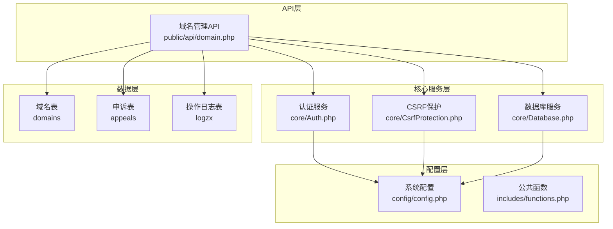
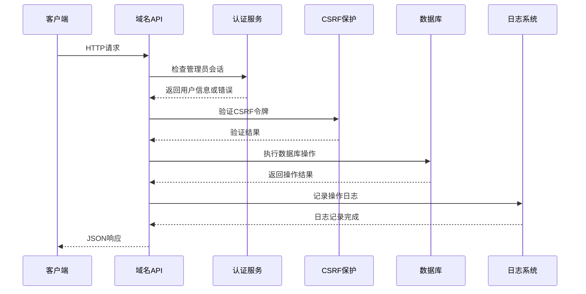
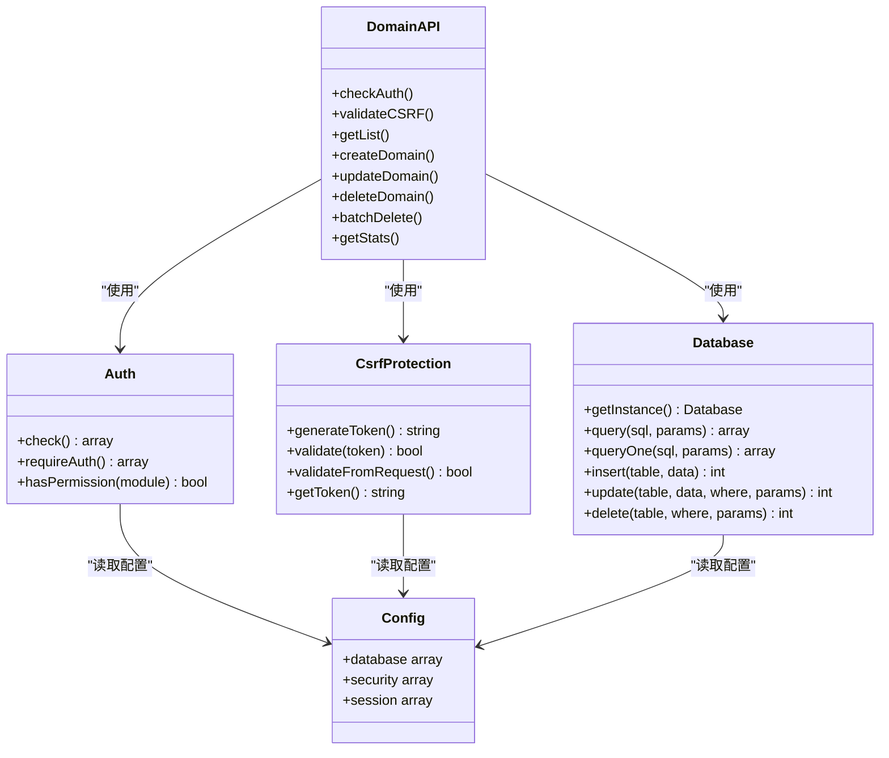
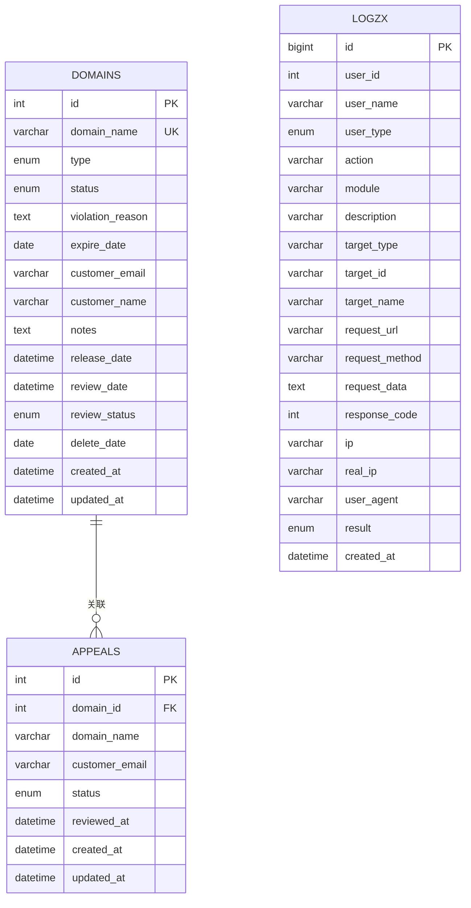

# 域名管理API

<cite>
**本文档引用的文件**
- [domain.php](file://public/api/domain.php)
- [config.php](file://config/config.php)
- [Database.php](file://core/Database.php)
- [CsrfProtection.php](file://core/CsrfProtection.php)
- [functions.php](file://includes/functions.php)
- [Auth.php](file://core/Auth.php)
- [init.sql](file://sql/init.sql)
- [header.php](file://public/admin/partials/header.php)
- [admin.js](file://public/admin/assets/js/admin.js)
</cite>

## 目录
1. [简介](#简介)
2. [项目结构](#项目结构)
3. [核心组件](#核心组件)
4. [架构概览](#架构概览)
5. [详细接口文档](#详细接口文档)
6. [依赖关系分析](#依赖关系分析)
7. [性能考虑](#性能考虑)
8. [故障排除指南](#故障排除指南)
9. [结论](#结论)

## 简介

域名管理API是灯塔DNS拦截响应平台的核心组件之一，提供完整的域名CRUD操作功能。该API专为管理员设计，支持域名的创建、查询、更新、删除以及批量操作，并提供详细的统计功能。

系统采用PHP 8.0+开发，使用PDO数据库连接，具备完善的CSRF保护机制和安全防护措施。所有接口均需要管理员身份认证，确保系统的安全性。

## 项目结构



**图表来源**
- [domain.php:1-539](file://public/api/domain.php#L1-L539)
- [Auth.php:1-272](file://core/Auth.php#L1-L272)
- [Database.php:1-400](file://core/Database.php#L1-L400)
- [config.php:1-152](file://config/config.php#L1-L152)

**章节来源**
- [domain.php:1-50](file://public/api/domain.php#L1-L50)
- [config.php:15-152](file://config/config.php#L15-L152)

## 核心组件

### 数据库连接管理
系统使用单例模式的Database类管理数据库连接，支持PDO预处理语句，防止SQL注入攻击。数据库配置通过config.php集中管理，支持SSL/TLS加密连接。

### 认证与授权
采用基于SSO的认证机制，支持Logto身份提供商。所有API请求都需要有效的管理员会话令牌。系统实现了细粒度的权限控制，支持不同角色的权限分级。

### CSRF保护机制
实现了多层CSRF保护：
- 基于Session的令牌生成和验证
- 支持多种令牌传递方式（HTTP头、POST参数）
- 令牌过期管理和自动清理
- 防重放攻击机制

**章节来源**
- [Database.php:13-46](file://core/Database.php#L13-L46)
- [Auth.php:55-94](file://core/Auth.php#L55-L94)
- [CsrfProtection.php:40-66](file://core/CsrfProtection.php#L40-L66)

## 架构概览



**图表来源**
- [domain.php:44-48](file://public/api/domain.php#L44-L48)
- [Auth.php:55-62](file://core/Auth.php#L55-L62)
- [CsrfProtection.php:144-161](file://core/CsrfProtection.php#L144-L161)

## 详细接口文档

### 通用响应格式

所有API接口返回统一的JSON格式：

```json
{
    "success": true,
    "code": 0,
    "message": "操作成功",
    "data": {}
}
```

错误响应格式：
```json
{
    "success": false,
    "code": -1,
    "message": "错误信息",
    "data": null
}
```

### 1. 获取域名列表

**接口地址**: `GET /api/domain.php?action=list`

**请求参数**:
- `page` (可选): 页码，默认1，最小1
- `per_page` (可选): 每页数量，默认20，最大100
- `type` (可选): 域名类型，支持`expired`、`violation`
- `status` (可选): 域名状态，支持`active`、`inactive`、`released`、`pending_review`
- `search` (可选): 搜索关键词，支持域名名称和客户邮箱

**响应数据**:
```json
{
    "domains": [
        {
            "id": 1,
            "domain_name": "example.com",
            "type": "expired",
            "status": "active",
            "violation_reason": "违规内容",
            "expire_date": "2024-12-31",
            "customer_email": "user@example.com",
            "customer_name": "张三",
            "notes": "备注信息",
            "created_at": "2024-01-01 12:00:00",
            "updated_at": "2024-01-01 12:00:00"
        }
    ],
    "total": 100,
    "page": 1,
    "per_page": 20
}
```

**分页查询实现**:
- 支持最大100条记录/页
- 使用LIMIT和OFFSET实现分页
- 提供总记录数用于前端分页控件

**筛选条件**:
- 类型筛选：按`type`字段精确匹配
- 状态筛选：按`status`字段精确匹配
- 搜索功能：支持域名名称和客户邮箱模糊匹配

**章节来源**
- [domain.php:58-123](file://public/api/domain.php#L58-L123)

### 2. 创建域名

**接口地址**: `POST /api/domain.php?action=create`

**请求参数**:
- `domain_name` (必需): 域名，格式验证
- `type` (必需): 域名类型，支持`expired`、`violation`
- `expire_date` (可选): 到期日期，格式YYYY-MM-DD（仅expired类型必填）
- `customer_email` (可选): 客户邮箱，格式验证
- `violation_reason` (可选): 违规原因（仅violation类型必填）

**数据验证规则**:
- 域名格式：标准域名格式验证
- 类型验证：必须为`expired`或`violation`
- 到期日期：有效日期格式
- 邮箱格式：标准邮箱格式验证
- 唯一性：域名必须唯一

**CSRF保护**: 必须包含有效的CSRF令牌

**章节来源**
- [domain.php:126-230](file://public/api/domain.php#L126-L230)

### 3. 更新域名

**接口地址**: `POST/PUT /api/domain.php?action=update&id=xxx`

**请求参数**:
支持更新以下字段：
- `domain_name`: 新域名名称
- `expire_date`: 到期日期
- `customer_email`: 客户邮箱
- `customer_name`: 客户姓名
- `notes`: 备注
- `violation_reason`: 违规原因
- `status`: 域名状态（active、inactive、released、pending_review）
- `review_date`: 审核日期
- `delete_date`: 删除日期

**状态变更逻辑**:
- 当状态变为`released`时，自动记录释放时间
- 支持状态值的严格验证

**章节来源**
- [domain.php:233-369](file://public/api/domain.php#L233-L369)

### 4. 删除域名

**接口地址**: `POST/DELETE /api/domain.php?action=delete&id=xxx`

**请求参数**:
- `id` (必需): 域名ID

**删除约束**:
- 检查域名是否存在
- 删除时会级联删除相关的申诉记录
- 记录详细的操作日志

**CSRF保护**: 必须包含有效的CSRF令牌

**章节来源**
- [domain.php:372-416](file://public/api/domain.php#L372-L416)

### 5. 批量删除域名

**接口地址**: `POST /api/domain.php?action=batch_delete`

**请求参数**:
- `ids` (必需): 域名ID数组

**批量操作限制**:
- 单次最多删除100条记录
- 验证ID的有效性和存在性
- 检查待删除域名是否有活跃的申诉记录

**章节来源**
- [domain.php:419-485](file://public/api/domain.php#L419-L485)

### 6. 获取域名统计

**接口地址**: `GET /api/domain.php?action=stats`

**响应数据**:
```json
{
    "total": 1000,
    "expired_count": 300,
    "violation_count": 250,
    "review_count": 50,
    "released_count": 100,
    "week_new_count": 25,
    "month_new_count": 120
}
```

**统计维度**:
- 总域名数
- 到期域名数
- 违规域名数
- 待审核域名数
- 已释放域名数
- 近7天新增数
- 近30天新增数

**章节来源**
- [domain.php:488-533](file://public/api/domain.php#L488-L533)

## 依赖关系分析



**图表来源**
- [domain.php:35-42](file://public/api/domain.php#L35-L42)
- [Auth.php:17-32](file://core/Auth.php#L17-L32)
- [CsrfProtection.php:17-30](file://core/CsrfProtection.php#L17-L30)
- [Database.php:13-23](file://core/Database.php#L13-L23)

### 数据模型关系



**图表来源**
- [init.sql:39-63](file://sql/init.sql#L39-L63)
- [init.sql:127-159](file://sql/init.sql#L127-L159)
- [init.sql:219-252](file://sql/init.sql#L219-L252)

**章节来源**
- [domain.php:17-42](file://public/api/domain.php#L17-L42)
- [Database.php:369-375](file://core/Database.php#L369-L375)

## 性能考虑

### 数据库优化
- 使用索引优化常用查询字段（type、status、domain_name）
- 分页查询使用LIMIT和OFFSET，避免全表扫描
- 统计查询使用COUNT(*)优化

### 缓存策略
- 配置文件使用静态缓存避免重复读取
- CSRF令牌支持多令牌管理，提高并发性能

### 安全优化
- 所有输入参数进行严格验证和清理
- 使用PDO预处理语句防止SQL注入
- CSRF令牌过期自动清理，防止内存泄漏

## 故障排除指南

### 常见错误码

| 错误码 | HTTP状态码 | 描述 | 解决方案 |
|--------|------------|------|----------|
| -1 | 500 | 系统错误 | 检查服务器日志，确认数据库连接正常 |
| 1 | 400 | 参数验证失败 | 检查请求参数格式和必填字段 |
| 2 | 404 | 资源不存在 | 确认ID有效性，检查数据库记录 |
| 3 | 409 | 资源冲突 | 检查唯一性约束，如域名重复 |

### CSRF相关问题

**问题**: CSRF Token验证失败
**可能原因**:
- 令牌过期
- 令牌传递方式不正确
- 会话未正确设置

**解决方法**:
1. 确保在表单中包含有效的CSRF令牌
2. 检查令牌是否在有效期内
3. 验证HTTP头或POST参数的令牌传递

### 数据库连接问题

**问题**: 数据库连接失败
**可能原因**:
- 数据库凭据配置错误
- 数据库服务不可用
- 网络连接问题

**解决方法**:
1. 检查config.php中的数据库配置
2. 验证数据库服务状态
3. 确认网络连通性

**章节来源**
- [domain.php:46-48](file://public/api/domain.php#L46-L48)
- [CsrfProtection.php:78-123](file://core/CsrfProtection.php#L78-L123)
- [Database.php:104-121](file://core/Database.php#L104-L121)

## 结论

域名管理API提供了完整的企业级域名管理功能，具有以下特点：

### 安全特性
- 完善的CSRF保护机制
- 严格的数据验证和清理
- 基于角色的权限控制
- 详细的操作日志记录

### 功能完整性
- 支持完整的CRUD操作
- 提供批量操作能力
- 内置统计查询功能
- 灵活的筛选和分页机制

### 技术优势
- 基于PHP 8.0+的现代开发
- 使用PDO数据库抽象层
- 单例模式的数据库连接管理
- 统一的错误处理和响应格式

该API设计遵循RESTful原则，接口清晰易用，适合集成到各种管理系统中。通过合理的安全设计和性能优化，能够满足企业级应用的需求。