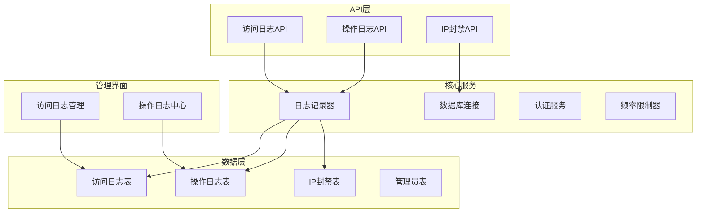
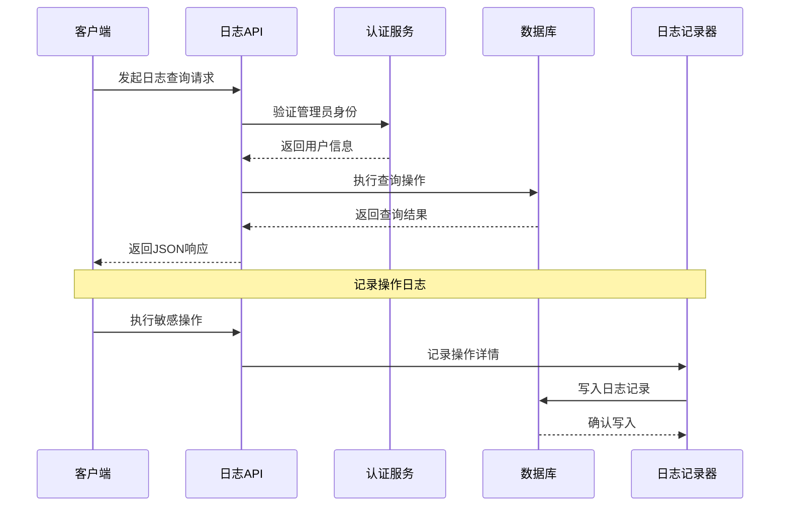
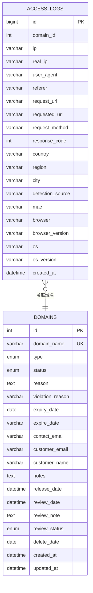
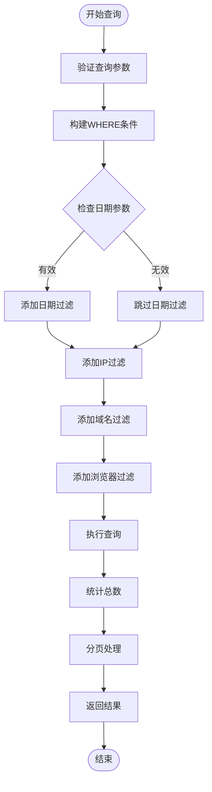
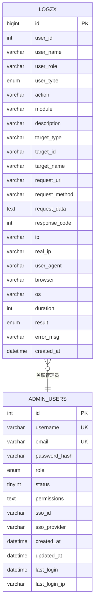
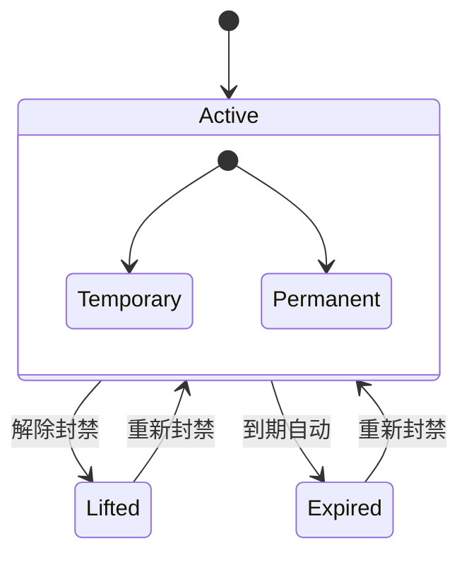
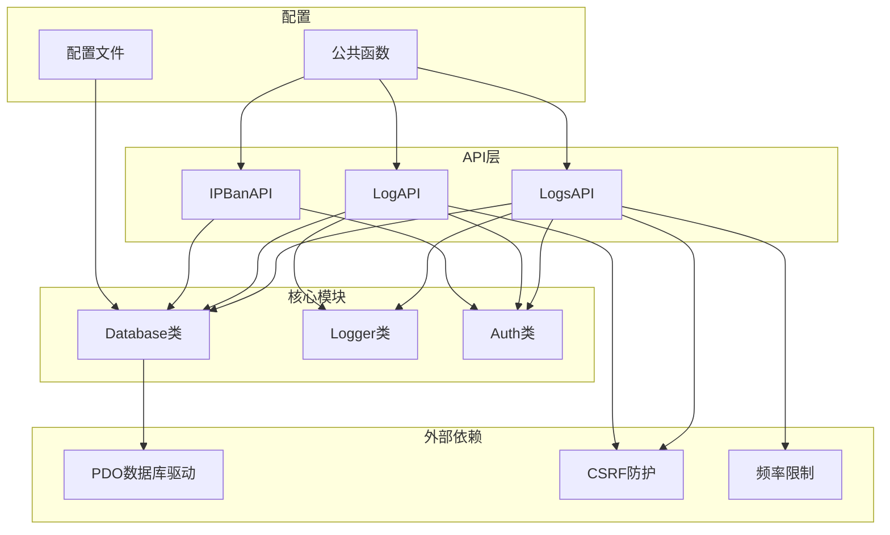

# 日志查询API

<cite>
**本文档引用的文件**
- [logs.php](file://public/api/logs.php)
- [log.php](file://public/api/log.php)
- [ipban.php](file://public/api/ipban.php)
- [Logger.php](file://core/Logger.php)
- [Database.php](file://core/Database.php)
- [access.php](file://public/admin/logs/access.php)
- [operation.php](file://public/admin/logs/operation.php)
- [init.sql](file://sql/init.sql)
- [config.php](file://config/config.php)
- [functions.php](file://includes/functions.php)
</cite>

## 目录
1. [简介](#简介)
2. [项目结构](#项目结构)
3. [核心组件](#核心组件)
4. [架构概览](#架构概览)
5. [详细组件分析](#详细组件分析)
6. [依赖关系分析](#依赖关系分析)
7. [性能考虑](#性能考虑)
8. [故障排除指南](#故障排除指南)
9. [结论](#结论)

## 简介

日志查询API是灯塔DNS拦截响应平台的核心组件，提供全面的日志管理功能。该系统支持三种主要类型的日志：访问日志、操作日志和IP封禁日志，为系统监控、安全审计和故障排查提供强大的查询和分析能力。

系统采用PHP + MySQL架构，通过RESTful API接口提供标准化的日志查询、统计、导出和管理功能。所有接口均需要管理员身份认证，确保日志数据的安全性和完整性。

## 项目结构

**图表来源**
- [logs.php:1-595](file://public/api/logs.php#L1-L595)
- [log.php:1-454](file://public/api/log.php#L1-L454)
- [ipban.php:1-404](file://public/api/ipban.php#L1-L404)

**章节来源**
- [logs.php:1-50](file://public/api/logs.php#L1-L50)
- [log.php:1-20](file://public/api/log.php#L1-L20)
- [init.sql:94-121](file://sql/init.sql#L94-L121)

## 核心组件

### 访问日志API (logs.php)

访问日志API提供DNS拦截响应平台的核心日志查询功能，支持详细的访问记录查询、统计分析和数据导出。

**主要功能特性：**
- 多条件筛选查询（IP、域名、浏览器、时间范围）
- 分页查询机制（支持自定义每页条数）
- 统计数据聚合（访问量、IP分布、趋势分析）
- 数据导出功能（CSV/JSON格式）
- IP封禁管理集成

**核心接口：**
- `GET /api/logs.php?action=list` - 获取访问日志列表
- `GET /api/logs.php?action=stats` - 获取统计数据
- `POST /api/logs.php?action=export` - 导出日志数据
- `POST /api/logs.php?action=clean` - 清理旧日志
- `POST /api/logs.php?action=ban_ip` - 封禁IP

**章节来源**
- [logs.php:8-13](file://public/api/logs.php#L8-L13)
- [logs.php:56-163](file://public/api/logs.php#L56-L163)

### 操作日志API (log.php)

操作日志API专注于记录和查询系统管理员的操作行为，提供完整的审计跟踪功能。

**主要功能：**
- 操作日志记录（支持单条和批量记录）
- 详细的用户行为追踪
- 统计分析和报表生成
- 日志清理和管理

**核心接口：**
- `POST /api/log.php?action=record` - 记录操作日志
- `GET /api/log.php?action=list` - 查询日志列表
- `GET /api/log.php?action=stats` - 获取统计信息
- `POST /api/log.php?action=clear` - 清空日志

**章节来源**
- [log.php:8-13](file://public/api/log.php#L8-L13)
- [log.php:49-191](file://public/api/log.php#L49-L191)

### IP封禁API (ipban.php)

IP封禁API提供完整的IP地址封禁管理功能，支持实时封禁、解封和批量管理。

**核心功能：**
- IP封禁添加和管理
- 封禁状态监控
- 批量封禁和解封
- 封禁列表查询

**接口：**
- `POST /api/ipban.php?action=add` - 添加IP封禁
- `POST /api/ipban.php?action=remove` - 解除IP封禁
- `POST /api/ipban.php?action=batch_unban` - 批量解封
- `GET /api/ipban.php?action=list` - 获取封禁列表
- `GET /api/ipban.php?action=check` - 检查IP封禁状态

**章节来源**
- [ipban.php:8-13](file://public/api/ipban.php#L8-L13)
- [ipban.php:50-154](file://public/api/ipban.php#L50-L154)

## 架构概览

**图表来源**
- [logs.php:42-46](file://public/api/logs.php#L42-L46)
- [log.php:55-64](file://public/api/log.php#L55-L64)
- [Logger.php:48-120](file://core/Logger.php#L48-L120)

## 详细组件分析

### 访问日志查询系统

访问日志查询系统是整个日志体系的核心，负责记录DNS拦截过程中的所有访问信息。

#### 数据模型设计

**图表来源**
- [init.sql:94-121](file://sql/init.sql#L94-L121)
- [init.sql:38-63](file://sql/init.sql#L38-L63)

#### 查询参数详解

| 参数名称 | 类型 | 必填 | 默认值 | 说明 |
|---------|------|------|--------|------|
| page | int | 否 | 1 | 当前页码 |
| per_page | int | 否 | 20 | 每页记录数（最大100） |
| date_from | date | 否 | - | 开始日期 |
| date_to | date | 否 | - | 结束日期 |
| ip | string | 否 | - | IP地址过滤 |
| domain | string | 否 | - | 域名过滤 |
| browser | string | 否 | - | 浏览器过滤 |
| domain_id | int | 否 | - | 域名ID过滤 |

#### 查询流程图

**图表来源**
- [logs.php:62-126](file://public/api/logs.php#L62-L126)
- [logs.php:128-150](file://public/api/logs.php#L128-L150)

**章节来源**
- [logs.php:62-163](file://public/api/logs.php#L62-L163)
- [access.php:59-97](file://public/admin/logs/access.php#L59-L97)

### 操作日志管理系统

操作日志系统专门记录管理员的所有操作行为，提供完整的审计跟踪功能。

#### 操作日志数据结构

**图表来源**
- [init.sql:218-252](file://sql/init.sql#L218-L252)
- [init.sql:12-31](file://sql/init.sql#L12-L31)

#### 操作类型分类

| 操作类型 | 描述 | 示例场景 |
|---------|------|----------|
| login/logout | 用户登录登出 | 管理员登录系统 |
| create/update/delete | 数据增删改查 | 创建域名、修改配置 |
| page_view | 页面访问 | 查看日志、管理页面 |
| api_call | API调用 | 系统内部接口调用 |
| submit | 表单提交 | 提交申诉、申请 |
| click | 点击操作 | 点击按钮、链接 |
| ban/unban | 封禁管理 | IP封禁、解封操作 |

**章节来源**
- [log.php:194-301](file://public/api/log.php#L194-L301)
- [operation.php:124-149](file://public/admin/logs/operation.php#L124-L149)

### IP封禁管理功能

IP封禁系统提供灵活的IP地址管理功能，支持临时和永久封禁。

#### 封禁状态流转

**图表来源**
- [init.sql:68-89](file://sql/init.sql#L68-L89)

#### 封禁类型说明

| 封禁类型 | 说明 | 有效期 | 使用场景 |
|---------|------|--------|----------|
| temporary | 临时封禁 | 24小时 | 短期威胁应对 |
| permanent | 永久封禁 | 无限期 | 严重违规IP |
| manual | 手动封禁 | 可配置 | 管理员手动操作 |

**章节来源**
- [ipban.php:49-154](file://public/api/ipban.php#L49-L154)
- [access.php:281-353](file://public/admin/logs/access.php#L281-L353)

## 依赖关系分析

### 核心依赖关系

**图表来源**
- [Database.php:13-46](file://core/Database.php#L13-L46)
- [Logger.php:14-36](file://core/Logger.php#L14-L36)
- [config.php:15-52](file://config/config.php#L15-L52)

### 数据库索引策略

为了优化日志查询性能，系统建立了以下关键索引：

| 表名 | 索引类型 | 字段 | 用途 |
|------|----------|------|------|
| access_logs | 主键 | id | 唯一标识 |
| access_logs | 普通索引 | ip | IP查询 |
| access_logs | 普通索引 | domain_id | 域名关联 |
| access_logs | 普通索引 | created_at | 时间范围查询 |
| logzx | 主键 | id | 唯一标识 |
| logzx | 普通索引 | user_id | 用户关联 |
| logzx | 普通索引 | action | 操作类型查询 |
| logzx | 普通索引 | created_at | 时间范围查询 |
| ip_bans | 主键 | id | 唯一标识 |
| ip_bans | 唯一索引 | ip | IP唯一性 |
| ip_bans | 普通索引 | status | 状态查询 |

**章节来源**
- [init.sql:117-121](file://sql/init.sql#L117-L121)
- [init.sql:244-252](file://sql/init.sql#L244-L252)
- [init.sql:85-89](file://sql/init.sql#L85-L89)

## 性能考虑

### 查询优化策略

1. **索引优化**
   - 访问日志表按时间字段建立索引，支持高效的时间范围查询
   - IP字段建立索引，支持快速IP过滤
   - 操作日志表按用户类型和操作类型建立复合索引

2. **分页机制**
   - 默认每页20条记录，最大支持100条/页
   - 使用LIMIT和OFFSET实现高效的分页查询
   - 提供总数统计，支持前端分页控件

3. **缓存策略**
   - 统计数据定期缓存，减少重复计算
   - 频繁查询的热门数据建立内存缓存

### 安全防护措施

1. **SQL注入防护**
   - 使用PDO预处理语句
   - 参数绑定机制
   - 输入验证和清理

2. **CSRF防护**
   - 所有POST请求都需要CSRF令牌
   - 令牌一次性验证，防止重放攻击

3. **权限控制**
   - 管理员身份验证
   - 操作权限检查
   - 敏感操作二次确认

## 故障排除指南

### 常见问题及解决方案

**问题1：日志查询超时**
- 检查时间范围是否过大
- 建议缩小查询时间范围
- 考虑添加更多过滤条件

**问题2：导出功能失败**
- 检查导出数据量限制（最多10000条）
- 确认导出格式参数正确
- 检查服务器磁盘空间

**问题3：权限不足错误**
- 确认管理员身份验证
- 检查用户角色权限
- 验证CSRF令牌有效性

**问题4：数据库连接失败**
- 检查数据库配置
- 验证数据库凭据
- 确认数据库服务状态

**章节来源**
- [logs.php:528-589](file://public/api/logs.php#L528-L589)
- [log.php:377-448](file://public/api/log.php#L377-L448)
- [ipban.php:49-154](file://public/api/ipban.php#L49-L154)

### 性能监控指标

| 指标类型 | 正常阈值 | 监控方法 |
|---------|----------|----------|
| 查询响应时间 | < 2秒 | 数据库慢查询日志 |
| API吞吐量 | > 100请求/秒 | 应用服务器日志 |
| 数据库连接数 | < 50 | MySQL状态监控 |
| 内存使用率 | < 80% | 系统监控工具 |
| 磁盘空间 | > 20%可用 | 存储监控 |

## 结论

日志查询API系统提供了完整、安全、高性能的日志管理解决方案。通过合理的架构设计和完善的防护措施，系统能够满足DNS拦截平台的各种日志需求。

**主要优势：**
- 多层次日志管理（访问、操作、封禁）
- 完善的查询和统计功能
- 强大的安全防护机制
- 良好的性能和可扩展性

**建议改进：**
- 实现实时日志流功能
- 增加日志聚合分析能力
- 优化大数据量查询性能
- 扩展日志导出格式支持

该系统为DNS拦截平台的运维管理和安全审计提供了坚实的技术基础，能够有效支撑平台的长期稳定运行。