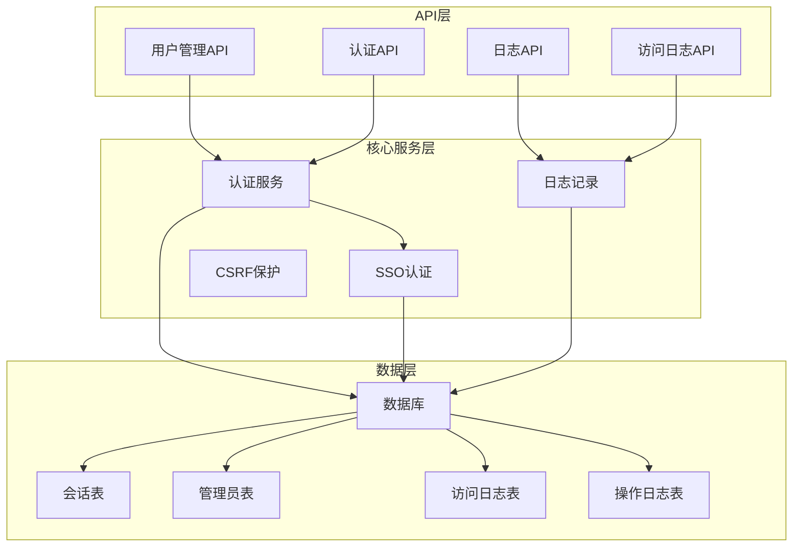
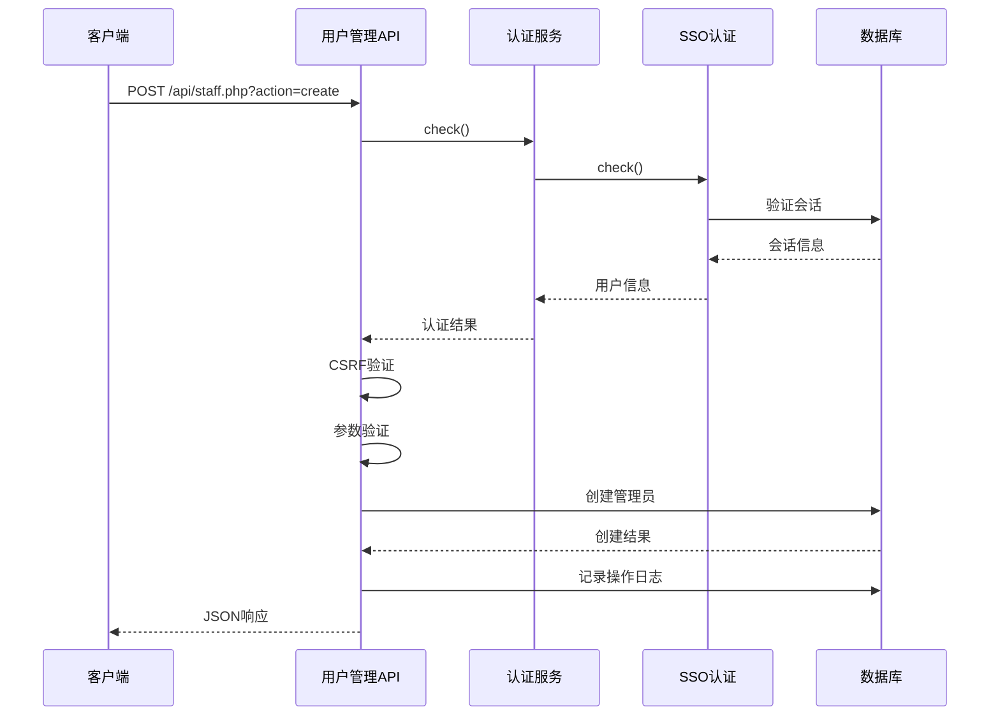
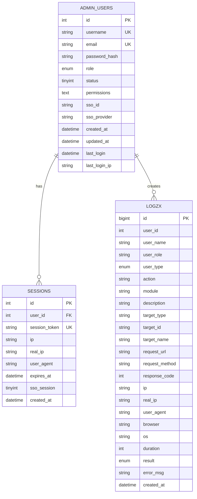
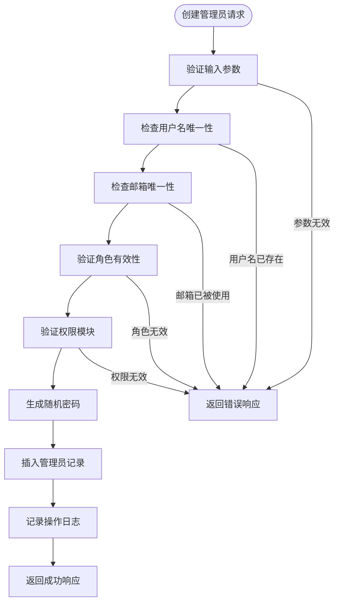
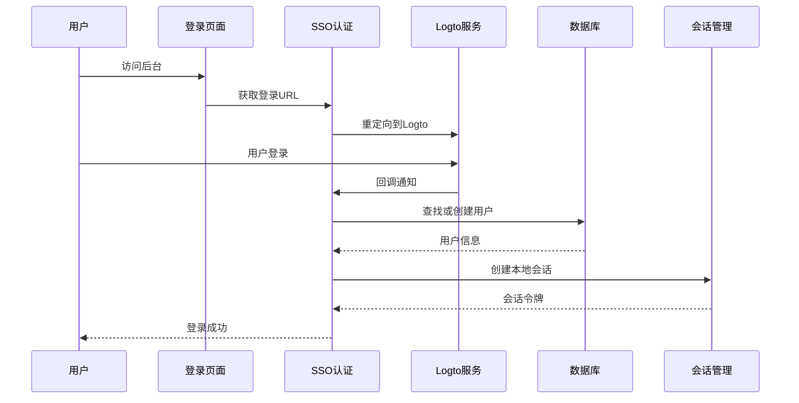
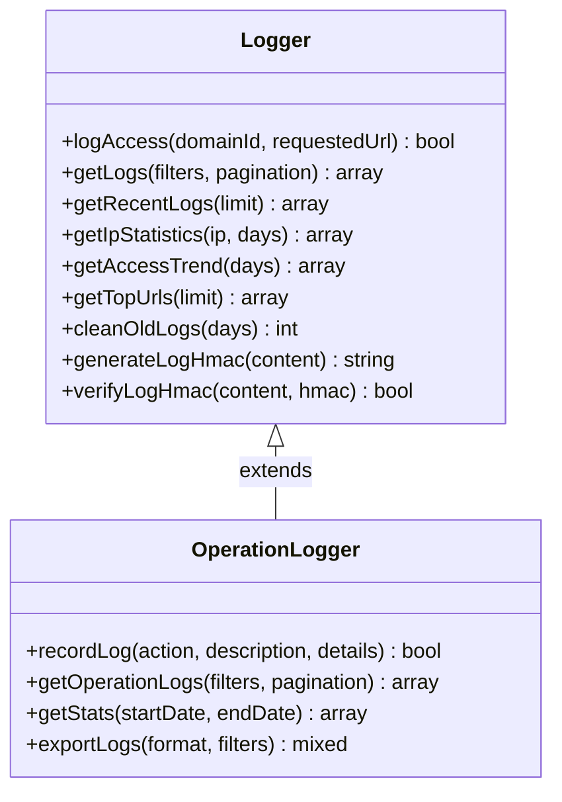
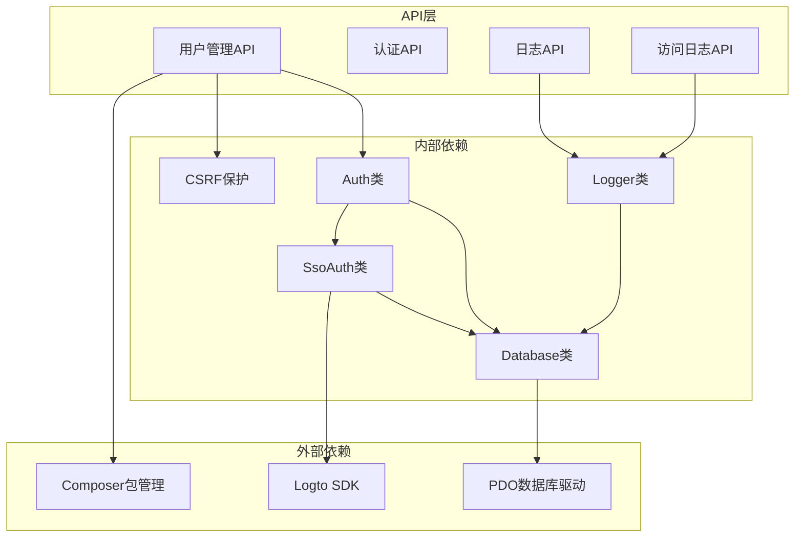

# 用户管理API

<cite>
**本文档引用的文件**
- [staff.php](file://public/api/staff.php)
- [auth.php](file://public/api/auth.php)
- [Auth.php](file://core/Auth.php)
- [SsoAuth.php](file://core/SsoAuth.php)
- [Logger.php](file://core/Logger.php)
- [config.php](file://config/config.php)
- [functions.php](file://includes/functions.php)
- [init.sql](file://sql/init.sql)
- [logs.php](file://public/api/logs.php)
- [log.php](file://public/api/log.php)
- [Database.php](file://core/Database.php)
- [CsrfProtection.php](file://core/CsrfProtection.php)
</cite>

## 目录
1. [简介](#简介)
2. [项目结构](#项目结构)
3. [核心组件](#核心组件)
4. [架构概览](#架构概览)
5. [详细组件分析](#详细组件分析)
6. [依赖关系分析](#依赖关系分析)
7. [性能考虑](#性能考虑)
8. [故障排除指南](#故障排除指南)
9. [结论](#结论)

## 简介

用户管理API是灯塔DNS拦截响应平台的核心功能模块，提供完整的管理员用户生命周期管理能力。该系统采用SSO单点登录架构，支持多角色权限管理和细粒度的权限控制。

主要功能特性：
- **用户生命周期管理**：创建、激活/禁用、删除、密码重置
- **权限管理**：基于角色的权限控制和自定义权限分配
- **会话管理**：基于Cookie的会话管理和SSO集成
- **安全防护**：CSRF保护、IP白名单、安全响应头
- **审计日志**：完整操作日志记录和统计分析
- **批量操作**：支持批量用户管理和数据导出

## 项目结构

**图表来源**
- [staff.php:1-50](file://public/api/staff.php#L1-L50)
- [auth.php:1-50](file://public/api/auth.php#L1-L50)
- [Auth.php:1-50](file://core/Auth.php#L1-L50)
- [SsoAuth.php:1-50](file://core/SsoAuth.php#L1-L50)

**章节来源**
- [staff.php:1-50](file://public/api/staff.php#L1-L50)
- [auth.php:1-50](file://public/api/auth.php#L1-L50)
- [init.sql:12-31](file://sql/init.sql#L12-L31)

## 核心组件

### 用户管理API组件

用户管理API位于`public/api/staff.php`，提供以下核心功能：

#### 主要接口
- **GET /api/staff.php?action=list** - 获取管理员列表
- **POST /api/staff.php?action=create** - 创建管理员
- **POST /api/staff.php?action=update** - 更新管理员信息
- **POST /api/staff.php?action=delete** - 禁用管理员（软删除）
- **POST /api/staff.php?action=toggle_status** - 启用/禁用管理员

#### 权限控制机制
- 仅超级管理员可访问
- 基于角色的权限验证
- 自定义权限支持通配符`*`

#### 安全特性
- CSRF令牌验证
- 输入参数清理和验证
- 会话安全检查
- 操作日志记录

**章节来源**
- [staff.php:8-14](file://public/api/staff.php#L8-L14)
- [staff.php:49-52](file://public/api/staff.php#L49-L52)

### 认证系统组件

认证系统采用双层架构：

#### 核心认证类
- **Auth类**：主要认证逻辑
- **SsoAuth类**：SSO集成认证
- **CsrfProtection类**：CSRF安全保护

#### 会话管理
- 基于Cookie的会话存储
- 会话超时控制（30分钟）
- 多设备会话支持
- SSO会话集成

**章节来源**
- [Auth.php:11-74](file://core/Auth.php#L11-L74)
- [SsoAuth.php:10-69](file://core/SsoAuth.php#L10-L69)
- [config.php:72-80](file://config/config.php#L72-L80)

## 架构概览

**图表来源**
- [staff.php:34-47](file://public/api/staff.php#L34-L47)
- [Auth.php:55-62](file://core/Auth.php#L55-L62)
- [SsoAuth.php:355-396](file://core/SsoAuth.php#L355-L396)

### 数据模型关系

**图表来源**
- [init.sql:13-31](file://sql/init.sql#L13-L31)
- [init.sql:257-272](file://sql/init.sql#L257-L272)
- [init.sql:218-252](file://sql/init.sql#L218-L252)

## 详细组件分析

### 用户管理API详细分析

#### 创建管理员接口

**图表来源**
- [staff.php:117-194](file://public/api/staff.php#L117-L194)

#### 权限验证机制

系统采用多层次权限验证：

1. **角色权限**：预设角色模板
2. **自定义权限**：JSON数组配置
3. **超级管理员特权**：完全访问权限

**章节来源**
- [staff.php:117-194](file://public/api/staff.php#L117-L194)
- [Auth.php:153-195](file://core/Auth.php#L153-L195)

### 认证系统详细分析

#### SSO认证流程

**图表来源**
- [SsoAuth.php:74-167](file://core/SsoAuth.php#L74-L167)
- [SsoAuth.php:288-350](file://core/SsoAuth.php#L288-L350)

#### 会话管理机制

系统支持多种会话管理方式：

1. **传统会话**：基于Cookie的PHP会话
2. **SSO会话**：集成Logto的单点登录
3. **多设备支持**：同一用户可在多设备登录

**章节来源**
- [SsoAuth.php:288-350](file://core/SsoAuth.php#L288-L350)
- [config.php:72-80](file://config/config.php#L72-L80)

### 日志系统详细分析

#### 操作日志记录

**图表来源**
- [Logger.php:14-472](file://core/Logger.php#L14-L472)
- [log.php:49-191](file://public/api/log.php#L49-L191)

#### 日志审计功能

系统提供完整的审计能力：

1. **访问日志**：记录所有用户访问行为
2. **操作日志**：记录管理员操作详情
3. **统计分析**：提供多维度数据分析
4. **导出功能**：支持CSV和JSON格式导出

**章节来源**
- [logs.php:55-163](file://public/api/logs.php#L55-L163)
- [log.php:193-301](file://public/api/log.php#L193-L301)

## 依赖关系分析

### 核心依赖关系

**图表来源**
- [Database.php:10-12](file://core/Database.php#L10-L12)
- [Auth.php:9-32](file://core/Auth.php#L9-L32)
- [SsoAuth.php:8-26](file://core/SsoAuth.php#L8-L26)

### 安全依赖配置

系统安全配置位于`config/config.php`：

#### CSRF保护配置
- 令牌名称：`_token`
- 过期时间：3600秒
- 多令牌支持：最多5个令牌

#### 会话安全配置
- 会话有效期：1800秒（30分钟）
- Cookie安全设置：HttpOnly、SameSite=Lax
- HTTPS自动检测

#### 安全响应头
- Content-Security-Policy
- X-Content-Type-Options: nosniff
- X-Frame-Options: DENY
- X-XSS-Protection: 1; mode=block

**章节来源**
- [config.php:86-105](file://config/config.php#L86-L105)
- [config.php:72-80](file://config/config.php#L72-L80)

## 性能考虑

### 数据库优化

1. **索引设计**
   - 管理员表：username、email、sso_id唯一索引
   - 会话表：session_token唯一索引
   - 日志表：多字段复合索引优化查询

2. **查询优化**
   - 分页查询限制每页最大100条记录
   - 使用预处理语句防止SQL注入
   - 合理使用LIMIT和OFFSET

3. **缓存策略**
   - 角色权限缓存
   - CSRF令牌缓存
   - 配置信息缓存

### 性能监控

系统提供内置性能监控：

- SQL查询执行时间记录
- 请求处理时间统计
- 数据库连接池管理
- 日志文件大小限制

**章节来源**
- [Database.php:144-181](file://core/Database.php#L144-L181)
- [functions.php:45-70](file://includes/functions.php#L45-L70)

## 故障排除指南

### 常见问题及解决方案

#### 认证失败
1. **检查SSO配置**
   - 确认Logto服务端点配置正确
   - 验证应用ID和密钥
   - 检查回调URL设置

2. **会话问题**
   - 清除浏览器Cookie
   - 检查会话过期时间
   - 验证HTTPS配置

#### 权限问题
1. **角色权限验证失败**
   - 确认用户角色配置
   - 检查自定义权限设置
   - 验证权限模块名称

2. **CSRF验证失败**
   - 检查令牌生成和传递
   - 验证令牌过期时间
   - 确认请求头设置

#### 数据库连接问题
1. **连接失败**
   - 检查数据库凭据
   - 验证网络连接
   - 确认防火墙设置

2. **查询超时**
   - 优化SQL查询
   - 检查索引配置
   - 调整查询参数

**章节来源**
- [staff.php:38-41](file://public/api/staff.php#L38-L41)
- [Auth.php:22-31](file://core/Auth.php#L22-L31)
- [Database.php:104-122](file://core/Database.php#L104-L122)

### 调试模式

系统提供详细的调试功能：

1. **调试配置**
   - 开启调试模式
   - 设置允许IP白名单
   - 配置日志级别

2. **调试输出**
   - API请求日志
   - SQL查询日志
   - 认证过程日志
   - 错误堆栈跟踪

**章节来源**
- [functions.php:45-70](file://includes/functions.php#L45-L70)
- [config.php:123-133](file://config/config.php#L123-L133)

## 结论

用户管理API提供了完整的管理员用户生命周期管理解决方案，具有以下特点：

### 技术优势
- **安全性**：多层安全防护，包括CSRF保护、会话安全、权限验证
- **可扩展性**：模块化设计，支持角色扩展和权限定制
- **可靠性**：完善的错误处理和日志记录机制
- **性能**：优化的数据库查询和缓存策略

### 功能完整性
- 支持完整的用户生命周期管理
- 提供细粒度的权限控制
- 集成SSO单点登录
- 全面的操作审计功能

### 最佳实践建议
1. **安全配置**：定期更新SSO配置和安全响应头
2. **监控维护**：建立日志监控和性能监控机制
3. **备份策略**：定期备份数据库和配置文件
4. **权限管理**：遵循最小权限原则分配用户权限

该系统为企业级用户管理提供了坚实的技术基础，可根据具体需求进行功能扩展和定制开发。