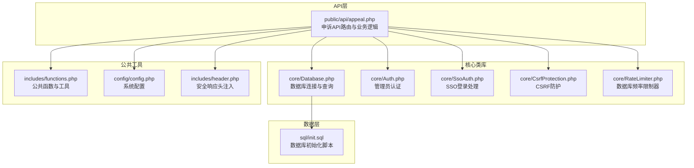
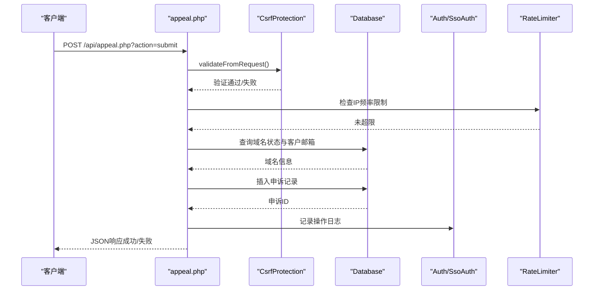
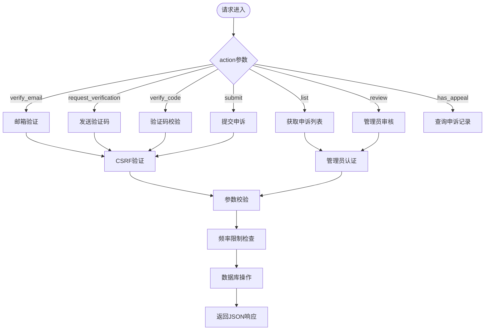
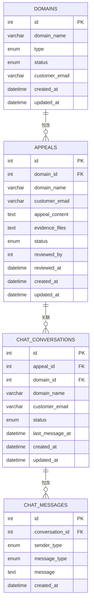
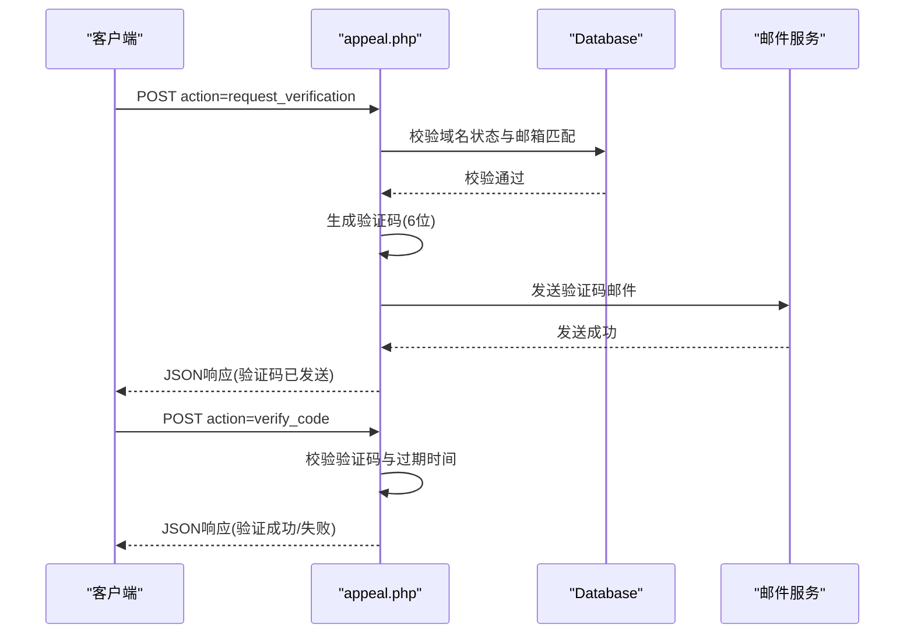
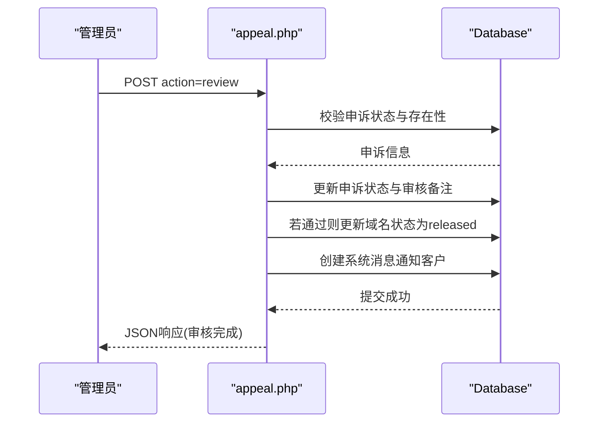
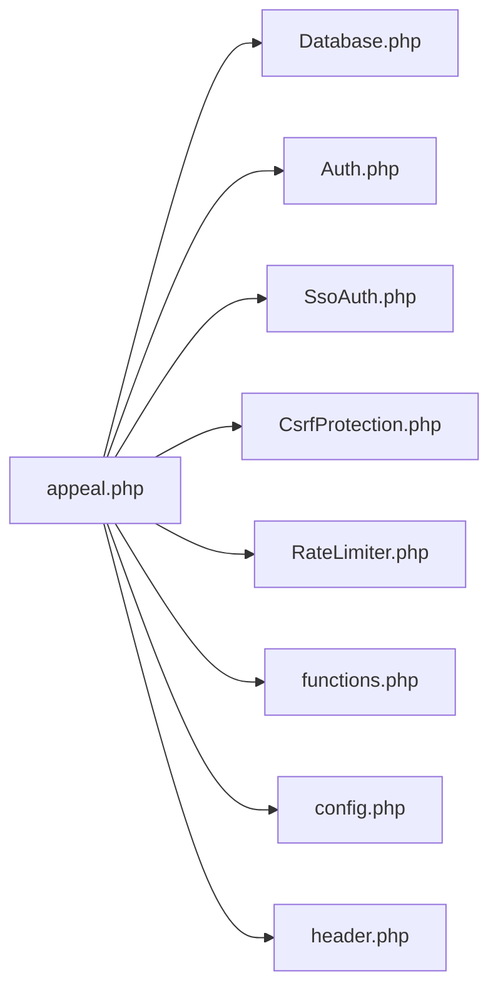

# 申诉处理API

<cite>
**本文引用的文件**
- [appeal.php](file://public/api/appeal.php)
- [init.sql](file://sql/init.sql)
- [functions.php](file://includes/functions.php)
- [Auth.php](file://core/Auth.php)
- [SsoAuth.php](file://core/SsoAuth.php)
- [Database.php](file://core/Database.php)
- [CsrfProtection.php](file://core/CsrfProtection.php)
- [RateLimiter.php](file://core/RateLimiter.php)
- [config.php](file://config/config.php)
- [header.php](file://includes/header.php)
- [callback.php](file://public/admin/callback.php)
</cite>

## 目录
1. [简介](#简介)
2. [项目结构](#项目结构)
3. [核心组件](#核心组件)
4. [架构总览](#架构总览)
5. [详细组件分析](#详细组件分析)
6. [依赖关系分析](#依赖关系分析)
7. [性能考虑](#性能考虑)
8. [故障排除指南](#故障排除指南)
9. [结论](#结论)
10. [附录](#附录)

## 简介
本文件为灯塔DNS拦截响应平台的申诉处理API完整技术文档。该API提供域名申诉的全流程能力，包括邮箱验证、验证码发送与校验、申诉提交、申诉列表查询、管理员审核等功能。系统采用PHP + MySQL架构，结合CSRF防护、频率限制、SSO认证等安全机制，确保申诉流程的安全性与可靠性。

## 项目结构
申诉处理API位于`public/api/appeal.php`，配合核心类库与数据库初始化脚本共同构成完整的申诉处理能力。

**图表来源**
- [appeal.php:1-789](file://public/api/appeal.php#L1-L789)
- [Database.php:1-400](file://core/Database.php#L1-L400)
- [Auth.php:1-272](file://core/Auth.php#L1-L272)
- [SsoAuth.php:1-505](file://core/SsoAuth.php#L1-L505)
- [CsrfProtection.php:1-298](file://core/CsrfProtection.php#L1-L298)
- [RateLimiter.php:1-309](file://core/RateLimiter.php#L1-L309)
- [functions.php:1-998](file://includes/functions.php#L1-L998)
- [config.php:1-152](file://config/config.php#L1-L152)
- [header.php:1-171](file://includes/header.php#L1-L171)
- [init.sql:1-275](file://sql/init.sql#L1-L275)

**章节来源**
- [appeal.php:1-789](file://public/api/appeal.php#L1-L789)
- [init.sql:1-275](file://sql/init.sql#L1-L275)

## 核心组件
- 申诉API路由与业务逻辑：负责接收请求、参数校验、调用核心服务与数据库操作、返回标准化JSON响应。
- 数据库类：提供PDO封装、事务支持、参数绑定、SQL注入防护等。
- 管理员认证：基于SSO的管理员登录与权限校验。
- CSRF防护：基于Session的令牌生成与验证，防止跨站请求伪造。
- 频率限制器：基于数据库的分布式频率限制，解决Session绕过问题。
- 公共函数库：输入清理、文件上传、邮件发送、JSON响应等工具函数。
- 配置系统：数据库、安全、会话、上传、调试等配置项。

**章节来源**
- [appeal.php:1-789](file://public/api/appeal.php#L1-L789)
- [Database.php:1-400](file://core/Database.php#L1-L400)
- [Auth.php:1-272](file://core/Auth.php#L1-L272)
- [SsoAuth.php:1-505](file://core/SsoAuth.php#L1-L505)
- [CsrfProtection.php:1-298](file://core/CsrfProtection.php#L1-L298)
- [RateLimiter.php:1-309](file://core/RateLimiter.php#L1-L309)
- [functions.php:1-998](file://includes/functions.php#L1-L998)
- [config.php:1-152](file://config/config.php#L1-L152)

## 架构总览
申诉处理API采用“路由分发 + 业务处理 + 数据持久化”的三层架构：
- 路由层：根据action参数分发到不同处理逻辑。
- 业务层：参数校验、安全检查（CSRF、频率限制）、业务规则（重复申诉、域名状态）。
- 数据层：数据库操作、事务管理、日志记录。

**图表来源**
- [appeal.php:361-500](file://public/api/appeal.php#L361-L500)
- [CsrfProtection.php:144-161](file://core/CsrfProtection.php#L144-L161)
- [RateLimiter.php:76-89](file://core/RateLimiter.php#L76-L89)
- [Database.php:144-181](file://core/Database.php#L144-L181)
- [Auth.php:55-62](file://core/Auth.php#L55-L62)

## 详细组件分析

### 1. 申诉API路由与业务逻辑
- 支持的action：
  - `verify_email`：邮箱验证（用于确认申诉人身份）
  - `request_verification`：发送邮箱验证码
  - `verify_code`：验证邮箱验证码并生成验证Token
  - `submit`：提交申诉（支持证据文件上传）
  - `list`：管理员获取申诉列表
  - `review`：管理员审核申诉
  - `has_appeal`：查询域名是否有申诉记录
- 请求方法限制：不同action对应不同的HTTP方法（如GET/POST）。
- CSRF防护：所有状态变更请求均进行CSRF验证。
- 频率限制：验证码发送、验证码校验、申诉提交等均有频率限制。
- 安全措施：邮箱脱敏、参数清理、SQL注入防护、XSS防护。

**图表来源**
- [appeal.php:64-789](file://public/api/appeal.php#L64-L789)

**章节来源**
- [appeal.php:1-789](file://public/api/appeal.php#L1-L789)

### 2. 数据模型与表结构
申诉相关的核心表：
- appeals：存储申诉记录，包含域名ID、客户邮箱、申诉内容、证据文件、状态、审核备注等。
- domains：存储域名信息，包含域名、类型、状态、客户邮箱等。
- chat_conversations：与申诉关联的聊天会话表。
- chat_messages：聊天消息表，用于审核通过/拒绝后的系统通知。

**图表来源**
- [init.sql:124-213](file://sql/init.sql#L124-L213)

**章节来源**
- [init.sql:124-213](file://sql/init.sql#L124-L213)

### 3. 接口参数与响应格式
- 统一响应格式：
  - 成功：success=true，code=业务码，message=消息，data=业务数据
  - 失败：success=false，code=业务码，message=错误消息，data=附加数据
- 常用HTTP状态码：
  - 200：成功
  - 400：参数错误/未知操作
  - 401：未登录
  - 403：CSRF失败/权限不足
  - 404：资源不存在
  - 409：冲突（如重复提交）
  - 429：请求过于频繁
  - 500：系统错误

**章节来源**
- [functions.php:490-516](file://includes/functions.php#L490-L516)
- [appeal.php:64-789](file://public/api/appeal.php#L64-L789)

### 4. 邮箱验证与验证码流程
- 邮箱验证：确认申诉人邮箱与域名绑定邮箱一致，支持失败次数限制与IP封禁。
- 发送验证码：检查域名状态、邮箱匹配、频率限制，生成6位数字验证码并存储到Session。
- 验证码校验：比对验证码、检查过期时间、失败次数限制，成功后生成验证Token。

**图表来源**
- [appeal.php:175-359](file://public/api/appeal.php#L175-L359)
- [functions.php:695-742](file://includes/functions.php#L695-L742)

**章节来源**
- [appeal.php:175-359](file://public/api/appeal.php#L175-L359)
- [functions.php:695-742](file://includes/functions.php#L695-L742)

### 5. 申诉提交与证据上传
- 参数校验：域名ID、客户邮箱、申诉内容长度限制。
- 重复提交检查：同一域名+邮箱在同一状态下不可重复提交。
- 证据上传：支持多文件上传，限制文件类型与大小，生成相对路径保存。
- 频率限制：基于IP的每日提交上限。
- 审核状态：默认状态为pending。

**章节来源**
- [appeal.php:361-500](file://public/api/appeal.php#L361-L500)
- [functions.php:529-681](file://includes/functions.php#L529-L681)
- [config.php:57-66](file://config/config.php#L57-L66)

### 6. 管理员审核流程
- 管理员认证：基于SSO的管理员登录与权限校验。
- 审核状态：支持approved/rejected两种状态。
- 审核备注：必填，长度限制。
- 自动释放：审核通过时自动释放域名。
- 通知机制：通过聊天消息表向客户发送系统通知。

**图表来源**
- [appeal.php:602-755](file://public/api/appeal.php#L602-L755)
- [Auth.php:55-62](file://core/Auth.php#L55-L62)

**章节来源**
- [appeal.php:602-755](file://public/api/appeal.php#L602-L755)
- [Auth.php:55-62](file://core/Auth.php#L55-L62)

### 7. 频率限制与安全机制
- 验证码发送：同一邮箱每60秒内只能发送一次；同一IP每小时最多10次。
- 验证码校验：失败次数超过阈值自动清空验证码。
- 申诉提交：同一IP每天最多5次。
- CSRF防护：令牌生成与验证，支持多令牌与过期时间。
- 会话安全：Cookie安全属性配置，会话有效期30分钟。

**章节来源**
- [appeal.php:214-227](file://public/api/appeal.php#L214-L227)
- [appeal.php:393-399](file://public/api/appeal.php#L393-L399)
- [RateLimiter.php:76-135](file://core/RateLimiter.php#L76-L135)
- [CsrfProtection.php:40-161](file://core/CsrfProtection.php#L40-L161)
- [config.php:72-80](file://config/config.php#L72-L80)

### 8. 错误处理与日志记录
- 统一错误响应：jsonError函数封装标准错误格式。
- 调试模式：可记录SQL、认证、API调用等详细日志。
- 操作日志：记录申诉提交、审核等关键操作。
- 安全日志：封禁IP、白名单拒绝等安全事件。

**章节来源**
- [functions.php:508-516](file://includes/functions.php#L508-L516)
- [functions.php:490-498](file://includes/functions.php#L490-L498)
- [appeal.php:481-490](file://public/api/appeal.php#L481-L490)
- [config.php:123-133](file://config/config.php#L123-L133)

## 依赖关系分析
- 申诉API依赖：
  - 数据库：查询域名、插入申诉、更新状态、事务处理。
  - 认证：管理员登录与权限校验。
  - CSRF：所有状态变更请求的令牌验证。
  - 频率限制：数据库级别的频率控制。
  - 公共函数：输入清理、文件上传、邮件发送、JSON响应。
  - 配置：数据库、上传、会话、安全等配置。

**图表来源**
- [appeal.php:17-53](file://public/api/appeal.php#L17-L53)
- [Database.php:1-400](file://core/Database.php#L1-L400)
- [Auth.php:1-272](file://core/Auth.php#L1-L272)
- [SsoAuth.php:1-505](file://core/SsoAuth.php#L1-L505)
- [CsrfProtection.php:1-298](file://core/CsrfProtection.php#L1-L298)
- [RateLimiter.php:1-309](file://core/RateLimiter.php#L1-L309)
- [functions.php:1-998](file://includes/functions.php#L1-L998)
- [config.php:1-152](file://config/config.php#L1-L152)
- [header.php:15-47](file://includes/header.php#L15-L47)

**章节来源**
- [appeal.php:17-53](file://public/api/appeal.php#L17-L53)

## 性能考虑
- 数据库查询优化：使用索引字段（domain_name、customer_email、status）减少查询成本。
- 事务处理：审核流程使用事务保证数据一致性。
- 频率限制：数据库级别限制避免Session绕过带来的性能与安全问题。
- 文件上传：限制文件大小与类型，避免过大文件占用带宽与存储。
- 缓存与CDN：前端资源可通过CDN加速，但API请求建议直连后端。

## 故障排除指南
- 验证码发送失败：检查邮件配置与日志，确认邮箱格式与频率限制。
- 验证码校验失败：检查验证码是否过期、失败次数是否过多。
- 申诉提交失败：检查域名状态、重复提交、参数长度限制。
- 管理员登录失败：检查SSO配置、回调地址、会话Cookie设置。
- CSRF验证失败：检查表单中隐藏令牌、AJAX请求头设置。
- 频繁请求被限制：检查频率限制配置与IP白名单。

**章节来源**
- [appeal.php:262-265](file://public/api/appeal.php#L262-L265)
- [appeal.php:355-358](file://public/api/appeal.php#L355-L358)
- [appeal.php:496-499](file://public/api/appeal.php#L496-L499)
- [callback.php:32-38](file://public/admin/callback.php#L32-L38)
- [CsrfProtection.php:144-161](file://core/CsrfProtection.php#L144-L161)
- [RateLimiter.php:76-89](file://core/RateLimiter.php#L76-L89)

## 结论
灯塔DNS拦截响应平台的申诉处理API具备完善的邮箱验证、验证码、申诉提交、列表查询、管理员审核等功能，结合CSRF防护、频率限制、SSO认证与日志审计，确保了系统的安全性与可靠性。通过标准化的JSON响应与清晰的错误码设计，便于客户端集成与维护。

## 附录

### A. API接口清单与调用示例
- 发送邮箱验证码
  - 方法：POST
  - 路径：/api/appeal.php?action=request_verification
  - 参数：domain_id, customer_email
  - 响应：expires_in（验证码有效期）
- 验证邮箱验证码
  - 方法：POST
  - 路径：/api/appeal.php?action=verify_code
  - 参数：domain_id, customer_email, code
  - 响应：verification_token（1小时有效期）
- 提交申诉
  - 方法：POST
  - 路径：/api/appeal.php?action=submit
  - 参数：domain_id, customer_email, appeal_content, customer_name, customer_phone, evidence（可选）
  - 响应：appeal_id
- 获取申诉列表（管理员）
  - 方法：GET
  - 路径：/api/appeal.php?action=list
  - 参数：domain_id, domain_name, status, page, per_page
  - 响应：appeals, stats, pagination
- 审核申诉（管理员）
  - 方法：POST
  - 路径：/api/appeal.php?action=review
  - 参数：appeal_id, status（approved/rejected）, review_note
  - 响应：appeal_id, status
- 查询域名是否有申诉记录
  - 方法：GET
  - 路径：/api/appeal.php?action=has_appeal
  - 参数：domain_id
  - 响应：has_appeal, appeal（简要信息）

**章节来源**
- [appeal.php:64-789](file://public/api/appeal.php#L64-L789)

### B. 客户端集成指南
- 表单集成：在表单中嵌入CSRF隐藏字段，参考`csrfField()`。
- AJAX请求：在请求头中携带CSRF令牌，参考`ajaxHeader()`。
- 文件上传：使用multipart/form-data，支持多文件上传。
- 错误处理：根据code与message进行UI提示与重试逻辑。
- 安全建议：始终启用HTTPS，合理设置Cookie安全属性。

**章节来源**
- [functions.php:146-177](file://includes/functions.php#L146-L177)
- [functions.php:204-233](file://includes/functions.php#L204-L233)
- [header.php:15-47](file://includes/header.php#L15-L47)
- [config.php:72-80](file://config/config.php#L72-L80)