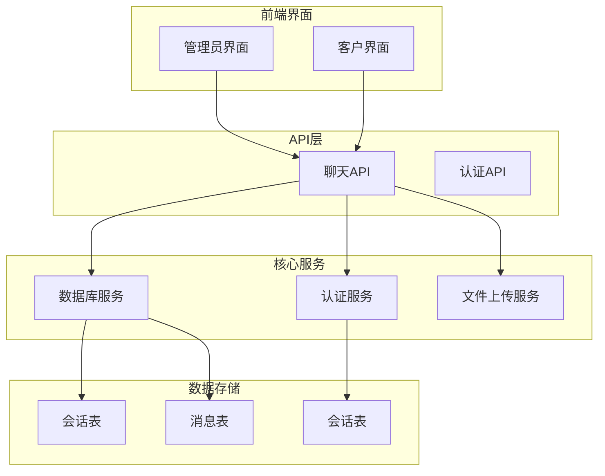
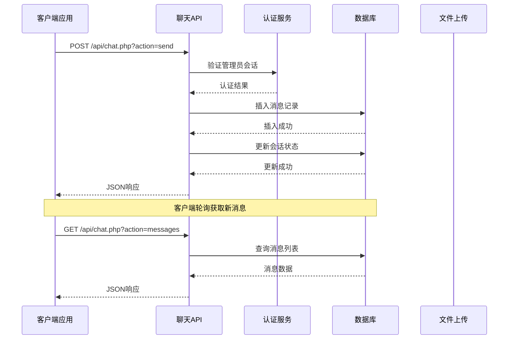
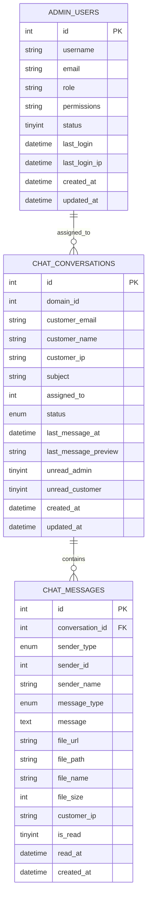
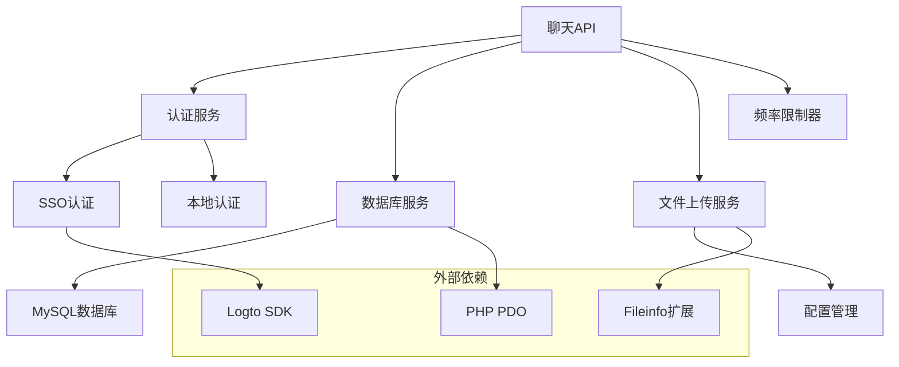

# 聊天通信API

<cite>
**本文档引用的文件**
- [chat.php](file://public/api/chat.php)
- [list.php](file://public/admin/chat/list.php)
- [view.php](file://public/admin/chat/view.php)
- [Auth.php](file://core/Auth.php)
- [SsoAuth.php](file://core/SsoAuth.php)
- [Database.php](file://core/Database.php)
- [CsrfProtection.php](file://core/CsrfProtection.php)
- [functions.php](file://includes/functions.php)
- [config.php](file://config/config.php)
- [init.sql](file://sql/init.sql)
</cite>

## 目录
1. [简介](#简介)
2. [项目结构](#项目结构)
3. [核心组件](#核心组件)
4. [架构概览](#架构概览)
5. [详细组件分析](#详细组件分析)
6. [依赖关系分析](#依赖关系分析)
7. [性能考虑](#性能考虑)
8. [故障排除指南](#故障排除指南)
9. [结论](#结论)

## 简介

灯塔DNS拦截响应平台提供了一个完整的实时聊天通信API，支持管理员与客户之间的双向通信。该系统实现了会话管理、消息收发、文件上传、未读消息计数等核心功能，采用RESTful API设计，提供JSON格式的响应数据。

系统主要特点：
- **实时通信**：基于轮询机制实现消息的近实时更新
- **多类型消息**：支持文本、图片、视频和文件传输
- **双端认证**：管理员使用SSO认证，客户使用Token验证
- **会话管理**：完整的会话生命周期管理，包括自动关闭机制
- **安全防护**：CSRF保护、SQL注入防护、文件上传安全验证

## 项目结构

**图表来源**
- [chat.php:1-1017](file://public/api/chat.php#L1-L1017)
- [Auth.php:1-272](file://core/Auth.php#L1-L272)

**章节来源**
- [chat.php:1-1017](file://public/api/chat.php#L1-L1017)
- [list.php:1-226](file://public/admin/chat/list.php#L1-L226)

## 核心组件

### 聊天API控制器
聊天API是系统的核心入口，提供完整的聊天功能接口：

**主要功能模块：**
- 会话管理：创建、关闭、查询会话列表
- 消息处理：发送、接收、历史消息查询
- 文件上传：支持图片、视频、文档上传
- 未读消息：统计和标记已读状态
- 客户端接口：为匿名用户提供安全的消息发送能力

**接口特性：**
- RESTful设计，基于URL参数action路由
- 统一JSON响应格式
- 完善的错误处理和状态码
- 支持分页查询和条件筛选

### 认证系统
系统采用双重认证机制：

**管理员认证（SSO）：**
- 基于Logto的单点登录
- 自动用户同步和权限管理
- 会话管理和安全验证

**客户认证：**
- 基于Token的身份验证
- 支持申诉流程中的邮箱验证
- 会话级别的安全保护

### 数据库模型
系统使用MySQL数据库存储聊天数据：

**核心表结构：**
- `chat_conversations`：会话信息管理
- `chat_messages`：消息内容存储
- `sessions`：用户会话管理

**数据完整性：**
- 外键约束保证数据一致性
- 索引优化查询性能
- 安全字段防止SQL注入

**章节来源**
- [chat.php:102-1017](file://public/api/chat.php#L102-L1017)
- [Auth.php:55-94](file://core/Auth.php#L55-L94)
- [Database.php:13-400](file://core/Database.php#L13-L400)

## 架构概览

**图表来源**
- [chat.php:282-393](file://public/api/chat.php#L282-L393)
- [view.php:431-444](file://public/admin/chat/view.php#L431-L444)

系统采用分层架构设计，各组件职责明确：

**架构层次：**
1. **表现层**：Web界面和API接口
2. **业务层**：聊天逻辑和业务规则
3. **数据层**：数据库操作和文件存储
4. **安全层**：认证授权和安全防护

## 详细组件分析

### 聊天API接口规范

#### 会话管理接口

**获取会话列表（管理员）**
- 方法：GET
- URL：`/api/chat.php?action=list`
- 参数：page、per_page、search、status
- 权限：管理员登录

**创建新会话（管理员）**
- 方法：POST
- URL：`/api/chat.php?action=create`
- 参数：domain_id、customer_email
- 权限：管理员登录

**关闭会话（管理员）**
- 方法：POST
- URL：`/api/chat.php?action=close`
- 参数：id
- 权限：管理员登录

**获取未读消息总数（管理员）**
- 方法：GET
- URL：`/api/chat.php?action=unread_count`
- 权限：管理员登录

#### 消息处理接口

**管理员发送消息**
- 方法：POST
- URL：`/api/chat.php?action=send`
- 参数：conversation_id、message、message_type、file
- 权限：管理员登录

**客户发送消息**
- 方法：POST
- URL：`/api/chat.php?action=customer_send`
- 参数：conversation_id、message、message_type、verification_token、customer_email、domain
- 权限：客户验证

**获取消息历史**
- 方法：GET
- URL：`/api/chat.php?action=messages` 或 `/api/chat.php?action=customer_messages`
- 参数：conversation_id、page、per_page、verification_token、customer_email
- 权限：相应权限

#### 文件上传接口

**文件上传处理**
- 方法：POST
- URL：`/api/chat.php?action=upload`
- 参数：conversation_id、file
- 权限：管理员登录

**章节来源**
- [chat.php:104-1017](file://public/api/chat.php#L104-L1017)

### 数据模型设计

**图表来源**
- [init.sql:170-213](file://sql/init.sql#L170-L213)

### 安全机制

#### CSRF防护
系统实现多层CSRF防护机制：

**令牌管理：**
- Session存储CSRF令牌
- 支持多令牌并发使用
- 自动过期清理机制
- 时间安全比较算法

**验证流程：**
- 从多个位置获取令牌（HTTP头、POST参数）
- 防止令牌重放攻击
- 支持消费后令牌清除

#### 文件上传安全
**多重验证机制：**
- 扩展名白名单验证
- MIME类型二次验证
- 文件大小限制
- 安全文件名生成
- 目录访问控制

**章节来源**
- [CsrfProtection.php:17-298](file://core/CsrfProtection.php#L17-L298)
- [chat.php:1029-1160](file://public/api/chat.php#L1029-L1160)

### 自动化功能

#### 会话自动关闭
系统实现智能会话管理：

**触发条件：**
- 10分钟无消息活动
- 无未读管理员消息
- 竞态条件防护

**处理流程：**
- 定期扫描不活跃会话
- 最终确认无未读消息
- 自动关闭并通知客户

#### 未读消息统计
**实时统计机制：**
- 活跃会话中客户消息计数
- 按会话分组的未读统计
- 自动标记消息为已读

**章节来源**
- [chat.php:61-99](file://public/api/chat.php#L61-L99)
- [chat.php:845-889](file://public/api/chat.php#L845-L889)

## 依赖关系分析

**图表来源**
- [chat.php:23-48](file://public/api/chat.php#L23-L48)
- [SsoAuth.php:19-61](file://core/SsoAuth.php#L19-L61)

**依赖特点：**
- **低耦合设计**：各组件职责单一，便于维护
- **可扩展性**：支持插件化扩展和第三方集成
- **安全性**：内置多种安全防护机制
- **性能优化**：数据库索引和查询优化

**章节来源**
- [Database.php:13-400](file://core/Database.php#L13-L400)
- [functions.php:27-41](file://includes/functions.php#L27-L41)

## 性能考虑

### 数据库优化
**索引策略：**
- 会话表：status、customer_email、domain_name索引
- 消息表：conversation_id、sender_type、created_at索引
- 会话表：提升查询和排序性能

**查询优化：**
- 分页查询限制每页最大记录数
- 条件筛选减少数据传输
- 索引使用避免全表扫描

### 缓存策略
**会话缓存：**
- Redis缓存热门会话数据
- 减少数据库查询压力
- 提升响应速度

**配置缓存：**
- 静态配置文件缓存
- 避免重复文件读取
- 提升系统启动速度

### 文件存储优化
**存储策略：**
- 按日期分目录存储文件
- 压缩存储节省空间
- CDN加速文件访问

**章节来源**
- [config.php:57-66](file://config/config.php#L57-L66)
- [Database.php:144-181](file://core/Database.php#L144-L181)

## 故障排除指南

### 常见问题诊断

**认证失败**
- 检查SSO配置是否正确
- 验证会话是否过期
- 确认用户权限设置

**文件上传失败**
- 检查文件大小限制
- 验证文件类型是否允许
- 确认上传目录权限

**消息发送异常**
- 验证会话状态是否活跃
- 检查消息类型是否支持
- 确认CSRF令牌有效性

### 日志分析
**调试模式启用：**
- 配置文件中开启调试模式
- 查看详细错误日志
- 分析SQL执行性能

**监控指标：**
- API响应时间统计
- 错误率监控
- 用户行为分析

### 性能优化建议
**数据库层面：**
- 定期优化表结构
- 监控慢查询日志
- 调整缓冲池大小

**应用层面：**
- 合理设置会话超时
- 优化文件上传处理
- 实施适当的缓存策略

**章节来源**
- [config.php:123-133](file://config/config.php#L123-L133)
- [functions.php:50-70](file://includes/functions.php#L50-L70)

## 结论

灯塔DNS拦截响应平台的聊天通信API提供了一个功能完整、安全可靠的实时通信解决方案。系统采用现代化的架构设计，实现了以下核心价值：

**技术优势：**
- 完善的双端认证机制
- 多层次安全防护体系
- 高性能的数据库设计
- 灵活的扩展架构

**业务价值：**
- 提升客户服务质量
- 降低运营成本
- 增强用户体验
- 支持业务快速发展

**未来发展：**
- WebSocket升级计划
- AI智能客服集成
- 多语言支持扩展
- 移动端原生应用

该系统为类似的企业级聊天通信需求提供了优秀的参考实现，具有良好的可维护性和扩展性。