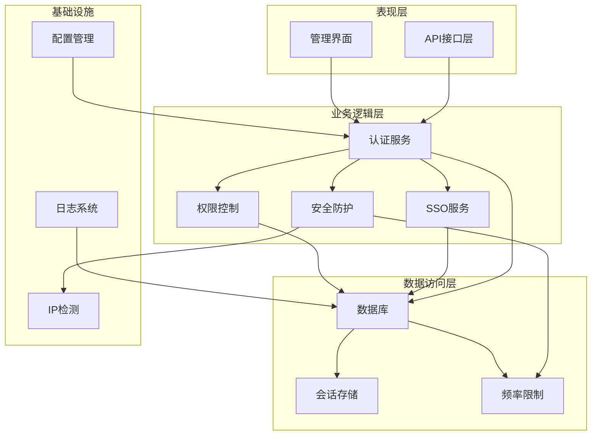
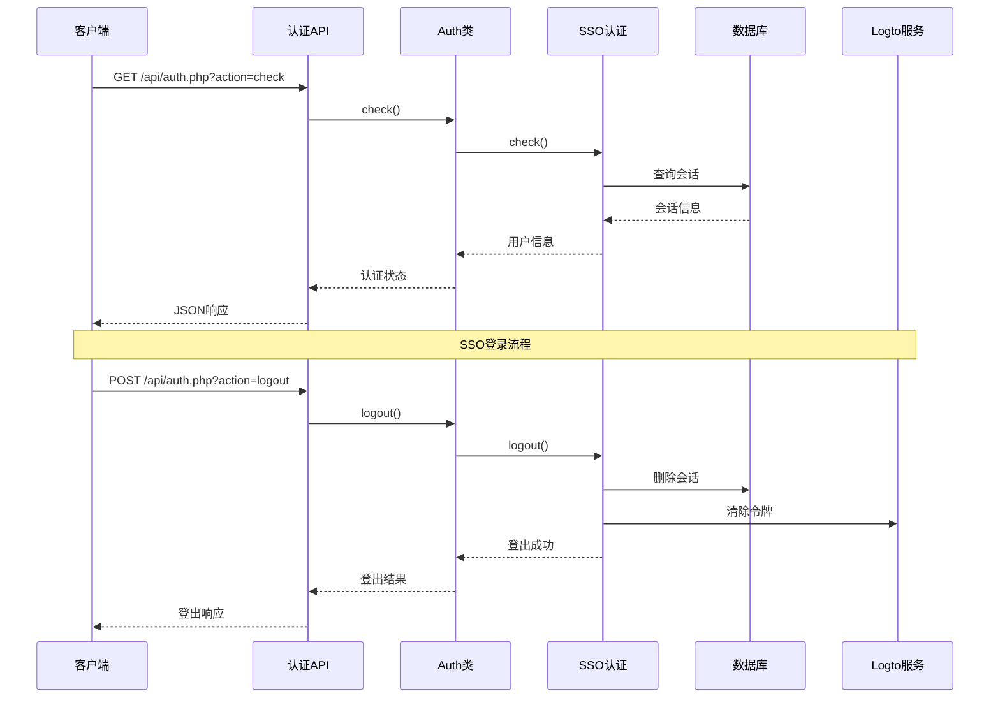
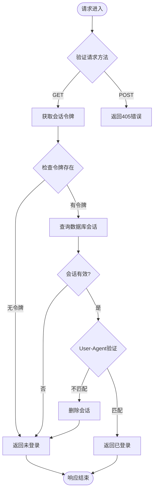
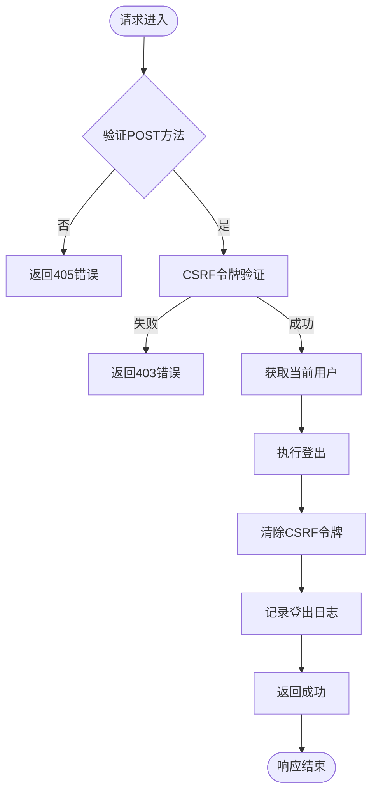
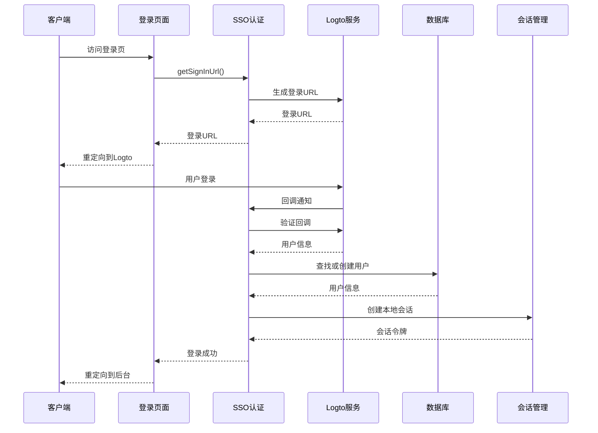
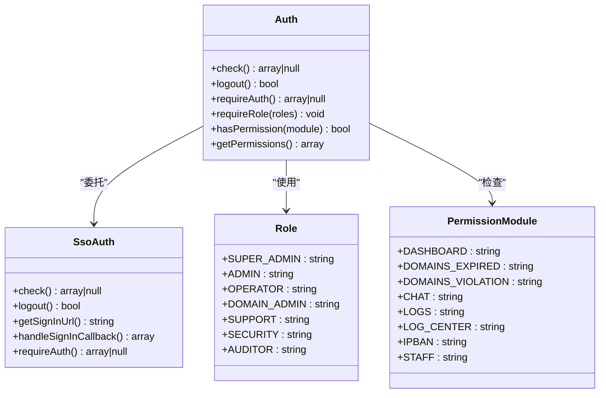
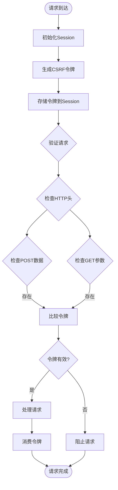
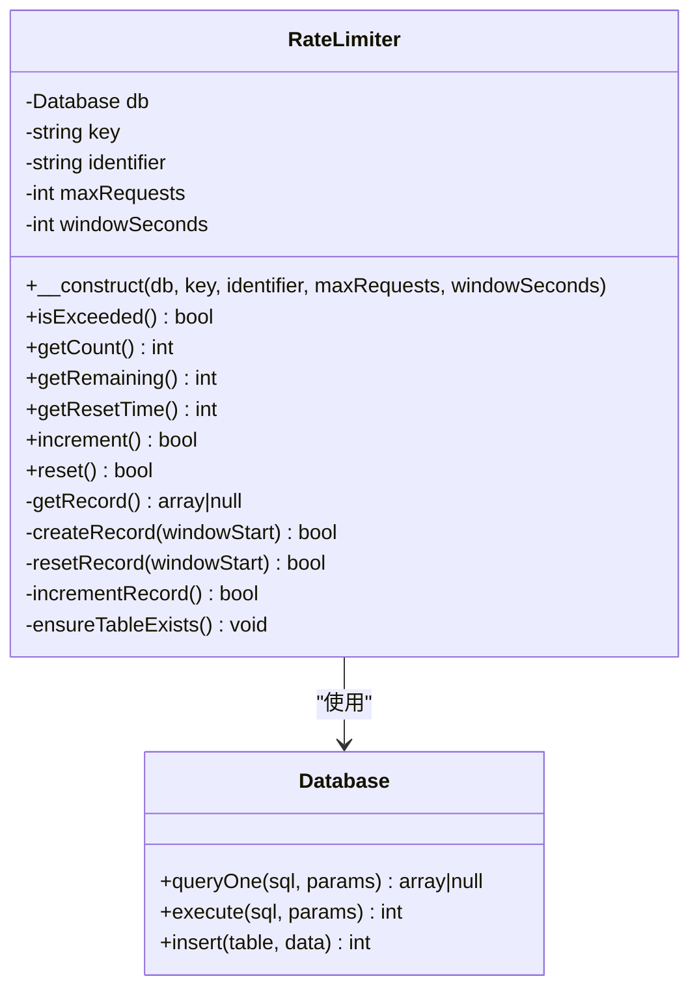
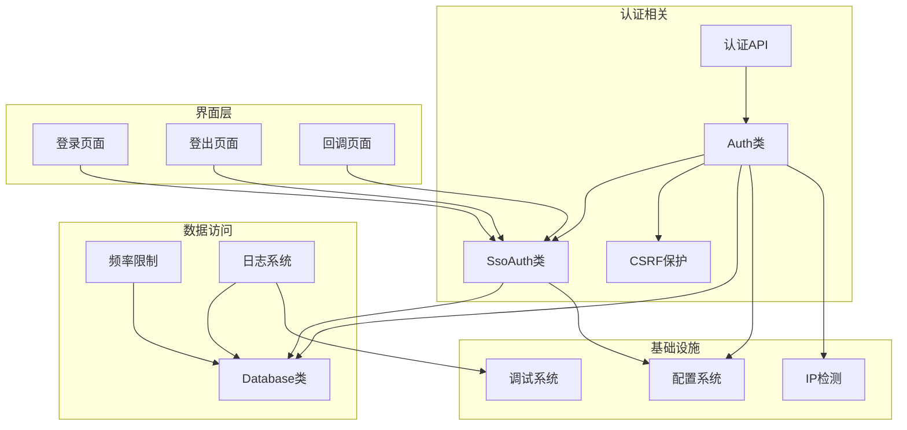
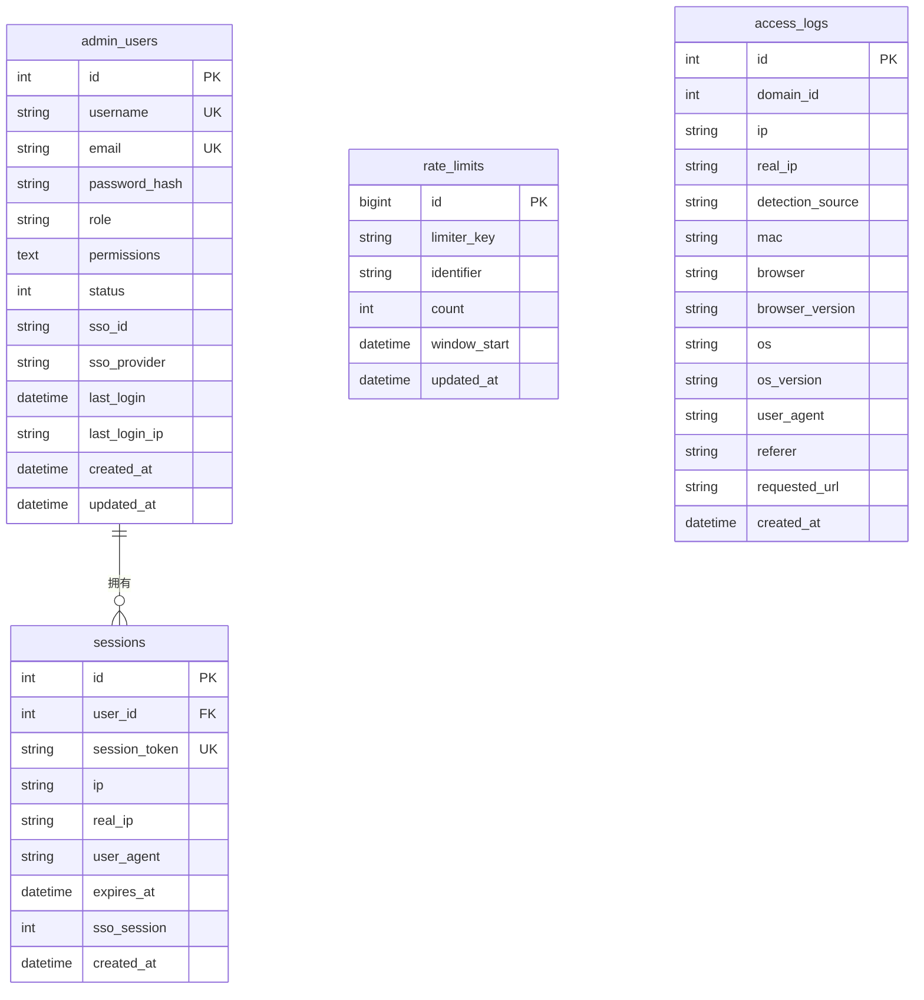

# 认证授权API

<cite>
**本文档引用的文件**
- [public/api/auth.php](file://public/api/auth.php)
- [core/Auth.php](file://core/Auth.php)
- [core/SsoAuth.php](file://core/SsoAuth.php)
- [core/CsrfProtection.php](file://core/CsrfProtection.php)
- [core/RateLimiter.php](file://core/RateLimiter.php)
- [public/admin/login.php](file://public/admin/login.php)
- [public/admin/logout.php](file://public/admin/logout.php)
- [public/admin/callback.php](file://public/admin/callback.php)
- [config/config.php](file://config/config.php)
- [core/Database.php](file://core/Database.php)
- [includes/functions.php](file://includes/functions.php)
- [core/IpDetector.php](file://core/IpDetector.php)
- [core/Logger.php](file://core/Logger.php)
- [public/reset_password.php](file://public/reset_password.php)
- [core/Debug.php](file://core/Debug.php)
</cite>

## 目录
1. [简介](#简介)
2. [项目结构](#项目结构)
3. [核心组件](#核心组件)
4. [架构概览](#架构概览)
5. [详细组件分析](#详细组件分析)
6. [依赖关系分析](#依赖关系分析)
7. [性能考虑](#性能考虑)
8. [故障排除指南](#故障排除指南)
9. [结论](#结论)
10. [附录](#附录)

## 简介

认证授权API是灯塔DNS拦截响应平台的核心安全组件，负责管理管理员的认证、授权和会话生命周期。该系统采用SSO（单点登录）集成，结合CSRF保护、IP检测、频率限制等多重安全机制，确保系统的安全性。

系统主要特点：
- 基于Logto的SSO集成，支持统一身份认证
- 完整的会话管理机制，包括超时控制和多设备支持
- 多层次安全防护，包括CSRF、IP限制、频率控制
- 详细的审计日志和安全监控
- 支持权限分级和模块化权限控制

## 项目结构

认证授权系统采用分层架构设计，主要分为以下几个层次：

**图表来源**
- [core/Auth.php:11-272](file://core/Auth.php#L11-L272)
- [core/SsoAuth.php:10-505](file://core/SsoAuth.php#L10-L505)
- [core/CsrfProtection.php:17-298](file://core/CsrfProtection.php#L17-L298)

**章节来源**
- [core/Auth.php:1-272](file://core/Auth.php#L1-L272)
- [core/SsoAuth.php:1-505](file://core/SsoAuth.php#L1-L505)
- [config/config.php:15-152](file://config/config.php#L15-L152)

## 核心组件

### 认证核心组件

系统的核心认证组件包括：

1. **Auth类** - 主认证控制器，处理会话检查、权限验证
2. **SsoAuth类** - SSO集成服务，处理Logto认证流程
3. **CsrfProtection类** - CSRF保护机制
4. **RateLimiter类** - 频率限制器
5. **Database类** - 数据库连接和操作

### 安全组件

1. **IpDetector类** - IP地址检测和地理位置查询
2. **Logger类** - 访问日志记录
3. **Debug类** - 调试日志系统
4. **配置系统** - 安全配置管理

**章节来源**
- [core/Auth.php:11-272](file://core/Auth.php#L11-L272)
- [core/SsoAuth.php:10-505](file://core/SsoAuth.php#L10-L505)
- [core/CsrfProtection.php:17-298](file://core/CsrfProtection.php#L17-L298)
- [core/RateLimiter.php:25-309](file://core/RateLimiter.php#L25-L309)

## 架构概览

认证授权系统采用模块化设计，各组件职责明确：

**图表来源**
- [public/api/auth.php:46-125](file://public/api/auth.php#L46-L125)
- [core/Auth.php:55-74](file://core/Auth.php#L55-L74)
- [core/SsoAuth.php:355-423](file://core/SsoAuth.php#L355-L423)

**章节来源**
- [public/api/auth.php:1-126](file://public/api/auth.php#L1-L126)
- [core/Auth.php:55-74](file://core/Auth.php#L55-L74)
- [core/SsoAuth.php:355-423](file://core/SsoAuth.php#L355-L423)

## 详细组件分析

### 认证API接口

认证API提供两个核心接口：

#### 登录状态检查接口

**图表来源**
- [public/api/auth.php:86-120](file://public/api/auth.php#L86-L120)
- [core/SsoAuth.php:355-396](file://core/SsoAuth.php#L355-L396)

#### 退出登录接口

**图表来源**
- [public/api/auth.php:48-84](file://public/api/auth.php#L48-L84)
- [core/Auth.php:67-74](file://core/Auth.php#L67-L74)
- [core/CsrfProtection.php:144-161](file://core/CsrfProtection.php#L144-L161)

**章节来源**
- [public/api/auth.php:46-125](file://public/api/auth.php#L46-L125)

### SSO认证流程

SSO认证采用Logto集成，支持统一身份认证：

**图表来源**
- [public/admin/login.php:45-58](file://public/admin/login.php#L45-L58)
- [public/admin/callback.php:40-52](file://public/admin/callback.php#L40-L52)
- [core/SsoAuth.php:100-167](file://core/SsoAuth.php#L100-L167)

**章节来源**
- [public/admin/login.php:1-337](file://public/admin/login.php#L1-L337)
- [public/admin/callback.php:1-53](file://public/admin/callback.php#L1-L53)
- [core/SsoAuth.php:74-167](file://core/SsoAuth.php#L74-L167)

### 权限控制系统

系统采用基于角色的权限控制（RBAC）：

**图表来源**
- [core/Auth.php:11-272](file://core/Auth.php#L11-L272)
- [core/SsoAuth.php:10-505](file://core/SsoAuth.php#L10-L505)

**章节来源**
- [core/Auth.php:138-233](file://core/Auth.php#L138-L233)

### CSRF保护机制

系统实现多层CSRF保护：

**图表来源**
- [core/CsrfProtection.php:40-161](file://core/CsrfProtection.php#L40-L161)

**章节来源**
- [core/CsrfProtection.php:17-298](file://core/CsrfProtection.php#L17-L298)

### 频率限制系统

基于数据库的频率限制器：

**图表来源**
- [core/RateLimiter.php:25-309](file://core/RateLimiter.php#L25-L309)

**章节来源**
- [core/RateLimiter.php:25-309](file://core/RateLimiter.php#L25-L309)

## 依赖关系分析

### 组件依赖图

**图表来源**
- [core/Auth.php:11-272](file://core/Auth.php#L11-L272)
- [core/SsoAuth.php:19-39](file://core/SsoAuth.php#L19-L39)
- [public/api/auth.php:14-39](file://public/api/auth.php#L14-L39)

### 数据库表结构

**图表来源**
- [core/Database.php:209-274](file://core/Database.php#L209-L274)
- [core/RateLimiter.php:269-281](file://core/RateLimiter.php#L269-L281)
- [core/Logger.php:48-120](file://core/Logger.php#L48-L120)

**章节来源**
- [core/Database.php:209-274](file://core/Database.php#L209-L274)
- [core/RateLimiter.php:269-281](file://core/RateLimiter.php#L269-L281)
- [core/Logger.php:48-120](file://core/Logger.php#L48-L120)

## 性能考虑

### 会话管理优化

1. **会话超时控制**：系统配置30分钟会话超时，符合等保2.0三级要求
2. **User-Agent验证**：防止会话劫持，但可能影响代理环境
3. **数据库索引优化**：会话表使用复合索引提高查询性能

### CSRF令牌管理

1. **多令牌支持**：支持同时存在多个有效令牌，提高并发性能
2. **令牌清理机制**：自动清理过期令牌，防止内存泄漏
3. **时间安全比较**：使用hash_equals防止时序攻击

### 频率限制优化

1. **数据库级限制**：基于MySQL的原子操作，确保准确性
2. **缓存降级**：支持APCu和文件缓存，提高查询性能
3. **智能清理**：定期清理过期记录，维护数据库健康

## 故障排除指南

### 常见认证问题

#### SSO登录失败

**症状**：用户无法通过SSO登录系统

**排查步骤**：
1. 检查Logto配置是否正确
2. 验证回调URL配置
3. 检查网络连接和防火墙设置
4. 查看调试日志获取详细错误信息

**解决方案**：
- 确认Logto服务正常运行
- 验证应用ID和密钥配置
- 检查HTTPS证书有效性

#### 会话超时问题

**症状**：用户登录后很快被登出

**排查步骤**：
1. 检查会话配置的lifetime设置
2. 验证Cookie配置是否正确
3. 检查服务器时间同步情况

**解决方案**：
- 调整session.lifetime配置
- 确保服务器时间准确
- 检查负载均衡器的会话保持设置

#### CSRF验证失败

**症状**：POST请求总是被拒绝

**排查步骤**：
1. 检查表单中是否包含CSRF令牌
2. 验证AJAX请求是否正确设置请求头
3. 检查令牌是否过期

**解决方案**：
- 确保表单正确渲染CSRF令牌
- 验证JavaScript正确设置请求头
- 检查令牌清理机制是否正常工作

**章节来源**
- [core/Debug.php:42-75](file://core/Debug.php#L42-L75)
- [config/config.php:68-105](file://config/config.php#L68-L105)

## 结论

认证授权API提供了完整的SSO集成、会话管理和安全防护机制。系统采用模块化设计，具有良好的可扩展性和安全性。

主要优势：
1. **强安全性**：多层防护机制，包括CSRF、IP检测、频率限制
2. **灵活配置**：支持多种SSO提供商和自定义配置
3. **完整审计**：详细的日志记录和监控能力
4. **性能优化**：合理的数据库设计和缓存策略

建议改进：
1. 增加多设备登录支持
2. 实现强制下线功能
3. 添加IP白名单和黑名单功能
4. 增强密码重置功能（虽然系统使用SSO）

## 附录

### 安全配置指南

#### 基础安全配置

1. **启用HTTPS**：确保所有认证相关接口使用HTTPS传输
2. **配置安全Cookie**：设置Secure、HttpOnly、SameSite属性
3. **启用CSRF保护**：在所有状态变更请求中启用CSRF验证
4. **配置会话超时**：根据业务需求调整会话有效期

#### 高级安全配置

1. **IP限制**：配置IP白名单和黑名单
2. **频率控制**：为敏感操作设置更严格的频率限制
3. **审计日志**：启用详细的操作日志记录
4. **监控告警**：设置异常行为监控和告警机制

#### 部署建议

1. **环境分离**：开发、测试、生产环境使用不同的配置
2. **密钥管理**：使用环境变量存储敏感配置
3. **定期审计**：定期检查安全配置和日志
4. **备份恢复**：建立完整的数据备份和恢复机制

**章节来源**
- [config/config.php:82-105](file://config/config.php#L82-L105)
- [core/Database.php:93-102](file://core/Database.php#L93-L102)
- [core/IpDetector.php:566-649](file://core/IpDetector.php#L566-L649)