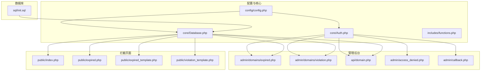
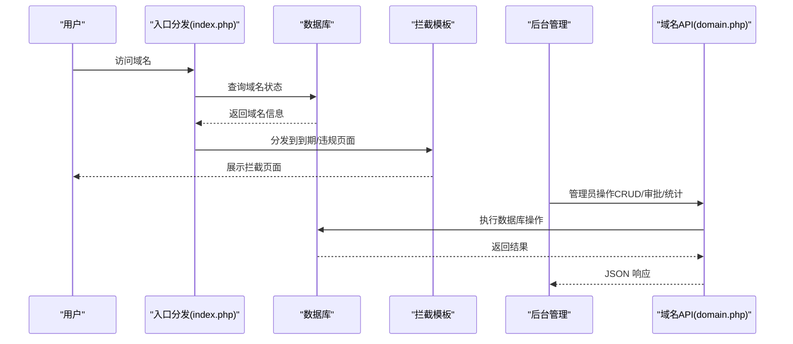
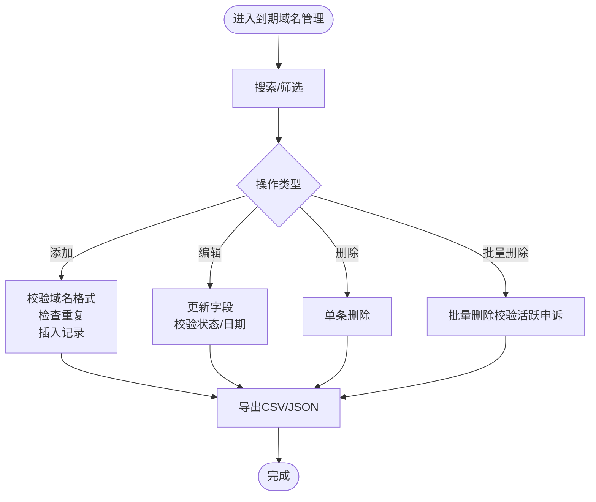
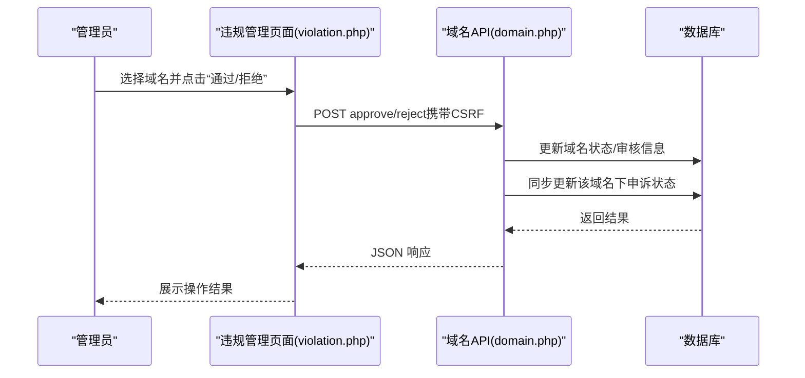
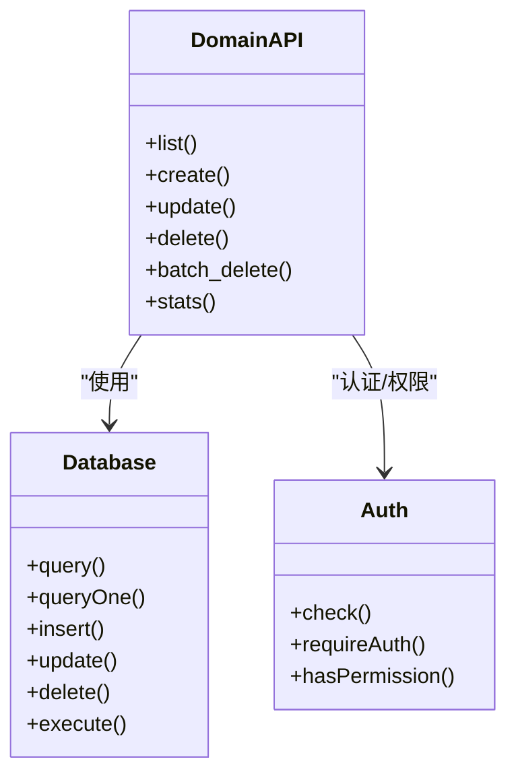
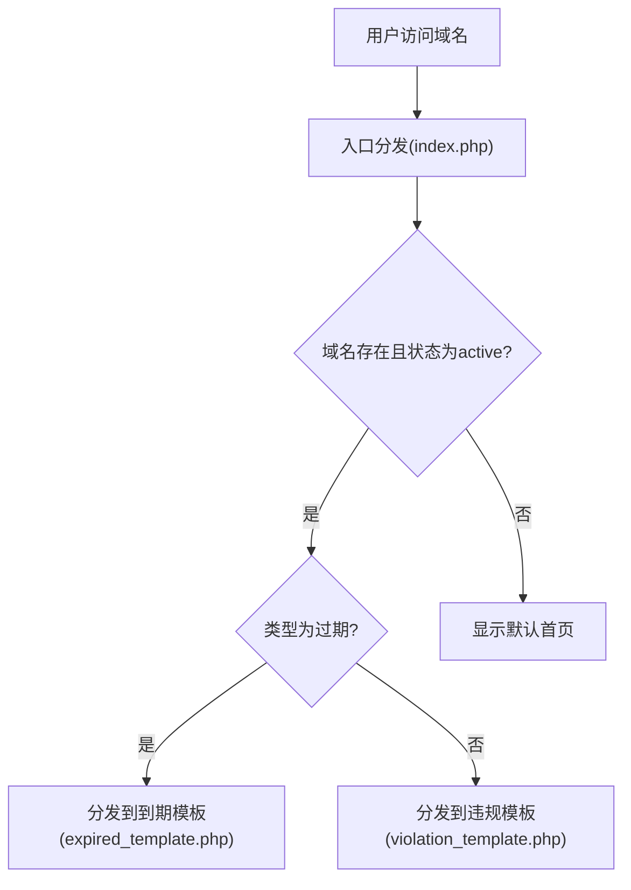
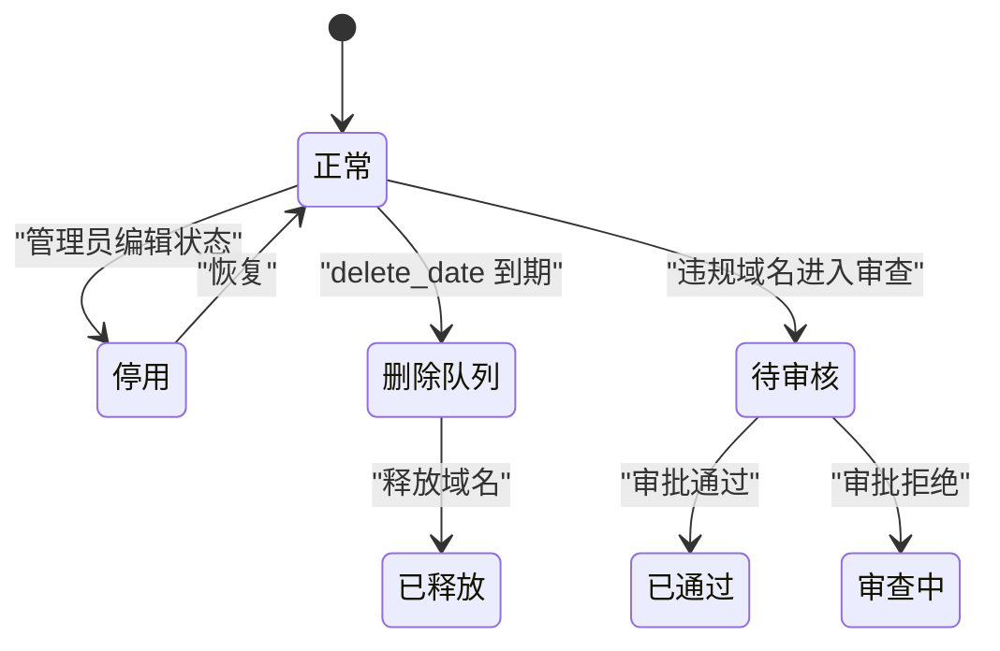
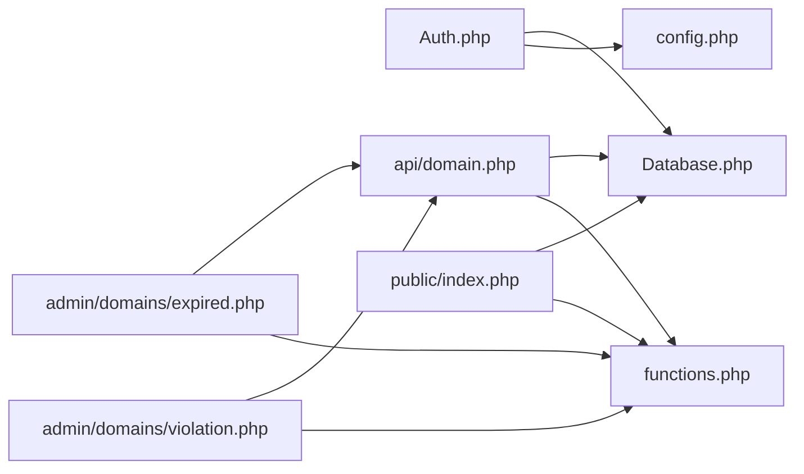

# 域名管理

<cite>
**本文引用的文件**
- [config.php](file://config/config.php)
- [expired.php](file://public/admin/domains/expired.php)
- [violation.php](file://public/admin/domains/violation.php)
- [domain.php](file://public/api/domain.php)
- [functions.php](file://includes/functions.php)
- [Auth.php](file://core/Auth.php)
- [Database.php](file://core/Database.php)
- [index.php](file://public/index.php)
- [expired.php](file://public/expired.php)
- [expired_template.php](file://public/expired_template.php)
- [violation_template.php](file://public/violation_template.php)
- [access_denied.php](file://public/admin/access_denied.php)
- [callback.php](file://public/admin/callback.php)
- [init.sql](file://sql/init.sql)
</cite>

## 目录
1. [简介](#简介)
2. [项目结构](#项目结构)
3. [核心组件](#核心组件)
4. [架构总览](#架构总览)
5. [详细组件分析](#详细组件分析)
6. [依赖关系分析](#依赖关系分析)
7. [性能考量](#性能考量)
8. [故障排查指南](#故障排查指南)
9. [结论](#结论)
10. [附录](#附录)

## 简介
本文件面向“域名管理系统”的使用者与维护者，系统围绕“到期域名”和“违规域名”的全生命周期管理展开，涵盖添加、删除、编辑、查询、批量操作、导入导出、搜索过滤、状态跟踪与转换、拦截页面与响应机制、SSO 登录与权限控制、CDN 兼容性与安全加固等内容。系统采用 PHP + MySQL 技术栈，前端基于 TailwindCSS 与原生 JavaScript，提供后台管理界面与用户拦截页面。

## 项目结构
- 配置与核心
  - config/config.php：站点、数据库、会话、安全、日志、调试、SSO 等配置
  - core/Auth.php：管理员认证与权限控制
  - core/Database.php：PDO 数据库封装
  - includes/functions.php：公共函数库（输入清理、CSRF、JSON 响应、文件上传、工具函数等）
- 管理后台
  - public/admin/domains/expired.php：到期域名管理（CRUD、搜索、分页、批量、导出）
  - public/admin/domains/violation.php：违规域名管理（CRUD、审批、搜索、分页）
  - public/api/domain.php：域名管理 API（列表、创建、更新、删除、批量删除、统计）
  - public/admin/access_denied.php：后台域名白名单拒绝访问页面
  - public/admin/callback.php：SSO 登录回调处理
- 前端拦截页面
  - public/index.php：入口分发，根据域名类型分发到过期/违规模板
  - public/expired.php：到期域名入口
  - public/expired_template.php：到期域名拦截页面
  - public/violation_template.php：违规域名拦截页面
- 数据库初始化
  - sql/init.sql：管理员、域名、IP封禁、访问日志、申诉、会话、操作日志等表结构

**图表来源**
- [config.php:15-151](file://config/config.php#L15-L151)
- [Auth.php:11-272](file://core/Auth.php#L11-L272)
- [Database.php:13-400](file://core/Database.php#L13-L400)
- [functions.php:1-998](file://includes/functions.php#L1-L998)
- [expired.php:1-675](file://public/admin/domains/expired.php#L1-L675)
- [violation.php:1-594](file://public/admin/domains/violation.php#L1-L594)
- [domain.php:1-539](file://public/api/domain.php#L1-L539)
- [index.php:1-228](file://public/index.php#L1-L228)
- [expired.php:1-48](file://public/expired.php#L1-L48)
- [expired_template.php:1-635](file://public/expired_template.php#L1-L635)
- [violation_template.php:1-1144](file://public/violation_template.php#L1-L1144)
- [access_denied.php:1-318](file://public/admin/access_denied.php#L1-L318)
- [callback.php:1-53](file://public/admin/callback.php#L1-L53)
- [init.sql:1-275](file://sql/init.sql#L1-L275)

**章节来源**
- [config.php:15-151](file://config/config.php#L15-L151)
- [expired.php:1-675](file://public/admin/domains/expired.php#L1-L675)
- [violation.php:1-594](file://public/admin/domains/violation.php#L1-L594)
- [domain.php:1-539](file://public/api/domain.php#L1-L539)
- [index.php:1-228](file://public/index.php#L1-L228)
- [expired.php:1-48](file://public/expired.php#L1-L48)
- [expired_template.php:1-635](file://public/expired_template.php#L1-L635)
- [violation_template.php:1-1144](file://public/violation_template.php#L1-L1144)
- [access_denied.php:1-318](file://public/admin/access_denied.php#L1-L318)
- [callback.php:1-53](file://public/admin/callback.php#L1-L53)
- [init.sql:1-275](file://sql/init.sql#L1-L275)

## 核心组件
- 管理员认证与权限
  - Auth 类负责 SSO 登录、会话校验、后台域名白名单检查、角色与模块权限判定
- 数据库访问
  - Database 类提供 PDO 单例、查询、插入、更新、删除、事务与参数绑定
- 公共函数库
  - 输入清理、CSRF 令牌、JSON 响应、文件上传、时间格式化、客户端 IP 获取、请求工具等
- 域名管理 UI 与 API
  - 后台到期/违规域名管理页面与 API，支持 CRUD、搜索、分页、批量、导出、审批
- 拦截页面与入口
  - 根据域名类型分发到到期/违规拦截页面，展示倒计时、申诉与客服入口
- 数据模型
  - domains 表承载域名类型、状态、过期/违规信息、删除时间等字段

**章节来源**
- [Auth.php:11-272](file://core/Auth.php#L11-L272)
- [Database.php:13-400](file://core/Database.php#L13-L400)
- [functions.php:1-998](file://includes/functions.php#L1-L998)
- [expired.php:1-675](file://public/admin/domains/expired.php#L1-L675)
- [violation.php:1-594](file://public/admin/domains/violation.php#L1-L594)
- [domain.php:1-539](file://public/api/domain.php#L1-L539)
- [index.php:1-228](file://public/index.php#L1-L228)
- [init.sql:36-63](file://sql/init.sql#L36-L63)

## 架构总览
系统采用“入口分发 + 后台管理 + 拦截页面 + API 接口”的分层设计：
- 入口分发：public/index.php 根据请求域名查询数据库，判断类型并分发到相应拦截页面
- 后台管理：admin/domains/*.php 提供到期/违规域名的管理界面；api/domain.php 提供统一的域名管理 API
- 拦截页面：expired_template.php 与 violation_template.php 展示到期/违规拦截信息，内置申诉与客服功能
- 安全与权限：Auth 类统一处理 SSO 登录、后台域名白名单、权限校验；CSRF 保护贯穿前后端

**图表来源**
- [index.php:108-173](file://public/index.php#L108-L173)
- [expired_template.php:1-635](file://public/expired_template.php#L1-L635)
- [violation_template.php:1-1144](file://public/violation_template.php#L1-L1144)
- [domain.php:55-123](file://public/api/domain.php#L55-L123)

**章节来源**
- [index.php:1-228](file://public/index.php#L1-L228)
- [domain.php:1-539](file://public/api/domain.php#L1-L539)

## 详细组件分析

### 到期域名管理（admin/domains/expired.php）
- 功能要点
  - 添加：校验域名格式、去重、自动计算删除时间（到期后+7天）、状态默认 active
  - 编辑：支持过期时间、删除时间、客户邮箱、客户名称、备注、状态切换
  - 删除：单条删除、批量删除（带活跃申诉检查）
  - 查询：支持按域名/邮箱搜索、状态筛选（含“删除队列”特殊状态）
  - 导出：支持 CSV/JSON 导出
  - 批量操作：全选、批量删除
- 关键逻辑
  - 删除队列判定：当 delete_date 存在且已过期时，UI 展示“删除队列”
  - 自动计算删除时间：输入到期时间后自动 +7 天
  - CSRF 保护：POST 操作均携带 _token
  - 已存在域名处理：若同名域名已存在，弹窗提示并可一键释放后重新添加

**图表来源**
- [expired.php:58-124](file://public/admin/domains/expired.php#L58-L124)
- [expired.php:127-181](file://public/admin/domains/expired.php#L127-L181)
- [expired.php:183-216](file://public/admin/domains/expired.php#L183-L216)

**章节来源**
- [expired.php:1-675](file://public/admin/domains/expired.php#L1-L675)

### 违规域名管理（admin/domains/violation.php）
- 功能要点
  - 添加：校验域名格式与违规原因，状态默认 active，记录审查时间
  - 审批：通过/拒绝（同时同步处理该域名下的申诉）
  - 查询：支持按域名/邮箱/违规原因搜索、状态筛选
  - 申诉查看：展示关联申诉详情（含证据文件）
- 关键逻辑
  - 审核通过：状态改为 released，记录 release_date，同步通过该域名下 pending/processing 的申诉
  - 审核拒绝：记录 review_note，同步拒绝该域名下 pending/processing 的申诉
  - 申诉状态联动：审批操作影响关联申诉状态

**图表来源**
- [violation.php:106-168](file://public/admin/domains/violation.php#L106-L168)
- [domain.php:232-369](file://public/api/domain.php#L232-L369)

**章节来源**
- [violation.php:1-594](file://public/admin/domains/violation.php#L1-L594)
- [domain.php:1-539](file://public/api/domain.php#L1-L539)

### 域名管理 API（public/api/domain.php）
- 接口能力
  - 列表：支持 type/status/search 分页查询
  - 创建：校验域名格式、类型、过期/违规信息、邮箱格式、唯一性
  - 更新：字段校验、状态枚举、释放时间记录
  - 删除：单条删除
  - 批量删除：限制数量、检查活跃申诉
  - 统计：总数、到期/违规/待审/已释放数量、近7/30天新增
- 安全与健壮性
  - 管理员认证：未登录返回 401
  - CSRF 校验：所有 POST/PUT/DELETE 均需校验
  - 参数校验与错误处理：统一 JSON 响应格式
  - 日志记录：操作日志入库

**图表来源**
- [domain.php:55-538](file://public/api/domain.php#L55-L538)
- [Database.php:144-309](file://core/Database.php#L144-L309)
- [Auth.php:55-195](file://core/Auth.php#L55-L195)

**章节来源**
- [domain.php:1-539](file://public/api/domain.php#L1-L539)
- [Database.php:1-400](file://core/Database.php#L1-L400)
- [Auth.php:1-272](file://core/Auth.php#L1-L272)

### 拦截页面与入口（public/index.php、expired.php、expired_template.php、violation_template.php）
- 入口分发
  - public/index.php：检查 IP 封禁、记录访问日志、查询域名并按类型分发到拦截页面
- 到期拦截页面
  - expired_template.php：展示域名过期状态、倒计时、删除进度、续费与联系信息
- 违规拦截页面
  - violation_template.php：展示审查状态、审查时间、申诉与客服入口
- 交互与体验
  - 倒计时翻牌动画、进度条、扫描线与粒子背景等视觉效果
  - 申诉表单与文件上传、客服对话面板（按需加载）

**图表来源**
- [index.php:108-173](file://public/index.php#L108-L173)
- [expired_template.php:1-635](file://public/expired_template.php#L1-L635)
- [violation_template.php:1-1144](file://public/violation_template.php#L1-L1144)

**章节来源**
- [index.php:1-228](file://public/index.php#L1-L228)
- [expired.php:1-48](file://public/expired.php#L1-L48)
- [expired_template.php:1-635](file://public/expired_template.php#L1-L635)
- [violation_template.php:1-1144](file://public/violation_template.php#L1-L1144)

### 数据模型与状态跟踪（sql/init.sql）
- domains 表关键字段
  - type：expired（到期）/violation（违规）
  - status：active（正常）/inactive（停用）/released（已释放）/pending_review（待审核）
  - expire_date/delete_date：过期/删除时间
  - violation_reason/reason：违规原因
  - review_date/review_status/review_note/release_date：审核相关
  - 客户邮箱/名称、备注、创建/更新时间
- 状态转换
  - 到期域名：active/inactive；删除队列（delete_date 到期后）
  - 违规域名：active/pending_review/released；审批通过/拒绝同步影响申诉

**图表来源**
- [init.sql:36-63](file://sql/init.sql#L36-L63)

**章节来源**
- [init.sql:1-275](file://sql/init.sql#L1-L275)

## 依赖关系分析
- 组件耦合
  - 后台页面与 API：admin/domains/*.php 通过 fetch 调用 /api/domain.php，形成前后端分离
  - 认证与权限：Auth 类贯穿后台页面与 API，统一 SSO 登录与权限校验
  - 数据访问：Database 类被 Auth、API、入口分发等广泛使用
- 外部依赖
  - SSO：Logto（可选），通过 SsoAuth 集成
  - CDN：入口分发与公共函数中对 CDN 代理头的识别与信任
- 潜在循环依赖
  - 未发现直接循环依赖；Auth 与 Database 为基础设施，被上层组件依赖

**图表来源**
- [Auth.php:11-272](file://core/Auth.php#L11-L272)
- [Database.php:13-400](file://core/Database.php#L13-L400)
- [expired.php:1-675](file://public/admin/domains/expired.php#L1-L675)
- [violation.php:1-594](file://public/admin/domains/violation.php#L1-L594)
- [domain.php:1-539](file://public/api/domain.php#L1-L539)
- [index.php:1-228](file://public/index.php#L1-L228)
- [functions.php:1-998](file://includes/functions.php#L1-L998)
- [config.php:15-151](file://config/config.php#L15-L151)

**章节来源**
- [Auth.php:1-272](file://core/Auth.php#L1-L272)
- [Database.php:1-400](file://core/Database.php#L1-L400)
- [expired.php:1-675](file://public/admin/domains/expired.php#L1-L675)
- [violation.php:1-594](file://public/admin/domains/violation.php#L1-L594)
- [domain.php:1-539](file://public/api/domain.php#L1-L539)
- [index.php:1-228](file://public/index.php#L1-L228)
- [functions.php:1-998](file://includes/functions.php#L1-L998)
- [config.php:15-151](file://config/config.php#L15-L151)

## 性能考量
- 查询优化
  - domains 表对 type/status 建有索引，建议在高频搜索场景下结合索引字段使用
  - 列表查询支持 per_page 限制，默认最大 100，避免一次性返回过多数据
- 数据库连接
  - Database 类使用 PDO 单例，合理复用连接；SSL/TLS 可配置
- 前端交互
  - 批量操作与导出建议配合分页与搜索，避免一次性渲染大量 DOM
- CDN 兼容
  - 入口分发与公共函数对常见 CDN 代理头进行识别，确保真实 IP 与日志准确性

[本节为通用指导，不涉及具体文件分析]

## 故障排查指南
- 访问被拒绝（后台）
  - 若访问 /admin/ 时出现“无权访问”，检查后台域名白名单配置与当前访问域名是否匹配
  - 参考：[access_denied.php:1-318](file://public/admin/access_denied.php#L1-L318)、[Auth.php:103-131](file://core/Auth.php#L103-L131)
- SSO 登录失败
  - 检查 config.php 中 logto 配置与回调地址；查看 /admin/callback.php 的处理结果
  - 参考：[callback.php:1-53](file://public/admin/callback.php#L1-L53)、[config.php:139-149](file://config/config.php#L139-L149)
- API 返回 401/403
  - 确认已登录且会话有效；检查 CSRF Token 是否随请求提交
  - 参考：[domain.php:44-48](file://public/api/domain.php#L44-L48)、[functions.php:146-177](file://includes/functions.php#L146-L177)
- 导出失败或为空
  - 确认筛选条件与导出格式；注意导出上限与字段映射
  - 参考：[expired.php:127-181](file://public/admin/domains/expired.php#L127-L181)
- 审批操作异常
  - 检查是否存在活跃申诉；审批通过/拒绝会同步处理相关申诉
  - 参考：[violation.php:117-166](file://public/admin/domains/violation.php#L117-L166)

**章节来源**
- [access_denied.php:1-318](file://public/admin/access_denied.php#L1-L318)
- [Auth.php:103-131](file://core/Auth.php#L103-L131)
- [callback.php:1-53](file://public/admin/callback.php#L1-L53)
- [config.php:139-149](file://config/config.php#L139-L149)
- [domain.php:44-48](file://public/api/domain.php#L44-L48)
- [functions.php:146-177](file://includes/functions.php#L146-L177)
- [expired.php:127-181](file://public/admin/domains/expired.php#L127-L181)
- [violation.php:117-166](file://public/admin/domains/violation.php#L117-L166)

## 结论
本系统围绕到期与违规两类域名提供了完善的管理能力：后台 UI 与 API 支持全生命周期操作，拦截页面提供清晰的用户体验与申诉入口；通过 SSO 与权限控制保障后台访问安全，通过 CSRF、输入清理、日志与封禁检查强化整体安全。结合 CDN 代理头识别与数据库索引设计，系统在易用性与安全性之间取得平衡。

[本节为总结性内容，不涉及具体文件分析]

## 附录

### 域名状态与转换说明
- 到期域名
  - 正常：active；停用：inactive；删除队列：delete_date 到期；已释放：释放后状态
- 违规域名
  - 审查中：active；待审核：pending_review；已通过：released；审核拒绝：状态不变但可继续申诉

**章节来源**
- [init.sql:36-63](file://sql/init.sql#L36-L63)
- [expired.php:294-331](file://public/admin/domains/expired.php#L294-L331)
- [violation.php:254-313](file://public/admin/domains/violation.php#L254-L313)

### 域名拦截工作原理与响应机制
- DNS 解析拦截
  - 系统通过域名注册与状态控制实现“拦截”：未在系统中注册或状态非 active 的域名不会被解析到业务主机
- HTTP 响应处理
  - 入口分发根据域名类型返回到期/违规拦截页面，展示倒计时、申诉与客服入口
- CDN 兼容性
  - 通过识别常见 CDN 代理头获取真实 IP，确保封禁与日志准确

**章节来源**
- [index.php:40-106](file://public/index.php#L40-L106)
- [index.php:162-173](file://public/index.php#L162-L173)
- [functions.php:408-440](file://includes/functions.php#L408-L440)

### 最佳实践与安全考虑
- 最佳实践
  - 使用后台域名白名单限制后台访问来源
  - 定期导出域名数据并进行备份
  - 审批违规域名时同步处理相关申诉，避免遗漏
- 安全考虑
  - CSRF 令牌与校验贯穿所有 POST/PUT/DELETE 操作
  - 输入清理与参数绑定防止 SQL 注入与 XSS
  - 等保 2.0 要求的安全响应头与会话配置
  - IP 封禁检查与访问日志记录

**章节来源**
- [config.php:86-105](file://config/config.php#L86-L105)
- [config.php:72-80](file://config/config.php#L72-L80)
- [domain.php:131-134](file://public/api/domain.php#L131-L134)
- [functions.php:97-118](file://includes/functions.php#L97-L118)

### 使用场景与配置示例
- 场景一：域名即将到期
  - 在到期域名管理中添加域名，设置到期时间，系统自动计算删除时间；临近到期时用户可在拦截页面查看倒计时与续费入口
- 场景二：域名违规被拦截
  - 在违规域名管理中添加域名与违规原因；管理员审批通过后释放域名并同步通过相关申诉；用户可在拦截页面发起申诉
- 场景三：批量操作与导出
  - 使用搜索与筛选定位目标域名，勾选后批量删除或导出 CSV/JSON

**章节来源**
- [expired.php:127-181](file://public/admin/domains/expired.php#L127-L181)
- [violation.php:106-168](file://public/admin/domains/violation.php#L106-L168)
- [domain.php:487-533](file://public/api/domain.php#L487-L533)