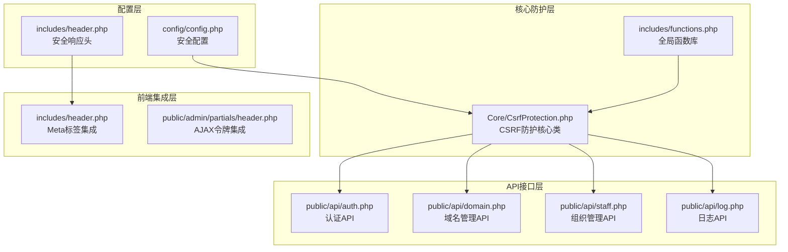
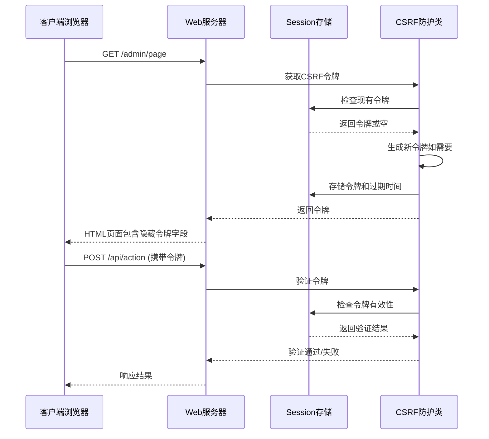
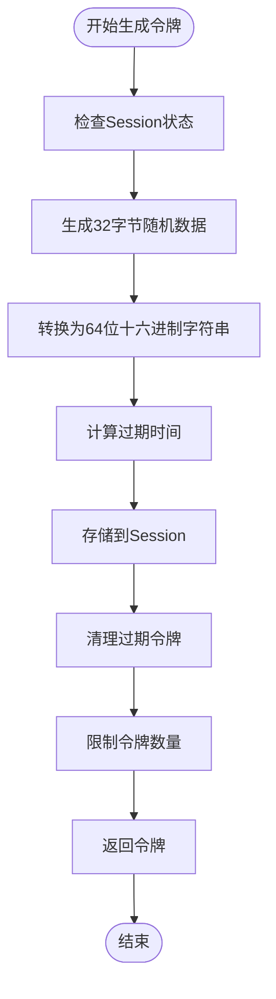
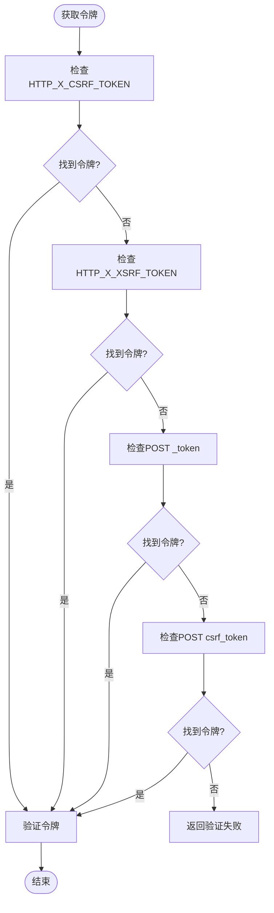
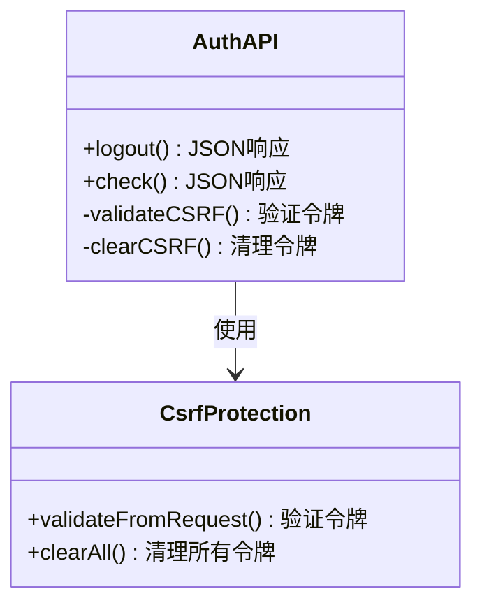
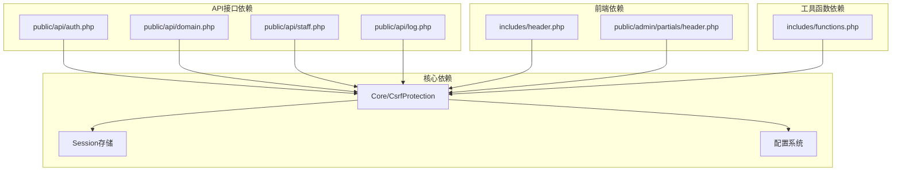

# CSRF防护机制

<cite>
**本文档引用的文件**
- [CsrfProtection.php](file://core/CsrfProtection.php)
- [functions.php](file://includes/functions.php)
- [config.php](file://config/config.php)
- [auth.php](file://public/api/auth.php)
- [domain.php](file://public/api/domain.php)
- [staff.php](file://public/api/staff.php)
- [log.php](file://public/api/log.php)
- [header.php](file://includes/header.php)
- [header.php](file://public/admin/partials/header.php)
</cite>

## 目录
1. [简介](#简介)
2. [项目结构](#项目结构)
3. [核心组件](#核心组件)
4. [架构概览](#架构概览)
5. [详细组件分析](#详细组件分析)
6. [依赖关系分析](#依赖关系分析)
7. [性能考虑](#性能考虑)
8. [故障排除指南](#故障排除指南)
9. [结论](#结论)
10. [附录](#附录)

## 简介

CSRF（跨站请求伪造）是一种常见的Web安全漏洞，攻击者通过诱使已登录的用户在不知情的情况下执行恶意操作。本系统采用多层次的CSRF防护策略，结合基于Session的令牌机制、安全的Cookie配置、以及完善的前端集成方案，为管理后台提供全面的CSRF防护。

## 项目结构

系统采用模块化的架构设计，CSRF防护机制主要分布在以下几个关键位置：

**图表来源**
- [CsrfProtection.php:1-298](file://core/CsrfProtection.php#L1-L298)
- [config.php:86-105](file://config/config.php#L86-L105)

**章节来源**
- [CsrfProtection.php:1-298](file://core/CsrfProtection.php#L1-L298)
- [config.php:15-152](file://config/config.php#L15-L152)

## 核心组件

### CSRF防护核心类

系统的核心CSRF防护机制由`Core\CsrfProtection`类提供，该类实现了完整的令牌生成、验证、存储和管理功能。

#### 核心特性

1. **多令牌支持**：支持同时维护多个有效令牌，提高并发安全性
2. **时间安全验证**：使用`hash_equals()`防止时序攻击
3. **自动清理机制**：定期清理过期令牌，限制令牌数量
4. **灵活的令牌来源**：支持多种令牌传递方式

**章节来源**
- [CsrfProtection.php:17-298](file://core/CsrfProtection.php#L17-L298)

## 架构概览

系统采用"令牌驱动+多层验证"的综合防护架构：

**图表来源**
- [CsrfProtection.php:40-123](file://core/CsrfProtection.php#L40-L123)
- [auth.php:54-83](file://public/api/auth.php#L54-L83)

## 详细组件分析

### 令牌生成与存储机制

#### 令牌生成算法

系统使用加密安全的随机数生成器生成CSRF令牌：

**图表来源**
- [CsrfProtection.php:40-66](file://core/CsrfProtection.php#L40-L66)
- [CsrfProtection.php:251-277](file://core/CsrfProtection.php#L251-L277)

#### 令牌存储策略

令牌采用多层存储机制：

1. **单令牌兼容**：`csrf_token`和`csrf_token_expires`
2. **多令牌支持**：`csrf_tokens`数组，最多保留5个
3. **自动清理**：过期令牌自动移除

**章节来源**
- [CsrfProtection.php:19-295](file://core/CsrfProtection.php#L19-L295)

### 令牌验证机制

#### 多源令牌获取

系统支持从多个位置获取CSRF令牌：

**图表来源**
- [CsrfProtection.php:144-161](file://core/CsrfProtection.php#L144-L161)

#### 时间安全验证

使用`hash_equals()`函数防止时序攻击：

**章节来源**
- [CsrfProtection.php:78-123](file://core/CsrfProtection.php#L78-L123)

### 前端集成方案

#### 表单令牌注入

系统提供多种前端集成方式：

1. **隐藏字段注入**：`csrfField()`生成隐藏的`_token`字段
2. **Meta标签集成**：`metaTag()`在页面头部注入CSRF令牌
3. **AJAX令牌头**：`ajaxHeader()`提供JavaScript/AJAX使用的令牌头

**章节来源**
- [CsrfProtection.php:204-233](file://core/CsrfProtection.php#L204-L233)
- [functions.php:174-177](file://includes/functions.php#L174-L177)

### API接口防护

#### 认证API中的CSRF防护

认证API对所有状态变更操作实施严格的CSRF验证：

**图表来源**
- [auth.php:49-83](file://public/api/auth.php#L49-L83)
- [auth.php:63-64](file://public/api/auth.php#L63-L64)

**章节来源**
- [auth.php:49-83](file://public/api/auth.php#L49-L83)

#### 域名管理API的CSRF防护

域名管理API对所有危险操作实施CSRF验证：

**章节来源**
- [domain.php:131-134](file://public/api/domain.php#L131-L134)
- [domain.php:238-241](file://public/api/domain.php#L238-L241)
- [domain.php:377-380](file://public/api/domain.php#L377-L380)
- [domain.php:424-427](file://public/api/domain.php#L424-L427)

### 配置与部署

#### 安全配置

系统在配置文件中提供了全面的安全设置：

**章节来源**
- [config.php:86-105](file://config/config.php#L86-L105)

#### Cookie安全属性

系统采用严格的Cookie安全配置：

**章节来源**
- [config.php:72-80](file://config/config.php#L72-L80)
- [CsrfProtection.php:286-296](file://core/CsrfProtection.php#L286-L296)

## 依赖关系分析

### 组件耦合关系

**图表来源**
- [functions.php:146-177](file://includes/functions.php#L146-L177)
- [auth.php:54-57](file://public/api/auth.php#L54-L57)

### 外部依赖

系统对外部依赖较少，主要依赖PHP标准库和Composer包管理器：

**章节来源**
- [functions.php:17-21](file://includes/functions.php#L17-L21)

## 性能考虑

### 令牌管理性能

1. **内存优化**：令牌存储在Session中，避免数据库查询
2. **批量清理**：定期清理过期令牌，防止内存泄漏
3. **数量限制**：最多保留5个有效令牌，平衡安全性和性能

### 验证性能

1. **快速验证**：令牌验证仅涉及Session查找和时间比较
2. **零拷贝比较**：使用`hash_equals()`进行安全比较
3. **缓存友好**：令牌存储在内存中，访问速度快

## 故障排除指南

### 常见问题及解决方案

#### 令牌验证失败

**症状**：API请求返回403错误，提示CSRF验证失败

**可能原因**：
1. 令牌过期（默认1小时）
2. 令牌被消费（状态变更操作后自动清除）
3. 令牌来源不正确

**解决方案**：
1. 刷新页面获取新令牌
2. 检查令牌传递方式
3. 确认请求方法正确

#### 会话问题

**症状**：登录后仍提示未登录或会话过期

**可能原因**：
1. Cookie配置问题
2. HTTPS配置不当
3. 会话存储问题

**解决方案**：
1. 检查`config/config.php`中的会话配置
2. 确认HTTPS证书配置
3. 验证Session存储权限

#### 前端集成问题

**症状**：AJAX请求失败，提示令牌无效

**可能原因**：
1. Meta标签未正确注入
2. JavaScript未正确读取令牌
3. 令牌头未正确设置

**解决方案**：
1. 检查页面头部是否包含`<meta name="csrf-token">`
2. 验证JavaScript代码中的令牌读取逻辑
3. 确认AJAX请求头设置正确

**章节来源**
- [CsrfProtection.php:144-161](file://core/CsrfProtection.php#L144-L161)
- [config.php:72-80](file://config/config.php#L72-L80)

## 结论

本系统的CSRF防护机制采用了多层次、全方位的防护策略：

1. **技术层面**：基于Session的加密安全令牌生成和验证
2. **架构层面**：多源令牌获取和自动清理机制
3. **部署层面**：严格的Cookie安全配置和响应头设置
4. **集成层面**：完善的前端集成方案和API防护

通过这些措施，系统能够有效防范CSRF攻击，保护管理后台的安全性。建议在生产环境中配合其他安全措施使用，如内容安全策略（CSP）、输入验证等，以构建更全面的安全防护体系。

## 附录

### 配置参考

#### CSRF相关配置

| 配置项 | 默认值 | 说明 |
|--------|--------|------|
| csrf_enabled | true | 是否启用CSRF防护 |
| csrf_token_expire | 3600 | 令牌过期时间（秒） |
| csrf_token_name | _token | 令牌字段名称 |

#### 安全响应头配置

| 响应头 | 值 | 作用 |
|--------|-----|------|
| Content-Security-Policy | default-src 'self'... | 防止XSS攻击 |
| X-Content-Type-Options | nosniff | 防止MIME类型嗅探 |
| X-Frame-Options | DENY | 防止点击劫持 |
| Referrer-Policy | strict-origin-when-cross-origin | 控制Referer信息泄露 |

### 最佳实践

1. **令牌管理**：定期清理过期令牌，限制令牌数量
2. **请求验证**：对所有状态变更操作实施CSRF验证
3. **前端集成**：确保所有表单和AJAX请求都包含CSRF令牌
4. **安全配置**：正确配置Cookie安全属性和响应头
5. **监控审计**：记录CSRF验证失败事件，及时发现攻击尝试