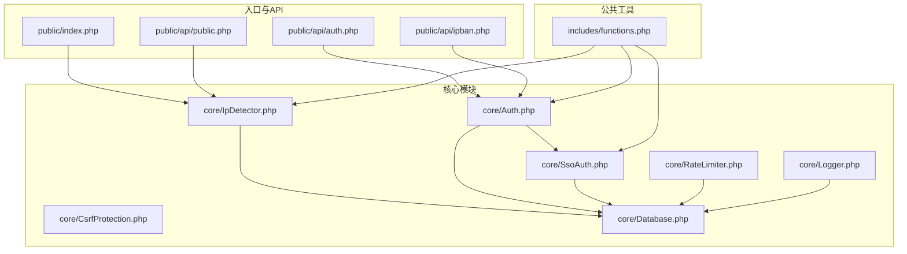
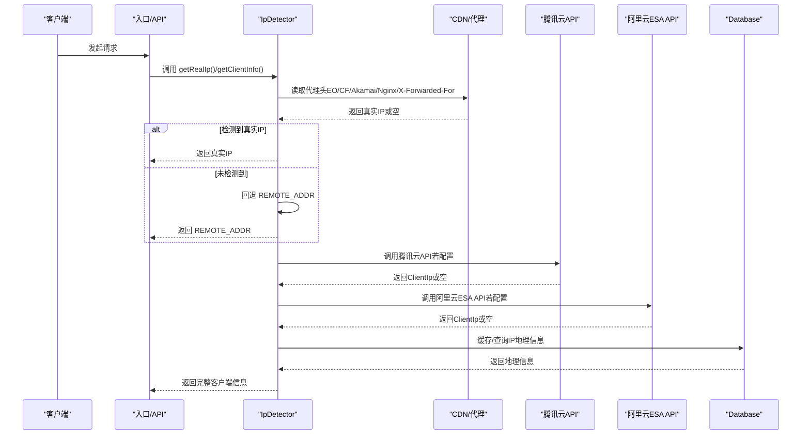
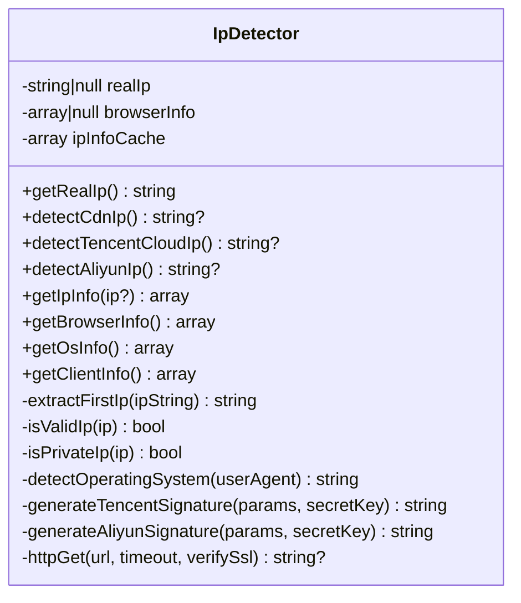
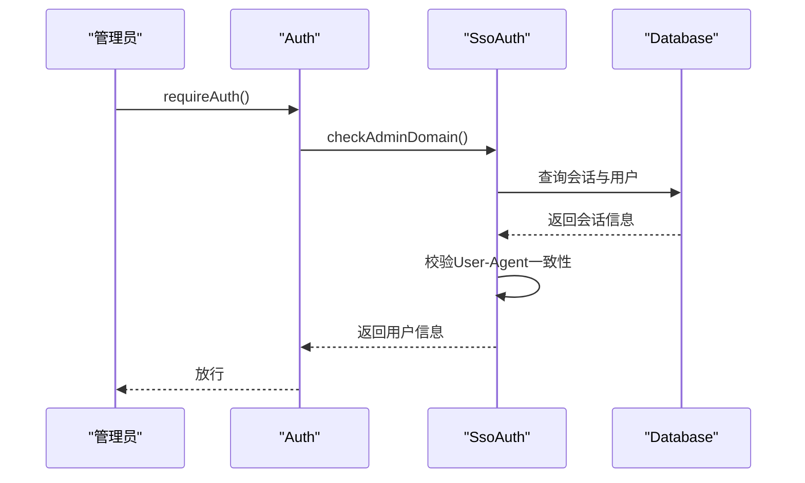
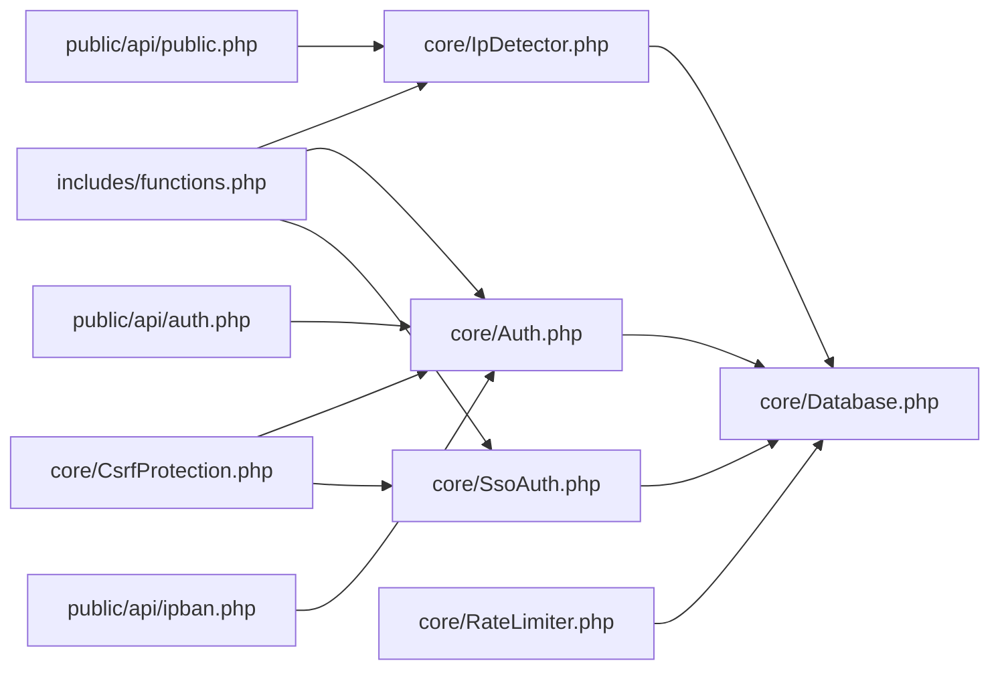

# IP检测系统

<cite>
**本文引用的文件**
- [IpDetector.php](file://core/IpDetector.php)
- [config.php](file://config/config.php)
- [functions.php](file://includes/functions.php)
- [auth.php](file://public/api/auth.php)
- [Auth.php](file://core/Auth.php)
- [SsoAuth.php](file://core/SsoAuth.php)
- [RateLimiter.php](file://core/RateLimiter.php)
- [CsrfProtection.php](file://core/CsrfProtection.php)
- [Database.php](file://core/Database.php)
- [public.php](file://public/api/public.php)
- [ipban.php](file://public/api/ipban.php)
- [index.php](file://public/index.php)
- [Logger.php](file://core/Logger.php)
</cite>

## 目录
1. [简介](#简介)
2. [项目结构](#项目结构)
3. [核心组件](#核心组件)
4. [架构总览](#架构总览)
5. [详细组件分析](#详细组件分析)
6. [依赖关系分析](#依赖关系分析)
7. [性能考量](#性能考量)
8. [故障排除指南](#故障排除指南)
9. [结论](#结论)
10. [附录](#附录)

## 简介
本文件面向“IP检测系统”的技术文档，聚焦于真实IP识别的核心算法与多层检测策略，涵盖CDN代理头检测、腾讯云与阿里云API回源检测、IP有效性验证、内网IP过滤、私有网络检测等安全防护；同时介绍IP地理信息查询、浏览器与操作系统识别、DNS Rebinding攻击防护、SSRF漏洞防范、HTTPS加密通信等安全机制，并提供配置选项、错误处理策略与性能优化建议。

## 项目结构
系统采用分层架构，核心IP检测能力集中在核心模块，配合认证、限流、CSRF防护与数据库访问层，形成完整的安全与功能闭环。

图表来源
- [index.php:1-45](file://public/index.php#L1-L45)
- [public.php:1-46](file://public/api/public.php#L1-L46)
- [auth.php:1-126](file://public/api/auth.php#L1-L126)
- [ipban.php:1-49](file://public/api/ipban.php#L1-L49)
- [IpDetector.php:1-651](file://core/IpDetector.php#L1-L651)
- [Auth.php:1-272](file://core/Auth.php#L1-L272)
- [SsoAuth.php:1-505](file://core/SsoAuth.php#L1-L505)
- [RateLimiter.php:1-309](file://core/RateLimiter.php#L1-L309)
- [CsrfProtection.php:1-298](file://core/CsrfProtection.php#L1-L298)
- [Database.php:1-400](file://core/Database.php#L1-L400)
- [functions.php:1-800](file://includes/functions.php#L1-L800)
- [Logger.php:72-100](file://core/Logger.php#L72-L100)

章节来源
- [index.php:1-45](file://public/index.php#L1-L45)
- [IpDetector.php:1-651](file://core/IpDetector.php#L1-L651)
- [functions.php:1-800](file://includes/functions.php#L1-L800)

## 核心组件
- 真实IP检测器：多层CDN代理头检测、腾讯云/阿里云API回源检测、IP有效性与私有网络校验、缓存与HTTP请求安全封装。
- 客户端信息聚合：统一获取IP、IP地理信息、浏览器与操作系统信息。
- 安全防护：CSRF令牌、速率限制、SSO认证、域名白名单、HTTPS加密、DNS Rebinding防护。
- 数据访问：数据库连接、参数绑定、SQL注入防护、事务与调试日志。

章节来源
- [IpDetector.php:13-448](file://core/IpDetector.php#L13-L448)
- [Auth.php:11-272](file://core/Auth.php#L11-L272)
- [SsoAuth.php:10-505](file://core/SsoAuth.php#L10-L505)
- [RateLimiter.php:25-309](file://core/RateLimiter.php#L25-L309)
- [CsrfProtection.php:17-298](file://core/CsrfProtection.php#L17-L298)
- [Database.php:13-400](file://core/Database.php#L13-L400)

## 架构总览
系统通过入口文件与API路由触发，核心IP检测器负责真实IP识别与客户端信息聚合，结合认证与限流模块保障访问安全，数据库层提供持久化能力。

图表来源
- [IpDetector.php:31-47](file://core/IpDetector.php#L31-L47)
- [IpDetector.php:62-121](file://core/IpDetector.php#L62-L121)
- [IpDetector.php:131-167](file://core/IpDetector.php#L131-L167)
- [IpDetector.php:177-215](file://core/IpDetector.php#L177-L215)
- [IpDetector.php:226-316](file://core/IpDetector.php#L226-L316)
- [Database.php:14-46](file://core/Database.php#L14-L46)

## 详细组件分析

### 真实IP检测器（IpDetector）
- 多层CDN代理头检测：优先级依次为EO-Connecting-IP、CF-Connecting-IP、True-Client-IP、X-TencentCDN-Real-IP、X-Tencent-Real-IP、X-Real-IP、X-Forwarded-For，直接信任并取首个有效IP。
- 回源检测：腾讯云与阿里云API回源检测，需在配置中启用并提供密钥，失败静默处理。
- IP有效性与私有网络检测：使用标准过滤器验证IP合法性，拒绝私有/保留网段。
- IP地理信息：通过HTTPS查询第三方API，支持APCu/文件缓存，1小时有效期；内网IP直接返回默认值。
- 浏览器与操作系统识别：解析User-Agent，提取浏览器名称/版本/引擎、平台、移动端/爬虫标记、操作系统版本与架构。
- HTTP请求安全：cURL替代file_get_contents，CURLOPT_RESOLVE绑定解析IP，防止DNS Rebinding；仅允许HTTP/HTTPS协议，验证目标主机解析IP均为公网；强制SSL证书验证。
- 客户端信息聚合：一次性返回IP、IP地理信息、浏览器、操作系统、Referer、请求URI、方法、UA、Accept-Language等。

图表来源
- [IpDetector.php:13-651](file://core/IpDetector.php#L13-L651)

章节来源
- [IpDetector.php:31-47](file://core/IpDetector.php#L31-L47)
- [IpDetector.php:62-121](file://core/IpDetector.php#L62-L121)
- [IpDetector.php:131-167](file://core/IpDetector.php#L131-L167)
- [IpDetector.php:177-215](file://core/IpDetector.php#L177-L215)
- [IpDetector.php:226-316](file://core/IpDetector.php#L226-L316)
- [IpDetector.php:325-448](file://core/IpDetector.php#L325-L448)
- [IpDetector.php:458-488](file://core/IpDetector.php#L458-L488)
- [IpDetector.php:496-525](file://core/IpDetector.php#L496-L525)
- [IpDetector.php:534-564](file://core/IpDetector.php#L534-L564)
- [IpDetector.php:577-649](file://core/IpDetector.php#L577-L649)

### 支持的CDN头部识别机制
- EO-Connecting-IP（腾讯云Edge ONE）
- CF-Connecting-IP（Cloudflare）
- True-Client-IP（Akamai/Cloudflare Enterprise）
- X-TencentCDN-Real-IP / X-Tencent-Real-IP（腾讯云）
- X-Real-IP（Nginx代理）
- X-Forwarded-For（通用代理）

章节来源
- [IpDetector.php:52-121](file://core/IpDetector.php#L52-L121)
- [functions.php:419-440](file://includes/functions.php#L419-L440)

### IP地址有效性验证与内网/私有网络检测
- 有效性：使用标准过滤器验证IP格式。
- 私有/保留网段：拒绝私网与保留地址，防止内网IP被误判为真实来源。
- SSRF防护：HTTP请求前解析目标域名，验证解析IP均为公网，拒绝内网IP；仅允许HTTP/HTTPS协议。

章节来源
- [IpDetector.php:470-488](file://core/IpDetector.php#L470-L488)
- [IpDetector.php:577-649](file://core/IpDetector.php#L577-L649)

### IP地理信息查询与缓存
- 查询接口：通过HTTPS访问第三方API，字段包含国家、省/州、城市、ISP、经纬度、时区、AS号等。
- 缓存策略：APCu优先，文件缓存降级；同一IP查询结果缓存1小时。
- 内网保护：对内网IP直接返回默认值，避免SSRF风险。

章节来源
- [IpDetector.php:226-316](file://core/IpDetector.php#L226-L316)

### 浏览器与操作系统识别
- 浏览器识别：基于User-Agent关键字匹配，提取名称、版本、引擎；移动端/爬虫标记。
- 操作系统识别：匹配Windows/macOS/Linux/iOS/Android等常见系统及版本、架构（x86/x86_64/ARM/ARM64）。

章节来源
- [IpDetector.php:325-426](file://core/IpDetector.php#L325-L426)

### DNS Rebinding攻击防护与HTTPS加密通信
- DNS Rebinding防护：解析目标域名后，通过CURLOPT_RESOLVE绑定解析到的IP，确保请求阶段IP不变，防止TOCTOU攻击。
- HTTPS加密：查询第三方IP API使用HTTPS，强制SSL证书验证；数据库连接支持TLS加密与证书校验。

章节来源
- [IpDetector.php:567-649](file://core/IpDetector.php#L567-L649)
- [Database.php:93-102](file://core/Database.php#L93-L102)

### 管理员认证与域名白名单
- SSO集成：支持Logto SDK，自动创建/同步管理员用户，本地会话持久化，User-Agent一致性校验。
- 域名白名单：后台访问域名白名单检查，拒绝未授权域名访问；前端页面不受白名单限制。
- CSRF防护：基于Session的令牌生成与验证，支持多令牌、过期清理、AJAX头传递。
- 速率限制：基于数据库的滑动窗口/固定窗口限流，支持清理过期记录。

图表来源
- [Auth.php:79-94](file://core/Auth.php#L79-L94)
- [SsoAuth.php:462-473](file://core/SsoAuth.php#L462-L473)
- [SsoAuth.php:355-396](file://core/SsoAuth.php#L355-L396)

章节来源
- [Auth.php:96-131](file://core/Auth.php#L96-L131)
- [SsoAuth.php:480-503](file://core/SsoAuth.php#L480-L503)
- [CsrfProtection.php:144-161](file://core/CsrfProtection.php#L144-L161)
- [RateLimiter.php:76-89](file://core/RateLimiter.php#L76-L89)

### API与入口中的IP检测使用
- 入口分发：根据域名查询数据库，判断域名类型并分发到对应页面，同时检测访问者IP是否被封禁。
- 公共API：统计接口可结合速率限制与缓存策略。
- 认证API：退出登录与状态检查，结合CSRF与会话安全。

章节来源
- [index.php:40-45](file://public/index.php#L40-L45)
- [public.php:25-29](file://public/api/public.php#L25-L29)
- [auth.php:46-120](file://public/api/auth.php#L46-L120)

## 依赖关系分析

图表来源
- [functions.php:27-41](file://includes/functions.php#L27-L41)
- [IpDetector.php:1-651](file://core/IpDetector.php#L1-L651)
- [Auth.php:1-272](file://core/Auth.php#L1-L272)
- [SsoAuth.php:1-505](file://core/SsoAuth.php#L1-L505)
- [RateLimiter.php:1-309](file://core/RateLimiter.php#L1-L309)
- [CsrfProtection.php:1-298](file://core/CsrfProtection.php#L1-L298)
- [Database.php:1-400](file://core/Database.php#L1-L400)
- [public.php:1-46](file://public/api/public.php#L1-L46)
- [auth.php:1-126](file://public/api/auth.php#L1-L126)
- [ipban.php:1-49](file://public/api/ipban.php#L1-L49)

章节来源
- [functions.php:27-41](file://includes/functions.php#L27-L41)
- [Database.php:13-46](file://core/Database.php#L13-L46)

## 性能考量
- 缓存策略：IP地理信息APCu优先、文件降级，1小时有效期，减少重复查询。
- HTTP请求优化：cURL直连，CURLOPT_RESOLVE绑定解析IP，避免DNS解析往返与重试开销。
- 数据库连接：PDO单例，参数绑定自动类型推断，SQL注入防护与调试日志。
- 速率限制：数据库限流器，支持清理过期记录，避免Session绕过。
- 建议：对高频查询接口（如check/stats）结合浏览器缓存与服务端限流；对IP查询接口可考虑本地GeoIP库替代第三方API以降低延迟。

## 故障排除指南
- IP检测失败：确认CDN代理头是否透传，检查代理链路；若启用API回源，确认密钥配置与网络可达性。
- 内网IP被拒：内网IP将被判定为私有网络，直接返回默认地理信息；如需查询内网IP，需调整策略或使用专用API。
- SSRF/Rebinding问题：检查HTTP请求逻辑，确保仅允许HTTP/HTTPS协议，目标主机解析IP为公网；确认CURLOPT_RESOLVE绑定正确。
- CSRF/会话异常：核对令牌生成与验证流程，确保AJAX请求携带正确的X-CSRF-Token头；检查会话Cookie配置与User-Agent一致性。
- 速率限制触发：检查限流器配置与计数窗口，必要时清理过期记录；对公共接口适当放宽阈值。

章节来源
- [IpDetector.php:265-276](file://core/IpDetector.php#L265-L276)
- [IpDetector.php:577-649](file://core/IpDetector.php#L577-L649)
- [CsrfProtection.php:144-161](file://core/CsrfProtection.php#L144-L161)
- [RateLimiter.php:294-307](file://core/RateLimiter.php#L294-L307)

## 结论
本IP检测系统通过多层CDN代理头检测与API回源检测相结合，辅以内网/私有网络过滤、HTTPS加密与DNS Rebinding防护，实现了高可靠的真实IP识别；同时提供浏览器与操作系统识别、IP地理信息查询与缓存、CSRF与速率限制等安全与性能优化措施，满足生产环境的安全与稳定性需求。

## 附录

### 配置选项清单
- 数据库配置：主机、端口、库名、用户、密码、字符集、连接选项、SSL配置。
- 站点配置：名称、描述、Logo路径、联系邮箱、后台URL、时区、CDN本地化开关、后台域名白名单。
- 会话配置：生命周期、Cookie名称、路径、域名、Secure/HttpOnly/SameSite。
- 安全响应头：CSP、X-Content-Type-Options、X-Frame-Options、X-XSS-Protection、Referrer-Policy、Permissions-Policy。
- 日志配置：启用、日志目录、日志级别、保留天数。
- 调试模式：启用、允许IP白名单、日志目录、SQL/认证/API/错误记录、单文件大小与文件数量。
- Logto SSO：启用、端点、应用ID/密钥、回调/登出URI、作用域、自动创建用户、默认角色。

章节来源
- [config.php:15-151](file://config/config.php#L15-L151)

### API与安全要点
- 认证API：退出登录与状态检查，CSRF验证，会话清理。
- 公共API：统计接口，建议速率限制与缓存。
- IP封禁API：管理员操作，需登录认证。

章节来源
- [auth.php:46-120](file://public/api/auth.php#L46-L120)
- [public.php:25-29](file://public/api/public.php#L25-L29)
- [ipban.php:47-49](file://public/api/ipban.php#L47-L49)