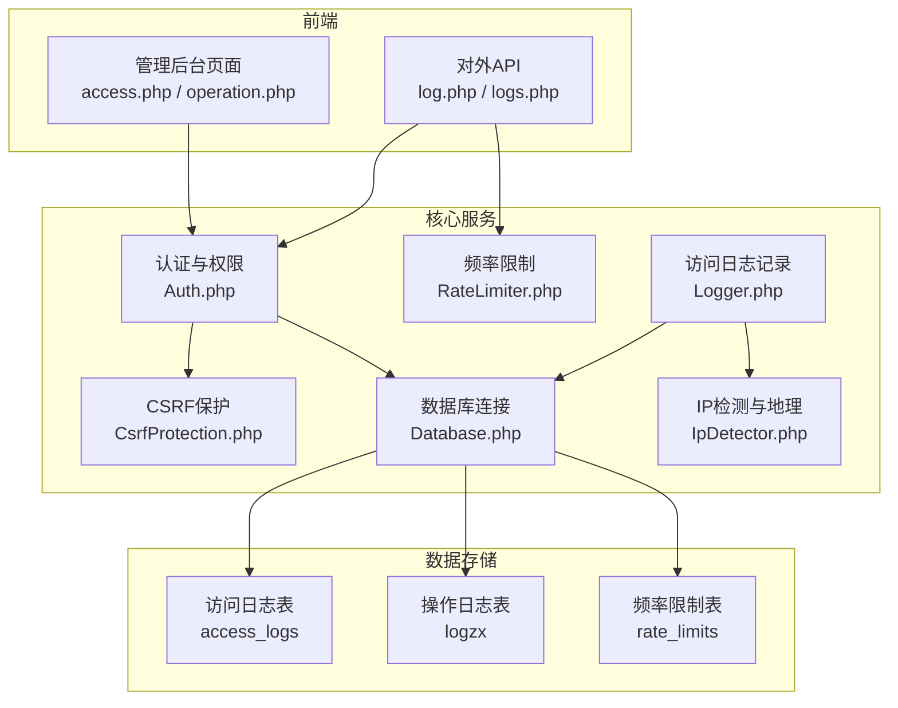
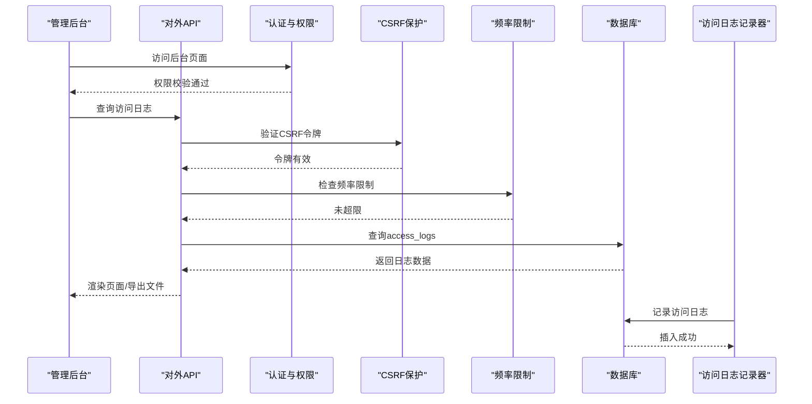
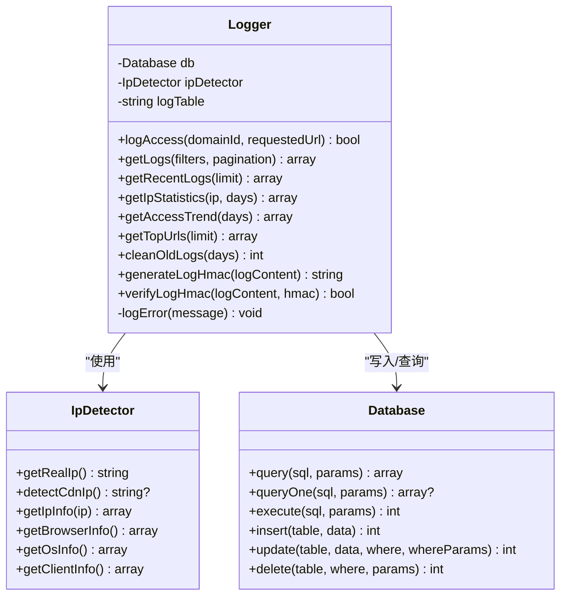
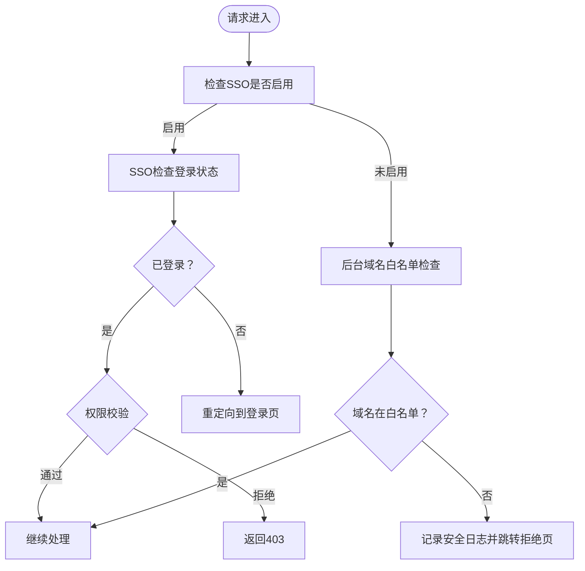
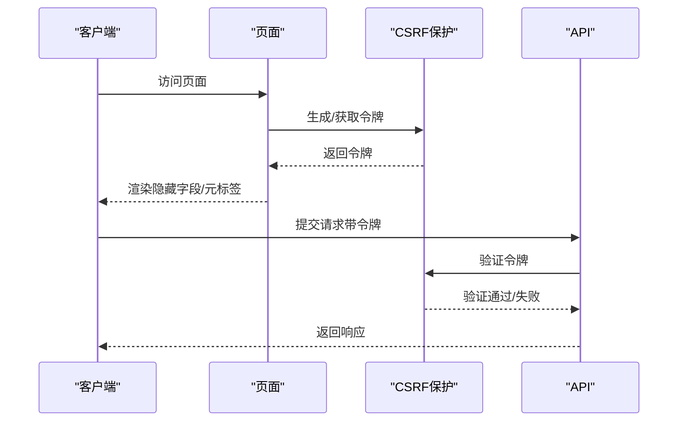
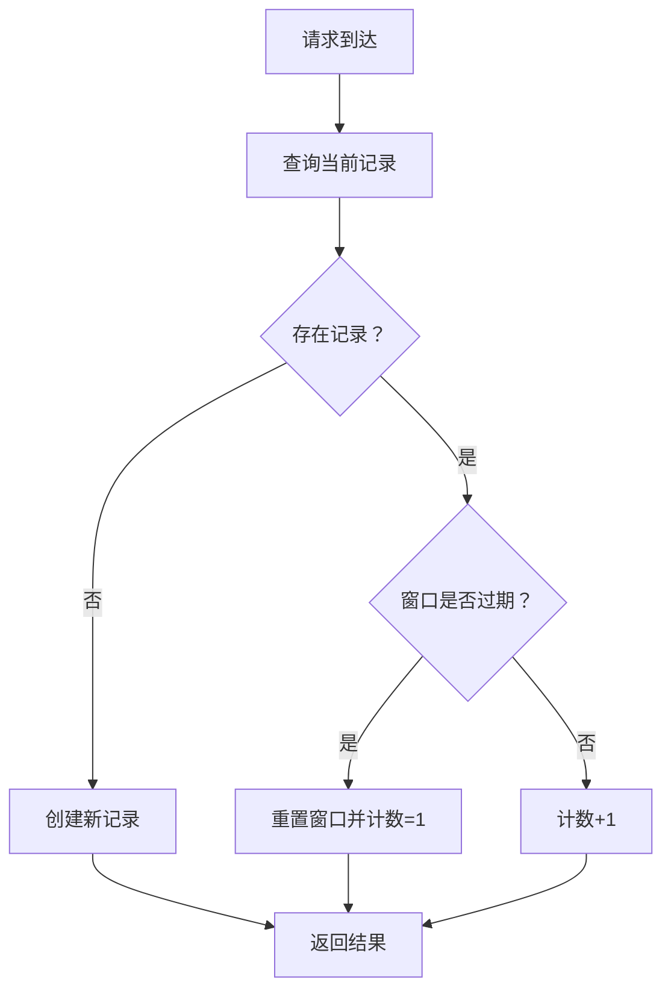
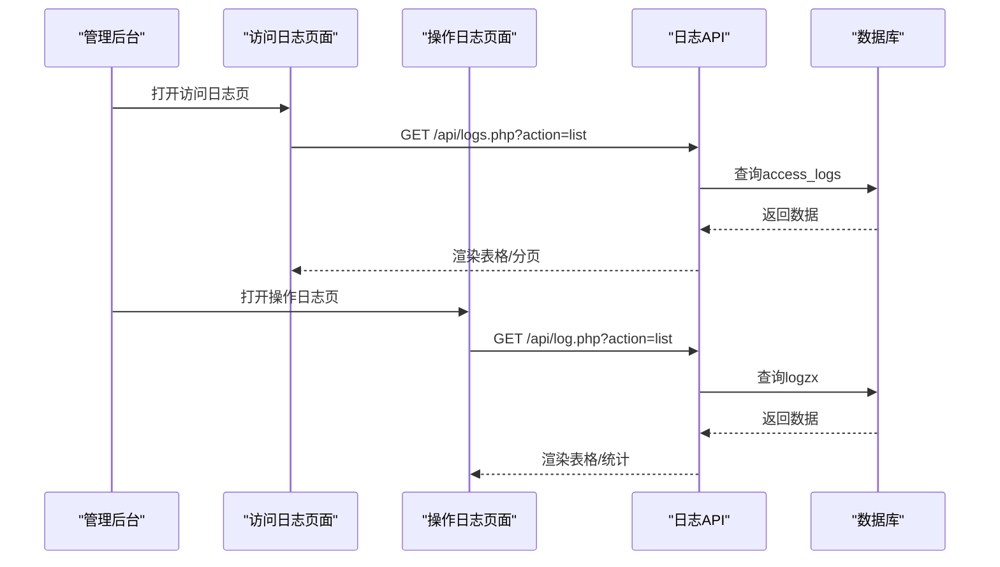
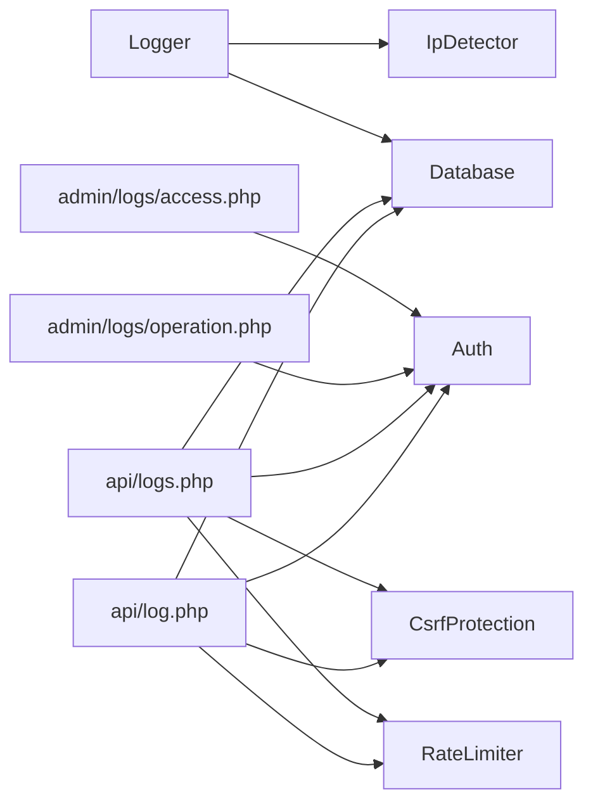

# 安全审计日志

<cite>
**本文档引用的文件**
- [Logger.php](file://core/Logger.php)
- [access.php](file://public/admin/logs/access.php)
- [operation.php](file://public/admin/logs/operation.php)
- [log.php](file://public/api/log.php)
- [logs.php](file://public/api/logs.php)
- [Database.php](file://core/Database.php)
- [Auth.php](file://core/Auth.php)
- [IpDetector.php](file://core/IpDetector.php)
- [config.php](file://config/config.php)
- [init.sql](file://sql/init.sql)
- [functions.php](file://includes/functions.php)
- [CsrfProtection.php](file://core/CsrfProtection.php)
- [RateLimiter.php](file://core/RateLimiter.php)
</cite>

## 目录
1. [简介](#简介)
2. [项目结构](#项目结构)
3. [核心组件](#核心组件)
4. [架构总览](#架构总览)
5. [详细组件分析](#详细组件分析)
6. [依赖关系分析](#依赖关系分析)
7. [性能考虑](#性能考虑)
8. [故障排查指南](#故障排查指南)
9. [结论](#结论)

## 简介
本项目是一个基于 PHP 的安全审计日志系统，提供访问日志、操作日志两大类审计能力，配套完善的查询、统计、导出、清理等功能，并内置 CSRF 保护、频率限制、IP 检测、日志完整性校验等安全机制。系统采用数据库存储，支持 Web 管理界面与 API 接口双入口，满足日常运维与自动化集成需求。

## 项目结构
系统采用典型的三层架构：
- 核心层（Core）：数据库连接、认证、CSRF、频率限制、IP 检测、日志记录等基础能力
- 接口层（Public API/Admin）：Web 管理后台与对外 API，负责权限校验、参数处理、视图渲染
- 配置层（Config）：数据库、安全、调试、日志等配置项

**图表来源**
- [access.php:1-356](file://public/admin/logs/access.php#L1-L356)
- [operation.php:1-510](file://public/admin/logs/operation.php#L1-L510)
- [log.php:1-454](file://public/api/log.php#L1-L454)
- [logs.php:1-595](file://public/api/logs.php#L1-L595)
- [Logger.php:1-472](file://core/Logger.php#L1-L472)
- [Database.php:1-400](file://core/Database.php#L1-L400)
- [Auth.php:1-272](file://core/Auth.php#L1-L272)
- [IpDetector.php:1-651](file://core/IpDetector.php#L1-L651)
- [CsrfProtection.php:1-298](file://core/CsrfProtection.php#L1-L298)
- [RateLimiter.php:1-309](file://core/RateLimiter.php#L1-L309)

**章节来源**
- [access.php:1-356](file://public/admin/logs/access.php#L1-L356)
- [operation.php:1-510](file://public/admin/logs/operation.php#L1-L510)
- [log.php:1-454](file://public/api/log.php#L1-L454)
- [logs.php:1-595](file://public/api/logs.php#L1-L595)
- [Logger.php:1-472](file://core/Logger.php#L1-L472)
- [Database.php:1-400](file://core/Database.php#L1-L400)
- [Auth.php:1-272](file://core/Auth.php#L1-L272)
- [IpDetector.php:1-651](file://core/IpDetector.php#L1-L651)
- [config.php:1-152](file://config/config.php#L1-L152)
- [init.sql:1-275](file://sql/init.sql#L1-L275)

## 核心组件
- 访问日志记录器（Logger）：负责采集客户端信息、记录访问日志、提供查询统计、清理过期日志与完整性校验
- 数据库连接（Database）：统一的 PDO 连接封装，提供查询、插入、更新、删除与事务支持
- 认证与权限（Auth）：基于 SSO 的后台认证、角色权限模型与白名单域名控制
- CSRF 保护（CsrfProtection）：基于 Session 的多令牌 CSRF 令牌生成与验证
- 频率限制（RateLimiter）：基于数据库的跨会话频率限制，防刷与资源耗尽攻击
- IP 检测（IpDetector）：多 CDN/代理场景下的真实 IP 检测与地理信息查询

**章节来源**
- [Logger.php:1-472](file://core/Logger.php#L1-L472)
- [Database.php:1-400](file://core/Database.php#L1-L400)
- [Auth.php:1-272](file://core/Auth.php#L1-L272)
- [CsrfProtection.php:1-298](file://core/CsrfProtection.php#L1-L298)
- [RateLimiter.php:1-309](file://core/RateLimiter.php#L1-L309)
- [IpDetector.php:1-651](file://core/IpDetector.php#L1-L651)

## 架构总览
系统通过 Web 管理后台与对外 API 两条路径产生与消费日志：
- 管理后台：访问日志列表页与操作日志中心，支持筛选、分页、导出、清空等
- 对外 API：提供访问日志查询、统计、导出、清理；操作日志记录、查询、统计、清空

**图表来源**
- [access.php:1-356](file://public/admin/logs/access.php#L1-L356)
- [operation.php:1-510](file://public/admin/logs/operation.php#L1-L510)
- [log.php:1-454](file://public/api/log.php#L1-L454)
- [logs.php:1-595](file://public/api/logs.php#L1-L595)
- [Logger.php:1-472](file://core/Logger.php#L1-L472)
- [Auth.php:1-272](file://core/Auth.php#L1-L272)
- [CsrfProtection.php:1-298](file://core/CsrfProtection.php#L1-L298)
- [RateLimiter.php:1-309](file://core/RateLimiter.php#L1-L309)
- [Database.php:1-400](file://core/Database.php#L1-L400)

## 详细组件分析

### 访问日志记录器（Logger）
- 职责：采集客户端信息（真实 IP、浏览器、操作系统、UA、Referer、请求 URL）、写入数据库、提供查询、统计、导出、清理、完整性校验
- 关键能力：
  - 客户端信息采集：通过 IpDetector 获取真实 IP、浏览器、OS、地理信息
  - 日志记录：自动拼装字段并插入 access_logs 表
  - 查询与筛选：支持 IP、域名、浏览器、OS、日期范围、关键词等多维筛选
  - 统计分析：提供访问趋势、热门 URL、IP 统计等
  - 清理策略：按天数清理过期日志
  - 完整性保护：基于 HMAC-SHA256 的日志签名，密钥存储于临时目录

**图表来源**
- [Logger.php:1-472](file://core/Logger.php#L1-L472)
- [IpDetector.php:1-651](file://core/IpDetector.php#L1-L651)
- [Database.php:1-400](file://core/Database.php#L1-L400)

**章节来源**
- [Logger.php:1-472](file://core/Logger.php#L1-L472)
- [IpDetector.php:1-651](file://core/IpDetector.php#L1-L651)

### 认证与权限（Auth）
- 职责：后台 SSO 认证、角色权限模型、域名白名单控制
- 关键能力：
  - SSO 登录检查与登出
  - 角色模板与自定义权限
  - 后台域名白名单拒绝访问并记录安全日志

**图表来源**
- [Auth.php:1-272](file://core/Auth.php#L1-L272)

**章节来源**
- [Auth.php:1-272](file://core/Auth.php#L1-L272)

### CSRF 保护（CsrfProtection）
- 职责：生成与验证 CSRF 令牌，支持多令牌与过期控制，AJAX 头部传递
- 关键能力：
  - 令牌生成与存储（Session）
  - 从请求头/POST 参数获取并验证
  - 状态变更操作强制消耗令牌，防止重放

**图表来源**
- [CsrfProtection.php:1-298](file://core/CsrfProtection.php#L1-L298)

**章节来源**
- [CsrfProtection.php:1-298](file://core/CsrfProtection.php#L1-L298)

### 频率限制（RateLimiter）
- 职责：基于数据库的跨会话频率限制，防刷与资源耗尽
- 关键能力：
  - 记录计数与窗口起始时间
  - 查询剩余次数、重置时间
  - 定时清理过期记录

**图表来源**
- [RateLimiter.php:1-309](file://core/RateLimiter.php#L1-L309)

**章节来源**
- [RateLimiter.php:1-309](file://core/RateLimiter.php#L1-L309)

### 数据库连接（Database）
- 职责：PDO 连接封装、SQL 防注入、参数绑定、调试日志
- 关键能力：
  - DSN 构建与 SSL/TLS 连接
  - 参数绑定自动识别整数/布尔/null
  - 标识符白名单校验防止注入
  - 调试日志记录 SQL、时间、影响行数

**章节来源**
- [Database.php:1-400](file://core/Database.php#L1-L400)

### Web 管理后台与 API
- 访问日志管理后台（access.php）：支持日期范围、IP/域名/浏览器筛选、分页、CSV/JSON 导出、封禁 IP
- 操作日志管理中心（operation.php）：支持用户类型、操作类型、模块、结果、关键词等筛选，统计卡片，清空日志
- 对外 API：
  - 访问日志：查询、统计、导出、清理、封禁 IP
  - 操作日志：记录、查询、统计、清空

**图表来源**
- [access.php:1-356](file://public/admin/logs/access.php#L1-L356)
- [operation.php:1-510](file://public/admin/logs/operation.php#L1-L510)
- [logs.php:1-595](file://public/api/logs.php#L1-L595)
- [log.php:1-454](file://public/api/log.php#L1-L454)

**章节来源**
- [access.php:1-356](file://public/admin/logs/access.php#L1-L356)
- [operation.php:1-510](file://public/admin/logs/operation.php#L1-L510)
- [logs.php:1-595](file://public/api/logs.php#L1-L595)
- [log.php:1-454](file://public/api/log.php#L1-L454)

## 依赖关系分析
- Logger 依赖 IpDetector 与 Database
- Web 页面与 API 依赖 Auth、CsrfProtection、RateLimiter、Database
- 数据库层提供统一的查询/插入/更新/删除能力，并支持调试日志

**图表来源**
- [Logger.php:1-472](file://core/Logger.php#L1-L472)
- [access.php:1-356](file://public/admin/logs/access.php#L1-L356)
- [operation.php:1-510](file://public/admin/logs/operation.php#L1-L510)
- [logs.php:1-595](file://public/api/logs.php#L1-L595)
- [log.php:1-454](file://public/api/log.php#L1-L454)
- [Auth.php:1-272](file://core/Auth.php#L1-L272)
- [CsrfProtection.php:1-298](file://core/CsrfProtection.php#L1-L298)
- [RateLimiter.php:1-309](file://core/RateLimiter.php#L1-L309)
- [Database.php:1-400](file://core/Database.php#L1-L400)

**章节来源**
- [Logger.php:1-472](file://core/Logger.php#L1-L472)
- [Auth.php:1-272](file://core/Auth.php#L1-L272)
- [CsrfProtection.php:1-298](file://core/CsrfProtection.php#L1-L298)
- [RateLimiter.php:1-309](file://core/RateLimiter.php#L1-L309)
- [Database.php:1-400](file://core/Database.php#L1-L400)

## 性能考虑
- 查询性能
  - access_logs 与 logzx 表均建立必要索引（IP、时间、模块、目标等），建议结合实际查询模式增加复合索引
  - 分页参数限制（最大每页条数），避免超大结果集
- 写入性能
  - 访问日志写入为高频操作，建议：
    - 使用批量写入（API 支持批量）
    - 合理设置数据库连接池与缓冲区
    - 对热点字段（如 created_at）建立索引
- 缓存策略
  - IP 地理信息缓存（APCu/文件），降低外部查询压力
- 清理策略
  - 定期清理过期日志，建议在低峰期执行 OPTIMIZE TABLE（注释中提示锁表风险）

**章节来源**
- [Logger.php:395-413](file://core/Logger.php#L395-L413)
- [logs.php:528-589](file://public/api/logs.php#L528-L589)
- [IpDetector.php:234-316](file://core/IpDetector.php#L234-L316)

## 故障排查指南
- 认证与权限问题
  - 检查后台域名白名单配置与当前访问域名是否匹配
  - 确认 SSO 配置与回调地址
- CSRF 验证失败
  - 确认页面是否正确渲染隐藏令牌字段或 meta 标签
  - AJAX 请求是否携带 X-CSRF-Token 头
- 频率限制触发
  - 检查 rate_limits 表记录与窗口重置时间
  - 调整限制阈值或时间窗口
- 数据库连接失败
  - 检查数据库配置、凭据与网络连通性
  - 确认 SSL/TLS 配置（如启用）
- 日志查询异常
  - 检查 SQL 注入防护（标识符白名单）与参数绑定
  - 查看调试日志定位具体 SQL 与参数

**章节来源**
- [Auth.php:96-131](file://core/Auth.php#L96-L131)
- [CsrfProtection.php:125-161](file://core/CsrfProtection.php#L125-L161)
- [RateLimiter.php:254-285](file://core/RateLimiter.php#L254-L285)
- [Database.php:53-122](file://core/Database.php#L53-L122)
- [functions.php:45-70](file://includes/functions.php#L45-L70)

## 结论
本安全审计日志系统通过完善的组件设计与安全机制，实现了访问日志与操作日志的全生命周期管理。系统具备良好的扩展性与运维友好性，建议在生产环境中：
- 启用 HTTPS 与安全响应头
- 配置合理的日志保留周期与清理策略
- 结合监控告警与集中化日志管理
- 定期评估与优化查询索引与数据库性能