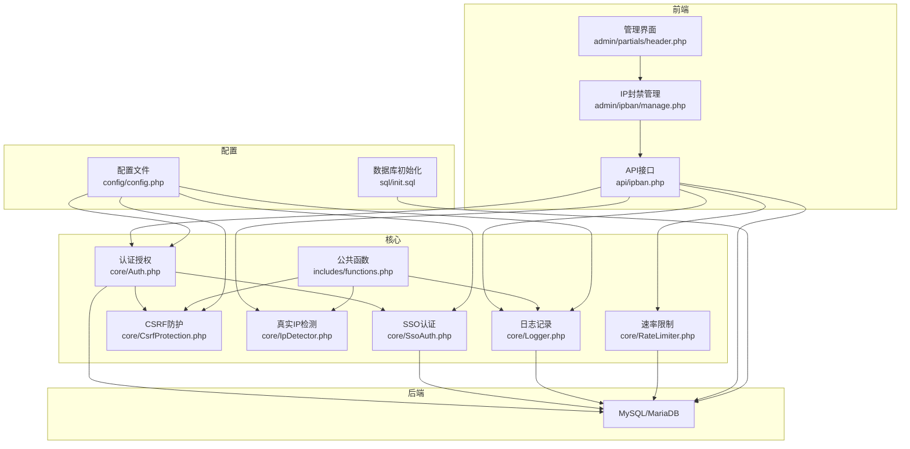
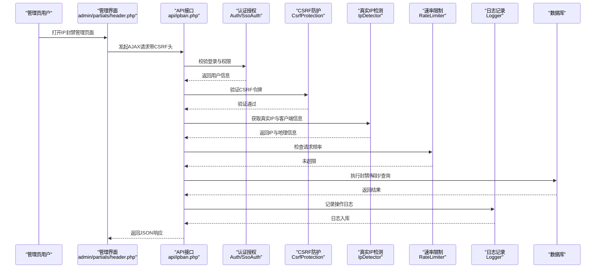
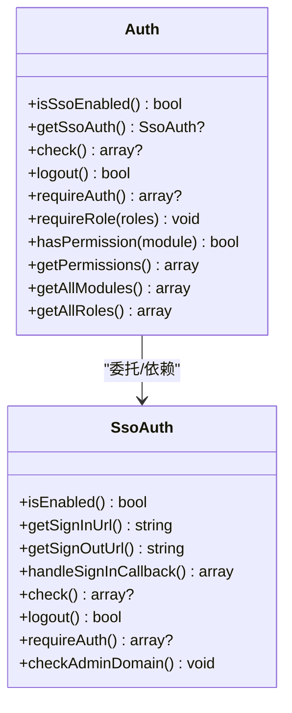
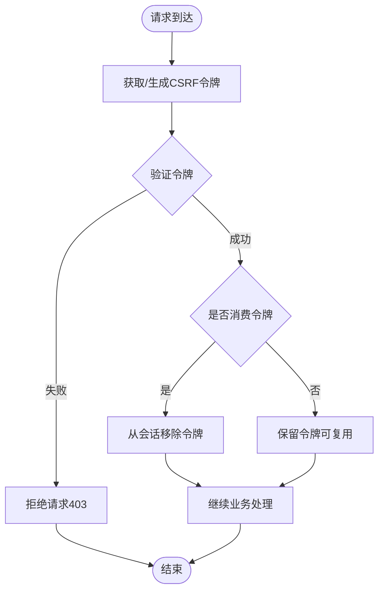
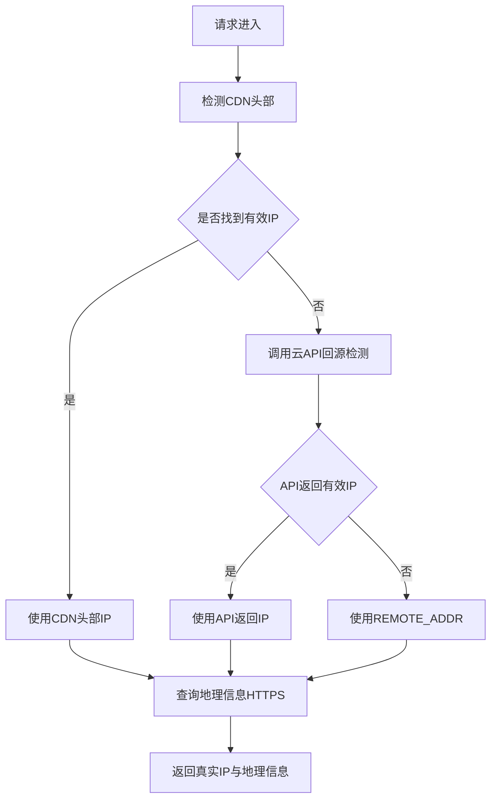
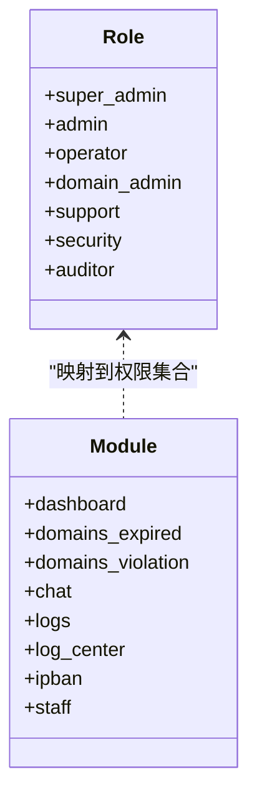
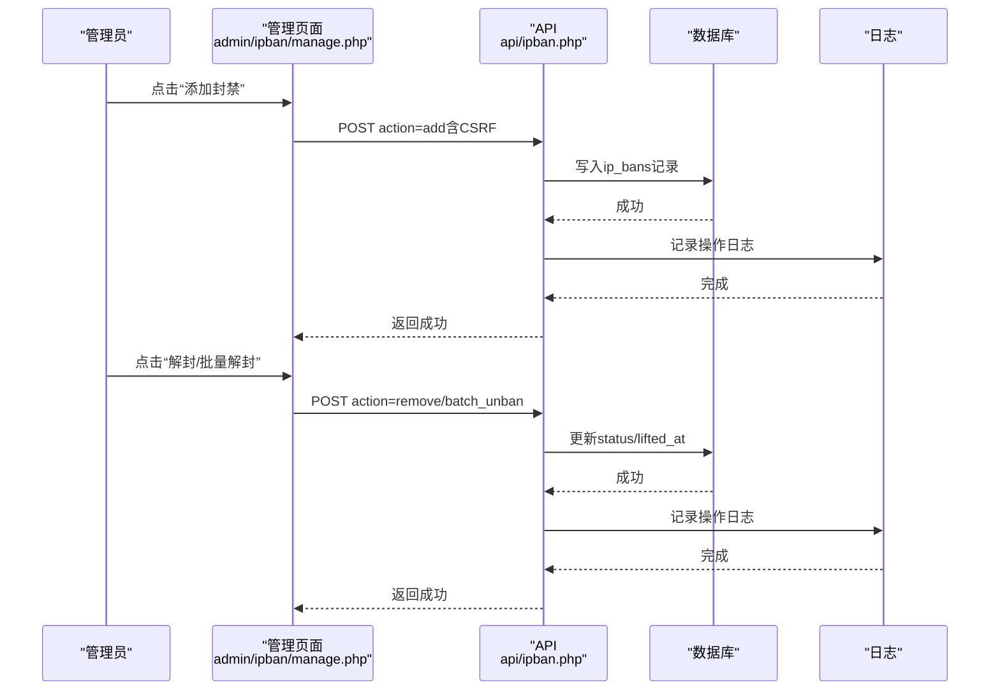
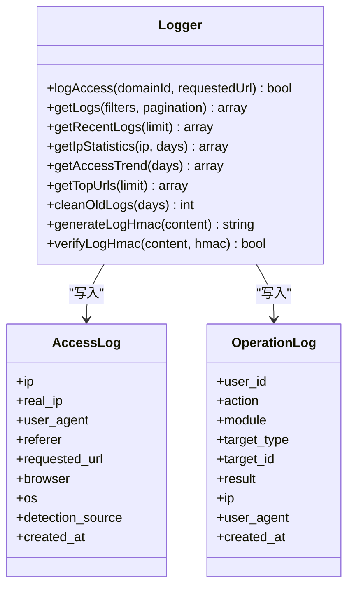
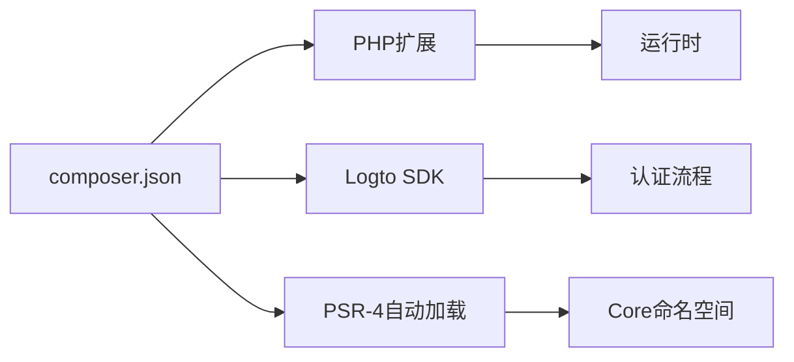

# 安全系统

<cite>
**本文引用的文件**
- [config.php](file://config/config.php)
- [Auth.php](file://core/Auth.php)
- [SsoAuth.php](file://core/SsoAuth.php)
- [CsrfProtection.php](file://core/CsrfProtection.php)
- [IpDetector.php](file://core/IpDetector.php)
- [RateLimiter.php](file://core/RateLimiter.php)
- [Logger.php](file://core/Logger.php)
- [functions.php](file://includes/functions.php)
- [header.php](file://public/admin/partials/header.php)
- [manage.php](file://public/admin/ipban/manage.php)
- [ipban.php](file://public/api/ipban.php)
- [init.sql](file://sql/init.sql)
- [composer.json](file://composer.json)
- [DEPLOY.md](file://DEPLOY.md)
</cite>

## 目录
1. [简介](#简介)
2. [项目结构](#项目结构)
3. [核心组件](#核心组件)
4. [架构总览](#架构总览)
5. [详细组件分析](#详细组件分析)
6. [依赖关系分析](#依赖关系分析)
7. [性能考虑](#性能考虑)
8. [故障排除指南](#故障排除指南)
9. [结论](#结论)
10. [附录](#附录)

## 简介
本文件面向“DNS拦截响应平台”的安全系统，围绕等保2.0三级标准，系统性梳理平台在认证授权、访问控制、CSRF/XSS防护、真实IP识别、IP封禁、日志审计与监控等方面的设计与实现要点，并提供部署与配置建议。文档同时给出关键流程的时序图与类图，帮助读者快速把握系统架构与安全机制。

## 项目结构
项目采用“核心模块 + 前端管理 + API接口 + 数据库初始化”的分层组织方式：
- 核心模块（core）：认证授权、CSRF防护、真实IP检测、速率限制、日志记录等
- 前端管理（public/admin）：后台界面、IP封禁管理、日志查看等
- API接口（public/api）：对外提供的REST风格接口，如IP封禁管理
- 配置（config）：站点、数据库、会话、安全响应头、日志、调试、SSO等配置
- 数据库初始化（sql/init.sql）：管理员、域名、IP封禁、访问日志、操作日志、会话等表结构
- 通用函数（includes/functions.php）：自动加载、输入清理、CSRF兼容、工具函数等
- 依赖与部署（composer.json、DEPLOY.md）：PHP扩展、SSO SDK、伪静态、目录权限等

图表来源
- [header.php:1-81](file://public/admin/partials/header.php#L1-L81)
- [manage.php:1-780](file://public/admin/ipban/manage.php#L1-L780)
- [ipban.php:1-404](file://public/api/ipban.php#L1-L404)
- [Auth.php:1-272](file://core/Auth.php#L1-L272)
- [SsoAuth.php:1-505](file://core/SsoAuth.php#L1-L505)
- [CsrfProtection.php:1-298](file://core/CsrfProtection.php#L1-L298)
- [IpDetector.php:1-651](file://core/IpDetector.php#L1-L651)
- [RateLimiter.php:1-309](file://core/RateLimiter.php#L1-L309)
- [Logger.php:1-472](file://core/Logger.php#L1-L472)
- [functions.php:1-998](file://includes/functions.php#L1-L998)
- [config.php:1-152](file://config/config.php#L1-L152)
- [init.sql:1-275](file://sql/init.sql#L1-L275)

章节来源
- [DEPLOY.md:1-198](file://DEPLOY.md#L1-L198)
- [composer.json:1-37](file://composer.json#L1-L37)

## 核心组件
- 认证与授权（Auth/SsoAuth）：支持SSO登录、后台域名白名单、角色权限模型、细粒度模块权限
- CSRF防护（CsrfProtection）：基于Session的令牌生成与验证，支持多令牌、消费后作废、AJAX头传递
- 真实IP识别（IpDetector）：多层CDN头部检测、腾讯云/阿里云API回源检测、地理信息查询、SSRF防护
- 速率限制（RateLimiter）：基于数据库的跨会话频率限制，满足等保2.0三级要求
- 日志记录（Logger）：访问日志、操作日志、日志清理、日志完整性保护（HMAC）
- 公共函数（functions.php）：自动加载、输入清理、CSRF兼容、URL/Host/文件上传等工具

章节来源
- [Auth.php:1-272](file://core/Auth.php#L1-L272)
- [SsoAuth.php:1-505](file://core/SsoAuth.php#L1-L505)
- [CsrfProtection.php:1-298](file://core/CsrfProtection.php#L1-L298)
- [IpDetector.php:1-651](file://core/IpDetector.php#L1-L651)
- [RateLimiter.php:1-309](file://core/RateLimiter.php#L1-L309)
- [Logger.php:1-472](file://core/Logger.php#L1-L472)
- [functions.php:1-998](file://includes/functions.php#L1-L998)

## 架构总览
系统遵循“前端界面 + 后端API + 核心安全模块 + 数据库”的分层设计。前端通过CSRF meta标签与AJAX头传递令牌；API层统一进行认证、权限、CSRF、速率限制与日志记录；核心模块负责真实IP识别、速率限制与日志完整性保护；数据库承载用户、会话、封禁、日志等数据。

图表来源
- [header.php:74-80](file://public/admin/partials/header.php#L74-L80)
- [ipban.php:1-404](file://public/api/ipban.php#L1-L404)
- [Auth.php:1-272](file://core/Auth.php#L1-L272)
- [SsoAuth.php:1-505](file://core/SsoAuth.php#L1-L505)
- [CsrfProtection.php:1-298](file://core/CsrfProtection.php#L1-L298)
- [IpDetector.php:1-651](file://core/IpDetector.php#L1-L651)
- [RateLimiter.php:1-309](file://core/RateLimiter.php#L1-L309)
- [Logger.php:1-472](file://core/Logger.php#L1-L472)

## 详细组件分析

### 认证与授权（Auth/SsoAuth）
- SSO集成：通过Logto SDK实现单点登录，支持回调处理、会话创建、会话校验与登出
- 后台域名白名单：基于HTTP_HOST严格校验域名格式，拒绝非白名单访问并记录安全日志
- 角色与权限：内置角色模板与模块权限映射，支持自定义权限JSON覆盖
- 会话安全：Cookie安全属性（Secure、HttpOnly、SameSite）、会话超时（等保2.0三级要求）

图表来源
- [Auth.php:1-272](file://core/Auth.php#L1-L272)
- [SsoAuth.php:1-505](file://core/SsoAuth.php#L1-L505)

章节来源
- [Auth.php:1-272](file://core/Auth.php#L1-L272)
- [SsoAuth.php:1-505](file://core/SsoAuth.php#L1-L505)
- [config.php:70-80](file://config/config.php#L70-L80)

### CSRF防护机制
- 令牌生成：基于random_bytes生成高熵令牌，支持多令牌并限制数量
- 验证策略：支持从多个位置获取令牌（HTTP头、POST、GET），消费后作废，防止重放
- AJAX集成：提供meta标签与AJAX头，前端统一携带令牌
- 安全细节：使用hash_equals防时序攻击、清理过期令牌、限制令牌数量

图表来源
- [CsrfProtection.php:1-298](file://core/CsrfProtection.php#L1-L298)
- [header.php:79-80](file://public/admin/partials/header.php#L79-L80)
- [manage.php:549-596](file://public/admin/ipban/manage.php#L549-L596)

章节来源
- [CsrfProtection.php:1-298](file://core/CsrfProtection.php#L1-L298)
- [header.php:79-80](file://public/admin/partials/header.php#L79-L80)
- [functions.php:146-177](file://includes/functions.php#L146-L177)

### 真实IP识别与CDN穿透
- 多层检测：优先检测CDN专用头部（如CF、Akamai、腾讯云、Nginx等），回退到REMOTE_ADDR
- API回源：支持腾讯云与阿里云ESA API回源检测真实IP
- SSRF防护：解析目标URL域名后验证解析IP均为公网，使用CURLOPT_RESOLVE绑定DNS解析结果，防止DNS Rebinding
- 地理信息：HTTPS查询ip-api.com，支持APCu/文件缓存，限制内网IP查询

图表来源
- [IpDetector.php:31-121](file://core/IpDetector.php#L31-L121)
- [IpDetector.php:131-215](file://core/IpDetector.php#L131-L215)
- [IpDetector.php:226-316](file://core/IpDetector.php#L226-L316)

章节来源
- [IpDetector.php:1-651](file://core/IpDetector.php#L1-L651)
- [functions.php:414-440](file://includes/functions.php#L414-L440)

### 访问控制与权限管理
- 角色体系：超级管理员、管理员、运维人员、域名管理员、客服专员、安全专员、审计员
- 模块权限：模块到角色的映射，支持通配符“*”与自定义权限JSON
- 后台白名单：严格校验HTTP_HOST，拒绝非白名单域名访问
- 细粒度授权：API与页面均进行hasPermission检查

图表来源
- [Auth.php:240-270](file://core/Auth.php#L240-L270)
- [Auth.php:179-195](file://core/Auth.php#L179-L195)

章节来源
- [Auth.php:1-272](file://core/Auth.php#L1-L272)
- [functions.php:356-379](file://includes/functions.php#L356-L379)

### IP封禁系统（自动/手动/策略）
- 管理界面：支持添加、编辑、解封、批量解封、导出，基于CSRF保护
- API接口：统一的REST接口，支持添加、移除、批量解封、列表查询、封禁检查
- 封禁策略：支持永久与临时封禁，临时封禁可设置时长，自动过期
- 日志审计：所有封禁操作均记录操作日志，便于追踪与审计

图表来源
- [manage.php:60-224](file://public/admin/ipban/manage.php#L60-L224)
- [ipban.php:47-308](file://public/api/ipban.php#L47-L308)
- [init.sql:68-89](file://sql/init.sql#L68-L89)

章节来源
- [manage.php:1-780](file://public/admin/ipban/manage.php#L1-L780)
- [ipban.php:1-404](file://public/api/ipban.php#L1-L404)
- [init.sql:68-89](file://sql/init.sql#L68-L89)

### 安全响应头与XSS防护
- 安全响应头：Content-Security-Policy、X-Content-Type-Options、X-Frame-Options、X-XSS-Protection、Referrer-Policy、Permissions-Policy
- 输出转义：输入清理在输入阶段进行，输出时使用模板转义（如使用e()函数），避免XSS
- Host头校验：严格验证HTTP_HOST格式，防止Host头注入

章节来源
- [config.php:86-105](file://config/config.php#L86-L105)
- [header.php:19-25](file://public/admin/partials/header.php#L19-L25)
- [functions.php:314-340](file://includes/functions.php#L314-L340)

### 日志审计与入侵检测
- 访问日志：记录IP、UA、Referer、请求URL、浏览器/系统、地理位置、检测来源等
- 操作日志：记录管理员操作、模块、目标、结果、IP、UA等
- 日志清理：按天数清理过期日志，释放空间
- 日志完整性：生成HMAC签名，防止篡改

图表来源
- [Logger.php:1-472](file://core/Logger.php#L1-L472)
- [init.sql:94-121](file://sql/init.sql#L94-L121)
- [init.sql:218-252](file://sql/init.sql#L218-L252)

章节来源
- [Logger.php:1-472](file://core/Logger.php#L1-L472)
- [init.sql:94-121](file://sql/init.sql#L94-L121)
- [init.sql:218-252](file://sql/init.sql#L218-L252)

### 速率限制（等保2.0三级要求）
- 基于数据库的跨会话频率限制，避免绕过
- 支持查询剩余次数、重置时间、清理过期记录
- 与CSRF结合，对状态变更操作强制消费令牌

章节来源
- [RateLimiter.php:1-309](file://core/RateLimiter.php#L1-L309)

## 依赖关系分析
- PHP扩展：PDO、PDO_MySQL、JSON、cURL、mbstring、OpenSSL、FileInfo、Session
- SSO SDK：Logto SDK（^0.3），用于SSO认证
- 自动加载：PSR-4命名空间Core映射到core目录
- 伪静态：Nginx/Apache分别提供rewrite规则，禁止访问敏感目录

图表来源
- [composer.json:1-37](file://composer.json#L1-L37)
- [DEPLOY.md:136-171](file://DEPLOY.md#L136-L171)

章节来源
- [composer.json:1-37](file://composer.json#L1-L37)
- [DEPLOY.md:1-198](file://DEPLOY.md#L1-L198)

## 性能考虑
- 真实IP检测：CDN头部优先，API回源降级，地理信息查询使用APCu/文件缓存，限制查询频率
- 日志写入：数据库写入失败不影响主流程，错误记录到文件；支持日志清理
- 会话与Cookie：合理设置生命周期与安全属性，减少无效会话占用
- 速率限制：数据库表建立索引，定期清理过期记录，避免表膨胀

## 故障排除指南
- CSRF验证失败：检查页面是否正确输出<meta name="csrf-token">，AJAX请求是否携带X-CSRF-Token头
- SSO登录异常：确认Logto配置、SDK可用性、回调地址与端点正确
- 真实IP始终为REMOTE_ADDR：检查CDN回源配置与HTTP头是否正确透传
- 日志记录失败：检查storage/logs目录权限与磁盘空间
- 会话超时：确认config/session配置与浏览器Cookie设置

章节来源
- [config.php:70-105](file://config/config.php#L70-L105)
- [DEPLOY.md:174-194](file://DEPLOY.md#L174-L194)

## 结论
该系统在等保2.0三级要求下，构建了完善的认证授权、CSRF/XSS防护、真实IP识别、速率限制与日志审计体系。通过SSO集成、细粒度权限模型、多层CDN穿透检测与数据库级频率限制，有效提升了平台的安全性与可运维性。建议在生产环境中持续优化日志完整性、加强入侵检测与告警联动，并定期进行安全评估与渗透测试。

## 附录
- 部署要点：PHP扩展、伪静态、目录权限、SSO依赖安装
- 数据库初始化：管理员、域名、IP封禁、访问日志、操作日志、会话等表
- 配置参考：会话、安全响应头、日志、调试、SSO等

章节来源
- [DEPLOY.md:1-198](file://DEPLOY.md#L1-L198)
- [init.sql:1-275](file://sql/init.sql#L1-L275)
- [config.php:1-152](file://config/config.php#L1-L152)