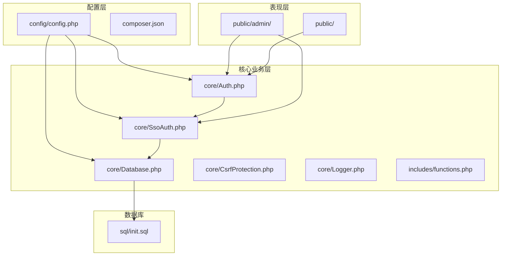
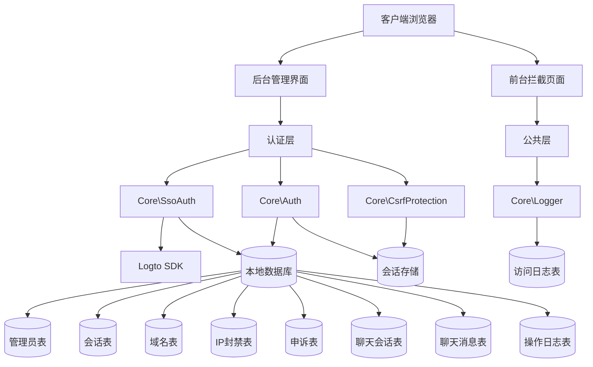
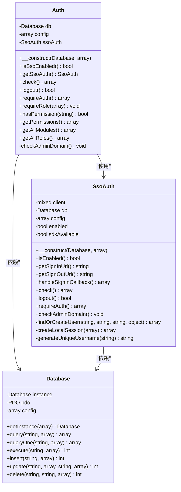
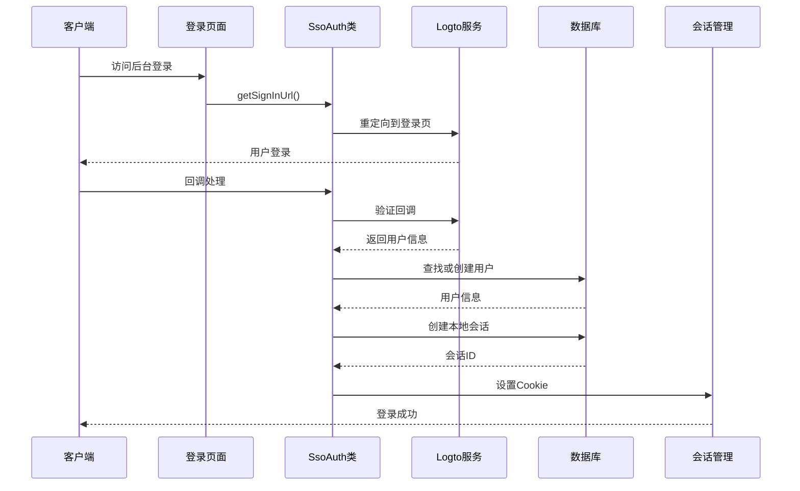
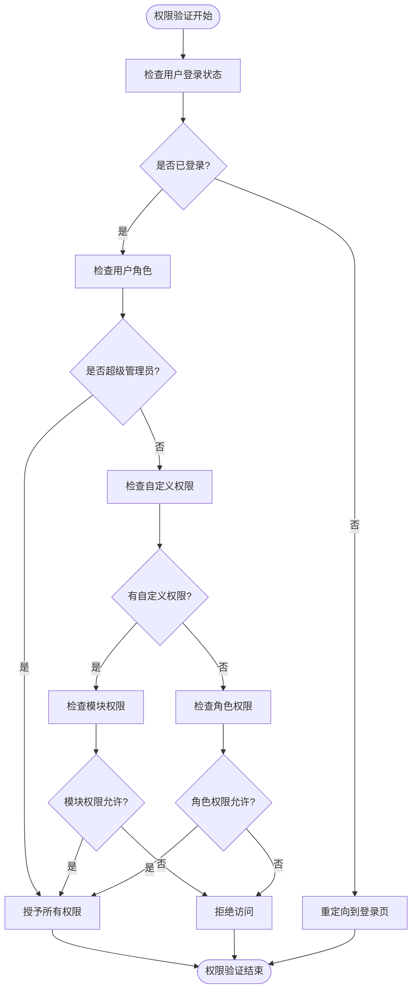
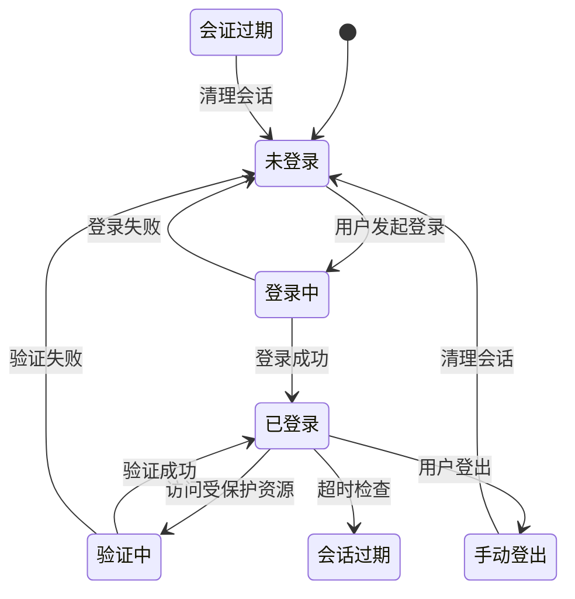
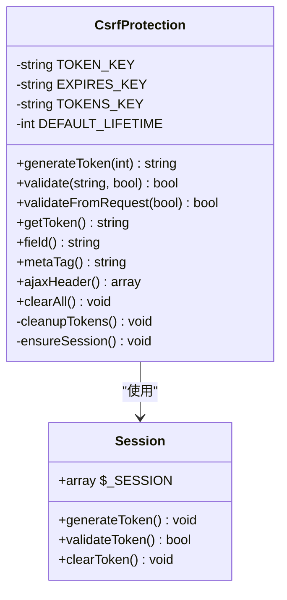
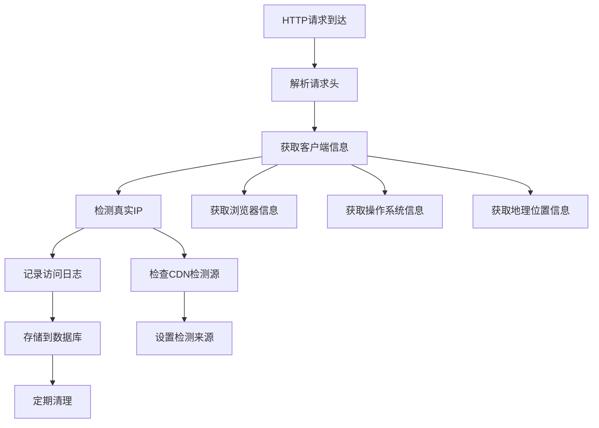
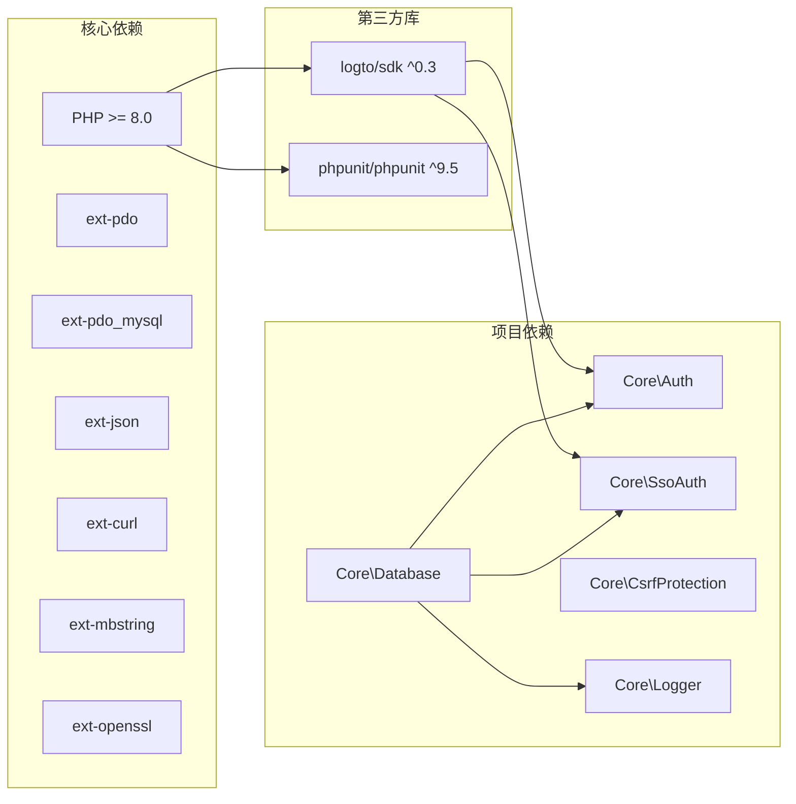
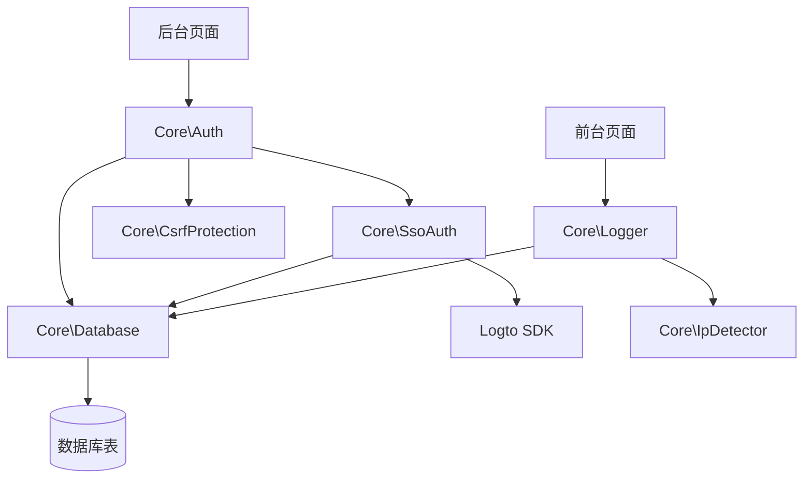

# 访问控制系统

<cite>
**本文档引用的文件**
- [config.php](file://config/config.php)
- [Auth.php](file://core/Auth.php)
- [SsoAuth.php](file://core/SsoAuth.php)
- [Database.php](file://core/Database.php)
- [functions.php](file://includes/functions.php)
- [callback.php](file://public/admin/callback.php)
- [login.php](file://public/admin/login.php)
- [logout.php](file://public/admin/logout.php)
- [index.php](file://public/admin/index.php)
- [init.sql](file://sql/init.sql)
- [composer.json](file://composer.json)
- [CsrfProtection.php](file://core/CsrfProtection.php)
- [Logger.php](file://core/Logger.php)
- [README.md](file://README.md)
- [DEPLOY.md](file://DEPLOY.md)
</cite>

## 目录
1. [简介](#简介)
2. [项目结构](#项目结构)
3. [核心组件](#核心组件)
4. [架构概览](#架构概览)
5. [详细组件分析](#详细组件分析)
6. [依赖关系分析](#依赖关系分析)
7. [性能考虑](#性能考虑)
8. [故障排除指南](#故障排除指南)
9. [结论](#结论)
10. [附录](#附录)

## 简介

灯塔DNS拦截响应平台是一个专业的域名过期与违规拦截服务系统，采用基于角色的访问控制（RBAC）模型实现。系统集成了Logto单点登录（SSO）认证，提供了完整的用户认证、权限验证、会话管理等核心功能。

该系统遵循等保2.0三级要求，实现了多层次的安全防护机制，包括CSRF防护、XSS防护、SQL注入防护、密码安全策略、会话超时配置等。系统支持细粒度的权限控制，包括管理员角色体系、权限继承机制、权限动态更新等功能。

## 项目结构

项目采用典型的三层架构设计，主要分为配置层、核心业务层和表现层：



**图表来源**
- [config.php:15-152](file://config/config.php#L15-L152)
- [Auth.php:11-272](file://core/Auth.php#L11-L272)
- [SsoAuth.php:10-505](file://core/SsoAuth.php#L10-L505)
- [Database.php:13-400](file://core/Database.php#L13-L400)

**章节来源**
- [README.md:25-68](file://README.md#L25-L68)
- [DEPLOY.md:18-26](file://DEPLOY.md#L18-L26)

## 核心组件

### 认证系统

系统采用双层认证架构，结合本地认证和SSO认证：

- **核心认证类**：`Core\Auth` - 提供统一的认证接口
- **SSO认证类**：`Core\SsoAuth` - 集成Logto SDK实现单点登录
- **数据库抽象层**：`Core\Database` - 提供安全的数据库操作

### 权限控制系统

系统实现了完整的RBAC模型：

- **角色定义**：super_admin、admin、operator、domain_admin、support、security、auditor
- **权限矩阵**：预定义的模块权限映射
- **自定义权限**：支持JSON格式的细粒度权限配置
- **权限继承**：基于角色的权限继承机制

### 会话管理系统

- **会话存储**：基于数据库的会话持久化
- **会话验证**：User-Agent校验、过期时间检查
- **会话清理**：自动过期清理机制

**章节来源**
- [Auth.php:11-272](file://core/Auth.php#L11-L272)
- [SsoAuth.php:10-505](file://core/SsoAuth.php#L10-L505)
- [Database.php:13-400](file://core/Database.php#L13-L400)

## 架构概览

系统采用模块化设计，各组件职责清晰：



**图表来源**
- [Auth.php:55-94](file://core/Auth.php#L55-L94)
- [SsoAuth.php:100-167](file://core/SsoAuth.php#L100-L167)
- [Logger.php:14-472](file://core/Logger.php#L14-L472)

## 详细组件分析

### 认证组件分析

#### 核心认证类（Core\Auth）



**图表来源**
- [Auth.php:11-272](file://core/Auth.php#L11-L272)
- [SsoAuth.php:10-505](file://core/SsoAuth.php#L10-L505)
- [Database.php:13-400](file://core/Database.php#L13-L400)

#### SSO登录流程



**图表来源**
- [login.php:45-58](file://public/admin/login.php#L45-L58)
- [callback.php:40-52](file://public/admin/callback.php#L40-L52)
- [SsoAuth.php:100-167](file://core/SsoAuth.php#L100-L167)

**章节来源**
- [Auth.php:55-94](file://core/Auth.php#L55-L94)
- [SsoAuth.php:74-95](file://core/SsoAuth.php#L74-L95)
- [login.php:45-58](file://public/admin/login.php#L45-L58)

### 权限控制组件分析

#### 权限验证流程



**图表来源**
- [Auth.php:138-195](file://core/Auth.php#L138-L195)
- [Auth.php:179-194](file://core/Auth.php#L179-L194)

#### 角色权限矩阵

系统预定义了完整的角色权限矩阵：

| 角色 | 权限模块 |
|------|----------|
| super_admin | 所有模块 |
| admin | 所有模块 |
| operator | 仪表盘、到期域名、违规域名、客服中心、访问记录、日志中心 |
| domain_admin | 仪表盘、到期域名、违规域名 |
| support | 仪表盘、客服中心 |
| security | 仪表盘、IP封禁、访问记录、日志中心 |
| auditor | 仪表盘、访问记录、日志中心 |

**章节来源**
- [Auth.php:179-233](file://core/Auth.php#L179-L233)
- [Auth.php:240-270](file://core/Auth.php#L240-L270)

### 会话管理组件分析

#### 会话生命周期管理



**图表来源**
- [SsoAuth.php:355-396](file://core/SsoAuth.php#L355-L396)
- [SsoAuth.php:401-423](file://core/SsoAuth.php#L401-L423)

#### 会话安全机制

系统实现了多重安全防护：

- **会话超时**：30分钟（等保2.0三级要求）
- **User-Agent校验**：防止会话劫持
- **Cookie安全属性**：HttpOnly、Secure、SameSite
- **会话清理**：过期自动清理

**章节来源**
- [config.php:72-80](file://config/config.php#L72-L80)
- [SsoAuth.php:380-385](file://core/SsoAuth.php#L380-L385)

### CSRF防护组件分析

#### CSRF令牌管理



**图表来源**
- [CsrfProtection.php:17-298](file://core/CsrfProtection.php#L17-L298)

#### CSRF防护机制

系统采用多层CSRF防护：

- **令牌生成**：基于随机数的加密安全令牌
- **令牌验证**：时间安全比较，防止时序攻击
- **多令牌支持**：支持同时存在多个有效令牌
- **令牌清理**：自动清理过期令牌，限制令牌数量

**章节来源**
- [CsrfProtection.php:40-66](file://core/CsrfProtection.php#L40-L66)
- [CsrfProtection.php:78-123](file://core/CsrfProtection.php#L78-L123)

### 日志审计组件分析

#### 访问日志记录



**图表来源**
- [Logger.php:48-120](file://core/Logger.php#L48-L120)
- [Logger.php:144-249](file://core/Logger.php#L144-L249)

#### 日志审计功能

系统提供完整的日志审计能力：

- **访问日志**：记录每次访问的详细信息
- **操作日志**：记录管理员的操作行为
- **日志查询**：支持多维度查询和筛选
- **日志清理**：自动清理过期日志，释放存储空间

**章节来源**
- [Logger.php:144-249](file://core/Logger.php#L144-L249)
- [Logger.php:402-413](file://core/Logger.php#L402-L413)

## 依赖关系分析

### 外部依赖

系统使用Composer管理依赖，主要依赖包括：



**图表来源**
- [composer.json:7-16](file://composer.json#L7-L16)
- [composer.json:20-24](file://composer.json#L20-L24)

### 内部组件依赖



**图表来源**
- [Auth.php:17-32](file://core/Auth.php#L17-L32)
- [SsoAuth.php:23-39](file://core/SsoAuth.php#L23-L39)
- [Logger.php:14-36](file://core/Logger.php#L14-L36)

**章节来源**
- [composer.json:1-37](file://composer.json#L1-37)
- [functions.php:27-41](file://includes/functions.php#L27-L41)

## 性能考虑

### 数据库优化

系统采用了多项数据库优化策略：

- **索引设计**：为常用查询字段建立索引
- **查询优化**：使用预处理语句防止SQL注入
- **连接池**：单例模式管理数据库连接
- **事务处理**：支持事务的原子性操作

### 缓存策略

虽然系统未实现专门的权限缓存机制，但可以通过以下方式优化：

- **会话缓存**：会话信息存储在数据库中，查询效率高
- **配置缓存**：配置信息在进程内缓存
- **日志缓存**：大量日志操作采用批量写入

### 安全性能平衡

系统在安全性和性能之间取得了良好平衡：

- **CSRF防护**：令牌验证开销极小
- **会话安全**：User-Agent校验增加少量CPU开销
- **日志记录**：异步日志记录不影响主业务流程

## 故障排除指南

### 常见问题诊断

#### SSO登录问题

**问题症状**：SSO登录失败，出现"SSO登录未启用"错误

**可能原因**：
1. Logto SDK未正确安装
2. 配置文件中SSO相关配置缺失
3. Logto应用配置错误

**解决步骤**：
1. 检查Logto SDK是否安装：`composer show logto/sdk`
2. 验证配置文件中的SSO配置项
3. 确认Logto应用的回调URL配置正确

#### 会话超时问题

**问题症状**：用户登录后很快被强制登出

**可能原因**：
1. 会话超时时间设置过短
2. User-Agent发生变化
3. 服务器时间不同步

**解决步骤**：
1. 检查配置文件中的会话超时设置
2. 确认User-Agent校验逻辑
3. 同步服务器时间

#### 权限访问问题

**问题症状**：用户无法访问某些功能模块

**可能原因**：
1. 用户角色配置错误
2. 自定义权限设置问题
3. 权限矩阵配置错误

**解决步骤**：
1. 检查用户角色设置
2. 验证自定义权限配置
3. 确认权限矩阵映射

### 调试模式使用

系统提供了完整的调试模式支持：

```php
// 在配置文件中启用调试模式
'debug' => [
    'enabled' => true,
    'log_queries' => true,
    'log_auth' => true,
    'log_api' => true,
],
```

调试日志存储在`storage/logs/debug/`目录中，包含：

- 数据库查询日志
- 认证操作日志  
- API调用日志
- 错误和异常日志

**章节来源**
- [config.php:123-133](file://config/config.php#L123-L133)
- [functions.php:50-70](file://includes/functions.php#L50-L70)

## 结论

灯塔DNS拦截响应平台的访问控制系统实现了企业级的安全标准，具有以下特点：

### 安全优势

- **多层防护**：CSRF、XSS、SQL注入等多重安全防护
- **等保合规**：完全符合等保2.0三级要求
- **会话安全**：HttpOnly、Secure、SameSite等安全Cookie属性
- **审计完整**：完整的操作日志和访问日志记录

### 功能特色

- **RBAC模型**：灵活的角色权限管理体系
- **SSO集成**：无缝集成Logto单点登录
- **细粒度控制**：支持模块级别的权限控制
- **实时监控**：完善的日志审计和监控功能

### 技术亮点

- **模块化设计**：清晰的组件分离和职责划分
- **数据库抽象**：安全的数据库操作封装
- **自动清理**：会话和日志的自动清理机制
- **扩展性强**：易于扩展新的权限模块和功能

该系统为企业级应用提供了可靠的身份认证和权限控制解决方案，适合需要严格安全管控的组织使用。

## 附录

### 角色权限配置指南

#### 角色定义

系统支持以下角色配置：

| 角色 | 描述 | 默认权限 |
|------|------|----------|
| super_admin | 超级管理员 | 所有模块权限 |
| admin | 系统管理员 | 所有模块权限 |
| operator | 运维人员 | 基础运营权限 |
| domain_admin | 域名管理员 | 域名管理权限 |
| support | 客服人员 | 客服和申诉处理权限 |
| security | 安全人员 | 安全和封禁权限 |
| auditor | 审计员 | 只读审计权限 |

#### 权限配置方法

1. **角色级别权限**：通过角色定义自动获得相应权限
2. **自定义权限**：为用户设置特定的模块权限
3. **权限继承**：高级角色自动继承低级角色权限

### 用户管理操作手册

#### 添加新用户

1. 登录后台管理界面
2. 进入员工管理模块
3. 点击"添加员工"按钮
4. 填写用户基本信息
5. 分配用户角色
6. 设置自定义权限（可选）
7. 保存用户信息

#### 修改用户权限

1. 进入员工管理界面
2. 选择目标用户
3. 点击"编辑"按钮
4. 修改用户角色或权限
5. 保存更改

#### 用户状态管理

- **启用状态**：用户可以正常登录和使用系统
- **禁用状态**：用户无法登录系统
- **删除用户**：彻底删除用户账户和相关信息

### 部署注意事项

#### 环境要求

- **PHP版本**：8.0及以上
- **数据库**：MySQL 5.7及以上
- **Web服务器**：Nginx或Apache
- **操作系统**：Linux或Windows

#### 安全配置

1. **SSL证书**：部署HTTPS证书
2. **防火墙**：配置服务器防火墙规则
3. **文件权限**：设置正确的目录权限
4. **备份策略**：建立定期备份机制

#### 性能优化

1. **数据库优化**：建立必要的索引
2. **缓存配置**：配置适当的缓存策略
3. **日志轮转**：设置日志文件大小限制
4. **监控告警**：建立系统监控和告警机制

**章节来源**
- [README.md:208-235](file://README.md#L208-L235)
- [DEPLOY.md:174-194](file://DEPLOY.md#L174-L194)