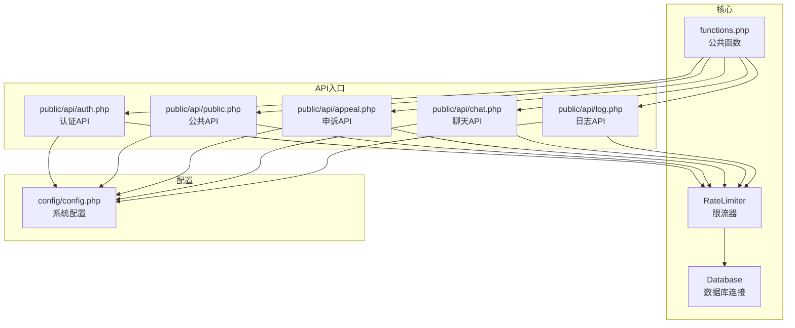
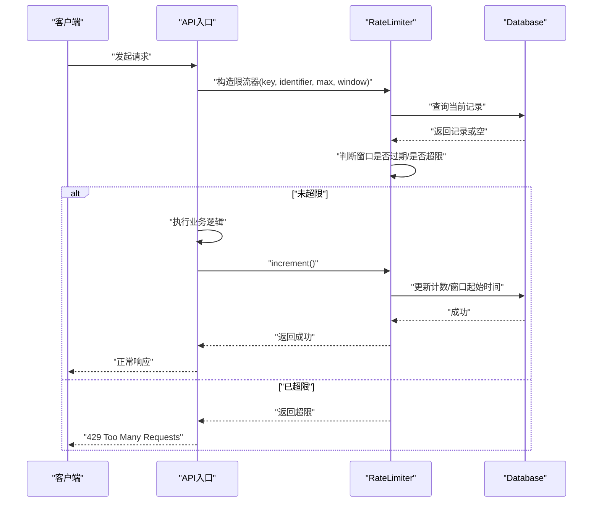
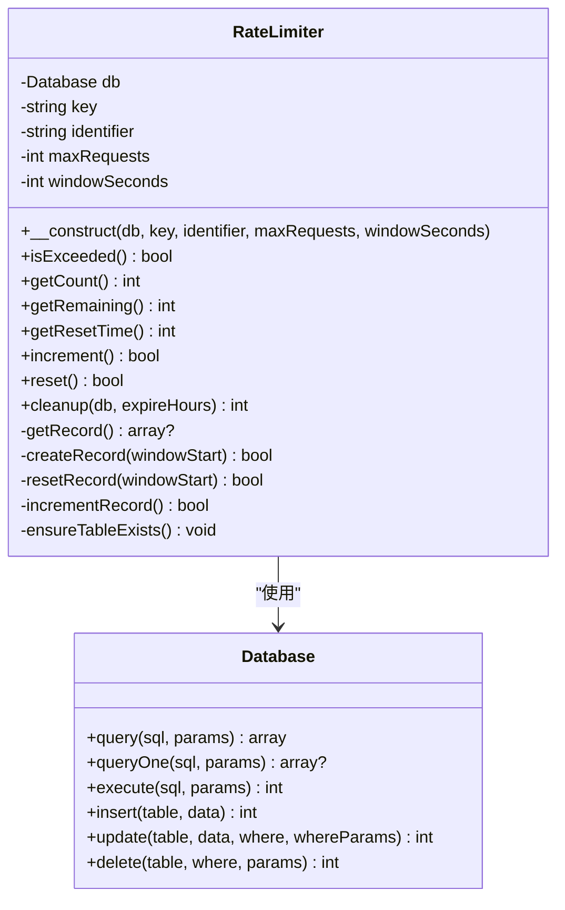
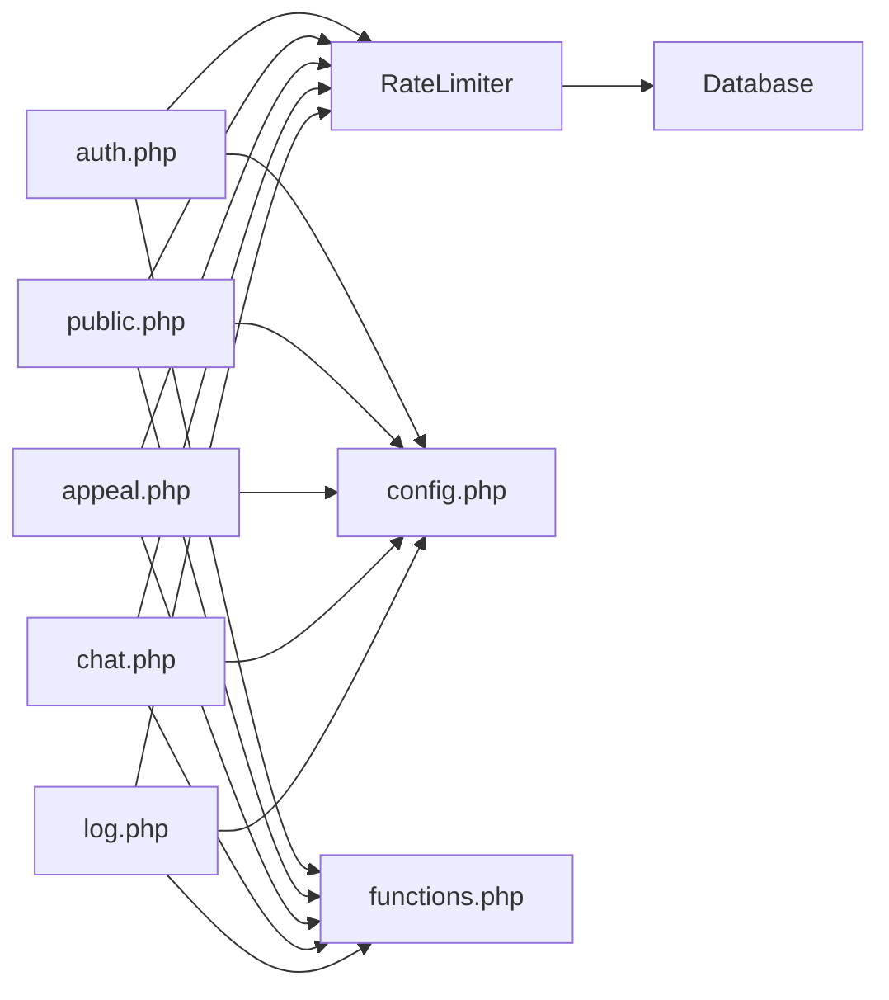

# 访问频率限制

<cite>
**本文引用的文件**
- [RateLimiter.php](file://core/RateLimiter.php)
- [config.php](file://config/config.php)
- [Database.php](file://core/Database.php)
- [functions.php](file://includes/functions.php)
- [auth.php](file://public/api/auth.php)
- [public.php](file://public/api/public.php)
- [appeal.php](file://public/api/appeal.php)
- [chat.php](file://public/api/chat.php)
- [log.php](file://public/api/log.php)
</cite>

## 目录
1. [简介](#简介)
2. [项目结构](#项目结构)
3. [核心组件](#核心组件)
4. [架构总览](#架构总览)
5. [详细组件分析](#详细组件分析)
6. [依赖关系分析](#依赖关系分析)
7. [性能考量](#性能考量)
8. [故障排查指南](#故障排查指南)
9. [结论](#结论)
10. [附录](#附录)

## 简介
本文件面向“访问频率限制系统”的技术文档，围绕现有代码实现进行深入分析，涵盖限流算法原理、多维度限流策略（基于IP、邮箱哈希、会话标识）、数据库驱动的计数模型、以及在认证、申诉、聊天、日志等API中的落地实践。同时提供Redis集成思路、阈值与窗口配置建议、响应策略与错误码约定、性能监控与故障排查方法。

## 项目结构
系统采用“核心类 + API入口 + 配置”的分层组织：
- 核心类：限流器、数据库连接、公共函数、安全防护等
- API入口：认证、公共统计、申诉、聊天、日志等接口
- 配置：数据库、站点、会话、安全、日志、调试等配置项

图表来源
- [RateLimiter.php:1-309](file://core/RateLimiter.php#L1-L309)
- [Database.php:1-400](file://core/Database.php#L1-L400)
- [functions.php:1-800](file://includes/functions.php#L1-L800)
- [auth.php:1-126](file://public/api/auth.php#L1-L126)
- [public.php:1-87](file://public/api/public.php#L1-L87)
- [appeal.php:200-399](file://public/api/appeal.php#L200-L399)
- [chat.php:440-639](file://public/api/chat.php#L440-L639)
- [log.php:60-259](file://public/api/log.php#L60-L259)
- [config.php:1-152](file://config/config.php#L1-L152)

章节来源
- [RateLimiter.php:1-309](file://core/RateLimiter.php#L1-L309)
- [Database.php:1-400](file://core/Database.php#L1-L400)
- [functions.php:1-800](file://includes/functions.php#L1-L800)
- [auth.php:1-126](file://public/api/auth.php#L1-L126)
- [public.php:1-87](file://public/api/public.php#L1-L87)
- [appeal.php:200-399](file://public/api/appeal.php#L200-L399)
- [chat.php:440-639](file://public/api/chat.php#L440-L639)
- [log.php:60-259](file://public/api/log.php#L60-L259)
- [config.php:1-152](file://config/config.php#L1-L152)

## 核心组件
- 限流器（RateLimiter）
  - 基于数据库的固定窗口计数模型，支持按“键+标识”维度计数
  - 关键能力：检查是否超限、获取当前计数/剩余配额/重置时间、增量/重置计数、表自动创建与定期清理
- 数据库连接（Database）
  - 单例PDO封装，提供查询、执行、事务、参数绑定、SQL注入防护等
- 公共函数（functions.php）
  - 提供IP获取、JSON响应、CSRF保护、URL构建、文件上传、调试日志等工具
- API入口
  - 认证、公共统计、申诉、聊天、日志等接口在关键路径上应用限流

章节来源
- [RateLimiter.php:25-309](file://core/RateLimiter.php#L25-L309)
- [Database.php:13-400](file://core/Database.php#L13-L400)
- [functions.php:407-440](file://includes/functions.php#L407-L440)

## 架构总览
限流器通过唯一键（如“模块_维度”）与标识（如IP、邮箱哈希、会话标识）组合形成计数单元，数据库表记录每个单元的计数与窗口起始时间。API在进入业务逻辑前先检查限流，若未超限则执行业务并增量计数；若超限则返回429并提示重试时间。

图表来源
- [RateLimiter.php:76-160](file://core/RateLimiter.php#L76-L160)
- [Database.php:144-181](file://core/Database.php#L144-L181)
- [appeal.php:214-227](file://public/api/appeal.php#L214-L227)
- [chat.php:453-457](file://public/api/chat.php#L453-L457)
- [log.php:66-71](file://public/api/log.php#L66-L71)

## 详细组件分析

### 限流器（RateLimiter）设计与实现
- 数据模型
  - 表名：rate_limits
  - 字段：limiter_key（键）、identifier（标识）、count（计数）、window_start（窗口起始时间）、updated_at（更新时间）
  - 约束：键+标识唯一索引；窗口起始时间与更新时间索引
- 算法与流程
  - 固定窗口计数：窗口起始时间+窗口秒数决定窗口边界
  - isExceeded：查询记录→判断窗口是否过期→比较count与maxRequests
  - increment/reset：按需创建/重置/自增计数
  - cleanup：按updated_at清理过期记录（定时任务）
- 关键方法与复杂度
  - 查询/更新均为单行操作，命中唯一索引，时间复杂度近似O(1)
  - 建议：在高并发场景下结合数据库连接池与索引优化

图表来源
- [RateLimiter.php:25-309](file://core/RateLimiter.php#L25-L309)
- [Database.php:13-400](file://core/Database.php#L13-L400)

章节来源
- [RateLimiter.php:25-309](file://core/RateLimiter.php#L25-L309)

### 多维度限流策略与配置
- 基于IP（客户端真实IP）
  - 适用：验证码发送、日志记录、申诉提交等
  - 示例：申诉验证码发送使用“同一邮箱60秒内仅1次”，同时叠加“同一IP每小时10次”
- 基于邮箱哈希
  - 适用：针对同一邮箱的申诉流程，避免不同IP滥用
  - 示例：申诉验证码发送使用“appeal_email_{md5(email)}”
- 基于会话标识
  - 适用：聊天消息发送，结合验证Token或邮箱哈希
  - 示例：聊天消息使用“chat_customer_{IP}_{md5(token或email)}”
- 基于API端点
  - 适用：不同接口设置差异化阈值
  - 示例：认证check接口建议添加限流（注释中给出方案）

章节来源
- [appeal.php:214-227](file://public/api/appeal.php#L214-L227)
- [appeal.php:393-399](file://public/api/appeal.php#L393-L399)
- [chat.php:453-457](file://public/api/chat.php#L453-L457)
- [log.php:66-71](file://public/api/log.php#L66-L71)
- [auth.php:92-96](file://public/api/auth.php#L92-L96)

### Redis集成方案（分布式统一限流）
- 方案概述
  - 使用Redis实现滑动窗口/令牌桶/漏桶等更精细的限流策略
  - 限流键：{prefix}:{key}:{identifier}
  - 滑动窗口：使用zset存储请求时间戳，窗口外时间戳自动淘汰
  - 令牌桶：使用Lua脚本原子性地取令牌，不足时返回重试时间
  - 漏桶：队列+异步消费，保证平均速率
- 与现有实现的衔接
  - 限流器接口抽象：新增Redis版RateLimiter，保持isExceeded/getRemaining/increment等方法一致
  - 适配层：在API入口注入限流器实例（数据库或Redis），统一调用
  - 迁移策略：先在低风险接口试点，逐步替换数据库限流器

[本节为概念性方案，不直接对应具体源码文件]

### 关键技术参数与配置
- 阈值与窗口
  - 申诉验证码：邮箱粒度1次/60秒，IP粒度10次/3600秒
  - 申诉提交：IP粒度5次/86400秒
  - 聊天消息：IP+会话标识粒度5次/60秒
  - 日志记录：IP粒度60次/60秒
  - 认证check：建议60秒内最多30次（注释建议）
- 突发流量处理
  - 固定窗口天然支持突发，但可能产生瞬时峰值
  - Redis方案可结合令牌桶/滑动窗口平滑突发
- 响应策略
  - 超限时返回429，携带重试时间（秒）
  - 剩余配额可通过getRemaining获取，前端可做UI提示

章节来源
- [appeal.php:214-227](file://public/api/appeal.php#L214-L227)
- [appeal.php:393-399](file://public/api/appeal.php#L393-L399)
- [chat.php:453-457](file://public/api/chat.php#L453-L457)
- [log.php:66-71](file://public/api/log.php#L66-L71)
- [auth.php:92-96](file://public/api/auth.php#L92-L96)

### 响应策略、错误码与客户端重试
- HTTP状态码
  - 正常：200
  - 限流：429 Too Many Requests
  - 方法不允许：405
  - CSRF失败：403
  - 参数错误/业务错误：400
  - 系统错误：500
- 错误结构
  - 统一使用JSON响应，包含success/code/message/data
- 客户端重试
  - 前端根据getResetTime或响应中的重试秒数进行倒计时提示
  - 对于429，建议指数退避+抖动，避免雪崩

章节来源
- [functions.php:483-516](file://includes/functions.php#L483-L516)
- [RateLimiter.php:116-135](file://core/RateLimiter.php#L116-L135)
- [appeal.php:216-226](file://public/api/appeal.php#L216-L226)
- [chat.php:455-457](file://public/api/chat.php#L455-L457)
- [log.php:69-71](file://public/api/log.php#L69-L71)

### 性能监控与统计分析
- 指标建议
  - QPS/超限QPS、P95/P99延迟、限流命中率、剩余配额分布
  - 各限流键的调用量与超限率
- 统计方法
  - 数据库侧：基于rate_limits表统计count分布、窗口重置频率
  - Redis侧：结合慢查询日志与Lua脚本埋点
- 报警阈值
  - 超限率超过阈值触发报警
  - 某接口连续多次429报警

[本节为通用指导，不直接对应具体源码文件]

## 依赖关系分析
- RateLimiter依赖Database进行CRUD
- API入口通过functions.php提供的getClientIp等工具获取标识
- 配置文件提供数据库连接参数与调试开关

图表来源
- [RateLimiter.php:25-309](file://core/RateLimiter.php#L25-L309)
- [Database.php:13-400](file://core/Database.php#L13-L400)
- [functions.php:407-440](file://includes/functions.php#L407-L440)
- [auth.php:1-126](file://public/api/auth.php#L1-L126)
- [public.php:1-87](file://public/api/public.php#L1-L87)
- [appeal.php:200-399](file://public/api/appeal.php#L200-L399)
- [chat.php:440-639](file://public/api/chat.php#L440-L639)
- [log.php:60-259](file://public/api/log.php#L60-L259)
- [config.php:1-152](file://config/config.php#L1-L152)

章节来源
- [RateLimiter.php:25-309](file://core/RateLimiter.php#L25-L309)
- [Database.php:13-400](file://core/Database.php#L13-L400)
- [functions.php:407-440](file://includes/functions.php#L407-L440)
- [auth.php:1-126](file://public/api/auth.php#L1-L126)
- [public.php:1-87](file://public/api/public.php#L1-L87)
- [appeal.php:200-399](file://public/api/appeal.php#L200-L399)
- [chat.php:440-639](file://public/api/chat.php#L440-L639)
- [log.php:60-259](file://public/api/log.php#L60-L259)
- [config.php:1-152](file://config/config.php#L1-L152)

## 性能考量
- 数据库限流
  - 优点：实现简单、无需额外依赖
  - 限制：单机数据库，分布式场景需Redis
  - 优化：确保limiter_key+identifier唯一索引、窗口起始时间与更新时间索引
- Redis限流
  - 优点：高性能、可分布式共享
  - 建议：使用Lua脚本保证原子性；滑动窗口适合突发场景；令牌桶适合平滑限速
- 业务侧优化
  - 前端缓存剩余配额，减少重复查询
  - 对高频接口采用分级限流（普通用户/登录用户/管理员）

[本节为通用指导，不直接对应具体源码文件]

## 故障排查指南
- 常见问题
  - 限流未生效：确认限流键与标识是否正确拼接；检查表是否存在与索引是否命中
  - 误杀：调整阈值与窗口；区分IP与用户维度
  - 429过多：检查客户端重试策略；评估是否需要降级或提高阈值
- 排查步骤
  - 查看RateLimiter错误日志（内部使用error_log）
  - 检查数据库表rate_limits中对应记录
  - 使用Database调试日志定位慢查询
- 配置核对
  - 数据库连接参数、字符集、SSL配置
  - 调试模式开关与日志目录权限

章节来源
- [RateLimiter.php:186-189](file://core/RateLimiter.php#L186-L189)
- [RateLimiter.php:209-212](file://core/RateLimiter.php#L209-L212)
- [RateLimiter.php:229-232](file://core/RateLimiter.php#L229-L232)
- [RateLimiter.php:248-251](file://core/RateLimiter.php#L248-L251)
- [RateLimiter.php:282-284](file://core/RateLimiter.php#L282-L284)
- [RateLimiter.php:303-307](file://core/RateLimiter.php#L303-L307)
- [Database.php:104-121](file://core/Database.php#L104-L121)
- [config.php:23-38](file://config/config.php#L23-L38)

## 结论
系统当前采用数据库驱动的固定窗口限流，已在多个API中落地，满足基本的防刷需求。对于分布式部署与更精细的限流策略，建议引入Redis实现滑动窗口/令牌桶等算法，并在认证、公共统计等高频接口补充限流配置。通过合理的阈值与窗口设置、完善的监控与告警，可进一步提升系统的稳定性与用户体验。

## 附录

### API限流配置清单（示例）
- 申诉验证码发送
  - 邮箱粒度：1次/60秒
  - IP粒度：10次/3600秒
- 申诉提交
  - IP粒度：5次/86400秒
- 聊天消息发送
  - IP+会话标识：5次/60秒
- 日志记录
  - IP粒度：60次/60秒
- 认证check
  - 建议：60秒内最多30次（注释建议）

章节来源
- [appeal.php:214-227](file://public/api/appeal.php#L214-L227)
- [appeal.php:393-399](file://public/api/appeal.php#L393-L399)
- [chat.php:453-457](file://public/api/chat.php#L453-L457)
- [log.php:66-71](file://public/api/log.php#L66-L71)
- [auth.php:92-96](file://public/api/auth.php#L92-L96)