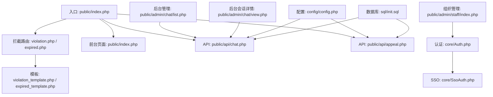
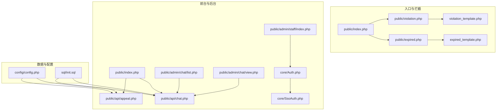
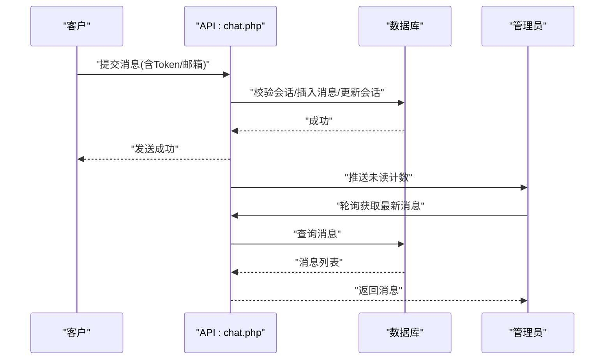
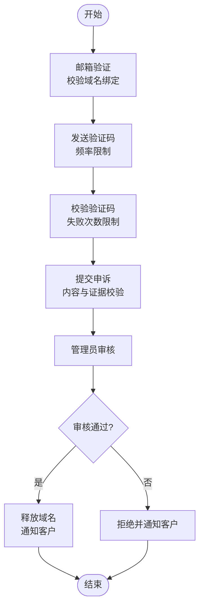
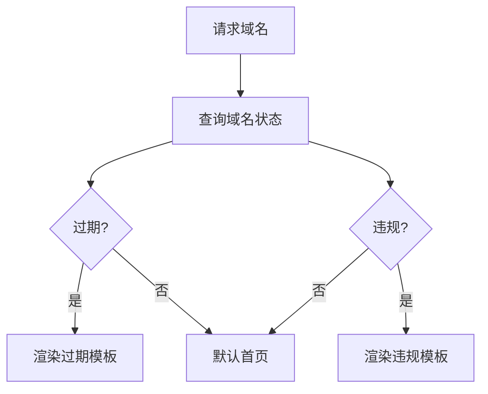
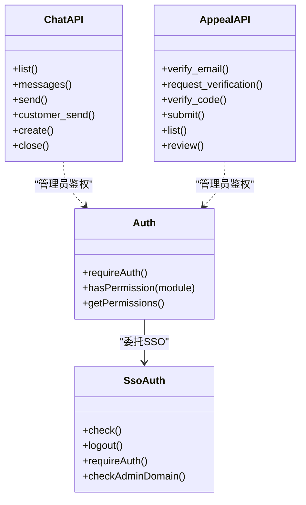
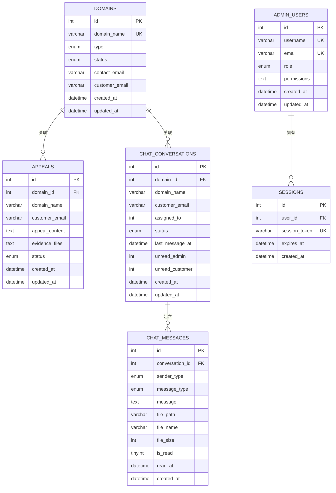
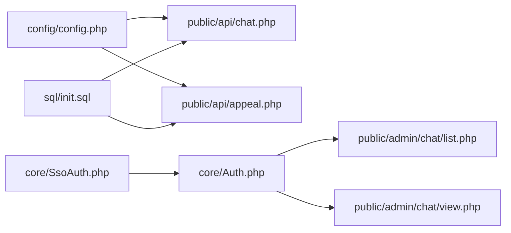

# 客户服务

<cite>
**本文引用的文件**
- [public/index.php](file://public/index.php)
- [public/violation.php](file://public/violation.php)
- [public/expired.php](file://public/expired.php)
- [public/violation_template.php](file://public/violation_template.php)
- [public/expired_template.php](file://public/expired_template.php)
- [public/admin/chat/list.php](file://public/admin/chat/list.php)
- [public/admin/chat/view.php](file://public/admin/chat/view.php)
- [public/api/chat.php](file://public/api/chat.php)
- [public/api/appeal.php](file://public/api/appeal.php)
- [public/admin/access_denied.php](file://public/admin/access_denied.php)
- [core/Auth.php](file://core/Auth.php)
- [core/SsoAuth.php](file://core/SsoAuth.php)
- [config/config.php](file://config/config.php)
- [sql/init.sql](file://sql/init.sql)
- [public/admin/staff/index.php](file://public/admin/staff/index.php)
</cite>

## 目录
1. [引言](#引言)
2. [项目结构](#项目结构)
3. [核心组件](#核心组件)
4. [架构总览](#架构总览)
5. [详细组件分析](#详细组件分析)
6. [依赖关系分析](#依赖关系分析)
7. [性能考虑](#性能考虑)
8. [故障排除指南](#故障排除指南)
9. [结论](#结论)
10. [附录](#附录)

## 引言
本文件面向客户服务系统的使用者与维护者，系统性梳理在线聊天、申诉处理、拦截页面展示、会话管理与客服工作台等能力，同时给出最佳实践与与SSO集成方式说明。文档基于仓库实际代码进行分析，所有技术细节均以源码为依据。

## 项目结构
系统采用前后端分离的PHP单页应用风格，入口位于 public/index.php，拦截页面分别由 violation.php/expired.php 路由到对应的模板；后台管理位于 public/admin，聊天与申诉相关API位于 public/api，核心认证与SSO位于 core 目录，数据库结构在 sql/init.sql 中定义。

图示来源
- [public/index.php:1-228](file://public/index.php#L1-L228)
- [public/violation.php:1-48](file://public/violation.php#L1-L48)
- [public/expired.php:1-48](file://public/expired.php#L1-L48)
- [public/admin/chat/list.php:1-226](file://public/admin/chat/list.php#L1-L226)
- [public/admin/chat/view.php:1-448](file://public/admin/chat/view.php#L1-L448)
- [public/api/chat.php:1-1161](file://public/api/chat.php#L1-L1161)
- [public/api/appeal.php:1-789](file://public/api/appeal.php#L1-L789)
- [core/Auth.php:1-272](file://core/Auth.php#L1-L272)
- [core/SsoAuth.php:1-505](file://core/SsoAuth.php#L1-L505)
- [config/config.php:1-152](file://config/config.php#L1-L152)
- [sql/init.sql:1-275](file://sql/init.sql#L1-L275)

章节来源
- [public/index.php:1-228](file://public/index.php#L1-L228)
- [public/violation.php:1-48](file://public/violation.php#L1-L48)
- [public/expired.php:1-48](file://public/expired.php#L1-L48)
- [config/config.php:1-152](file://config/config.php#L1-L152)

## 核心组件
- 拦截页面与入口路由：根据域名类型分发到过期/违规拦截页面，记录访问日志，支持封禁IP检测。
- 在线聊天系统：提供管理员与客户之间的实时会话与消息收发、文件上传、未读计数、自动关闭不活跃会话等功能。
- 申诉处理流程：邮箱验证、验证码发送与校验、申诉提交、管理员审核与状态流转、自动释放域名与通知。
- 客服工作台：会话列表、会话详情、消息发送、封禁IP、权限与角色控制。
- SSO集成：基于Logto的单点登录，支持白名单域名访问控制、会话持久化与权限继承。

章节来源
- [public/index.php:1-228](file://public/index.php#L1-L228)
- [public/api/chat.php:1-1161](file://public/api/chat.php#L1-L1161)
- [public/api/appeal.php:1-789](file://public/api/appeal.php#L1-L789)
- [core/Auth.php:1-272](file://core/Auth.php#L1-L272)
- [core/SsoAuth.php:1-505](file://core/SsoAuth.php#L1-L505)

## 架构总览
系统采用“入口路由 → 模板/页面 → API/数据库”的分层架构。入口负责域名解析与拦截判定，模板负责展示拦截提示与引导申诉；API负责业务逻辑与数据持久化；后台管理通过API与数据库交互，结合SSO进行权限控制。

图示来源
- [public/index.php:1-228](file://public/index.php#L1-L228)
- [public/violation.php:1-48](file://public/violation.php#L1-L48)
- [public/expired.php:1-48](file://public/expired.php#L1-L48)
- [public/admin/chat/list.php:1-226](file://public/admin/chat/list.php#L1-L226)
- [public/admin/chat/view.php:1-448](file://public/admin/chat/view.php#L1-L448)
- [public/api/chat.php:1-1161](file://public/api/chat.php#L1-L1161)
- [public/api/appeal.php:1-789](file://public/api/appeal.php#L1-L789)
- [core/Auth.php:1-272](file://core/Auth.php#L1-L272)
- [core/SsoAuth.php:1-505](file://core/SsoAuth.php#L1-L505)
- [config/config.php:1-152](file://config/config.php#L1-L152)
- [sql/init.sql:1-275](file://sql/init.sql#L1-L275)

## 详细组件分析

### 在线聊天功能
- 会话管理
  - 管理员可列出会话、按状态/关键词筛选、查看未读数、关闭会话。
  - 自动关闭不活跃会话：若会话超过10分钟无消息且无未读消息则自动关闭，并推送系统消息。
- 消息收发
  - 管理员发送文本/图片/视频/文件消息，支持CSRF防护与频率限制。
  - 客户通过邮箱或Token验证后发送消息，支持创建新会话与历史消息查询。
  - 消息读取状态：管理员侧自动标记客户消息为已读，客户侧自动标记管理员消息为已读。
- 文件上传
  - 上传目录与大小限制在配置中定义，图片/视频类型与MIME校验保障安全性。
- 实时性
  - 后台会话详情页通过轮询拉取最新消息，实现近实时展示。

图示来源
- [public/api/chat.php:1-1161](file://public/api/chat.php#L1-L1161)
- [public/admin/chat/view.php:1-448](file://public/admin/chat/view.php#L1-L448)

章节来源
- [public/admin/chat/list.php:1-226](file://public/admin/chat/list.php#L1-L226)
- [public/admin/chat/view.php:1-448](file://public/admin/chat/view.php#L1-L448)
- [public/api/chat.php:1-1161](file://public/api/chat.php#L1-L1161)
- [config/config.php:56-66](file://config/config.php#L56-L66)

### 申诉处理流程
- 邮箱验证与验证码
  - 验证邮箱与域名绑定一致性，支持基于IP的验证码发送频率限制与自动封禁策略。
  - 验证码校验失败达到阈值将触发临时封禁。
- 申诉提交
  - 支持文本内容与证据文件上传，提交频率限制（IP维度），避免刷单。
  - 重复提交待处理申诉将被拒绝。
- 审核与释放
  - 管理员审核通过自动释放域名并通知客户；拒绝时同样通知客户。
  - 审核过程记录日志，便于审计。

图示来源
- [public/api/appeal.php:1-789](file://public/api/appeal.php#L1-L789)

章节来源
- [public/api/appeal.php:1-789](file://public/api/appeal.php#L1-L789)

### 拦截页面展示逻辑
- 过期域名与违规域名分别路由到对应入口，查询数据库获取域名信息并渲染模板。
- 模板中提供申诉入口、联系方式与处理指引，帮助用户快速发起申诉。
- 入口页记录访问日志，支持CDN真实IP检测与封禁IP跳转。

图示来源
- [public/index.php:1-228](file://public/index.php#L1-L228)
- [public/violation.php:1-48](file://public/violation.php#L1-L48)
- [public/expired.php:1-48](file://public/expired.php#L1-L48)
- [public/violation_template.php](file://public/violation_template.php)
- [public/expired_template.php](file://public/expired_template.php)

章节来源
- [public/index.php:1-228](file://public/index.php#L1-L228)
- [public/violation.php:1-48](file://public/violation.php#L1-L48)
- [public/expired.php:1-48](file://public/expired.php#L1-L48)

### 客服工作台
- 会话列表：支持搜索、筛选、分页、未读数高亮、一键关闭会话。
- 会话详情：消息列表、发送文本/图片/视频、封禁IP弹窗、自动刷新。
- 组织管理：角色与权限分配、状态变更、删除限制（24小时窗口）。
- 权限控制：基于角色的模块权限与自定义权限，支持SSO用户同步与会话持久化。

图示来源
- [core/Auth.php:1-272](file://core/Auth.php#L1-L272)
- [core/SsoAuth.php:1-505](file://core/SsoAuth.php#L1-L505)
- [public/api/chat.php:1-1161](file://public/api/chat.php#L1-L1161)
- [public/api/appeal.php:1-789](file://public/api/appeal.php#L1-L789)

章节来源
- [public/admin/chat/list.php:1-226](file://public/admin/chat/list.php#L1-L226)
- [public/admin/chat/view.php:1-448](file://public/admin/chat/view.php#L1-L448)
- [public/admin/staff/index.php:1-788](file://public/admin/staff/index.php#L1-L788)
- [core/Auth.php:148-195](file://core/Auth.php#L148-L195)

### 数据模型与关系
- domains：域名表，记录域名、类型、状态、联系信息与审核信息。
- appeals：申诉表，记录申诉内容、证据、状态、审核备注与关联域名。
- chat_conversations：会话表，记录会话主题、分配管理员、状态与未读计数。
- chat_messages：消息表，记录消息类型、内容、文件信息与读取状态。
- admin_users/sessions：管理员与会话表，支撑SSO与权限控制。

图示来源
- [sql/init.sql:1-275](file://sql/init.sql#L1-L275)

章节来源
- [sql/init.sql:1-275](file://sql/init.sql#L1-L275)

## 依赖关系分析
- 入口与拦截：入口页依赖数据库查询域名状态，拦截页依赖模板渲染。
- API与数据库：聊天与申诉API依赖数据库读写与配置项，受CSRF与频率限制保护。
- 认证与SSO：后台管理依赖Auth与SsoAuth进行登录、权限与域名白名单校验。
- 配置：上传大小、会话生命周期、安全响应头、Logto参数均由config.php集中管理。

图示来源
- [config/config.php:1-152](file://config/config.php#L1-L152)
- [public/api/chat.php:1-1161](file://public/api/chat.php#L1-L1161)
- [public/api/appeal.php:1-789](file://public/api/appeal.php#L1-L789)
- [core/Auth.php:1-272](file://core/Auth.php#L1-L272)
- [core/SsoAuth.php:1-505](file://core/SsoAuth.php#L1-L505)
- [sql/init.sql:1-275](file://sql/init.sql#L1-L275)

章节来源
- [config/config.php:1-152](file://config/config.php#L1-L152)
- [core/Auth.php:1-272](file://core/Auth.php#L1-L272)
- [core/SsoAuth.php:1-505](file://core/SsoAuth.php#L1-L505)

## 性能考虑
- 轮询刷新：后台会话详情页采用定时轮询获取最新消息，建议在高并发场景下适当延长轮询间隔或引入WebSocket替代方案。
- 数据库索引：domains、appeals、chat_conversations、chat_messages等表具备常用查询索引，有助于提升列表与搜索性能。
- 上传限制：图片/视频大小与类型限制减少服务器压力，建议结合CDN与异步处理优化大文件体验。
- 会话生命周期：会话有效期遵循等保2.0三级要求，建议结合前端心跳与服务端会话续期策略提升稳定性。

## 故障排除指南
- 会话自动关闭
  - 现象：长时间无消息且无未读消息的会话被自动关闭。
  - 处理：检查会话最后消息时间与未读计数，确认是否符合自动关闭条件。
- 频率限制触发
  - 现象：验证码发送、申诉提交、客户消息发送出现“请求过于频繁”。
  - 处理：等待重置时间或降低请求频率；检查IP与会话状态。
- CSRF校验失败
  - 现象：管理员操作返回CSRF失败。
  - 处理：刷新页面获取新Token，确认表单包含隐藏Token字段。
- SSO登录异常
  - 现象：SSO启用后登录失败或白名单拒绝。
  - 处理：检查Logto配置、SDK可用性、回调地址与域名白名单；查看日志定位错误。

章节来源
- [public/api/chat.php:61-99](file://public/api/chat.php#L61-L99)
- [public/api/appeal.php:214-227](file://public/api/appeal.php#L214-L227)
- [public/api/appeal.php:393-399](file://public/api/appeal.php#L393-L399)
- [core/Auth.php:103-131](file://core/Auth.php#L103-L131)
- [core/SsoAuth.php:480-503](file://core/SsoAuth.php#L480-L503)

## 结论
本客户服务系统围绕“拦截页面—申诉—在线聊天—工作台—SSO”的完整闭环构建，具备完善的权限控制、安全防护与可观测性。通过合理的数据库设计、API分层与配置管理，系统在保证安全性的同时兼顾易用性与可扩展性。建议在高并发场景下进一步优化消息推送与上传处理，并持续完善日志与监控体系。

## 附录
- 最佳实践
  - 客户端：在聊天界面提供清晰的“正在输入”提示与消息状态反馈；对大文件上传提供进度条与断点续传建议。
  - 管理端：定期清理过期会话与日志；对敏感操作启用二次确认与审计日志。
  - 安全：严格校验上传文件类型与大小，启用CSRF与频率限制；定期轮换会话密钥与SSO配置。
- 与SSO集成要点
  - 启用SSO后，后台访问需满足域名白名单；登录成功后创建本地会话并持久化；权限继承自SSO用户角色。
  - 若Logto SDK不可用，系统将降级为非SSO模式，需自行配置管理员账户与权限。

章节来源
- [config/config.php:139-149](file://config/config.php#L139-L149)
- [core/Auth.php:103-131](file://core/Auth.php#L103-L131)
- [core/SsoAuth.php:19-61](file://core/SsoAuth.php#L19-L61)
- [public/admin/access_denied.php:1-318](file://public/admin/access_denied.php#L1-L318)