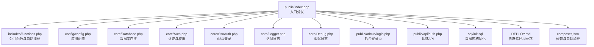
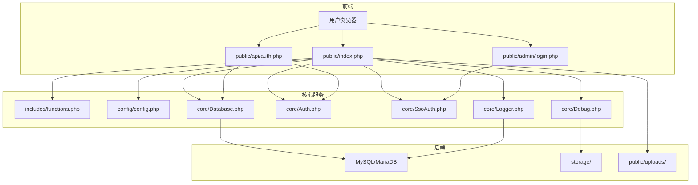
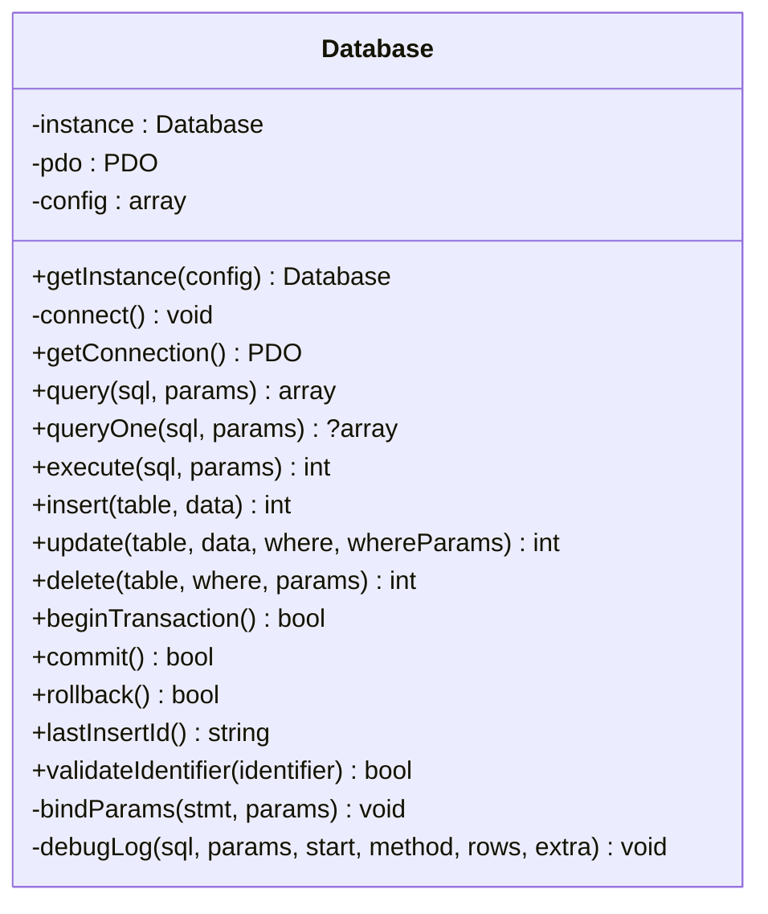
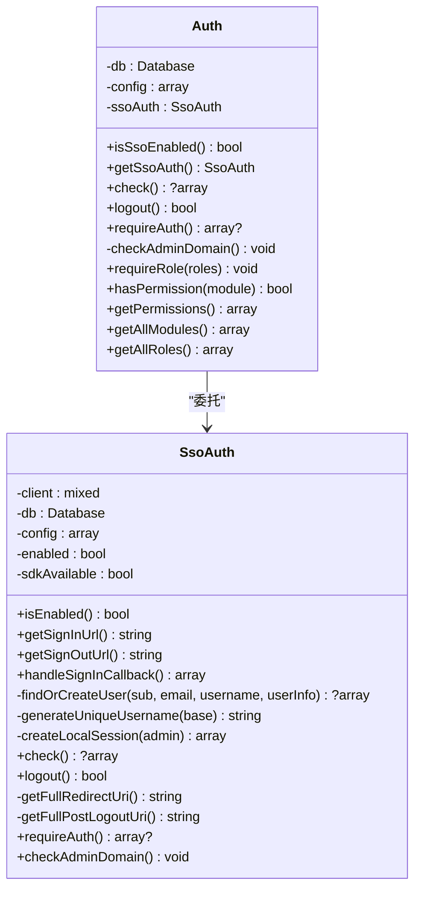
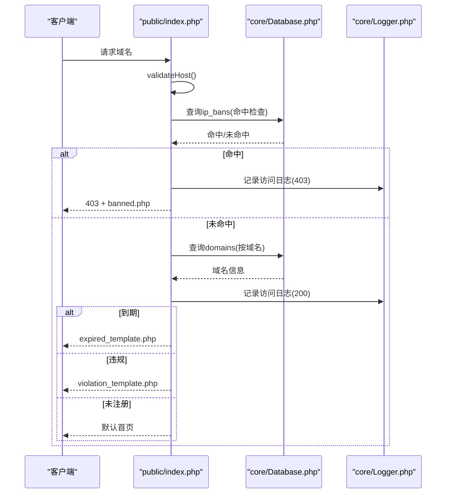
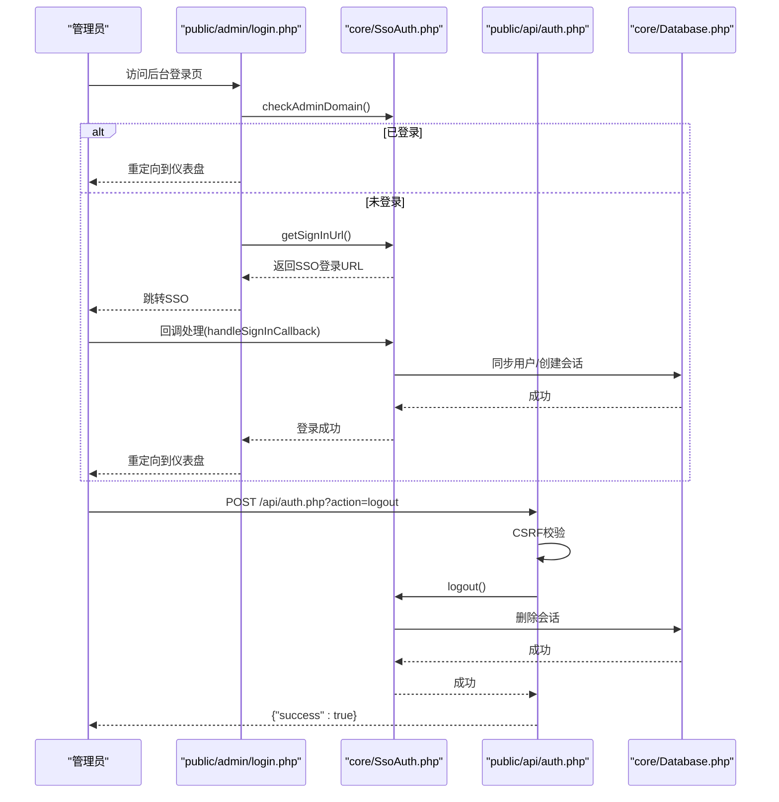
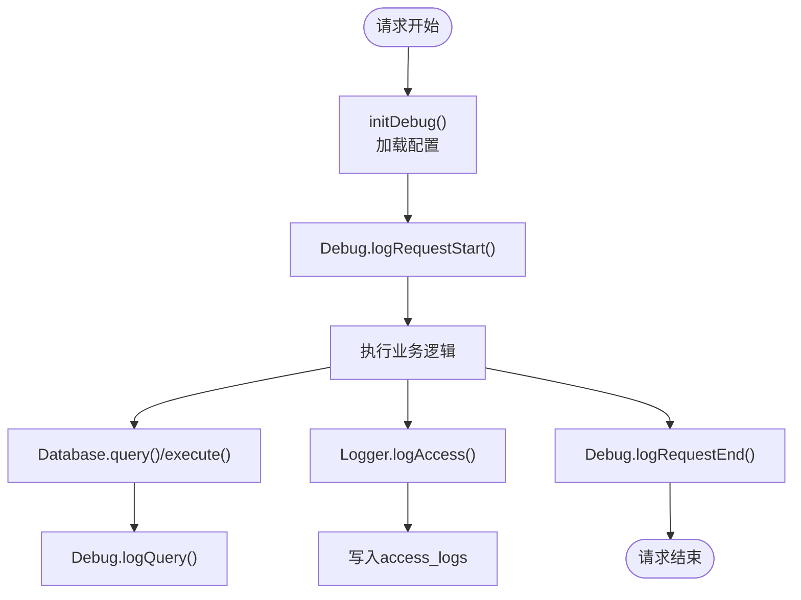
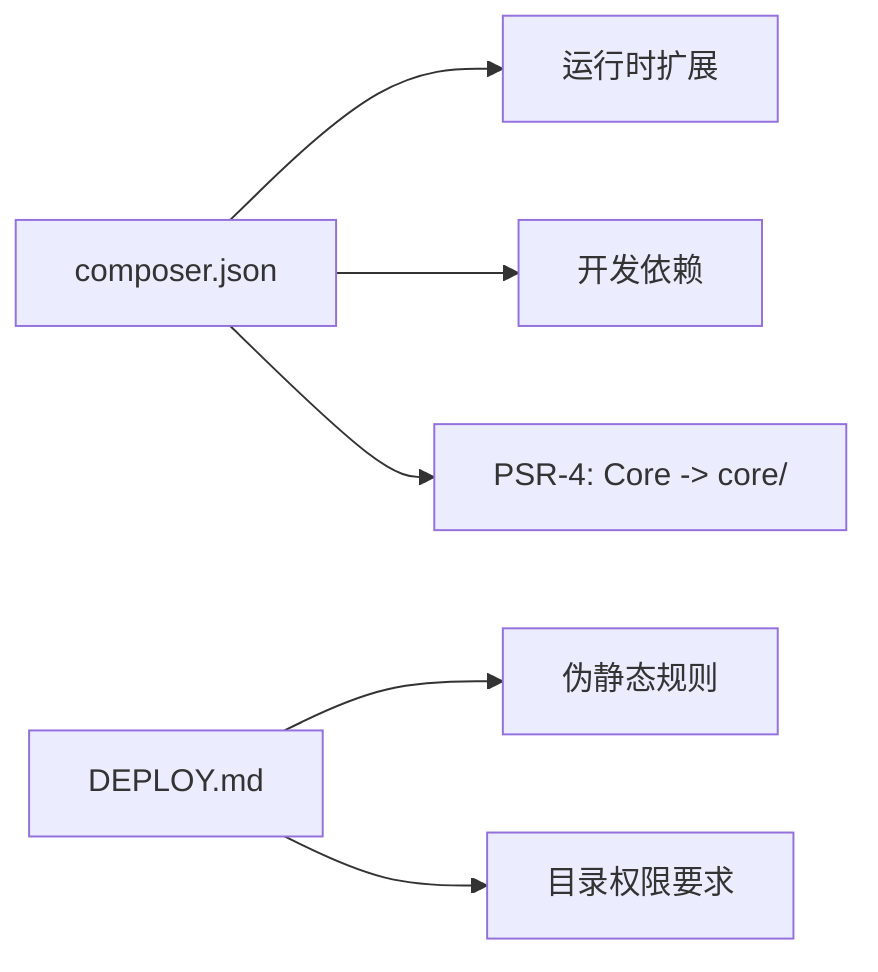

# 开发指南

<cite>
**本文引用的文件**
- [composer.json](file://composer.json)
- [config.php](file://config/config.php)
- [install.php](file://public/install.php)
- [init.sql](file://sql/init.sql)
- [DEPLOY.md](file://DEPLOY.md)
- [Auth.php](file://core/Auth.php)
- [SsoAuth.php](file://core/SsoAuth.php)
- [Database.php](file://core/Database.php)
- [functions.php](file://includes/functions.php)
- [index.php](file://public/index.php)
- [auth.php](file://public/api/auth.php)
- [Logger.php](file://core/Logger.php)
- [Debug.php](file://core/Debug.php)
- [login.php](file://public/admin/login.php)
- [header.php](file://includes/header.php)
</cite>

## 目录
1. [简介](#简介)
2. [项目结构](#项目结构)
3. [核心组件](#核心组件)
4. [架构总览](#架构总览)
5. [详细组件分析](#详细组件分析)
6. [依赖关系分析](#依赖关系分析)
7. [性能考虑](#性能考虑)
8. [故障排除指南](#故障排除指南)
9. [结论](#结论)
10. [附录](#附录)

## 简介
本指南面向DNS拦截响应平台的开发者，提供从环境搭建、代码规范、架构理解到扩展与质量保障的全流程开发文档。平台采用PHP 8+ + MySQL + Logto SSO，围绕“域名拦截展示页 + 后台管理 + API接口 + 安全与审计”的目标构建，强调安全响应头、CSRF防护、会话与权限模型、调试与日志体系。

## 项目结构
项目采用“入口分发 + 核心库 + 配置 + 页面与API + 数据库脚本 + 部署文档”的组织方式，便于维护与扩展。

图表来源
- [index.php:1-228](file://public/index.php#L1-L228)
- [functions.php:1-998](file://includes/functions.php#L1-L998)
- [config.php:1-152](file://config/config.php#L1-L152)
- [Database.php:1-400](file://core/Database.php#L1-L400)
- [Auth.php:1-272](file://core/Auth.php#L1-L272)
- [SsoAuth.php:1-505](file://core/SsoAuth.php#L1-L505)
- [Logger.php:1-472](file://core/Logger.php#L1-L472)
- [Debug.php:1-336](file://core/Debug.php#L1-L336)
- [login.php:1-337](file://public/admin/login.php#L1-L337)
- [auth.php:1-126](file://public/api/auth.php#L1-L126)
- [init.sql:1-275](file://sql/init.sql#L1-L275)
- [DEPLOY.md:1-198](file://DEPLOY.md#L1-L198)
- [composer.json:1-37](file://composer.json#L1-L37)

章节来源
- [index.php:1-228](file://public/index.php#L1-L228)
- [functions.php:1-998](file://includes/functions.php#L1-L998)
- [config.php:1-152](file://config/config.php#L1-L152)
- [composer.json:1-37](file://composer.json#L1-L37)

## 核心组件
- 数据库层：统一的PDO封装，支持参数绑定、事务、标识符校验与调试日志。
- 认证与权限：基于SSO的管理员认证，支持角色与模块权限矩阵。
- 日志与审计：访问日志记录、操作日志记录、调试日志与HMAC完整性保护。
- 安全与防护：安全响应头、CSRF令牌、IP白名单、安装锁、上传安全与输入清理。
- 入口与路由：入口文件根据域名类型分发到到期/违规展示页或默认首页，并记录访问日志。

章节来源
- [Database.php:1-400](file://core/Database.php#L1-L400)
- [Auth.php:1-272](file://core/Auth.php#L1-L272)
- [SsoAuth.php:1-505](file://core/SsoAuth.php#L1-L505)
- [Logger.php:1-472](file://core/Logger.php#L1-L472)
- [Debug.php:1-336](file://core/Debug.php#L1-L336)
- [index.php:1-228](file://public/index.php#L1-L228)

## 架构总览
平台采用“入口分发 + 核心服务 + 配置驱动 + 安全与审计”的分层架构。入口文件负责安装检测、会话初始化、IP封禁检查、域名查询与日志记录；核心库提供数据库、认证、日志与调试能力；配置文件集中管理数据库、站点、上传、会话、安全、日志、调试与SSO参数；API与后台页面通过统一的认证与权限模型访问后端能力。

图表来源
- [index.php:1-228](file://public/index.php#L1-L228)
- [login.php:1-337](file://public/admin/login.php#L1-L337)
- [auth.php:1-126](file://public/api/auth.php#L1-L126)
- [functions.php:1-998](file://includes/functions.php#L1-L998)
- [config.php:1-152](file://config/config.php#L1-L152)
- [Database.php:1-400](file://core/Database.php#L1-L400)
- [Auth.php:1-272](file://core/Auth.php#L1-L272)
- [SsoAuth.php:1-505](file://core/SsoAuth.php#L1-L505)
- [Logger.php:1-472](file://core/Logger.php#L1-L472)
- [Debug.php:1-336](file://core/Debug.php#L1-L336)

## 详细组件分析

### 数据库层（Database）
- 设计要点
  - 单例模式，延迟连接，配置驱动。
  - 参数绑定自动识别整数/布尔/NULL，避免类型错误。
  - WHERE条件白名单校验，防止注入。
  - 标识符（表/列）严格校验，防止注入。
  - 事务封装与调试日志联动。
- 性能与安全
  - 启用PDO::ATTR_EMULATE_PREPARES=false，减少注入风险。
  - SSL/TLS可配置，满足等保要求。
- 复杂度
  - 查询/执行/事务：O(1)；WHERE/标识符校验：O(n)（n为参数/标识符长度）。

图表来源
- [Database.php:1-400](file://core/Database.php#L1-L400)

章节来源
- [Database.php:1-400](file://core/Database.php#L1-L400)

### 认证与权限（Auth + SsoAuth）
- 设计要点
  - Auth聚合管理后台认证与权限，优先委托SsoAuth。
  - SsoAuth封装Logto SDK，负责登录URL生成、回调处理、会话创建与校验、登出。
  - 支持后台域名白名单，fail-safe策略。
  - 角色与模块权限矩阵，支持自定义权限覆盖。
- 安全特性
  - CSRF令牌生成与验证。
  - 会话Cookie安全属性（Secure/HttpOnly/SameSite）。
  - User-Agent一致性校验。
- 复杂度
  - check：O(1)查询；权限判定：O(1)查找。

图表来源
- [Auth.php:1-272](file://core/Auth.php#L1-L272)
- [SsoAuth.php:1-505](file://core/SsoAuth.php#L1-L505)

章节来源
- [Auth.php:1-272](file://core/Auth.php#L1-L272)
- [SsoAuth.php:1-505](file://core/SsoAuth.php#L1-L505)

### 入口分发与访问控制（index.php）
- 设计要点
  - 安装锁检测，未安装跳转安装向导。
  - Host格式严格校验，防止Host头注入。
  - IP封禁检查，命中即记录访问日志并返回403。
  - 域名查询，按类型分发到期/违规展示页。
  - 记录访问日志（UA截断、真实IP检测）。
- 安全特性
  - validateHost防注入。
  - CDN头真实IP检测与来源标记。
  - UA与Referer截断，避免超长存储。
- 复杂度
  - IP封禁查询：O(1)；域名查询：O(1)；日志插入：O(1)。

图表来源
- [index.php:1-228](file://public/index.php#L1-L228)
- [Logger.php:1-472](file://core/Logger.php#L1-L472)
- [Database.php:1-400](file://core/Database.php#L1-L400)

章节来源
- [index.php:1-228](file://public/index.php#L1-L228)

### API与后台登录（auth.php, login.php）
- 设计要点
  - 认证API：退出登录（CSRF校验）、登录状态检查。
  - 后台登录页：SSO跳转、错误提示、域名白名单检查。
- 安全特性
  - CSRF令牌验证。
  - SSO回调处理与用户同步。
  - Cookie安全属性与会话持久化。

图表来源
- [login.php:1-337](file://public/admin/login.php#L1-L337)
- [SsoAuth.php:1-505](file://core/SsoAuth.php#L1-L505)
- [auth.php:1-126](file://public/api/auth.php#L1-L126)
- [Database.php:1-400](file://core/Database.php#L1-L400)

章节来源
- [auth.php:1-126](file://public/api/auth.php#L1-L126)
- [login.php:1-337](file://public/admin/login.php#L1-L337)

### 日志与调试（Logger + Debug）
- 设计要点
  - Logger：访问日志记录、查询与统计、趋势分析、过期清理、HMAC完整性保护。
  - Debug：按分类记录SQL、认证、API、错误、请求生命周期，支持IP白名单与轮转清理。
- 复杂度
  - 访问日志插入：O(1)；查询/统计：O(n)（n为匹配记录数）。

图表来源
- [functions.php:1-998](file://includes/functions.php#L1-L998)
- [Debug.php:1-336](file://core/Debug.php#L1-L336)
- [Logger.php:1-472](file://core/Logger.php#L1-L472)
- [Database.php:1-400](file://core/Database.php#L1-L400)

章节来源
- [Logger.php:1-472](file://core/Logger.php#L1-L472)
- [Debug.php:1-336](file://core/Debug.php#L1-L336)

## 依赖关系分析
- Composer依赖
  - 运行时：PHP>=8.0、PDO/MySQL、JSON、cURL、mbstring、OpenSSL、Logto SDK。
  - 开发时：PHPUnit。
- 自动加载
  - PSR-4命名空间Core映射到core目录。
- 伪静态与目录权限
  - Nginx/Apache重写规则；storage与uploads写权限；安装锁防止重复安装。

图表来源
- [composer.json:1-37](file://composer.json#L1-L37)
- [DEPLOY.md:1-198](file://DEPLOY.md#L1-L198)

章节来源
- [composer.json:1-37](file://composer.json#L1-L37)
- [DEPLOY.md:1-198](file://DEPLOY.md#L1-L198)

## 性能考虑
- 数据库
  - 使用参数化查询与事务，避免注入与提升吞吐。
  - 合理索引：domains(type,status)、ip_bans(status,expires_at)、access_logs(…多字段)。
- 日志
  - 访问日志批量写入，避免频繁IO；定期清理过期日志。
  - Debug日志按分类开关，生产环境谨慎开启。
- 前端
  - 生产环境建议本地化CSS/JS，减少CDN依赖。
- 缓存
  - 对热点查询（如域名状态）引入缓存层（Redis/APCu）。

## 故障排除指南
- 安装相关
  - 未生成config/config.php：检查安装向导CSRF与环境变量（DB_USER/DB_PASSWORD）。
  - 安装锁存在仍提示未安装：检查storage/install.lock与权限。
- 数据库连接
  - PDO异常：核对host/port/dbname/user/password与SSL配置。
  - 连接超时：检查网络与防火墙，必要时增加PDO超时。
- SSO登录
  - SDK不可用：确认Logto SDK安装与版本兼容。
  - 回调失败：检查redirectUri/postLogoutUri与域名白名单。
- 安全与防护
  - CSRF失败：检查表单隐藏字段与会话状态。
  - Host头注入：确保validateHost生效，避免绕过。
- 日志与调试
  - 调试日志未生成：确认IP白名单与目录权限。
  - 访问日志缺失：检查入口分发与Logger.logAccess调用链。

章节来源
- [install.php:1-800](file://public/install.php#L1-L800)
- [config.php:1-152](file://config/config.php#L1-L152)
- [Database.php:1-400](file://core/Database.php#L1-L400)
- [SsoAuth.php:1-505](file://core/SsoAuth.php#L1-L505)
- [functions.php:1-998](file://includes/functions.php#L1-L998)
- [Debug.php:1-336](file://core/Debug.php#L1-L336)
- [Logger.php:1-472](file://core/Logger.php#L1-L472)

## 结论
本指南提供了DNS拦截响应平台的开发与运维全景：从环境与依赖、代码规范与安全实践，到核心组件与API设计、日志与调试体系，以及扩展与质量保障流程。建议在开发中遵循本文的命名、注释、错误处理与安全约定，结合调试与日志体系持续优化性能与稳定性。

## 附录

### 开发环境搭建步骤
- 系统与Web服务器
  - PHP>=8.0，Nginx/Apache，MySQL/MariaDB>=5.7。
- PHP扩展
  - pdo、pdo_mysql、json、curl、mbstring、openssl、fileinfo、session。
- 依赖安装
  - Composer安装：进入项目根目录执行安装命令。
- 伪静态
  - Nginx：try_files规则；Apache：.htaccess重写与敏感目录禁止访问。
- 目录权限
  - storage/、storage/logs/、public/uploads/等写权限。
- SSO配置
  - 安装Logto SDK，配置endpoint、appId、appSecret、回调地址与默认角色。

章节来源
- [DEPLOY.md:1-198](file://DEPLOY.md#L1-L198)
- [composer.json:1-37](file://composer.json#L1-L37)

### 代码规范与开发约定
- 命名规范
  - 类：PascalCase；方法/属性：camelCase；常量：UPPER_SNAKE_CASE。
  - 命名空间：Core\*；文件与类名一一对应。
- 注释标准
  - 类/方法：简述用途、参数、返回值与异常；复杂逻辑补充说明。
  - 安全相关：明确风险点与防护措施（如注入、CSRF、Host头）。
- 错误处理
  - 统一使用try/catch捕获异常，记录日志并返回标准化错误响应。
  - 数据库异常转换为用户友好的提示。
- 安全约定
  - 输入清理与白名单校验（Host、WHERE、标识符、上传目录）。
  - CSRF令牌生成与验证，Cookie安全属性。
  - 安全响应头集中配置，等保2.0三级要求。
- 调试与日志
  - initDebug在所有入口文件尽早调用。
  - Debug按分类记录，生产环境严格控制IP白名单与轮转。

章节来源
- [functions.php:1-998](file://includes/functions.php#L1-L998)
- [header.php:1-171](file://includes/header.php#L1-L171)
- [Debug.php:1-336](file://core/Debug.php#L1-L336)
- [Database.php:1-400](file://core/Database.php#L1-L400)

### 调试与测试方法
- 单元测试
  - 使用PHPUnit，针对核心类（Database、Auth、SsoAuth、Logger）编写测试用例。
- 集成测试
  - 模拟请求（入口分发、API、后台登录）与数据库交互，验证流程与日志。
- 性能测试
  - 压测访问日志写入、SSO回调与权限判定，观察慢查询与内存峰值。
- 安全测试
  - 注入测试（SQL、XSS、Host头）、CSRF、会话劫持与越权访问。

章节来源
- [composer.json:1-37](file://composer.json#L1-L37)
- [Database.php:1-400](file://core/Database.php#L1-L400)
- [Auth.php:1-272](file://core/Auth.php#L1-L272)
- [SsoAuth.php:1-505](file://core/SsoAuth.php#L1-L505)
- [Logger.php:1-472](file://core/Logger.php#L1-L472)

### 扩展开发指南
- 插件系统
  - 基于配置与事件钩子（建议）扩展模块，避免侵入核心。
- 自定义模块
  - 新增API：遵循CSRF与权限校验；新增页面：复用header模板与安全响应头。
- API扩展
  - 新增接口：统一JSON响应、错误码与日志记录；接入RateLimiter。
- 配置扩展
  - 通过config.php扩展站点、上传、日志、调试与SSO参数；注意环境变量注入与白名单校验。

章节来源
- [config.php:1-152](file://config/config.php#L1-L152)
- [header.php:1-171](file://includes/header.php#L1-L171)
- [auth.php:1-126](file://public/api/auth.php#L1-L126)

### 代码审查标准与质量保证流程
- 代码审查清单
  - 安全：注入防护、CSRF、Host头、Cookie安全、响应头。
  - 正确性：边界条件、异常分支、事务一致性、幂等性。
  - 可维护性：命名清晰、注释充分、模块职责单一、依赖可控。
  - 性能：查询优化、缓存策略、日志与调试成本。
- 质量保证流程
  - 提交前自测（单元/集成）；CI检查依赖与语法；评审通过后合并；灰度发布与监控告警。

章节来源
- [functions.php:1-998](file://includes/functions.php#L1-L998)
- [index.php:1-228](file://public/index.php#L1-L228)
- [auth.php:1-126](file://public/api/auth.php#L1-L126)