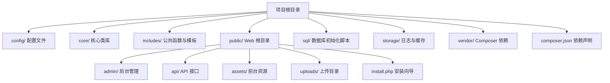
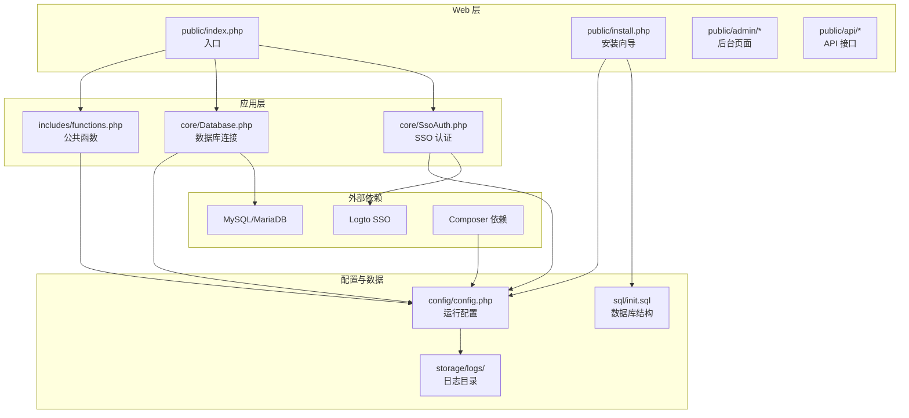
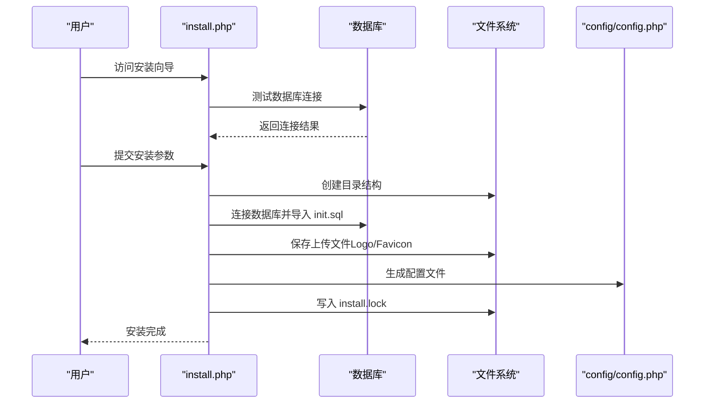
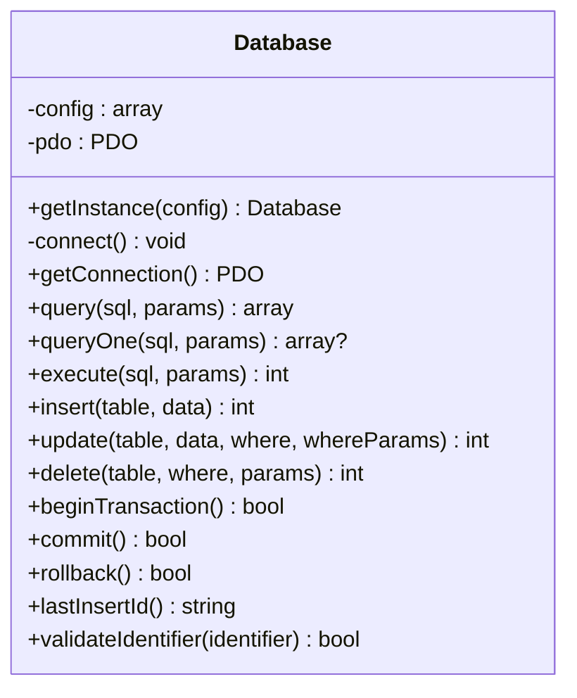
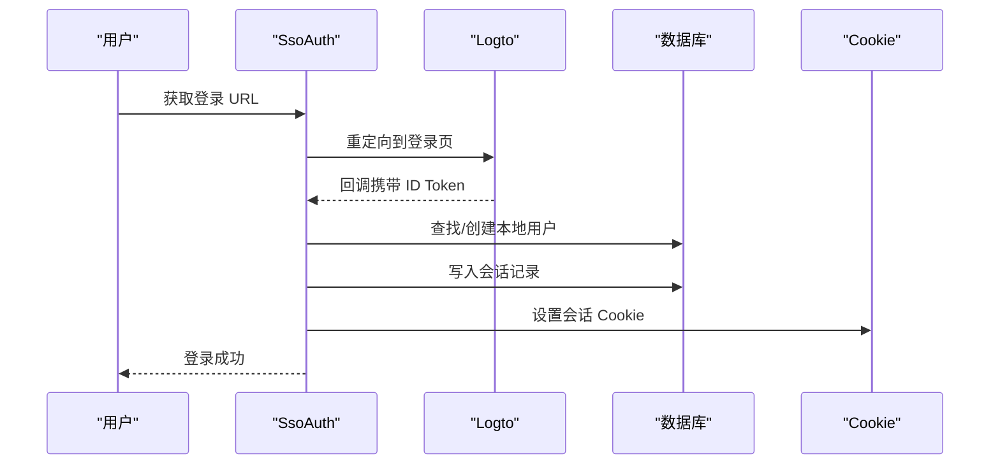
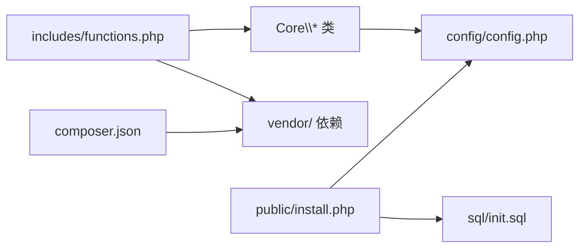

# 快速开始

<cite>
**本文引用的文件**
- [composer.json](file://composer.json)
- [config/config.php](file://config/config.php)
- [public/install.php](file://public/install.php)
- [sql/init.sql](file://sql/init.sql)
- [DEPLOY.md](file://DEPLOY.md)
- [README.md](file://README.md)
- [includes/functions.php](file://includes/functions.php)
- [core/Database.php](file://core/Database.php)
- [core/SsoAuth.php](file://core/SsoAuth.php)
</cite>

## 目录
1. [简介](#简介)
2. [项目结构](#项目结构)
3. [核心组件](#核心组件)
4. [架构总览](#架构总览)
5. [详细组件分析](#详细组件分析)
6. [依赖关系分析](#依赖关系分析)
7. [性能考虑](#性能考虑)
8. [故障排除指南](#故障排除指南)
9. [结论](#结论)
10. [附录](#附录)

## 简介
本指南面向首次部署“灯塔DNS拦截响应平台”的用户，帮助你在最短时间内完成环境准备、安装部署、配置与验证。平台基于 PHP 8.0+、MySQL/MariaDB，采用 Composer 管理依赖，支持 Logto SSO 单点登录，并内置完善的日志、安全与伪静态配置。

## 项目结构
项目采用“核心类库 + 公共函数 + Web 根目录”的组织方式，便于前后端分离与维护。

图表来源
- [README.md:25-68](file://README.md#L25-L68)

章节来源
- [README.md:25-68](file://README.md#L25-L68)

## 核心组件
- 安装向导：自动检测环境、连接数据库、导入表结构、生成配置文件、创建安装锁。
- 数据库类：统一 PDO 连接、参数绑定、事务、SQL 注入防护。
- SSO 认证：集成 Logto SDK，支持登录、回调、会话、登出与域名白名单校验。
- 公共函数库：输入清理、CSRF 令牌、文件上传、JSON 响应、IP 检测等。
- 配置文件：集中管理数据库、站点、上传、会话、安全、日志、SSO 等配置。

章节来源
- [public/install.php:1-120](file://public/install.php#L1-L120)
- [core/Database.php:13-47](file://core/Database.php#L13-L47)
- [core/SsoAuth.php:10-39](file://core/SsoAuth.php#L10-L39)
- [includes/functions.php:17-41](file://includes/functions.php#L17-L41)
- [config/config.php:15-151](file://config/config.php#L15-L151)

## 架构总览
系统采用“安装向导 + 配置文件 + 核心类库 + Web 入口”的分层架构，安装向导负责一次性初始化，后续通过配置文件驱动运行时行为。

图表来源
- [README.md:25-68](file://README.md#L25-L68)
- [public/install.php:103-409](file://public/install.php#L103-L409)
- [core/Database.php:53-122](file://core/Database.php#L53-L122)
- [core/SsoAuth.php:19-61](file://core/SsoAuth.php#L19-L61)

## 详细组件分析

### 环境与前置条件
- PHP 版本：≥ 8.0（推荐 8.1+）
- 数据库：MySQL/MariaDB ≥ 5.7（推荐 8.0+）
- Web 服务器：Nginx/Apache（推荐 Nginx）
- 操作系统：Linux/Windows（推荐 Linux）

必须安装的 PHP 扩展：
- pdo, pdo_mysql, json, curl, mbstring, openssl, fileinfo, session

必要函数（Composer 安装依赖时）：
- putenv, getenv, proc_open, proc_close, shell_exec, popen, pcntl_signal

章节来源
- [DEPLOY.md:18-101](file://DEPLOY.md#L18-L101)
- [README.md:72-101](file://README.md#L72-L101)
- [composer.json:7-16](file://composer.json#L7-L16)

### 安装与部署步骤
1) 安装 Composer 依赖
- 进入项目根目录，执行安装命令（生产环境建议关闭开发依赖与优化自动加载）。

2) 配置 Web 服务器
- 将 Web 根目录指向 public/。
- Nginx：启用 try_files 将请求转发到 index.php。
- Apache：在 public/ 目录创建 .htaccess，启用重写并禁止访问敏感目录。

3) 设置目录权限
- 确保 storage/ 与 public/uploads/ 具备写权限（755/775）。

4) 运行安装向导
- 访问 http://your-domain.com/install.php，按向导填写数据库、SSO、站点信息，完成后自动生成 config/config.php 并创建安装锁。

5) 首次运行验证
- 访问后台首页，确认可正常登录；若启用 SSO，按 SSO 集成指引完成回调与登出重定向配置。

章节来源
- [README.md:104-147](file://README.md#L104-L147)
- [DEPLOY.md:104-194](file://DEPLOY.md#L104-L194)
- [public/install.php:38-411](file://public/install.php#L38-L411)

### 基本配置选项
- 数据库连接：host/port/dbname/user/password/prefix/charset/collation/options
- 站点配置：name/description/logo_path/contact_email/admin_url/timezone/admin_allowed_domains/cdn_local
- 文件上传：max_size/max_image_size/max_video_size/allowed_*_types/chat_upload_dir/evidence_upload_dir
- 会话配置：lifetime/cookie_name/cookie_path/cookie_domain/cookie_secure/cookie_httponly/cookie_samesite
- 安全配置：csrf_enabled/csrf_token_name/csrf_token_expire/headers（CSP、X-Frame-Options、X-Content-Type-Options、Referrer-Policy、Permissions-Policy）
- 日志配置：enabled/log_dir/log_level/max_log_days
- 调试模式：enabled/allowed_ips/log_dir/log_queries/log_auth/log_api/log_errors/max_file_size/max_files
- Logto SSO：enabled/endpoint/appId/appSecret/redirectUri/postLogoutUri/scopes/autoCreateUser/defaultRole

章节来源
- [config/config.php:15-151](file://config/config.php#L15-L151)

### 安装向导工作流
安装向导通过 AJAX 分步执行，包含数据库连接测试、SQL 导入、文件上传（Logo/Favicon）、生成配置文件、创建安装锁等步骤。安装完成后锁定再次执行安装。

图表来源
- [public/install.php:50-409](file://public/install.php#L50-L409)
- [sql/init.sql:1-275](file://sql/init.sql#L1-L275)

章节来源
- [public/install.php:50-409](file://public/install.php#L50-L409)

### 数据库连接与安全
- 单例模式的 Database 类负责建立 PDO 连接，使用配置文件中的 options，启用严格错误模式与非模拟预处理。
- 连接前对数据库凭据进行校验，防止空凭据连接。
- 提供 query/queryOne/execute 与 insert/update/delete 等封装，自动绑定参数类型，防止 SQL 注入。
- 支持 SSL/TLS 连接配置（CA 证书与可选证书验证）。

图表来源
- [core/Database.php:13-400](file://core/Database.php#L13-L400)

章节来源
- [core/Database.php:53-122](file://core/Database.php#L53-L122)
- [core/Database.php:144-181](file://core/Database.php#L144-L181)
- [core/Database.php:211-309](file://core/Database.php#L211-L309)

### SSO 认证与会话
- SsoAuth 类集成 Logto SDK，支持登录 URL 生成、回调处理、用户查找/创建、本地会话创建与登出。
- 会话持久化到 sessions 表，结合 Cookie 与 User-Agent 校验，支持 SSO 标记。
- 后台域名白名单校验，使用 HTTP_HOST 严格格式验证，fail-safe 策略拒绝非白名单访问。

图表来源
- [core/SsoAuth.php:74-167](file://core/SsoAuth.php#L74-L167)
- [core/SsoAuth.php:288-350](file://core/SsoAuth.php#L288-L350)

章节来源
- [core/SsoAuth.php:19-61](file://core/SsoAuth.php#L19-L61)
- [core/SsoAuth.php:480-503](file://core/SsoAuth.php#L480-L503)

### 公共函数与安全工具
- 自动加载：PSR-4 命名空间与路径映射，防止路径遍历。
- 调试初始化：根据配置启用调试日志与请求生命周期记录。
- 输入清理：多层过滤，输出时再进行转义（遵循“输出时转义”原则）。
- CSRF 令牌：兼容包装函数，内部委托 Core\CsrfProtection。
- 文件上传：MIME 类型二次验证、内容验证、目录白名单、安全命名与日期目录组织。
- IP 检测：优先级检测 CDN 代理头，统一获取真实 IP。

章节来源
- [includes/functions.php:17-41](file://includes/functions.php#L17-L41)
- [includes/functions.php:50-84](file://includes/functions.php#L50-L84)
- [includes/functions.php:97-133](file://includes/functions.php#L97-L133)
- [includes/functions.php:146-177](file://includes/functions.php#L146-L177)
- [includes/functions.php:529-681](file://includes/functions.php#L529-L681)
- [includes/functions.php:414-440](file://includes/functions.php#L414-L440)

### 首次运行验证清单
- Web 根目录指向 public/，伪静态生效，访问后台首页正常。
- 数据库连接正常，安装向导生成的配置文件存在且权限正确。
- 若启用 SSO：Logto 应用回调与登出重定向配置正确，登录回调页面可访问。
- 日志目录可写，调试模式关闭（生产环境）。
- 文件上传目录可写，上传功能正常。

章节来源
- [README.md:286-308](file://README.md#L286-L308)

## 依赖关系分析
- composer.json 声明 PHP 版本与扩展依赖，以及 logto/sdk 依赖。
- includes/functions.php 引入 Composer 自动加载，确保 Logto SDK 可用。
- 安装向导在执行过程中直接连接数据库并导入 SQL，同时生成 config/config.php。
- 核心类库通过配置文件读取数据库与 SSO 参数，形成运行时依赖闭环。

图表来源
- [composer.json:7-16](file://composer.json#L7-L16)
- [includes/functions.php:17-20](file://includes/functions.php#L17-L20)
- [public/install.php:214-297](file://public/install.php#L214-L297)
- [config/config.php:15-151](file://config/config.php#L15-L151)

章节来源
- [composer.json:7-16](file://composer.json#L7-L16)
- [includes/functions.php:17-20](file://includes/functions.php#L17-L20)
- [public/install.php:214-297](file://public/install.php#L214-L297)

## 性能考虑
- 使用 PDO 预处理语句与非模拟预处理，减少 SQL 注入风险并提升执行效率。
- 事务封装与参数绑定，降低错误与重复开销。
- 上传文件采用日期目录组织，避免单目录文件过多导致性能下降。
- 建议生产环境启用 Nginx + PHP-FPM，合理配置 worker 数量与内存上限。

## 故障排除指南
- 安装后访问 404
  - 检查 Web 根目录是否指向 public/。
  - 检查伪静态规则是否正确，Apache 需启用 mod_rewrite。
- SSO 登录失败
  - 确认 Logto 应用回调 URL 与系统配置一致。
  - 检查 logto.endpoint、appId、appSecret 是否正确。
  - 确认服务器可访问 Logto 服务。
- 文件上传失败
  - 检查 public/uploads/ 权限与 php.ini 的 upload_max_filesize/post_max_size。
  - 确认未禁用文件操作相关函数。
- 数据库连接失败
  - 检查 DB_USER/DB_PASSWORD 环境变量或安装向导配置。
  - 确认 MySQL/MariaDB 服务运行与网络可达。

章节来源
- [README.md:286-308](file://README.md#L286-L308)
- [DEPLOY.md:55-101](file://DEPLOY.md#L55-L101)

## 结论
通过本快速开始指南，你可以在数小时内完成环境准备、安装部署与基本验证。建议在生产环境关闭调试模式、完善安全响应头与域名白名单，并定期备份数据库与日志。

## 附录

### Docker 部署方案（概念性说明）
- 使用 Nginx + PHP-FPM + MySQL/MariaDB 的容器组合。
- 将项目代码挂载到 PHP 容器的 /var/www/html/public/，并设置伪静态。
- 将 storage/ 与 public/uploads/ 映射为持久卷。
- 通过环境变量传递 DB_USER/DB_PASSWORD 与 LOGTO_* 配置。
- 通过 Composer 安装依赖后，运行安装向导生成配置文件。

[本节为概念性说明，不直接对应具体源文件]

### 传统服务器部署要点
- 将 Web 根目录指向 public/。
- 配置 Nginx/Apache 伪静态，禁止访问 core/config/storage/sql 目录。
- 设置目录权限与 SELinux/AppArmor（如启用）。
- 安装 Composer 依赖，确保必要函数未被禁用。
- 运行安装向导，生成 config/config.php 并创建 install.lock。

章节来源
- [DEPLOY.md:136-194](file://DEPLOY.md#L136-L194)