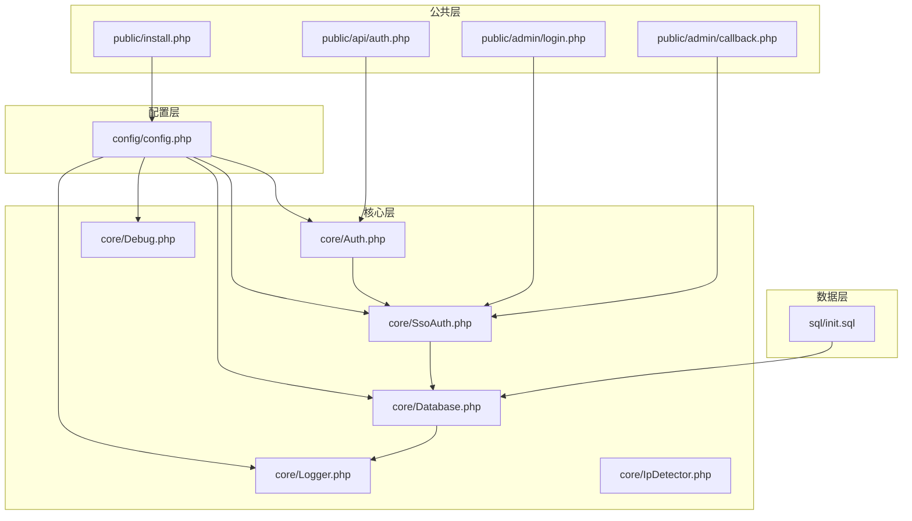
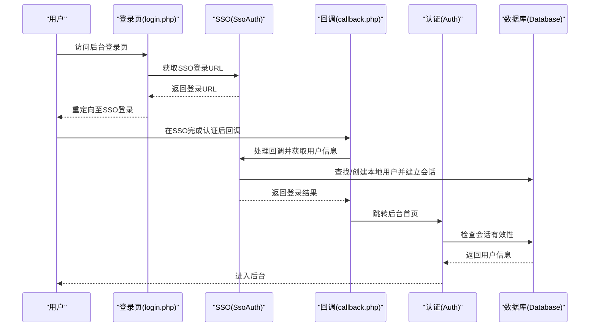
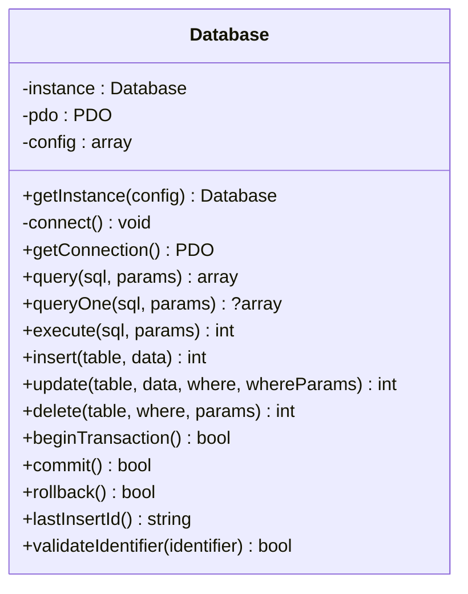
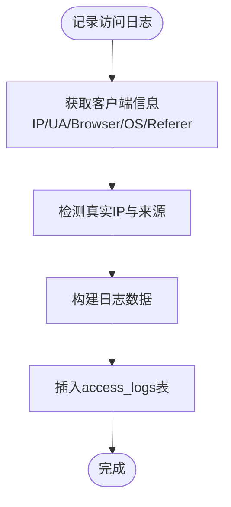
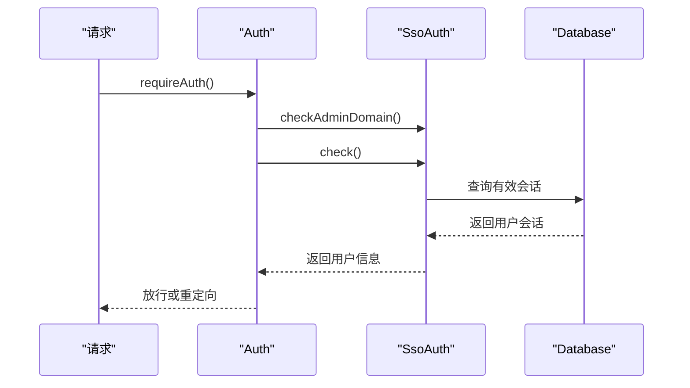
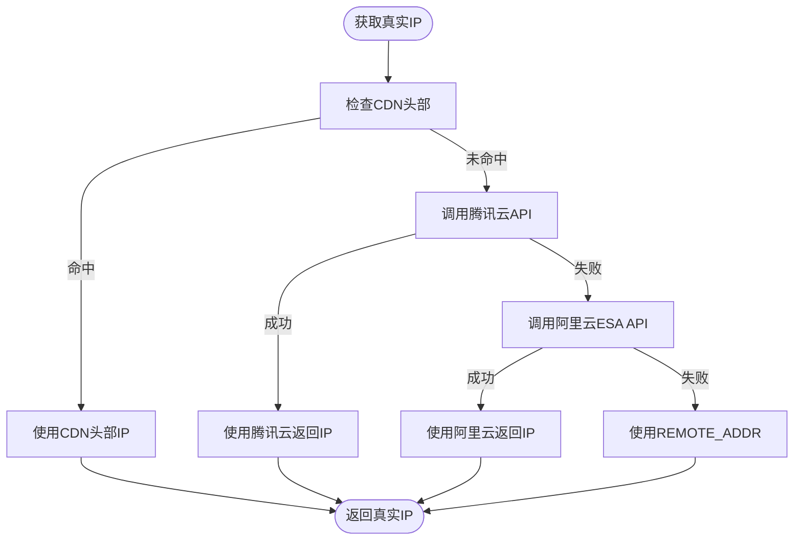
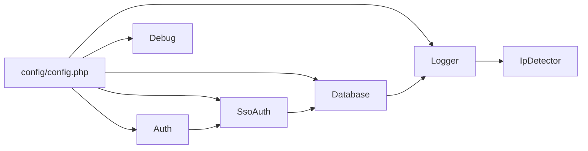

# 故障排除

<cite>
**本文引用的文件**
- [config.php](file://config/config.php)
- [Database.php](file://core/Database.php)
- [Logger.php](file://core/Logger.php)
- [Auth.php](file://core/Auth.php)
- [SsoAuth.php](file://core/SsoAuth.php)
- [IpDetector.php](file://core/IpDetector.php)
- [Debug.php](file://core/Debug.php)
- [install.php](file://public/install.php)
- [DEPLOY.md](file://DEPLOY.md)
- [login.php](file://public/admin/login.php)
- [callback.php](file://public/admin/callback.php)
- [auth.php](file://public/api/auth.php)
- [init.sql](file://sql/init.sql)
</cite>

## 目录
1. [简介](#简介)
2. [项目结构](#项目结构)
3. [核心组件](#核心组件)
4. [架构总览](#架构总览)
5. [详细组件分析](#详细组件分析)
6. [依赖关系分析](#依赖关系分析)
7. [性能考虑](#性能考虑)
8. [故障排除指南](#故障排除指南)
9. [结论](#结论)
10. [附录](#附录)

## 简介
本指南面向DNS拦截响应平台的运维与开发人员，聚焦于安装部署、配置校验、数据库连接、日志分析、性能排查、SSO集成、CDN环境问题、系统监控与预警、以及紧急应急处置与数据恢复。文档基于代码库的实际实现，提供可操作的排障步骤与定位方法，并辅以可视化图示帮助快速定位问题。

## 项目结构
项目采用典型的PHP MVC分层与模块化设计：
- 配置层：config/config.php集中管理数据库、站点、上传、会话、安全、日志、调试、SSO等配置
- 核心层：core/ 提供数据库连接、日志、认证、SSO、IP检测、调试等基础能力
- 公共层：public/ 提供入口页面、API接口、静态资源与上传目录
- 数据层：sql/init.sql 定义数据库表结构
- 部署与依赖：DEPLOY.md 描述环境与依赖要求；composer.json/composer.lock 管理第三方依赖

图表来源
- [config.php:15-152](file://config/config.php#L15-L152)
- [Database.php:13-46](file://core/Database.php#L13-L46)
- [Logger.php:14-36](file://core/Logger.php#L14-L36)
- [Auth.php:11-32](file://core/Auth.php#L11-L32)
- [SsoAuth.php:10-39](file://core/SsoAuth.php#L10-L39)
- [IpDetector.php:13-23](file://core/IpDetector.php#L13-L23)
- [Debug.php:17-51](file://core/Debug.php#L17-L51)
- [install.php:1-40](file://public/install.php#L1-L40)
- [login.php:1-40](file://public/admin/login.php#L1-L40)
- [callback.php:1-30](file://public/admin/callback.php#L1-L30)
- [auth.php:1-30](file://public/api/auth.php#L1-L30)
- [init.sql:1-40](file://sql/init.sql#L1-L40)

章节来源
- [config.php:15-152](file://config/config.php#L15-L152)
- [Database.php:13-46](file://core/Database.php#L13-L46)
- [Logger.php:14-36](file://core/Logger.php#L14-L36)
- [Auth.php:11-32](file://core/Auth.php#L11-L32)
- [SsoAuth.php:10-39](file://core/SsoAuth.php#L10-L39)
- [IpDetector.php:13-23](file://core/IpDetector.php#L13-L23)
- [Debug.php:17-51](file://core/Debug.php#L17-L51)
- [install.php:1-40](file://public/install.php#L1-L40)
- [login.php:1-40](file://public/admin/login.php#L1-L40)
- [callback.php:1-30](file://public/admin/callback.php#L1-L30)
- [auth.php:1-30](file://public/api/auth.php#L1-L30)
- [init.sql:1-40](file://sql/init.sql#L1-L40)

## 核心组件
- 数据库连接：单例模式，支持PDO配置、SSL/TLS、参数绑定、SQL注入防护、调试日志
- 日志系统：访问日志记录、查询与筛选、统计与清理、HMAC完整性保护
- 认证与权限：基于SSO的管理员认证、会话管理、角色与模块权限、域名白名单
- SSO集成：Logto SDK封装、登录回调处理、用户同步与会话创建
- IP检测：多层CDN穿透检测、地理信息查询、SSRF防护与DNS绑定
- 调试系统：分类日志、敏感信息脱敏、请求统计、文件轮转与清理
- 安装向导：数据库连接测试、SQL导入、配置生成、安装锁创建

章节来源
- [Database.php:13-46](file://core/Database.php#L13-L46)
- [Logger.php:14-36](file://core/Logger.php#L14-L36)
- [Auth.php:11-32](file://core/Auth.php#L11-L32)
- [SsoAuth.php:10-39](file://core/SsoAuth.php#L10-L39)
- [IpDetector.php:13-23](file://core/IpDetector.php#L13-L23)
- [Debug.php:17-51](file://core/Debug.php#L17-L51)
- [install.php:1-40](file://public/install.php#L1-L40)

## 架构总览
系统采用“配置驱动 + 核心服务 + 入口页面/API”的分层架构。SSO作为认证入口，数据库承载业务数据，日志系统贯穿请求生命周期，调试系统在开发/测试阶段提供详尽的运行时信息。

图表来源
- [login.php:45-58](file://public/admin/login.php#L45-L58)
- [callback.php:40-52](file://public/admin/callback.php#L40-L52)
- [SsoAuth.php:99-167](file://core/SsoAuth.php#L99-L167)
- [Auth.php:55-94](file://core/Auth.php#L55-L94)
- [Database.php:367-396](file://core/Database.php#L367-L396)

## 详细组件分析

### 数据库组件（Database）
- 单例模式，延迟连接，支持SSL/TLS、PDO选项转换、参数绑定自动类型识别
- SQL注入防护：标识符白名单校验、WHERE条件字符过滤、命名参数转位置参数
- 调试日志：连接耗时、查询统计、事务记录
- 事务支持：begin/commit/rollback

图表来源
- [Database.php:13-46](file://core/Database.php#L13-L46)
- [Database.php:144-181](file://core/Database.php#L144-L181)
- [Database.php:211-227](file://core/Database.php#L211-L227)
- [Database.php:232-274](file://core/Database.php#L232-L274)
- [Database.php:279-309](file://core/Database.php#L279-L309)

章节来源
- [Database.php:53-122](file://core/Database.php#L53-L122)
- [Database.php:144-181](file://core/Database.php#L144-L181)
- [Database.php:211-274](file://core/Database.php#L211-L274)
- [Database.php:314-345](file://core/Database.php#L314-L345)

### 日志组件（Logger）
- 访问日志记录：真实IP、浏览器、操作系统、请求URL、Referer、检测来源
- 查询与筛选：IP、域名ID、浏览器、系统、日期范围、关键词搜索
- 统计与趋势：访问总量、今日/周/月统计、热门URL排行、按天趋势
- 清理策略：按时间清理过期日志
- 完整性保护：HMAC签名生成与验证

图表来源
- [Logger.php:48-120](file://core/Logger.php#L48-L120)
- [Logger.php:95-113](file://core/Logger.php#L95-L113)

章节来源
- [Logger.php:48-120](file://core/Logger.php#L48-L120)
- [Logger.php:144-249](file://core/Logger.php#L144-L249)
- [Logger.php:279-335](file://core/Logger.php#L279-L335)
- [Logger.php:343-364](file://core/Logger.php#L343-L364)
- [Logger.php:372-392](file://core/Logger.php#L372-L392)
- [Logger.php:402-413](file://core/Logger.php#L402-L413)

### 认证与权限（Auth/SsoAuth）
- Auth：SSO启用检测、域名白名单检查、会话验证、角色与模块权限、权限模板
- SsoAuth：登录URL生成、回调处理、用户查找/创建、本地会话建立、会话校验、登出

图表来源
- [Auth.php:79-94](file://core/Auth.php#L79-L94)
- [Auth.php:103-131](file://core/Auth.php#L103-L131)
- [Auth.php:37-62](file://core/Auth.php#L37-L62)
- [SsoAuth.php:462-473](file://core/SsoAuth.php#L462-L473)
- [SsoAuth.php:355-396](file://core/SsoAuth.php#L355-L396)

章节来源
- [Auth.php:37-62](file://core/Auth.php#L37-L62)
- [Auth.php:79-94](file://core/Auth.php#L79-L94)
- [Auth.php:103-131](file://core/Auth.php#L103-L131)
- [Auth.php:138-195](file://core/Auth.php#L138-L195)
- [SsoAuth.php:99-167](file://core/SsoAuth.php#L99-L167)
- [SsoAuth.php:172-264](file://core/SsoAuth.php#L172-L264)
- [SsoAuth.php:288-350](file://core/SsoAuth.php#L288-L350)
- [SsoAuth.php:355-396](file://core/SsoAuth.php#L355-L396)
- [SsoAuth.php:401-423](file://core/SsoAuth.php#L401-L423)

### IP检测（IpDetector）
- 多层CDN穿透：EO、CF、Akamai、腾讯云、Nginx、X-Forwarded-For
- 回源检测：腾讯云ESA、阿里云ESA API
- 地理信息：HTTPS查询ip-api.com，APCu/文件缓存，内网IP防护
- SSRF防护：DNS解析验证、协议白名单、CURLOPT_RESOLVE绑定

图表来源
- [IpDetector.php:31-47](file://core/IpDetector.php#L31-L47)
- [IpDetector.php:62-121](file://core/IpDetector.php#L62-L121)
- [IpDetector.php:131-167](file://core/IpDetector.php#L131-L167)
- [IpDetector.php:177-215](file://core/IpDetector.php#L177-L215)

章节来源
- [IpDetector.php:31-47](file://core/IpDetector.php#L31-L47)
- [IpDetector.php:62-121](file://core/IpDetector.php#L62-L121)
- [IpDetector.php:131-167](file://core/IpDetector.php#L131-L167)
- [IpDetector.php:177-215](file://core/IpDetector.php#L177-L215)
- [IpDetector.php:226-316](file://core/IpDetector.php#L226-L316)
- [IpDetector.php:577-649](file://core/IpDetector.php#L577-L649)

### 调试系统（Debug）
- 分类日志：sql/auth/api/error/system/request
- 敏感信息脱敏：密码、令牌、密钥等关键字脱敏
- 请求统计：查询次数、总耗时、峰值内存
- 文件轮转与清理：按大小轮转、按数量清理

章节来源
- [Debug.php:92-128](file://core/Debug.php#L92-L128)
- [Debug.php:138-155](file://core/Debug.php#L138-L155)
- [Debug.php:246-272](file://core/Debug.php#L246-L272)
- [Debug.php:321-334](file://core/Debug.php#L321-L334)

### 安装向导（install.php）
- 数据库连接测试：DSN白名单、错误分类提示
- SQL导入：表前缀替换、参数化插入、忽略已存在/不存在错误
- 配置生成：SSO配置、站点配置、上传配置、会话配置、调试配置
- 安全措施：安装锁、CSRF保护、上传文件MIME校验与SVG净化

章节来源
- [install.php:52-100](file://public/install.php#L52-L100)
- [install.php:214-297](file://public/install.php#L214-L297)
- [install.php:359-408](file://public/install.php#L359-L408)
- [install.php:416-571](file://public/install.php#L416-L571)

## 依赖关系分析
- 配置驱动：config/config.php为所有核心组件提供配置
- 组件耦合：Logger依赖Database与IpDetector；Auth依赖SsoAuth；SsoAuth依赖Database
- 外部依赖：Logto SDK（SSO）、PDO扩展、cURL、mbstring、openssl、fileinfo、session

图表来源
- [config.php:15-152](file://config/config.php#L15-L152)
- [Database.php:13-46](file://core/Database.php#L13-L46)
- [Logger.php:14-36](file://core/Logger.php#L14-L36)
- [Auth.php:11-32](file://core/Auth.php#L11-L32)
- [SsoAuth.php:10-39](file://core/SsoAuth.php#L10-L39)
- [IpDetector.php:13-23](file://core/IpDetector.php#L13-L23)
- [Debug.php:17-51](file://core/Debug.php#L17-L51)

章节来源
- [config.php:15-152](file://config/config.php#L15-L152)
- [Database.php:13-46](file://core/Database.php#L13-L46)
- [Logger.php:14-36](file://core/Logger.php#L14-L36)
- [Auth.php:11-32](file://core/Auth.php#L11-L32)
- [SsoAuth.php:10-39](file://core/SsoAuth.php#L10-L39)
- [IpDetector.php:13-23](file://core/IpDetector.php#L13-L23)
- [Debug.php:17-51](file://core/Debug.php#L17-L51)

## 性能考虑
- 数据库层
  - 使用参数绑定与位置参数，避免字符串拼接引发的性能与安全问题
  - 合理索引：access_logs的ip、domain_id、created_at、country等字段
  - 事务批处理：批量导入SQL时关闭外键检查，完成后恢复
- 日志层
  - 访问日志写入采用异步/队列化更佳（当前为同步写入）
  - 定期清理过期日志，避免表膨胀
- SSO层
  - 回调处理与用户同步应尽量减少数据库往返
  - 会话校验时严格User-Agent比对，避免跨会话劫持
- CDN层
  - 确保CDN头部透传与真实IP检测链路正确
  - 地理信息查询使用缓存，避免频繁HTTP请求

章节来源
- [Database.php:189-206](file://core/Database.php#L189-L206)
- [Logger.php:402-413](file://core/Logger.php#L402-L413)
- [SsoAuth.php:288-350](file://core/SsoAuth.php#L288-L350)
- [IpDetector.php:226-316](file://core/IpDetector.php#L226-L316)

## 故障排除指南

### 一、安装部署问题
- 症状：访问安装向导报错或无法连接数据库
- 排查步骤
  - 检查PHP扩展：pdo、pdo_mysql、json、curl、mbstring、openssl、fileinfo、session
  - 检查Composer依赖：确保Logto SDK可用
  - 检查目录权限：storage、storage/logs、public/uploads及其子目录
  - 检查伪静态：Nginx/Apache重写规则是否生效
  - 使用安装向导的“测试数据库连接”功能，确认主机、端口、数据库名、用户、密码
- 常见错误与修复
  - “数据库不存在”：先创建数据库再安装
  - “Access denied”：核对用户名/密码与权限
  - “Connection refused”：确认MySQL服务已启动且监听地址可达
- 参考
  - [DEPLOY.md:29-101](file://DEPLOY.md#L29-L101)
  - [install.php:52-100](file://public/install.php#L52-L100)
  - [install.php:195-212](file://public/install.php#L195-L212)

章节来源
- [DEPLOY.md:29-101](file://DEPLOY.md#L29-L101)
- [install.php:52-100](file://public/install.php#L52-L100)
- [install.php:195-212](file://public/install.php#L195-L212)

### 二、配置错误
- 症状：后台登录页显示“SSO未启用”或“域名白名单拒绝”
- 排查步骤
  - 检查config/config.php中logto.enabled与必要字段是否配置
  - 检查admin_allowed_domains是否包含当前访问域名
  - 检查SSO回调地址redirectUri与postLogoutUri是否正确
- 修复建议
  - 在安装向导中完成SSO配置或手动在config.php中填写endpoint、appId、appSecret、redirectUri、postLogoutUri
  - 若启用域名白名单，确保白名单数组包含当前后台域名
- 参考
  - [config.php:139-149](file://config/config.php#L139-L149)
  - [login.php:42-58](file://public/admin/login.php#L42-L58)
  - [Auth.php:103-131](file://core/Auth.php#L103-L131)
  - [SsoAuth.php:480-503](file://core/SsoAuth.php#L480-L503)

章节来源
- [config.php:139-149](file://config/config.php#L139-L149)
- [login.php:42-58](file://public/admin/login.php#L42-L58)
- [Auth.php:103-131](file://core/Auth.php#L103-L131)
- [SsoAuth.php:480-503](file://core/SsoAuth.php#L480-L503)

### 三、数据库连接问题
- 症状：安装失败、登录失败、API报错
- 排查步骤
  - 使用Database::getInstance()连接，观察是否抛出异常
  - 检查config/config.php中的host/port/dbname/user/password/charset/collation/options
  - 如启用SSL/TLS，检查ca_file与verify_server_cert配置
  - 在调试模式下查看sql分类日志，确认连接耗时与错误信息
- 修复建议
  - 使用安装向导的“测试数据库连接”功能先行验证
  - 确认数据库用户具备相应权限与网络访问权限
  - 如使用远程数据库，确保防火墙放行端口
- 参考
  - [Database.php:53-122](file://core/Database.php#L53-L122)
  - [Database.php:104-121](file://core/Database.php#L104-L121)
  - [config.php:23-38](file://config/config.php#L23-L38)
  - [Debug.php:138-163](file://core/Debug.php#L138-L163)

章节来源
- [Database.php:53-122](file://core/Database.php#L53-L122)
- [Database.php:104-121](file://core/Database.php#L104-L121)
- [config.php:23-38](file://config/config.php#L23-L38)
- [Debug.php:138-163](file://core/Debug.php#L138-L163)

### 四、日志分析方法
- 系统日志
  - 位置：storage/logs/（按日期分文件）
  - 分类：sql、auth、api、error、system、request
  - 查看要点：连接耗时、查询次数、峰值内存、错误堆栈
- 访问日志
  - 表：access_logs
  - 查询：按IP、域名ID、浏览器、系统、日期范围、关键词搜索
  - 统计：访问总量、今日/周/月统计、热门URL排行、按天趋势
  - 清理：定期清理90天前日志
- 错误日志
  - Logger内部错误：storage/logs/logger_error.log
  - 调试日志：storage/logs/debug/（按日期与分类分文件）
- 参考
  - [Logger.php:144-249](file://core/Logger.php#L144-L249)
  - [Logger.php:279-335](file://core/Logger.php#L279-L335)
  - [Logger.php:343-364](file://core/Logger.php#L343-L364)
  - [Logger.php:402-413](file://core/Logger.php#L402-L413)
  - [Logger.php:420-432](file://core/Logger.php#L420-L432)
  - [Debug.php:246-272](file://core/Debug.php#L246-L272)

章节来源
- [Logger.php:144-249](file://core/Logger.php#L144-L249)
- [Logger.php:279-335](file://core/Logger.php#L279-L335)
- [Logger.php:343-364](file://core/Logger.php#L343-L364)
- [Logger.php:402-413](file://core/Logger.php#L402-L413)
- [Logger.php:420-432](file://core/Logger.php#L420-L432)
- [Debug.php:246-272](file://core/Debug.php#L246-L272)

### 五、性能问题排查
- 慢查询分析
  - 开启调试模式，查看sql分类日志中的耗时与参数
  - 使用Logger::getTopUrls()与getAccessTrend()定位热点
- 内存使用监控
  - Debug::getStats()输出峰值内存、查询次数、总耗时
- 并发处理优化
  - 为/check接口添加速率限制（建议：滑动窗口或固定窗口）
  - 优化IP地理信息查询缓存策略
- 参考
  - [auth.php:92-96](file://public/api/auth.php#L92-L96)
  - [Debug.php:232-241](file://core/Debug.php#L232-L241)
  - [Logger.php:372-392](file://core/Logger.php#L372-L392)
  - [Logger.php:343-364](file://core/Logger.php#L343-L364)

章节来源
- [auth.php:92-96](file://public/api/auth.php#L92-L96)
- [Debug.php:232-241](file://core/Debug.php#L232-L241)
- [Logger.php:372-392](file://core/Logger.php#L372-L392)
- [Logger.php:343-364](file://core/Logger.php#L343-L364)

### 六、SSO集成问题
- 认证失败
  - 检查SSO是否启用、endpoint/appId/appSecret是否正确
  - 查看callback.php的错误信息（通过session传递）
  - 核对redirectUri与postLogoutUri是否与SSO配置一致
- 权限异常
  - 检查用户角色与模块权限模板，确认权限是否符合预期
  - 若使用自定义permissions，确认JSON格式正确
- 用户同步问题
  - 检查autoCreateUser与defaultRole配置
  - 确认数据库admin_users表结构与字段
- 参考
  - [login.php:45-58](file://public/admin/login.php#L45-L58)
  - [callback.php:40-52](file://public/admin/callback.php#L40-L52)
  - [SsoAuth.php:99-167](file://core/SsoAuth.php#L99-L167)
  - [SsoAuth.php:172-264](file://core/SsoAuth.php#L172-L264)
  - [SsoAuth.php:288-350](file://core/SsoAuth.php#L288-L350)
  - [Auth.php:138-195](file://core/Auth.php#L138-L195)
  - [init.sql:13-31](file://sql/init.sql#L13-L31)

章节来源
- [login.php:45-58](file://public/admin/login.php#L45-L58)
- [callback.php:40-52](file://public/admin/callback.php#L40-L52)
- [SsoAuth.php:99-167](file://core/SsoAuth.php#L99-L167)
- [SsoAuth.php:172-264](file://core/SsoAuth.php#L172-L264)
- [SsoAuth.php:288-350](file://core/SsoAuth.php#L288-L350)
- [Auth.php:138-195](file://core/Auth.php#L138-L195)
- [init.sql:13-31](file://sql/init.sql#L13-L31)

### 七、CDN环境下的特殊问题
- IP识别错误
  - 确认CDN头部透传：X-Forwarded-For、X-Real-IP、CF-Connecting-IP、True-Client-IP、EO-Connecting-IP等
  - 检查IpDetector的检测顺序与可信代理配置
- 缓存问题
  - 确保后台页面不被CDN缓存，或使用无缓存策略
- 负载均衡
  - 确保多节点间会话一致性（当前使用数据库会话，注意Cookie域与路径）
- 参考
  - [IpDetector.php:62-121](file://core/IpDetector.php#L62-L121)
  - [IpDetector.php:131-167](file://core/IpDetector.php#L131-L167)
  - [IpDetector.php:177-215](file://core/IpDetector.php#L177-L215)
  - [config.php:49-51](file://config/config.php#L49-L51)

章节来源
- [IpDetector.php:62-121](file://core/IpDetector.php#L62-L121)
- [IpDetector.php:131-167](file://core/IpDetector.php#L131-L167)
- [IpDetector.php:177-215](file://core/IpDetector.php#L177-L215)
- [config.php:49-51](file://config/config.php#L49-L51)

### 八、系统监控与预警机制
- 建议指标
  - 数据库连接成功率、平均连接耗时、慢查询比例
  - 访问日志写入QPS、错误率、热门URL TopN
  - SSO回调成功率、会话创建耗时
- 建议工具
  - 使用storage/logs与storage/logs/debug进行日志聚合与告警
  - 配置Nginx/Apache访问日志，结合ELK或Prometheus/Grafana
- 参考
  - [Logger.php:144-249](file://core/Logger.php#L144-L249)
  - [Debug.php:218-227](file://core/Debug.php#L218-L227)

章节来源
- [Logger.php:144-249](file://core/Logger.php#L144-L249)
- [Debug.php:218-227](file://core/Debug.php#L218-L227)

### 九、紧急情况下的应急处理与数据恢复
- 应急处理
  - 临时关闭调试模式，避免日志风暴
  - 临时关闭SSO，使用本地会话维持管理
  - 临时放宽域名白名单，保障业务可用
- 数据恢复
  - 备份storage/logs与数据库
  - 使用init.sql重建表结构，注意表前缀与占位符替换
  - 通过数据库备份恢复admin_users与会话数据
- 参考
  - [install.php:214-297](file://public/install.php#L214-L297)
  - [init.sql:1-40](file://sql/init.sql#L1-L40)
  - [config.php:123-133](file://config/config.php#L123-L133)

章节来源
- [install.php:214-297](file://public/install.php#L214-L297)
- [init.sql:1-40](file://sql/init.sql#L1-L40)
- [config.php:123-133](file://config/config.php#L123-L133)

## 结论
本指南基于代码库的实际实现，提供了从安装部署到日常运维的全流程排障方法。通过合理利用调试日志、访问日志与数据库连接监控，结合SSO与CDN场景的专项排查，可快速定位并解决问题。建议在生产环境持续完善监控与预警体系，确保系统稳定运行。

## 附录
- 相关文件清单
  - 配置：config/config.php
  - 核心：core/Database.php、core/Logger.php、core/Auth.php、core/SsoAuth.php、core/IpDetector.php、core/Debug.php
  - 入口：public/admin/login.php、public/admin/callback.php、public/api/auth.php、public/install.php
  - 数据库：sql/init.sql
  - 部署：DEPLOY.md