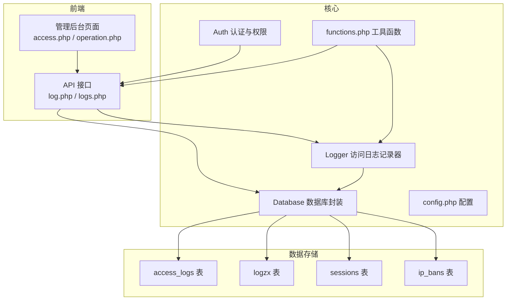
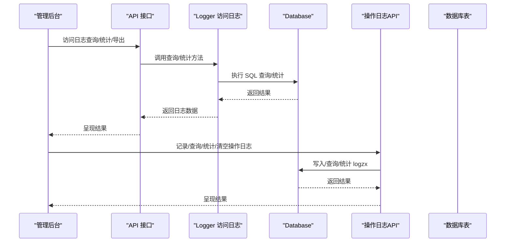
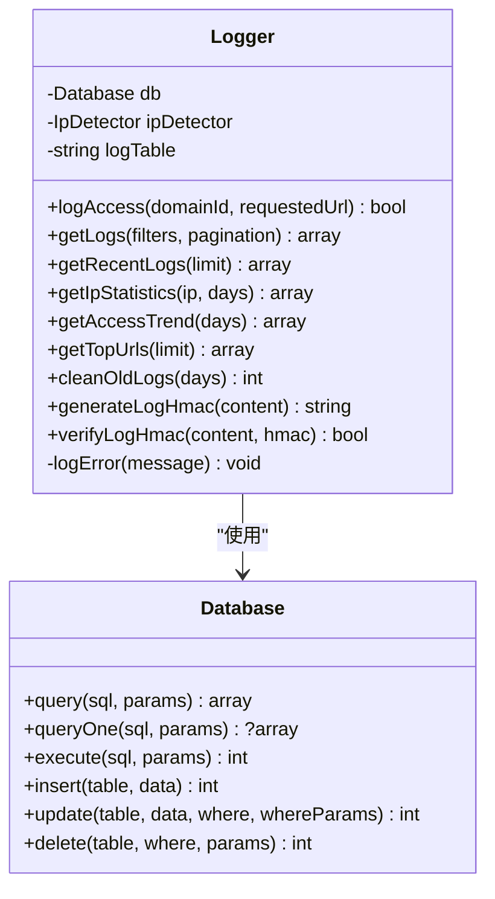
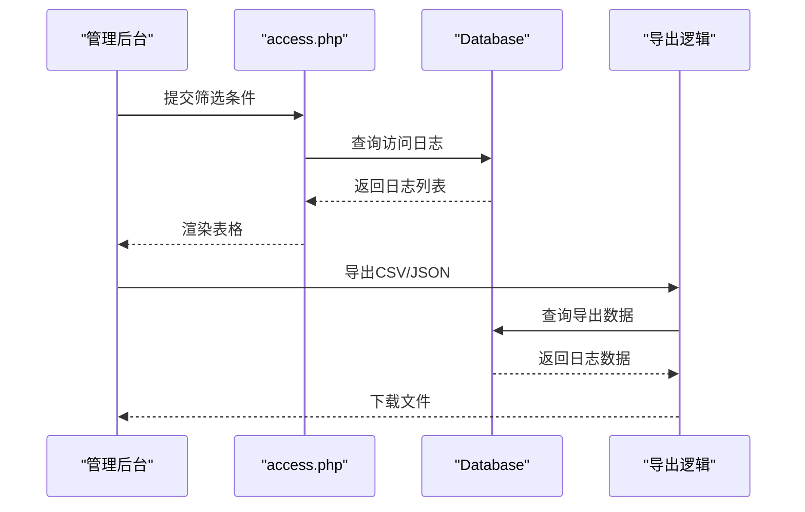
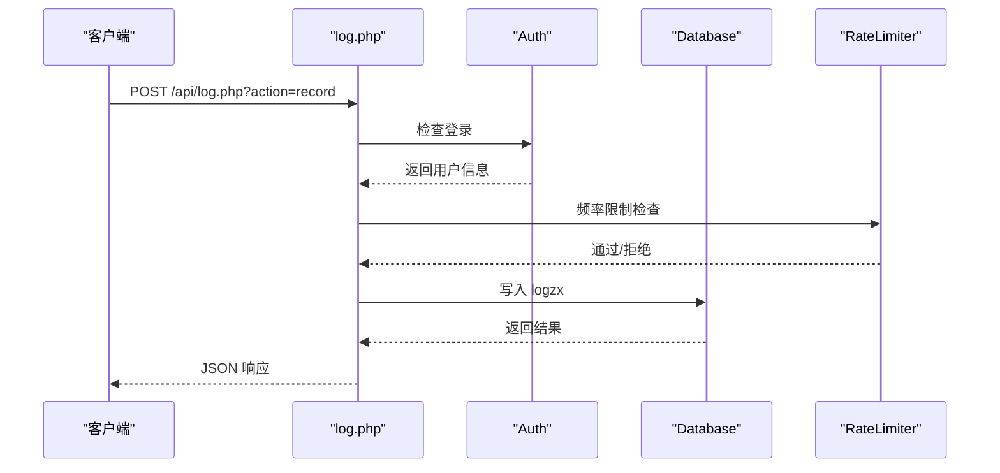
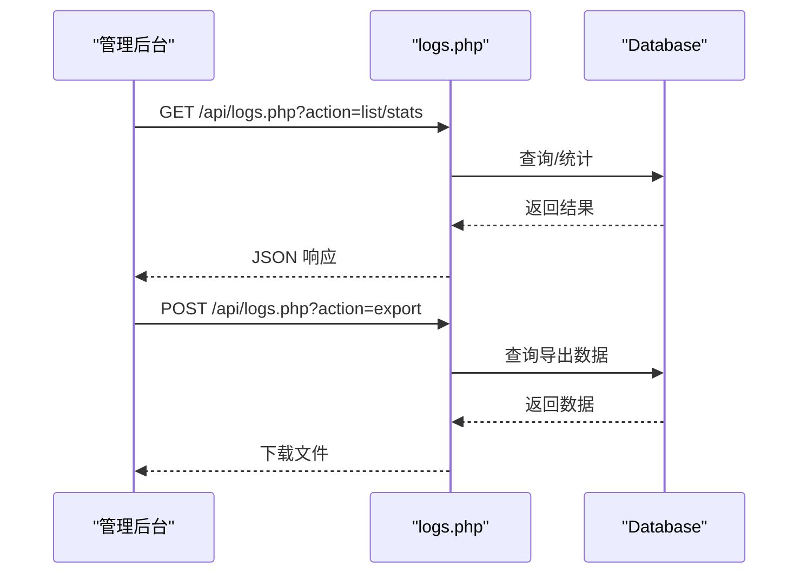
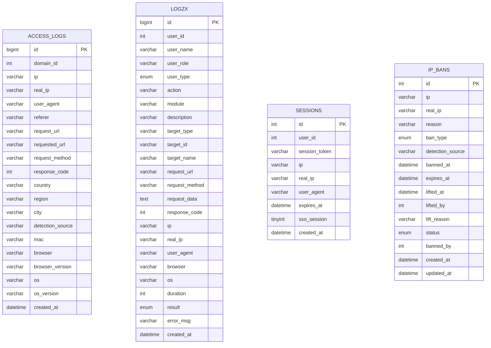
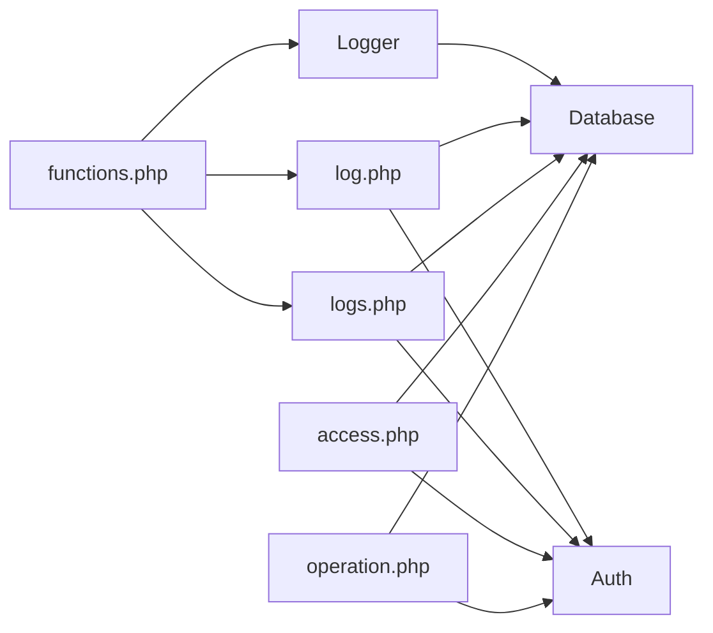

# 日志监控

<cite>
**本文引用的文件**
- [Logger.php](file://core/Logger.php)
- [Database.php](file://core/Database.php)
- [Auth.php](file://core/Auth.php)
- [functions.php](file://includes/functions.php)
- [config.php](file://config/config.php)
- [init.sql](file://sql/init.sql)
- [access.php](file://public/admin/logs/access.php)
- [operation.php](file://public/admin/logs/operation.php)
- [log.php](file://public/api/log.php)
- [logs.php](file://public/api/logs.php)
- [DEPLOY.md](file://DEPLOY.md)
</cite>

## 目录
1. [简介](#简介)
2. [项目结构](#项目结构)
3. [核心组件](#核心组件)
4. [架构总览](#架构总览)
5. [组件详解](#组件详解)
6. [依赖关系分析](#依赖关系分析)
7. [性能考量](#性能考量)
8. [故障排查指南](#故障排查指南)
9. [结论](#结论)
10. [附录](#附录)

## 简介
本系统提供完善的日志监控能力，涵盖访问日志、操作日志与系统日志的采集、存储、查询、统计与导出；支持基于时间、用户、操作类型等维度的筛选与聚合分析；内置审计日志与合规能力，满足等保2.0要求；提供日志轮转、备份与恢复策略建议及性能优化方案。

## 项目结构
系统采用“核心层(Core) + 接口层(API/Admin) + 配置层(Config)”的分层设计，日志相关的核心逻辑集中在 Core 命名空间下的 Logger、Database、Auth 等组件，前端通过 Admin 页面与 API 接口进行交互。

图表来源
- [access.php:1-356](file://public/admin/logs/access.php#L1-L356)
- [operation.php:1-510](file://public/admin/logs/operation.php#L1-L510)
- [log.php:1-454](file://public/api/log.php#L1-L454)
- [logs.php:1-595](file://public/api/logs.php#L1-L595)
- [Logger.php:1-472](file://core/Logger.php#L1-L472)
- [Database.php:1-400](file://core/Database.php#L1-L400)
- [Auth.php:1-272](file://core/Auth.php#L1-L272)
- [functions.php:1-998](file://includes/functions.php#L1-L998)
- [config.php:1-152](file://config/config.php#L1-L152)
- [init.sql:90-275](file://sql/init.sql#L90-L275)

章节来源
- [access.php:1-356](file://public/admin/logs/access.php#L1-L356)
- [operation.php:1-510](file://public/admin/logs/operation.php#L1-L510)
- [log.php:1-454](file://public/api/log.php#L1-L454)
- [logs.php:1-595](file://public/api/logs.php#L1-L595)
- [Logger.php:1-472](file://core/Logger.php#L1-L472)
- [Database.php:1-400](file://core/Database.php#L1-L400)
- [Auth.php:1-272](file://core/Auth.php#L1-L272)
- [functions.php:1-998](file://includes/functions.php#L1-L998)
- [config.php:1-152](file://config/config.php#L1-L152)
- [init.sql:90-275](file://sql/init.sql#L90-L275)

## 核心组件
- 访问日志记录器：负责采集访问信息（IP、UA、浏览器、操作系统、来源页面、请求URL等），并提供查询、统计、导出与清理能力。
- 操作日志记录器：统一记录管理员与系统的行为轨迹，支持批量写入、结果标记、耗时统计与审计。
- 数据库封装：提供安全的 SQL 执行、参数绑定、事务与调试日志记录。
- 认证与权限：提供 SSO 登录、角色权限校验、后台域名白名单控制与审计日志记录。
- 工具函数：提供输入清理、CSRF 令牌、UA 解析、JSON 安全编码、recordLog 统一日志记录等。

章节来源
- [Logger.php:1-472](file://core/Logger.php#L1-L472)
- [Database.php:1-400](file://core/Database.php#L1-L400)
- [Auth.php:1-272](file://core/Auth.php#L1-L272)
- [functions.php:1-998](file://includes/functions.php#L1-L998)

## 架构总览
系统通过 Admin 页面与 API 接口驱动日志采集与展示，核心 Logger 负责访问日志的采集与查询，API 层负责操作日志的记录、查询与统计，Database 封装保证 SQL 安全与性能可观测性，Auth 提供登录与权限控制，functions.php 提供统一工具与审计记录。

图表来源
- [access.php:140-156](file://public/admin/logs/access.php#L140-L156)
- [operation.php:104-121](file://public/admin/logs/operation.php#L104-L121)
- [log.php:47-191](file://public/api/log.php#L47-L191)
- [logs.php:55-163](file://public/api/logs.php#L55-L163)
- [Logger.php:144-249](file://core/Logger.php#L144-L249)
- [Database.php:144-181](file://core/Database.php#L144-L181)

## 组件详解

### 访问日志记录器（Logger）
- 记录字段：域名ID、IP、真实IP、MAC、浏览器/版本、操作系统/版本、User-Agent、Referer、请求URL、检测来源、时间戳等。
- 查询能力：支持按IP、域名、浏览器、操作系统、日期范围、关键词搜索等条件筛选，支持分页与排序。
- 统计能力：提供IP访问统计（总量/今日/本周/本月/独立URL）、访问趋势（按天）、热门URL排行等。
- 清理策略：按保留天数清理过期日志，释放数据库空间。
- 安全特性：内置 HMAC 签名生成与校验，保障日志完整性；日志记录失败不影响主流程，记录内部错误日志。

图表来源
- [Logger.php:14-472](file://core/Logger.php#L14-L472)
- [Database.php:13-400](file://core/Database.php#L13-L400)

章节来源
- [Logger.php:38-120](file://core/Logger.php#L38-L120)
- [Logger.php:122-249](file://core/Logger.php#L122-L249)
- [Logger.php:272-392](file://core/Logger.php#L272-L392)
- [Logger.php:394-413](file://core/Logger.php#L394-L413)
- [Logger.php:415-470](file://core/Logger.php#L415-L470)

### 访问日志查询与导出（Admin 页面）
- 管理后台提供访问日志的可视化查询界面，支持日期范围、IP、域名、浏览器等筛选，支持 CSV/JSON 导出。
- 导出限制与安全：导出数量限制、CSRF 校验、审计日志记录。

图表来源
- [access.php:100-138](file://public/admin/logs/access.php#L100-L138)
- [access.php:140-156](file://public/admin/logs/access.php#L140-L156)

章节来源
- [access.php:1-356](file://public/admin/logs/access.php#L1-L356)

### 操作日志记录与查询（API）
- 记录接口：支持单条与批量写入，自动识别用户类型（管理员/客户），记录UA解析、IP、耗时、结果等。
- 查询接口：支持按日期、用户类型、操作类型、模块、结果、关键词等筛选，支持分页与统计。
- 清空接口：仅超级管理员可执行，支持按日期范围清空，记录审计日志。

图表来源
- [log.php:49-191](file://public/api/log.php#L49-L191)
- [log.php:193-301](file://public/api/log.php#L193-L301)
- [log.php:303-375](file://public/api/log.php#L303-L375)
- [log.php:377-448](file://public/api/log.php#L377-L448)

章节来源
- [log.php:1-454](file://public/api/log.php#L1-L454)

### 访问日志查询与统计（API）
- 列表查询：支持日期范围、IP、域名、浏览器筛选，分页与总数统计。
- 统计接口：提供今日/本周/总计访问数、独立IP、Top IP/域名/浏览器、近30天趋势、当日小时分布等。
- 导出接口：支持 CSV/JSON 导出，带 CSRF 校验与审计日志。

图表来源
- [logs.php:55-163](file://public/api/logs.php#L55-L163)
- [logs.php:165-264](file://public/api/logs.php#L165-L264)
- [logs.php:266-433](file://public/api/logs.php#L266-L433)

章节来源
- [logs.php:1-595](file://public/api/logs.php#L1-L595)

### 数据模型与索引
- 访问日志表（access_logs）：包含IP、UA、浏览器、操作系统、请求URL、域名ID、时间戳等字段，建立IP、域名ID、时间戳、国家等索引。
- 操作日志表（logzx）：包含用户ID/名称/角色/类型、模块、操作类型、目标类型/ID/名称、请求URL/方法、耗时、结果、错误信息、时间戳等字段，建立用户、操作类型、模块、目标、时间戳、用户类型、IP等索引。

图表来源
- [init.sql:94-121](file://sql/init.sql#L94-L121)
- [init.sql:218-252](file://sql/init.sql#L218-L252)
- [init.sql:257-272](file://sql/init.sql#L257-L272)
- [init.sql:68-89](file://sql/init.sql#L68-L89)

章节来源
- [init.sql:90-275](file://sql/init.sql#L90-L275)

### 审计日志与合规
- 审计日志：清空日志、导出日志、封禁IP等高风险操作均记录审计日志，包含操作人、时间范围、影响范围等上下文。
- 等保2.0要求：会话超时不超过30分钟、安全响应头、CSRF 令牌、后台域名白名单、SSO 登录等。
- HMAC 完整性：访问日志支持生成与校验 HMAC，防止篡改。

章节来源
- [log.php:401-410](file://public/api/log.php#L401-L410)
- [logs.php:405-427](file://public/api/logs.php#L405-L427)
- [logs.php:496-518](file://public/api/logs.php#L496-L518)
- [config.php:68-80](file://config/config.php#L68-L80)
- [config.php:82-105](file://config/config.php#L82-L105)
- [Logger.php:434-470](file://core/Logger.php#L434-L470)

## 依赖关系分析
- Logger 依赖 Database 与 IpDetector（通过容器注入），负责访问日志的采集、查询与统计。
- API 层（log.php、logs.php）依赖 Auth 进行登录与权限校验，依赖 Database 执行 SQL，依赖 RateLimiter 进行频率限制。
- Admin 页面（access.php、operation.php）依赖 Database 与 Auth，提供可视化查询与导出。
- functions.php 提供统一工具函数与 recordLog 统一日志记录入口。

图表来源
- [Logger.php:14-472](file://core/Logger.php#L14-L472)
- [Database.php:1-400](file://core/Database.php#L1-L400)
- [Auth.php:1-272](file://core/Auth.php#L1-L272)
- [log.php:1-454](file://public/api/log.php#L1-L454)
- [logs.php:1-595](file://public/api/logs.php#L1-L595)
- [access.php:1-356](file://public/admin/logs/access.php#L1-L356)
- [operation.php:1-510](file://public/admin/logs/operation.php#L1-L510)
- [functions.php:1-998](file://includes/functions.php#L1-L998)

章节来源
- [Logger.php:1-472](file://core/Logger.php#L1-L472)
- [Database.php:1-400](file://core/Database.php#L1-L400)
- [Auth.php:1-272](file://core/Auth.php#L1-L272)
- [log.php:1-454](file://public/api/log.php#L1-L454)
- [logs.php:1-595](file://public/api/logs.php#L1-L595)
- [access.php:1-356](file://public/admin/logs/access.php#L1-L356)
- [operation.php:1-510](file://public/admin/logs/operation.php#L1-L510)
- [functions.php:1-998](file://includes/functions.php#L1-L998)

## 性能考量
- SQL 安全与性能
  - 使用预编译语句与参数绑定，避免 SQL 注入；对 LIMIT/OFFSET 等参数进行整数绑定，防止类型错误导致的性能问题。
  - 对高频查询建立合适索引（IP、时间戳、模块、目标等），减少全表扫描。
- 分页与导出
  - 列表查询支持分页与最大条数限制，避免一次性返回大量数据。
  - 导出接口限制最大导出条数，防止内存溢出。
- 频率限制
  - 操作日志记录接口使用数据库频率限制器，限制每分钟写入次数，防止滥用。
- 数据库连接
  - 单例模式管理数据库连接，支持 SSL/TLS 加密连接，降低连接开销与安全风险。
- 日志轮转与清理
  - 提供按天清理过期日志的能力，建议结合定时任务在低峰期执行，避免锁表影响。

章节来源
- [Database.php:144-181](file://core/Database.php#L144-L181)
- [Database.php:189-206](file://core/Database.php#L189-L206)
- [log.php:66-71](file://public/api/log.php#L66-L71)
- [logs.php:564-567](file://public/api/logs.php#L564-L567)
- [Logger.php:402-413](file://core/Logger.php#L402-L413)

## 故障排查指南
- 访问日志查询失败
  - 检查数据库连接配置与权限；查看内部错误日志文件定位具体异常。
- 操作日志记录失败
  - 检查 CSRF 令牌有效性、频率限制是否触发、数据库连接状态。
- 导出失败
  - 检查导出格式、筛选条件、导出数量限制与 CSRF 校验。
- 权限不足
  - 确认用户角色与权限模块，超级管理员可执行清空与清理操作。
- 安全告警
  - 后台域名白名单拒绝访问会记录安全日志，检查当前访问域名与白名单配置。

章节来源
- [Logger.php:415-432](file://core/Logger.php#L415-L432)
- [log.php:51-64](file://public/api/log.php#L51-L64)
- [logs.php:272-275](file://public/api/logs.php#L272-L275)
- [Auth.php:103-131](file://core/Auth.php#L103-L131)

## 结论
本系统通过统一的日志采集与查询体系，实现了访问日志、操作日志与审计日志的闭环管理，具备完善的筛选、统计与导出能力，并满足等保2.0的多项安全要求。建议在生产环境中配合定时任务进行日志清理与备份，持续优化索引与查询性能，确保日志系统的稳定性与可维护性。

## 附录

### 日志格式标准化
- 访问日志字段：IP、真实IP、MAC、浏览器/版本、操作系统/版本、User-Agent、Referer、请求URL、检测来源、时间戳等。
- 操作日志字段：用户ID/名称/角色/类型、模块、操作类型、目标类型/ID/名称、请求URL/方法、耗时、结果、错误信息、时间戳等。
- 字段长度与截断：对长文本字段进行截断处理，避免超长数据影响存储与查询性能。

章节来源
- [Logger.php:94-110](file://core/Logger.php#L94-L110)
- [log.php:104-179](file://public/api/log.php#L104-L179)
- [logs.php:342-355](file://public/api/logs.php#L342-L355)

### 日志轮转策略
- 保留周期：默认保留90天，可通过清理接口按天数清理过期日志。
- 清理时机：建议在业务低峰期执行，避免锁表影响。
- 备份：定期导出并归档历史日志，确保合规审计需求。

章节来源
- [config.php:110-115](file://config/config.php#L110-L115)
- [Logger.php:402-413](file://core/Logger.php#L402-L413)
- [logs.php:564-567](file://public/api/logs.php#L564-L567)

### 日志查询与分析
- 时间维度：支持按日/周/月/小时等粒度统计访问趋势与活跃度。
- 用户维度：支持按用户类型、IP、域名等维度进行聚合分析。
- 操作维度：支持按模块、操作类型、结果等维度进行统计与报表生成。

章节来源
- [logs.php:172-245](file://public/api/logs.php#L172-L245)
- [operation.php:58-74](file://public/admin/logs/operation.php#L58-L74)

### 审计日志与合规
- 审计范围：清空日志、导出日志、封禁IP等高风险操作均记录审计日志。
- 等保2.0：会话超时、安全响应头、CSRF 令牌、后台域名白名单、SSO 登录等。

章节来源
- [log.php:401-410](file://public/api/log.php#L401-L410)
- [logs.php:405-427](file://public/api/logs.php#L405-L427)
- [config.php:68-80](file://config/config.php#L68-L80)
- [config.php:82-105](file://config/config.php#L82-L105)

### 日志备份与恢复
- 备份方式：定期导出 CSV/JSON，结合数据库快照或物理备份。
- 恢复策略：在新环境中重建数据库结构，导入历史日志数据，验证完整性与可用性。

章节来源
- [logs.php:266-433](file://public/api/logs.php#L266-L433)
- [DEPLOY.md:174-193](file://DEPLOY.md#L174-L193)