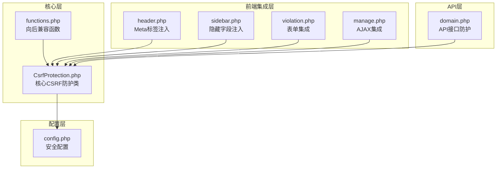
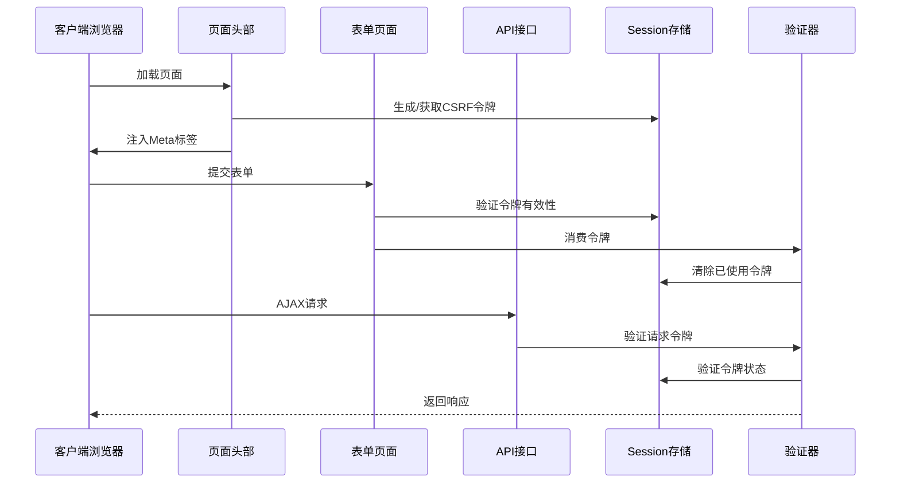
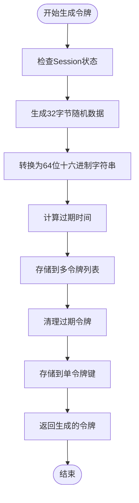
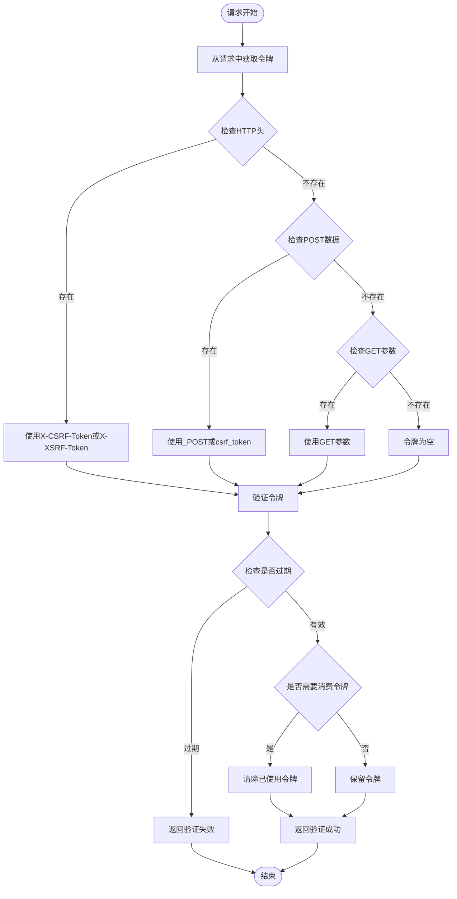
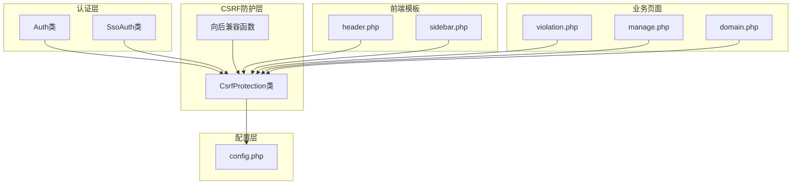

# CSRF防护系统

<cite>
**本文引用的文件**
- [CsrfProtection.php](file://core/CsrfProtection.php)
- [functions.php](file://includes/functions.php)
- [config.php](file://config/config.php)
- [header.php](file://public/admin/partials/header.php)
- [sidebar.php](file://public/admin/partials/sidebar.php)
- [violation.php](file://public/admin/domains/violation.php)
- [manage.php](file://public/admin/ipban/manage.php)
- [domain.php](file://public/api/domain.php)
</cite>

## 目录
1. [简介](#简介)
2. [项目结构](#项目结构)
3. [核心组件](#核心组件)
4. [架构概览](#架构概览)
5. [详细组件分析](#详细组件分析)
6. [依赖关系分析](#依赖关系分析)
7. [性能考虑](#性能考虑)
8. [故障排除指南](#故障排除指南)
9. [结论](#结论)

## 简介

CSRF（跨站请求伪造）防护系统是灯塔DNS拦截响应平台的核心安全部分，旨在防止恶意网站利用用户已登录的身份执行未经授权的操作。该系统采用基于Session的令牌机制，结合多种安全策略，为平台提供了全面的CSRF防护能力。

系统设计遵循"最小暴露原则"，通过一次性令牌、时间戳验证、多令牌管理等技术手段，有效抵御各种CSRF攻击场景，包括GET请求、POST请求、AJAX请求和文件上传等。

## 项目结构

CSRF防护系统在项目中的组织结构清晰合理，采用了分层架构设计：



**图表来源**
- [CsrfProtection.php:1-298](file://core/CsrfProtection.php#L1-L298)
- [functions.php:135-177](file://includes/functions.php#L135-L177)
- [config.php:86-105](file://config/config.php#L86-L105)

**章节来源**
- [CsrfProtection.php:1-298](file://core/CsrfProtection.php#L1-L298)
- [functions.php:1-800](file://includes/functions.php#L1-L800)
- [config.php:1-152](file://config/config.php#L1-L152)

## 核心组件

### CsrfProtection类设计

CsrfProtection类是整个CSRF防护系统的核心，采用静态方法设计，提供了完整的令牌生命周期管理：

#### 核心特性
- **多令牌支持**：支持同时维护多个有效令牌，提高并发安全性
- **时间戳验证**：内置令牌过期机制，防止令牌长期有效
- **向后兼容**：保留单令牌模式，确保现有代码正常运行
- **防重放攻击**：默认消费令牌，防止令牌重复使用

#### 关键常量
- `TOKEN_KEY`: 'csrf_token' - 单令牌存储键
- `EXPIRES_KEY`: 'csrf_token_expires' - 过期时间存储键  
- `TOKENS_KEY`: 'csrf_tokens' - 多令牌列表存储键
- `DEFAULT_LIFETIME`: 3600秒 - 默认令牌有效期

**章节来源**
- [CsrfProtection.php:17-30](file://core/CsrfProtection.php#L17-L30)

### 安全配置系统

系统通过config.php集中管理CSRF相关的安全配置：

#### 配置选项
- `csrf_enabled`: true - 启用CSRF防护
- `csrf_token_name`: '_token' - 令牌字段名称
- `csrf_token_expire`: 3600 - 令牌过期时间（秒）

**章节来源**
- [config.php:86-105](file://config/config.php#L86-L105)

## 架构概览

CSRF防护系统采用多层次防护架构，确保在各种攻击场景下都能提供有效保护：



**图表来源**
- [header.php:79](file://public/admin/partials/header.php#L79)
- [violation.php:199](file://public/admin/domains/violation.php#L199)
- [domain.php:132](file://public/api/domain.php#L132)

## 详细组件分析

### 令牌生成机制

#### 一次性令牌生成
系统使用`random_bytes()`函数生成加密安全的随机令牌，确保令牌的不可预测性：



**图表来源**
- [CsrfProtection.php:40-66](file://core/CsrfProtection.php#L40-L66)

#### 多令牌管理策略
系统支持同时维护最多5个有效令牌，实现令牌轮换和并发访问支持：

- **令牌数量限制**：最多保留5个令牌
- **自动清理**：移除过期令牌
- **轮换机制**：新令牌优先，旧令牌逐步淘汰

**章节来源**
- [CsrfProtection.php:251-277](file://core/CsrfProtection.php#L251-L277)

### 令牌验证流程

#### 多源令牌获取
系统支持从多个位置获取令牌，确保不同类型的请求都能正确验证：



**图表来源**
- [CsrfProtection.php:144-161](file://core/CsrfProtection.php#L144-L161)

#### 时间安全比较
系统使用`hash_equals()`函数进行时间安全的令牌比较，防止时序攻击：

**章节来源**
- [CsrfProtection.php:78-123](file://core/CsrfProtection.php#L78-L123)

### 前端集成方案

#### Meta标签注入
页面头部通过Meta标签注入CSRF令牌，供JavaScript/AJAX请求使用：

```html
<meta name="csrf-token" content="生成的令牌值">
```

#### 表单隐藏字段
侧边栏模板中注入隐藏的CSRF令牌字段：

```html
<input type="hidden" name="_token" value="生成的令牌值">
```

**章节来源**
- [header.php:79](file://public/admin/partials/header.php#L79)
- [sidebar.php:138](file://public/admin/partials/sidebar.php#L138)

### API防护集成

#### 表单提交防护
表单页面在处理POST请求时，通过`validateFromRequest()`方法验证令牌：

```php
if (!CsrfProtection::validateFromRequest()) {
    die(json_encode(['success' => false, 'message' => 'CSRF验证失败']));
}
```

#### AJAX请求防护
JavaScript通过Meta标签获取令牌，将其添加到AJAX请求中：

```javascript
const csrfToken = document.querySelector('meta[name="csrf-token"]').content;
fetch('/api/action.php', {
    method: 'POST',
    body: formData,
    headers: {
        'X-CSRF-Token': csrfToken
    }
});
```

**章节来源**
- [violation.php:61-65](file://public/admin/domains/violation.php#L61-L65)
- [manage.php:61-62](file://public/admin/ipban/manage.php#L61-L62)
- [domain.php:132](file://public/api/domain.php#L132)

## 依赖关系分析

CSRF防护系统与其他组件的依赖关系如下：



**图表来源**
- [functions.php:146-177](file://includes/functions.php#L146-L177)
- [config.php:17-40](file://config/config.php#L17-L40)

### 关键依赖关系

1. **Session管理**：CsrfProtection类内部管理Session启动和配置
2. **配置依赖**：依赖config.php中的安全配置
3. **向后兼容**：functions.php提供传统函数接口
4. **前端集成**：通过模板文件自动注入令牌

**章节来源**
- [CsrfProtection.php:282-296](file://core/CsrfProtection.php#L282-L296)
- [functions.php:135-177](file://includes/functions.php#L135-L177)

## 性能考虑

### 令牌存储优化

系统采用高效的令牌存储策略：
- **内存存储**：令牌存储在Session中，访问速度快
- **自动清理**：定期清理过期令牌，避免内存泄漏
- **数量限制**：最多保留5个令牌，平衡安全性与性能

### 并发处理

多令牌机制支持高并发场景：
- **令牌轮换**：新令牌优先，减少令牌冲突
- **独立验证**：每个令牌独立验证，互不影响
- **自动消费**：状态变更操作自动消费令牌，防止重放

### 缓存策略

系统通过以下方式优化性能：
- **令牌复用**：查询类操作可重用令牌，减少生成开销
- **延迟初始化**：仅在需要时启动Session
- **最小化存储**：仅存储必要的令牌元数据

## 故障排除指南

### 常见问题及解决方案

#### 1. CSRF验证失败
**症状**：表单提交或API请求返回"CSRF验证失败"

**可能原因**：
- 令牌过期
- 令牌被消费
- 请求头缺失
- 表单字段缺失

**解决方法**：
- 刷新页面获取新令牌
- 检查表单是否包含隐藏字段
- 确认AJAX请求包含正确的请求头

#### 2. 令牌重复使用
**症状**：同一个令牌多次使用导致验证失败

**解决方法**：
- 确保状态变更操作使用`validateFromRequest(true)`
- 检查是否正确消费了令牌

#### 3. Session问题
**症状**：令牌生成失败或验证异常

**解决方法**：
- 检查Session配置
- 确认Session存储可用
- 检查Cookie设置

**章节来源**
- [CsrfProtection.php:78-123](file://core/CsrfProtection.php#L78-L123)
- [CsrfProtection.php:144-161](file://core/CsrfProtection.php#L144-L161)

### 安全审计要点

#### 1. 令牌生命周期监控
- 监控令牌生成频率
- 检查令牌过期率
- 分析令牌使用模式

#### 2. 异常行为检测
- 监控CSRF攻击尝试
- 检测异常请求模式
- 分析失败验证统计

#### 3. 性能指标
- 令牌验证响应时间
- Session存储使用情况
- 内存占用分析

## 结论

灯塔DNS拦截响应平台的CSRF防护系统通过精心设计的多层防护机制，为平台提供了全面而高效的安全保障。系统的核心优势包括：

### 技术优势
- **多层次防护**：结合令牌机制、时间验证、多令牌管理等多种安全策略
- **高性能设计**：优化的存储和验证机制，确保低延迟响应
- **向后兼容**：完整的兼容层设计，保护现有代码不受影响
- **灵活配置**：可调整的令牌有效期和验证策略

### 安全特性
- **防重放攻击**：默认消费令牌，防止令牌重复使用
- **时间安全**：使用安全的比较函数，防止时序攻击
- **并发支持**：多令牌机制支持高并发场景
- **自动清理**：定期清理过期令牌，维护系统安全

### 最佳实践建议
1. **严格配置**：根据业务需求调整令牌有效期
2. **监控告警**：建立CSRF攻击检测和告警机制
3. **定期审计**：定期检查令牌使用和系统性能
4. **安全培训**：对开发团队进行CSRF防护知识培训

该系统为DNS拦截响应平台提供了坚实的安全基础，能够有效抵御各种CSRF攻击威胁，确保平台的安全稳定运行。