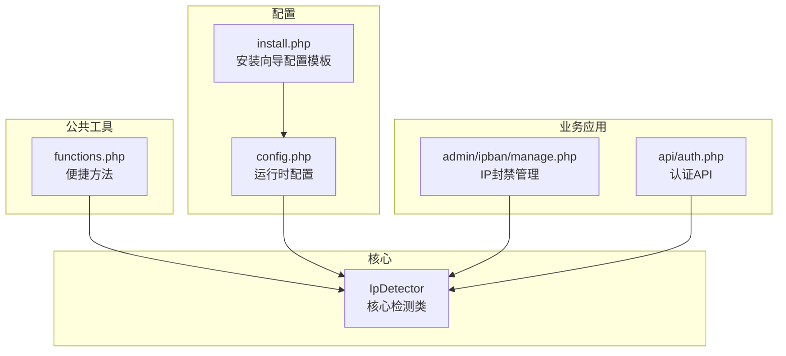
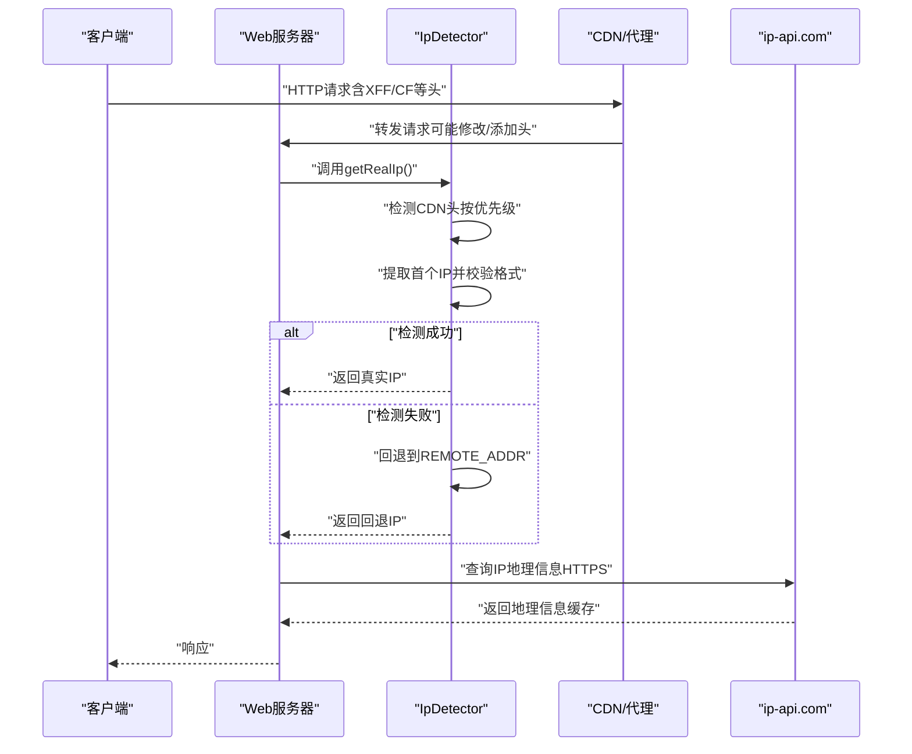
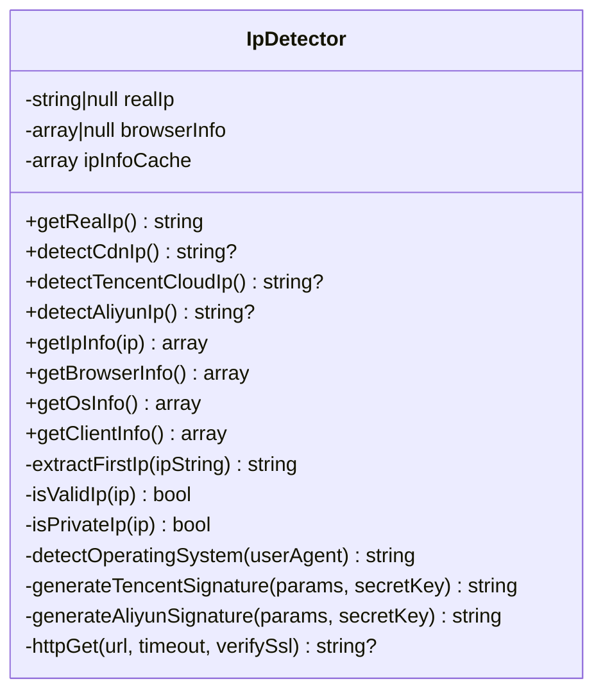
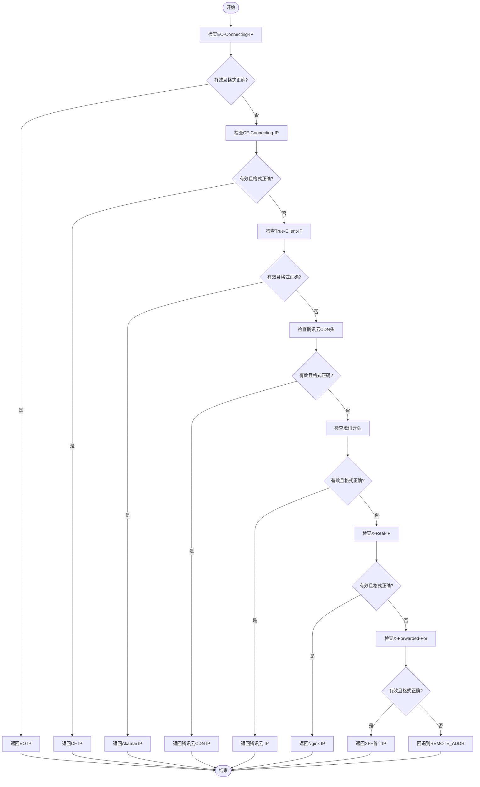
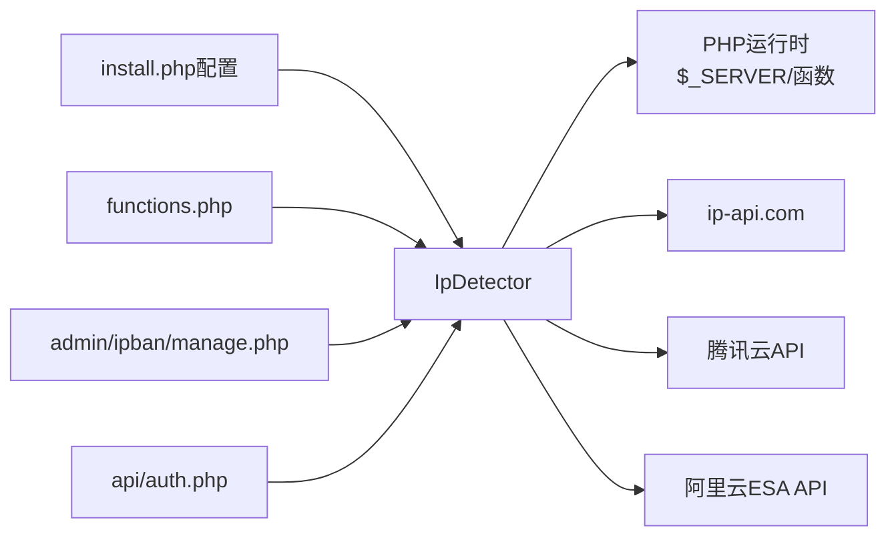

# IP检测系统

<cite>
**本文引用的文件**
- [IpDetector.php](file://core/IpDetector.php)
- [functions.php](file://includes/functions.php)
- [config.php](file://config/config.php)
- [install.php](file://public/install.php)
- [manage.php](file://public/admin/ipban/manage.php)
- [auth.php](file://public/api/auth.php)
</cite>

## 目录
1. [简介](#简介)
2. [项目结构](#项目结构)
3. [核心组件](#核心组件)
4. [架构总览](#架构总览)
5. [详细组件分析](#详细组件分析)
6. [依赖关系分析](#依赖关系分析)
7. [性能考量](#性能考量)
8. [故障排除指南](#故障排除指南)
9. [结论](#结论)
10. [附录](#附录)

## 简介
本文件面向DNS拦截响应平台的IP检测系统，重点围绕IpDetector类的实现原理展开，系统性阐述CDN环境下真实IP识别的技术方案，涵盖HTTP头解析、代理链追踪、CDN特殊处理、IP格式验证、IPv4/IPv6支持、私有IP过滤、缓存与性能优化、以及常见问题的解决方案。文档同时给出基于代码路径的参考定位，便于读者快速查阅具体实现细节。

## 项目结构
该项目采用分层模块化组织，IP检测能力集中在核心模块中，通过公共函数库提供便捷方法，并在安装向导中预置CDN检测配置模板。关键位置如下：
- 核心检测类：core/IpDetector.php
- 公共函数库：includes/functions.php（包含便捷的getClientIp方法）
- 安装向导配置模板：public/install.php（包含ip_detection配置项）
- 管理端IP封禁：public/admin/ipban/manage.php（使用IP检测结果进行封禁管理）
- 认证API：public/api/auth.php（演示如何在API中集成IP检测）

图表来源
- [IpDetector.php:1-651](file://core/IpDetector.php#L1-L651)
- [functions.php:408-440](file://includes/functions.php#L408-L440)
- [config.php:15-152](file://config/config.php#L15-L152)
- [install.php:469-495](file://public/install.php#L469-L495)
- [manage.php:60-121](file://public/admin/ipban/manage.php#L60-L121)
- [auth.php:46-120](file://public/api/auth.php#L46-L120)

章节来源
- [IpDetector.php:1-651](file://core/IpDetector.php#L1-L651)
- [functions.php:408-440](file://includes/functions.php#L408-L440)
- [config.php:15-152](file://config/config.php#L15-L152)
- [install.php:469-495](file://public/install.php#L469-L495)
- [manage.php:60-121](file://public/admin/ipban/manage.php#L60-L121)
- [auth.php:46-120](file://public/api/auth.php#L46-L120)

## 核心组件
- IpDetector类：提供真实IP检测、IP地理信息查询、浏览器/操作系统信息解析、HTTP请求安全封装等能力。
- 公共便捷方法：includes/functions.php中的getClientIp提供简化的IP检测流程。
- 安装向导配置：public/install.php中的ip_detection配置项定义可信代理网段、检测顺序与CDN头集合。

章节来源
- [IpDetector.php:13-47](file://core/IpDetector.php#L13-L47)
- [functions.php:408-440](file://includes/functions.php#L408-L440)
- [install.php:469-495](file://public/install.php#L469-L495)

## 架构总览
IP检测系统遵循“优先级检测 + 容错回退”的策略：优先从CDN代理头中提取真实IP，若失败则回退到REMOTE_ADDR；同时对IP进行格式校验与私有IP过滤，避免内网地址污染；地理信息查询采用HTTPS与缓存机制提升性能与安全性。

图表来源
- [IpDetector.php:31-47](file://core/IpDetector.php#L31-L47)
- [IpDetector.php:62-121](file://core/IpDetector.php#L62-L121)
- [IpDetector.php:226-316](file://core/IpDetector.php#L226-L316)

## 详细组件分析

### IpDetector类设计与职责
- 真实IP检测：按优先级从CDN头中提取，直接信任可信来源。
- IP地理信息：通过HTTPS查询ip-api.com，支持缓存与内网地址防护。
- 浏览器/操作系统信息：解析User-Agent，提取浏览器、引擎、平台、移动端与机器人标识。
- HTTP请求安全：使用cURL并绑定DNS解析结果，防止DNS重绑定攻击；限制协议与验证SSL。

图表来源
- [IpDetector.php:13-651](file://core/IpDetector.php#L13-L651)

章节来源
- [IpDetector.php:13-651](file://core/IpDetector.php#L13-L651)

### HTTP头解析与代理链追踪
- 优先级顺序：EO-Connecting-IP（腾讯云Edge ONE）→ CF-Connecting-IP（Cloudflare）→ True-Client-IP（Akamai）→ X-TencentCDN-Real-IP/X-Tencent-Real-IP（腾讯云）→ X-Real-IP（Nginx）→ X-Forwarded-For（通用）。
- 提取策略：从逗号分隔的列表中取第一个IP，进行格式校验后返回。
- 容错机制：若任一CDN头有效且通过校验，则直接采用；否则回退到REMOTE_ADDR。

图表来源
- [IpDetector.php:62-121](file://core/IpDetector.php#L62-L121)

章节来源
- [IpDetector.php:62-121](file://core/IpDetector.php#L62-L121)

### CDN特殊处理与多厂商适配
- 腾讯云：支持Edge ONE（EO-Connecting-IP）、CDN（X-TencentCDN-Real-IP）、普通（X-Tencent-Real-IP）。
- Cloudflare：支持CF-Connecting-IP。
- Akamai/Enterprise：支持True-Client-IP。
- Nginx/Akamai：支持X-Real-IP。
- 通用代理：支持X-Forwarded-For，取首个IP。

章节来源
- [IpDetector.php:62-121](file://core/IpDetector.php#L62-L121)

### IP格式验证与私有IP过滤
- 格式验证：使用标准IP验证函数，支持IPv4/IPv6。
- 私有IP过滤：在地理信息查询前，拒绝内网/保留地址，防止SSRF与内网探测。
- 缓存策略：APCu优先，文件缓存降级；同一IP缓存1小时。

章节来源
- [IpDetector.php:470-488](file://core/IpDetector.php#L470-L488)
- [IpDetector.php:234-316](file://core/IpDetector.php#L234-L316)

### IP地理信息查询与安全防护
- 查询接口：HTTPS访问ip-api.com，字段精简，避免敏感信息泄露。
- 防护措施：SSRF防护（解析域名并校验IP非内网）、DNS重绑定防护（cURL绑定解析结果）、超时控制（默认3秒）。
- 缓存：APCu或文件缓存，1小时有效期。

章节来源
- [IpDetector.php:226-316](file://core/IpDetector.php#L226-L316)
- [IpDetector.php:577-649](file://core/IpDetector.php#L577-L649)

### 浏览器与操作系统信息解析
- 浏览器检测：基于User-Agent关键字匹配，提取名称、版本、引擎。
- 操作系统检测：基于User-Agent关键字匹配，提取名称、版本、架构。
- 移动端与机器人识别：关键词匹配，便于风控策略差异化。

章节来源
- [IpDetector.php:325-426](file://core/IpDetector.php#L325-L426)

### API回源检测（腾讯云/阿里云）
- 腾讯云：通过API获取真实客户端IP，需配置密钥与端点；失败静默。
- 阿里云ESA：通过API获取真实客户端IP，需配置密钥与端点；失败静默。
- 签名算法：分别实现对应SDK风格的HMAC-SHA1签名流程。

章节来源
- [IpDetector.php:131-167](file://core/IpDetector.php#L131-L167)
- [IpDetector.php:177-215](file://core/IpDetector.php#L177-L215)
- [IpDetector.php:534-564](file://core/IpDetector.php#L534-L564)

### 便捷方法与集成示例
- 公共函数：includes/functions.php提供getClientIp，与IpDetector的检测逻辑一致，便于在业务层快速使用。
- 管理端集成：admin/ipban/manage.php在封禁管理中使用IP检测结果，支持真实IP字段录入与查询。
- 认证API集成：api/auth.php演示在API中进行登录状态检查时如何获取客户端IP。

章节来源
- [functions.php:408-440](file://includes/functions.php#L408-L440)
- [manage.php:60-121](file://public/admin/ipban/manage.php#L60-L121)
- [auth.php:46-120](file://public/api/auth.php#L46-L120)

## 依赖关系分析
- 模块耦合：IpDetector依赖PHP运行时的HTTP环境变量、cURL、APCu/文件缓存、标准IP验证函数。
- 外部依赖：ip-api.com（地理信息）、腾讯云/阿里云API（回源检测）。
- 配置来源：安装向导生成的配置文件，包含可信代理网段、检测顺序与CDN头集合。

图表来源
- [IpDetector.php:13-651](file://core/IpDetector.php#L13-L651)
- [install.php:469-495](file://public/install.php#L469-L495)
- [functions.php:408-440](file://includes/functions.php#L408-L440)
- [manage.php:60-121](file://public/admin/ipban/manage.php#L60-L121)
- [auth.php:46-120](file://public/api/auth.php#L46-L120)

章节来源
- [IpDetector.php:13-651](file://core/IpDetector.php#L13-L651)
- [install.php:469-495](file://public/install.php#L469-L495)
- [functions.php:408-440](file://includes/functions.php#L408-L440)
- [manage.php:60-121](file://public/admin/ipban/manage.php#L60-L121)
- [auth.php:46-120](file://public/api/auth.php#L46-L120)

## 性能考量
- 缓存策略：APCu优先，文件缓存降级；IP地理信息缓存1小时，显著降低外部查询压力。
- DNS重绑定防护：cURL绑定解析结果，避免DNS解析与请求阶段的中间人攻击。
- 超时控制：外部查询默认3秒，失败静默，保证主流程不阻塞。
- 便捷方法：公共函数提供轻量级IP检测，适合高频场景快速调用。
- 安装向导配置：预置可信代理网段与检测顺序，减少运行时判断开销。

章节来源
- [IpDetector.php:234-316](file://core/IpDetector.php#L234-L316)
- [IpDetector.php:577-649](file://core/IpDetector.php#L577-L649)
- [functions.php:408-440](file://includes/functions.php#L408-L440)
- [install.php:469-495](file://public/install.php#L469-L495)

## 故障排除指南
- 无法获取真实IP
  - 检查CDN是否正确透传头部；确认安装向导配置的ip_detection.cdn_headers是否包含目标CDN头。
  - 确认REMOTE_ADDR是否为代理IP而非客户端真实IP。
  - 参考路径：[IpDetector.php:62-121](file://core/IpDetector.php#L62-L121)、[install.php:488-494](file://public/install.php#L488-L494)
- IP格式无效或为内网
  - 系统会拒绝内网/保留地址，需检查代理链是否正确设置。
  - 参考路径：[IpDetector.php:470-488](file://core/IpDetector.php#L470-L488)
- 地理信息查询失败
  - 检查网络连通性与HTTPS访问权限；确认超时设置与缓存可用性。
  - 参考路径：[IpDetector.php:226-316](file://core/IpDetector.php#L226-L316)
- API回源检测失败
  - 检查腾讯云/阿里云密钥配置与端点设置；确认网络可达与签名参数正确。
  - 参考路径：[IpDetector.php:131-167](file://core/IpDetector.php#L131-L167)、[IpDetector.php:177-215](file://core/IpDetector.php#L177-L215)
- 性能问题
  - 启用APCu缓存；检查文件缓存目录权限；优化外部查询超时。
  - 参考路径：[IpDetector.php:234-316](file://core/IpDetector.php#L234-L316)

章节来源
- [IpDetector.php:62-121](file://core/IpDetector.php#L62-L121)
- [IpDetector.php:470-488](file://core/IpDetector.php#L470-L488)
- [IpDetector.php:226-316](file://core/IpDetector.php#L226-L316)
- [IpDetector.php:131-167](file://core/IpDetector.php#L131-L167)
- [IpDetector.php:177-215](file://core/IpDetector.php#L177-L215)

## 结论
IpDetector类提供了在CDN与代理环境下可靠获取客户端真实IP的能力，结合安装向导的配置模板与公共便捷方法，可在不同业务场景中灵活集成。通过严格的IP验证、私有IP过滤、HTTPS查询与缓存策略，系统在准确性、安全性与性能之间取得平衡。建议在生产环境中启用APCu缓存、完善CDN头配置，并定期审查代理链与回源检测策略。

## 附录

### 常见HTTP头与处理逻辑
- X-Forwarded-For：通用代理链，取首个IP并校验。
- X-Real-IP：Nginx等反向代理常用，取首个IP并校验。
- CF-Connecting-IP：Cloudflare专用，直接采用。
- True-Client-IP：Akamai/Enterprise，直接采用。
- X-TencentCDN-Real-IP / X-Tencent-Real-IP：腾讯云CDN/普通，直接采用。
- EO-Connecting-IP：腾讯云Edge ONE，直接采用。

章节来源
- [IpDetector.php:62-121](file://core/IpDetector.php#L62-L121)

### IP检测优先级与容错机制
- 优先级：CDN头 → API回源 → REMOTE_ADDR。
- 容错：任一CDN头有效即返回；API失败静默；最终回退到REMOTE_ADDR。

章节来源
- [IpDetector.php:31-47](file://core/IpDetector.php#L31-L47)
- [IpDetector.php:62-121](file://core/IpDetector.php#L62-L121)

### 安装向导配置要点
- trusted_proxies：可信代理网段列表。
- detection_order：检测顺序（cdn_header → tencent_cloud → aliyun_esa → remote_addr）。
- cdn_headers：CDN透传头集合。

章节来源
- [install.php:469-495](file://public/install.php#L469-L495)