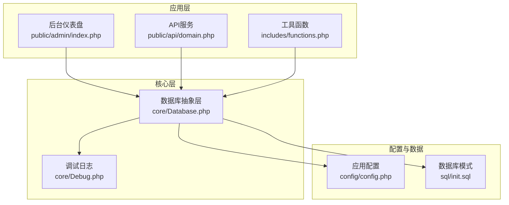
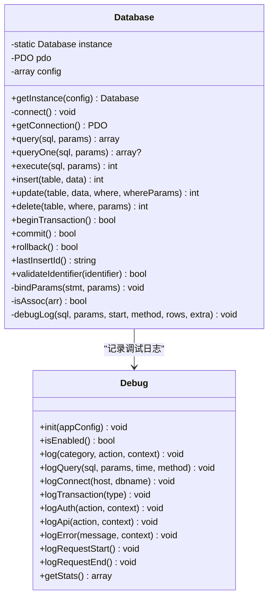
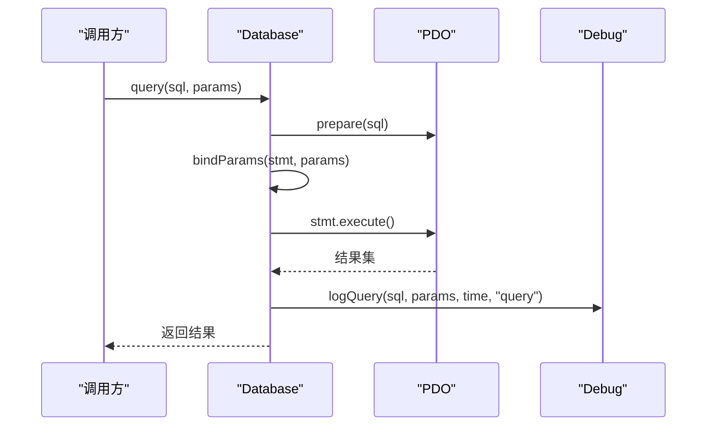
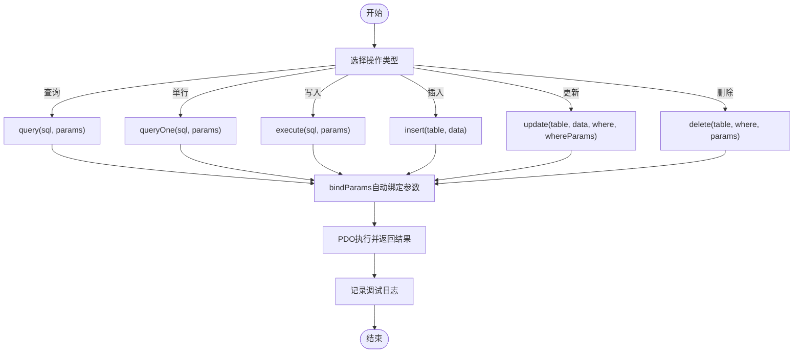
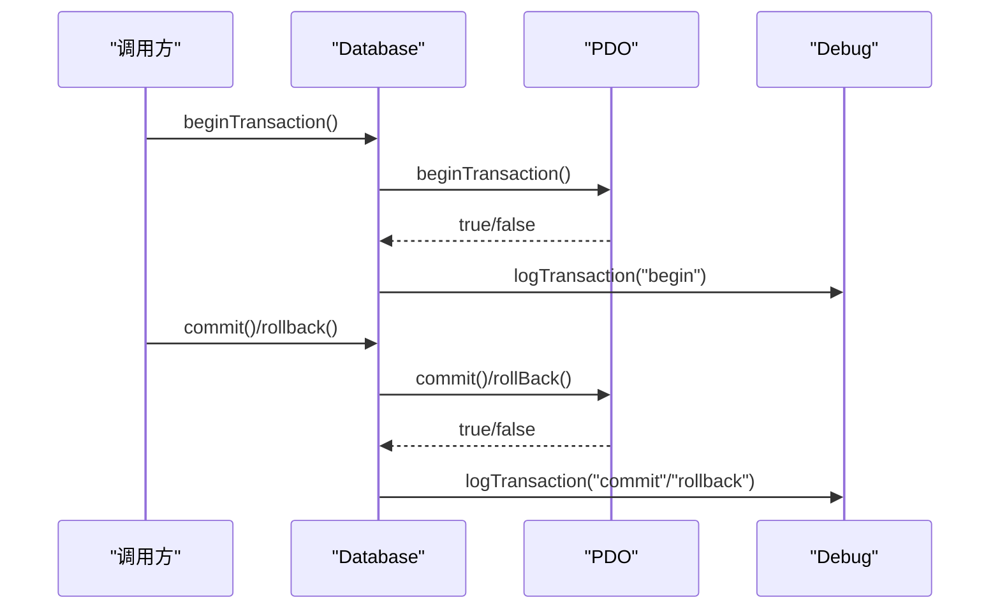
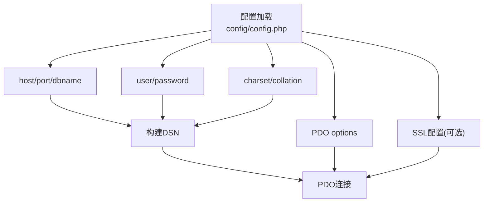
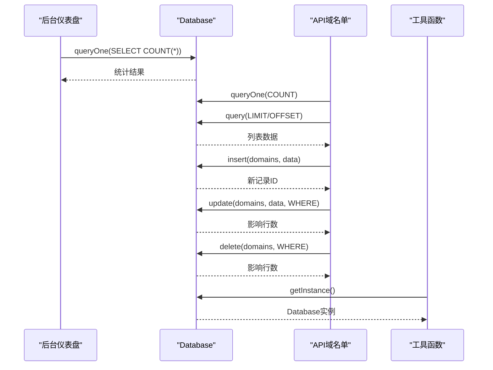
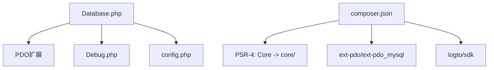

# 数据库抽象层

<cite>
**本文引用的文件**
- [config.php](file://config/config.php)
- [Database.php](file://core/Database.php)
- [Debug.php](file://core/Debug.php)
- [functions.php](file://includes/functions.php)
- [index.php](file://public/admin/index.php)
- [domain.php](file://public/api/domain.php)
- [init.sql](file://sql/init.sql)
- [composer.json](file://composer.json)
</cite>

## 目录
1. [简介](#简介)
2. [项目结构](#项目结构)
3. [核心组件](#核心组件)
4. [架构概览](#架构概览)
5. [详细组件分析](#详细组件分析)
6. [依赖关系分析](#依赖关系分析)
7. [性能考虑](#性能考虑)
8. [故障排除指南](#故障排除指南)
9. [结论](#结论)
10. [附录](#附录)

## 简介
本文件面向DNS拦截响应平台的数据库抽象层，系统性阐述Database类的设计理念、实现原理与最佳实践。重点涵盖：
- PDO连接管理与配置
- 查询封装与预处理语句
- 事务处理与错误处理
- 标识符验证与SQL注入防护
- CRUD操作示例与使用场景
- 数据库配置选项与字符集设置
- 抽象层如何提升可移植性与安全性
- 性能优化建议与索引使用指导
- 常见问题排查与解决方案

## 项目结构
数据库抽象层位于core目录，核心文件如下：
- core/Database.php：数据库连接与查询封装的核心类
- config/config.php：数据库配置与应用配置
- core/Debug.php：调试日志系统，支持SQL查询记录与性能统计
- includes/functions.php：全局工具函数，提供db()便捷函数
- public/admin/index.php：前端仪表盘使用Database进行统计查询
- public/api/domain.php：API层使用Database进行CRUD操作
- sql/init.sql：数据库初始化脚本，包含完整表结构与索引
- composer.json：项目依赖与自动加载配置

**图表来源**
- [Database.php:1-400](file://core/Database.php#L1-L400)
- [config.php:15-52](file://config/config.php#L15-L52)
- [Debug.php:17-336](file://core/Debug.php#L17-L336)
- [functions.php:850-854](file://includes/functions.php#L850-L854)
- [index.php:23](file://public/admin/index.php#L23)
- [domain.php:38](file://public/api/domain.php#L38)
- [init.sql:1-275](file://sql/init.sql#L1-L275)

**章节来源**
- [Database.php:1-400](file://core/Database.php#L1-L400)
- [config.php:15-152](file://config/config.php#L15-L152)
- [Debug.php:17-336](file://core/Debug.php#L17-L336)
- [functions.php:850-854](file://includes/functions.php#L850-L854)
- [index.php:23](file://public/admin/index.php#L23)
- [domain.php:38](file://public/api/domain.php#L38)
- [init.sql:1-275](file://sql/init.sql#L1-L275)

## 核心组件
- Database类：基于PDO的单例数据库抽象层，提供连接管理、查询封装、事务处理与安全校验。
- Debug类：在调试模式下记录SQL查询、连接、事务与请求统计，便于性能分析与问题定位。
- 配置系统：集中管理数据库连接参数、字符集、SSL配置与PDO选项。
- 工具函数：提供db()便捷函数，统一获取Database实例。

关键特性：
- 单例模式确保全局唯一连接
- 预处理语句与参数绑定，防止SQL注入
- 标识符白名单验证，限制表名/列名合法性
- 事务支持与调试日志集成
- 支持SSL/TLS加密连接

**章节来源**
- [Database.php:13-46](file://core/Database.php#L13-L46)
- [Database.php:53-122](file://core/Database.php#L53-L122)
- [Database.php:144-181](file://core/Database.php#L144-L181)
- [Database.php:211-227](file://core/Database.php#L211-L227)
- [Database.php:232-274](file://core/Database.php#L232-L274)
- [Database.php:279-309](file://core/Database.php#L279-L309)
- [Database.php:314-345](file://core/Database.php#L314-L345)
- [Database.php:369-375](file://core/Database.php#L369-L375)
- [Debug.php:42-75](file://core/Debug.php#L42-L75)
- [Debug.php:138-155](file://core/Debug.php#L138-L155)
- [Debug.php:168-171](file://core/Debug.php#L168-L171)

## 架构概览
Database类采用单例模式，通过配置文件提供的数据库参数建立PDO连接。查询封装层提供：
- query/queryOne：执行查询并返回集合或单行
- execute：执行INSERT/UPDATE/DELETE并返回影响行数
- insert/update/delete：高级CRUD方法，内置参数绑定与标识符验证
- 事务方法：beginTransaction/commit/rollback
- 调试日志：记录SQL执行时间、参数与方法类型

**图表来源**
- [Database.php:13-399](file://core/Database.php#L13-L399)
- [Debug.php:17-336](file://core/Debug.php#L17-L336)

**章节来源**
- [Database.php:13-399](file://core/Database.php#L13-L399)
- [Debug.php:17-336](file://core/Debug.php#L17-L336)

## 详细组件分析

### Database类设计与实现
- 单例与延迟连接：getInstance在首次使用时才加载配置并建立连接，避免不必要的资源消耗。
- 连接参数与选项：
  - DSN由主机、端口、数据库名与字符集拼接
  - PDO选项支持索引数组或关联数组两种形式，自动映射到PDO常量
  - SSL/TLS配置支持CA证书与服务器证书验证
- 预处理与参数绑定：
  - bindParams自动识别整数、布尔、NULL与字符串类型，避免类型混淆
  - 位置参数从1开始绑定，命名参数自动转换为位置参数
- 安全校验：
  - validateIdentifier限制标识符仅允许字母、数字、下划线，且以字母或下划线开头
  - WHERE条件中禁止分号、引号、反斜杠等危险字符
- 调试集成：
  - query/queryOne/execute/insert/update/delete均记录执行时间、参数与方法类型
  - 事务操作记录begin/commit/rollback

**图表来源**
- [Database.php:144-153](file://core/Database.php#L144-L153)
- [Database.php:380-390](file://core/Database.php#L380-L390)

**章节来源**
- [Database.php:27-46](file://core/Database.php#L27-L46)
- [Database.php:67-102](file://core/Database.php#L67-L102)
- [Database.php:189-206](file://core/Database.php#L189-L206)
- [Database.php:369-375](file://core/Database.php#L369-L375)
- [Database.php:240-242](file://core/Database.php#L240-L242)
- [Database.php:283-285](file://core/Database.php#L283-L285)
- [Database.php:380-390](file://core/Database.php#L380-L390)

### 查询封装与预处理语句
- query：返回所有结果，适合SELECT *或聚合查询
- queryOne：返回单行结果，适合COUNT(*)或唯一约束查询
- execute：返回受影响行数，适合INSERT/UPDATE/DELETE
- insert：自动生成列名与占位符，自动获取lastInsertId
- update：支持命名参数转换为位置参数，自动绑定WHERE条件
- delete：同上，支持命名参数转换

**图表来源**
- [Database.php:144-181](file://core/Database.php#L144-L181)
- [Database.php:211-227](file://core/Database.php#L211-L227)
- [Database.php:232-274](file://core/Database.php#L232-L274)
- [Database.php:279-309](file://core/Database.php#L279-L309)
- [Database.php:189-206](file://core/Database.php#L189-L206)

**章节来源**
- [Database.php:144-181](file://core/Database.php#L144-L181)
- [Database.php:211-227](file://core/Database.php#L211-L227)
- [Database.php:232-274](file://core/Database.php#L232-L274)
- [Database.php:279-309](file://core/Database.php#L279-L309)
- [Database.php:189-206](file://core/Database.php#L189-L206)

### 事务处理与错误处理
- 事务：beginTransaction/commit/rollback分别记录begin/commit/rollback事件
- 错误处理：连接失败抛出PDOException并记录错误日志；WHERE条件非法抛出InvalidArgumentException
- 调试模式：在启用时记录连接、查询与事务事件，便于性能分析

**图表来源**
- [Database.php:314-345](file://core/Database.php#L314-L345)
- [Debug.php:168-171](file://core/Debug.php#L168-L171)

**章节来源**
- [Database.php:314-345](file://core/Database.php#L314-L345)
- [Debug.php:168-171](file://core/Debug.php#L168-L171)

### 数据库配置与连接参数
- 数据库配置项：
  - host/port/dbname/user/password/prefix/charset/collation
  - options：PDO选项数组，支持索引或关联数组
  - ssl：可选SSL配置，支持CA证书与服务器证书验证
- 字符集与排序规则：utf8mb4与utf8mb4_unicode_ci
- PDO选项：
  - ERRMODE_EXCEPTION：异常模式
  - FETCH_ASSOC：默认获取关联数组
  - EMULATE_PREPARES：禁用模拟预处理，提升安全性
  - INIT_COMMAND：设置字符集命令

**图表来源**
- [config.php:23-38](file://config/config.php#L23-L38)
- [Database.php:67-102](file://core/Database.php#L67-L102)

**章节来源**
- [config.php:23-38](file://config/config.php#L23-L38)
- [Database.php:67-102](file://core/Database.php#L67-L102)

### CRUD操作示例与使用场景
- 后台仪表盘统计查询：使用queryOne进行COUNT统计，使用query进行GROUP BY统计
- API域名单列表：使用queryOne统计总数，使用query获取分页列表
- API域名单创建：使用insert插入新记录并获取lastInsertId
- API域名单更新：使用update更新指定字段，支持命名参数转换
- API域名单删除：使用delete删除记录，支持命名参数转换
- 工具函数：db()便捷函数统一获取Database实例

**图表来源**
- [index.php:29-48](file://public/admin/index.php#L29-L48)
- [index.php:64-79](file://public/admin/index.php#L64-L79)
- [domain.php:103-111](file://public/api/domain.php#L103-L111)
- [domain.php:178-192](file://public/api/domain.php#L178-L192)
- [domain.php:208](file://public/api/domain.php#L208)
- [domain.php:346](file://public/api/domain.php#L346)
- [domain.php:396](file://public/api/domain.php#L396)
- [functions.php:851-854](file://includes/functions.php#L851-L854)

**章节来源**
- [index.php:29-48](file://public/admin/index.php#L29-L48)
- [index.php:64-79](file://public/admin/index.php#L64-L79)
- [domain.php:103-111](file://public/api/domain.php#L103-L111)
- [domain.php:178-192](file://public/api/domain.php#L178-L192)
- [domain.php:208](file://public/api/domain.php#L208)
- [domain.php:346](file://public/api/domain.php#L346)
- [domain.php:396](file://public/api/domain.php#L396)
- [functions.php:851-854](file://includes/functions.php#L851-L854)

## 依赖关系分析
- Database依赖：
  - PDO扩展与PDO MySQL驱动
  - Debug类用于调试日志
  - 配置文件提供连接参数
- Composer自动加载：
  - PSR-4命名空间Core指向core/
- 外部依赖：
  - ext-pdo、ext-pdo_mysql、ext-json、ext-curl、ext-mbstring、ext-openssl
  - logto/sdk用于SSO集成

**图表来源**
- [composer.json:7-16](file://composer.json#L7-L16)
- [composer.json:20-24](file://composer.json#L20-L24)
- [Database.php:10-11](file://core/Database.php#L10-L11)
- [Debug.php:17-336](file://core/Debug.php#L17-L336)
- [config.php:15-52](file://config/config.php#L15-L52)

**章节来源**
- [composer.json:7-16](file://composer.json#L7-L16)
- [composer.json:20-24](file://composer.json#L20-L24)
- [Database.php:10-11](file://core/Database.php#L10-L11)
- [Debug.php:17-336](file://core/Debug.php#L17-L336)
- [config.php:15-52](file://config/config.php#L15-L52)

## 性能考虑
- 预处理语句与参数绑定：避免重复编译SQL，减少CPU开销
- 禁用模拟预处理：更接近原生MySQL行为，减少类型转换成本
- 字符集与排序规则：utf8mb4_unicode_ci兼顾兼容性与排序效率
- 索引使用建议：
  - domains表：uk_domain_name、idx_type、idx_status
  - ip_bans表：uk_ip、idx_status、idx_expires
  - access_logs表：idx_ip、idx_domain、idx_created、idx_country
  - appeals表：idx_domain、idx_email、idx_status、idx_token
  - chat_conversations表：idx_appeal、idx_domain、idx_status、idx_customer
  - chat_messages表：idx_conversation、idx_sender、idx_created
  - logzx表：idx_user、idx_action、idx_module、idx_target、idx_created、idx_user_type、idx_ip
  - sessions表：uk_token、idx_user、idx_expires
- 查询优化技巧：
  - 使用LIMIT/OFFSET进行分页，避免一次性加载大量数据
  - WHERE条件尽量使用索引列，避免在索引列上使用函数或表达式
  - 使用EXPLAIN分析慢查询，识别索引缺失或扫描过多的情况
  - 避免SELECT *，明确指定所需列
  - 批量操作使用IN子句，限制单次批量删除数量（参考API实现）

**章节来源**
- [Database.php:84-89](file://core/Database.php#L84-L89)
- [init.sql:30-121](file://sql/init.sql#L30-L121)
- [init.sql:155-252](file://sql/init.sql#L155-L252)
- [domain.php:442-445](file://public/api/domain.php#L442-L445)

## 故障排除指南
- 连接失败：
  - 检查数据库凭据是否通过环境变量设置（DB_USER、DB_PASSWORD）
  - 确认主机、端口、数据库名与字符集配置正确
  - 如启用SSL，确认CA证书路径与服务器证书验证设置
  - 查看调试日志中的连接失败记录
- SQL执行异常：
  - 检查WHERE条件是否包含非法字符
  - 确认标识符（表名/列名）符合白名单规则
  - 查看调试日志中的SQL执行时间与参数
- 事务问题：
  - 确认事务边界正确，避免嵌套事务
  - 捕获异常后及时回滚，防止数据不一致
- 性能问题：
  - 使用EXPLAIN分析慢查询
  - 检查索引使用情况，必要时添加复合索引
  - 优化分页查询，避免深度OFFSET
- 调试模式：
  - 启用调试模式记录详细日志，注意IP白名单限制
  - 关注SQL查询次数与总耗时，定位瓶颈

**章节来源**
- [config.php:20-28](file://config/config.php#L20-L28)
- [Database.php:61-65](file://core/Database.php#L61-L65)
- [Database.php:94-102](file://core/Database.php#L94-L102)
- [Database.php:240-242](file://core/Database.php#L240-L242)
- [Database.php:369-375](file://core/Database.php#L369-L375)
- [Debug.php:52-67](file://core/Debug.php#L52-L67)
- [Debug.php:138-155](file://core/Debug.php#L138-L155)

## 结论
Database类通过单例模式、预处理语句、参数绑定与标识符验证，构建了安全、高效且易于维护的数据库抽象层。结合调试日志与完善的配置体系，开发者可以快速实现CRUD操作，同时获得良好的性能表现与可观测性。遵循本文的性能优化建议与故障排除指南，可进一步提升系统的稳定性与可扩展性。

## 附录
- 数据库初始化脚本包含完整的表结构与索引定义，建议在部署时执行
- API层提供了丰富的CRUD示例，可作为实际开发的参考模板
- 工具函数db()提供统一入口，简化跨模块的数据库访问

**章节来源**
- [init.sql:1-275](file://sql/init.sql#L1-L275)
- [domain.php:55-539](file://public/api/domain.php#L55-L539)
- [functions.php:851-854](file://includes/functions.php#L851-L854)