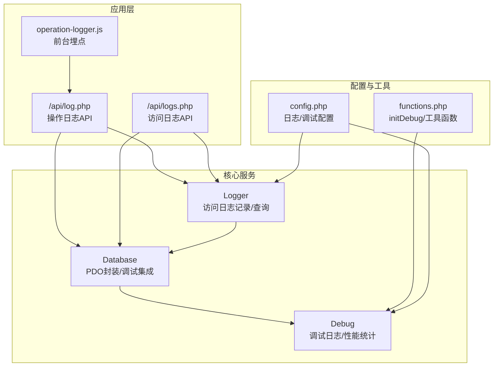
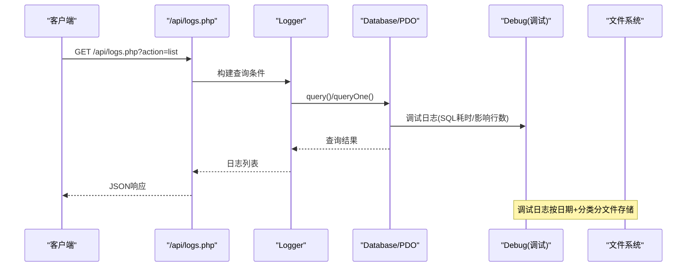
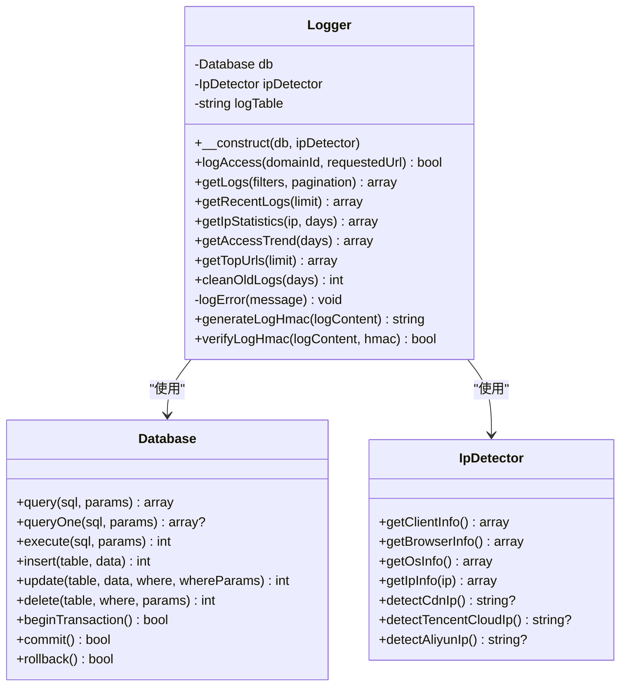
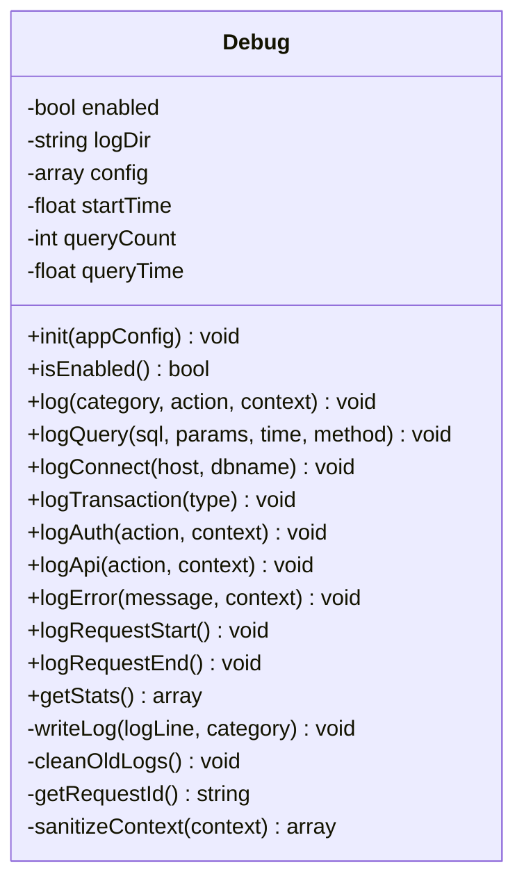
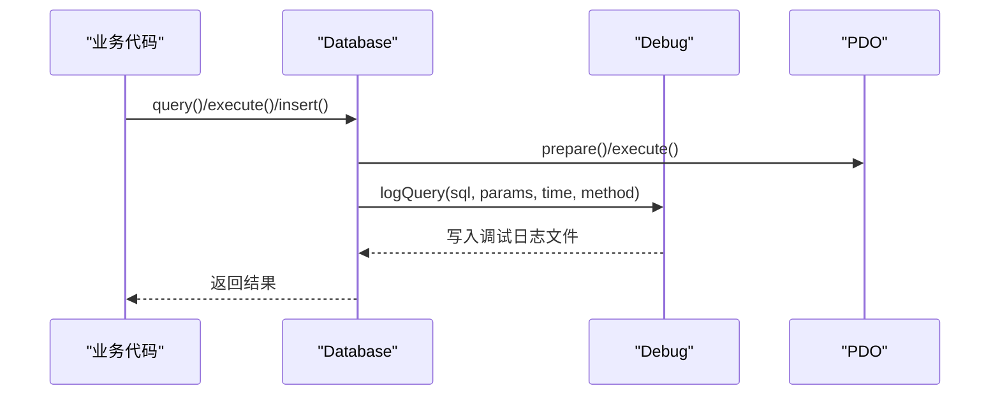
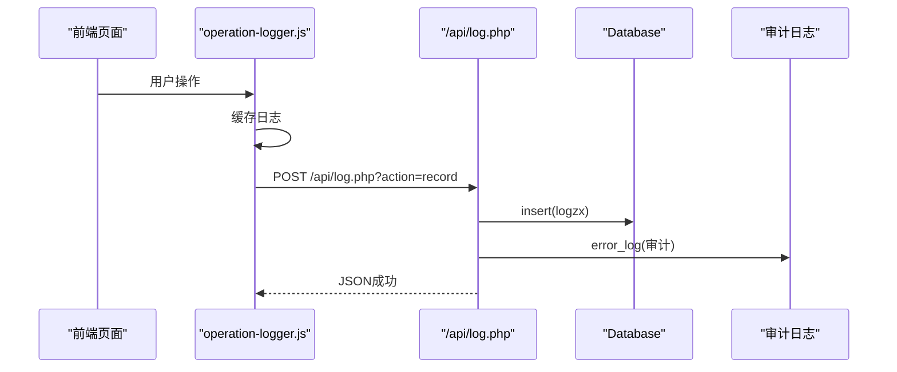
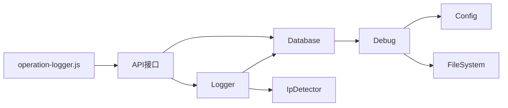

# 日志记录系统

<cite>
**本文引用的文件**
- [Logger.php](file://core/Logger.php)
- [Debug.php](file://core/Debug.php)
- [Database.php](file://core/Database.php)
- [config.php](file://config/config.php)
- [functions.php](file://includes/functions.php)
- [log.php](file://public/api/log.php)
- [logs.php](file://public/api/logs.php)
- [operation-logger.js](file://public/assets/js/operation-logger.js)
</cite>

## 目录
1. [简介](#简介)
2. [项目结构](#项目结构)
3. [核心组件](#核心组件)
4. [架构概览](#架构概览)
5. [详细组件分析](#详细组件分析)
6. [依赖关系分析](#依赖关系分析)
7. [性能考量](#性能考量)
8. [故障排查指南](#故障排查指南)
9. [结论](#结论)
10. [附录](#附录)

## 简介
本文件面向DNS拦截响应平台的日志记录系统，重点解析Logger类与Debug类的设计理念与实现原理，涵盖多级别日志记录（error、warning、info、debug）、日志格式标准化、时间戳记录、调用栈追踪、日志文件组织结构、轮转策略、存储位置配置、性能优化（异步写入、缓冲机制、磁盘空间管理）、日志分析方法与常见格式解读、故障排查技巧以及配置选项与自定义扩展方法。文档旨在帮助开发者快速理解并高效使用该日志体系，同时提供安全与性能方面的最佳实践建议。

## 项目结构
日志系统由以下关键模块组成：
- 核心日志类：Logger（访问日志记录与查询）、Debug（调试日志与性能统计）
- 数据访问层：Database（封装PDO，集成调试日志）
- 配置中心：config.php（日志与调试开关、存储路径、轮转策略等）
- 公共函数：functions.php（调试初始化、便捷函数）
- API接口：public/api下的日志API（操作日志与访问日志的增删查统计）
- 前端埋点：operation-logger.js（前台操作日志采集）

图表来源
- [Logger.php:14-472](file://core/Logger.php#L14-L472)
- [Debug.php:17-336](file://core/Debug.php#L17-L336)
- [Database.php:13-400](file://core/Database.php#L13-L400)
- [config.php:107-133](file://config/config.php#L107-L133)
- [functions.php:43-70](file://includes/functions.php#L43-L70)
- [log.php:1-454](file://public/api/log.php#L1-L454)
- [logs.php:1-595](file://public/api/logs.php#L1-L595)
- [operation-logger.js:1-429](file://public/assets/js/operation-logger.js#L1-L429)

章节来源
- [Logger.php:14-472](file://core/Logger.php#L14-L472)
- [Debug.php:17-336](file://core/Debug.php#L17-L336)
- [Database.php:13-400](file://core/Database.php#L13-L400)
- [config.php:107-133](file://config/config.php#L107-L133)
- [functions.php:43-70](file://includes/functions.php#L43-L70)
- [log.php:1-454](file://public/api/log.php#L1-L454)
- [logs.php:1-595](file://public/api/logs.php#L1-L595)
- [operation-logger.js:1-429](file://public/assets/js/operation-logger.js#L1-L429)

## 核心组件
- Logger：负责访问日志的采集、入库、查询、统计与清理；提供IP统计、访问趋势、热门URL排行等能力；内置错误日志文件落盘，避免日志失败影响主流程。
- Debug：在调试模式下记录数据库连接、SQL查询、事务、认证、API请求、错误异常等；按日期+分类分文件存储，支持轮转与过期清理；提供请求生命周期统计与敏感信息脱敏。
- Database：封装PDO，统一执行查询、插入、更新、删除与事务；在调试模式下自动记录SQL执行耗时、影响行数等信息。
- 配置与工具：config.php集中管理日志/调试开关、存储路径、轮转策略；functions.php提供initDebug初始化与全局debug_log便捷函数。

章节来源
- [Logger.php:14-472](file://core/Logger.php#L14-L472)
- [Debug.php:17-336](file://core/Debug.php#L17-L336)
- [Database.php:13-400](file://core/Database.php#L13-L400)
- [config.php:107-133](file://config/config.php#L107-L133)
- [functions.php:43-84](file://includes/functions.php#L43-L84)

## 架构概览
日志系统采用“双轨并行”设计：
- 访问日志（Logger）：面向业务访问轨迹，持久化到数据库，支持复杂查询与统计。
- 调试日志（Debug）：面向开发与运维排障，按分类与日期分文件，便于快速定位问题。

图表来源
- [logs.php:56-163](file://public/api/logs.php#L56-L163)
- [Logger.php:144-249](file://core/Logger.php#L144-L249)
- [Database.php:144-181](file://core/Database.php#L144-L181)
- [Debug.php:246-272](file://core/Debug.php#L246-L272)

## 详细组件分析

### Logger类分析
Logger专注于访问日志的采集与管理，具备以下特性：
- 自动采集客户端信息：真实IP、浏览器、操作系统、User-Agent、Referer、请求URL等。
- 智能IP检测：支持CDN、腾讯云、阿里云等头部识别，标注检测来源。
- 标准化入库：统一时间戳、字段截断、防注入处理，确保数据一致性。
- 查询与统计：支持多条件筛选、分页、排序；提供IP统计、访问趋势、热门URL排行等。
- 清理策略：按天清理过期日志，释放数据库空间。
- 安全完整性：提供HMAC签名生成与校验，用于检测日志篡改。

图表来源
- [Logger.php:14-472](file://core/Logger.php#L14-L472)
- [Database.php:13-400](file://core/Database.php#L13-L400)

章节来源
- [Logger.php:48-120](file://core/Logger.php#L48-L120)
- [Logger.php:144-249](file://core/Logger.php#L144-L249)
- [Logger.php:279-392](file://core/Logger.php#L279-L392)
- [Logger.php:402-413](file://core/Logger.php#L402-L413)
- [Logger.php:420-432](file://core/Logger.php#L420-L432)
- [Logger.php:443-470](file://core/Logger.php#L443-L470)

### Debug类分析
Debug在调试模式下记录系统运行过程的关键信息，具备以下特性：
- 模式控制：基于配置与IP白名单控制是否启用，支持分类开关（SQL、认证、API、错误）。
- 请求生命周期：自动记录请求开始与结束，汇总耗时、峰值内存、SQL查询次数与总耗时。
- 分类日志：提供logQuery、logConnect、logTransaction、logAuth、logApi、logError等便捷方法。
- 文件组织：按日期+分类分文件，支持单文件大小限制与文件数量上限的轮转清理。
- 敏感信息脱敏：对密码、Token、密钥等敏感键进行掩码处理。
- 请求追踪：生成唯一请求ID，便于跨模块日志关联。

图表来源
- [Debug.php:17-336](file://core/Debug.php#L17-L336)

章节来源
- [Debug.php:42-75](file://core/Debug.php#L42-L75)
- [Debug.php:92-128](file://core/Debug.php#L92-L128)
- [Debug.php:138-171](file://core/Debug.php#L138-L171)
- [Debug.php:246-272](file://core/Debug.php#L246-L272)
- [Debug.php:277-304](file://core/Debug.php#L277-L304)
- [Debug.php:309-316](file://core/Debug.php#L309-L316)
- [Debug.php:321-334](file://core/Debug.php#L321-L334)

### Database与调试集成
Database在调试模式下自动记录SQL执行细节，包括：
- SQL语句格式化（去冗余空白）
- 执行耗时、影响行数、方法类型
- 表名、最后插入ID等上下文信息
- 事务开始/提交/回滚的调试日志

图表来源
- [Database.php:144-181](file://core/Database.php#L144-L181)
- [Database.php:314-345](file://core/Database.php#L314-L345)
- [Database.php:380-390](file://core/Database.php#L380-L390)
- [Debug.php:138-155](file://core/Debug.php#L138-L155)

章节来源
- [Database.php:104-122](file://core/Database.php#L104-L122)
- [Database.php:380-390](file://core/Database.php#L380-L390)

### 日志API与前端埋点
- 操作日志API：支持记录、查询、统计、清空；包含CSRF防护、频率限制、权限校验与审计日志。
- 访问日志API：支持列表查询、统计、导出（CSV/JSON）、清理旧日志、封禁IP等。
- 前端埋点：operation-logger.js自动采集页面访问、操作事件，支持离线缓存与页面卸载时发送。

图表来源
- [operation-logger.js:41-429](file://public/assets/js/operation-logger.js#L41-L429)
- [log.php:50-191](file://public/api/log.php#L50-L191)

章节来源
- [log.php:50-191](file://public/api/log.php#L50-L191)
- [logs.php:56-163](file://public/api/logs.php#L56-L163)
- [operation-logger.js:41-429](file://public/assets/js/operation-logger.js#L41-L429)

## 依赖关系分析
- Logger依赖Database与IpDetector，用于数据持久化与客户端信息采集。
- Debug依赖配置与文件系统，按分类与日期分文件存储。
- Database在调试模式下依赖Debug进行SQL调试日志记录。
- API层通过Logger与Database完成业务日志的增删查统计。
- 前端operation-logger.js通过API上报操作日志。

图表来源
- [Logger.php:14-472](file://core/Logger.php#L14-L472)
- [Debug.php:17-336](file://core/Debug.php#L17-L336)
- [Database.php:13-400](file://core/Database.php#L13-L400)
- [config.php:107-133](file://config/config.php#L107-L133)
- [log.php:1-454](file://public/api/log.php#L1-L454)
- [logs.php:1-595](file://public/api/logs.php#L1-L595)
- [operation-logger.js:1-429](file://public/assets/js/operation-logger.js#L1-L429)

章节来源
- [Logger.php:14-472](file://core/Logger.php#L14-L472)
- [Debug.php:17-336](file://core/Debug.php#L17-L336)
- [Database.php:13-400](file://core/Database.php#L13-L400)
- [config.php:107-133](file://config/config.php#L107-L133)
- [log.php:1-454](file://public/api/log.php#L1-L454)
- [logs.php:1-595](file://public/api/logs.php#L1-L595)
- [operation-logger.js:1-429](file://public/assets/js/operation-logger.js#L1-L429)

## 性能考量
- 异步与非阻塞：Logger在数据库写入失败时仅记录系统错误日志，避免阻塞主流程；调试日志采用文件追加写入，必要时可引入队列或异步处理器。
- 缓冲与批处理：前端operation-logger.js支持离线缓存与批量发送，减少网络开销；API侧对批量日志写入设置了上限（等保安全要求）。
- 磁盘空间管理：Debug类支持单文件大小限制与文件数量上限的轮转清理；Logger提供按天清理过期日志的策略。
- 查询优化：Logger的查询接口对排序字段进行白名单校验，防止注入；SQL使用参数绑定，避免拼接风险。
- 资源占用：Debug统计请求耗时、内存峰值与SQL查询次数，便于发现性能瓶颈。

章节来源
- [Logger.php:115-120](file://core/Logger.php#L115-L120)
- [Logger.php:402-413](file://core/Logger.php#L402-L413)
- [Debug.php:257-272](file://core/Debug.php#L257-L272)
- [Debug.php:277-304](file://core/Debug.php#L277-L304)
- [operation-logger.js:384-392](file://public/assets/js/operation-logger.js#L384-L392)
- [log.php:118-124](file://public/api/log.php#L118-L124)

## 故障排查指南
- 调试模式启用：通过config.php的debug配置项开启调试模式，并设置允许的IP白名单；functions.php会在请求入口初始化调试日志。
- 日志查看：调试日志按日期+分类分文件存储在storage/logs/debug/目录；访问日志存储在数据库access_logs表中，可通过API进行查询与导出。
- 常见问题定位：
  - 数据库连接失败：查看调试日志中的连接失败记录与错误上下文。
  - SQL性能问题：通过调试日志中的SQL耗时、影响行数与查询次数进行分析。
  - 访问异常：通过访问日志API查询IP、浏览器、域名等维度，结合审计日志定位问题。
- 安全事件追踪：操作日志API支持批量记录与审计日志，配合CSRF防护与频率限制，确保日志真实性与完整性。

章节来源
- [config.php:123-133](file://config/config.php#L123-L133)
- [functions.php:43-70](file://includes/functions.php#L43-L70)
- [Database.php:114-121](file://core/Database.php#L114-L121)
- [log.php:186-190](file://public/api/log.php#L186-L190)
- [logs.php:56-163](file://public/api/logs.php#L56-L163)

## 结论
该日志系统通过Logger与Debug的协同，实现了业务访问日志与开发调试日志的分离与互补。Logger专注于数据持久化与统计分析，Debug专注于运行时可观测性与性能监控。系统在安全性、性能与可维护性方面均有良好设计，适合在生产环境中稳定运行。建议在生产环境谨慎开启调试模式，并结合轮转策略与磁盘空间管理，确保长期稳定运行。

## 附录

### 日志级别与格式
- 日志级别：error、warning、info、debug（由配置决定启用范围）。
- 格式规范：统一时间戳、分类、请求ID、操作描述、上下文JSON、内存与耗时统计。
- 敏感信息脱敏：对密码、Token、密钥等敏感键进行掩码处理。

章节来源
- [Debug.php:92-128](file://core/Debug.php#L92-L128)
- [Debug.php:321-334](file://core/Debug.php#L321-L334)

### 存储位置与轮转策略
- 存储位置：调试日志默认存储在storage/logs/debug/目录；系统错误日志（Logger内部）默认存储在storage/logs/目录。
- 轮转策略：单文件大小超过阈值时重命名为“.1”；定期清理超出文件数量上限的历史文件。
- 访问日志清理：按天清理过期记录，释放数据库空间。

章节来源
- [config.php:110-115](file://config/config.php#L110-L115)
- [config.php:126](file://config/config.php#L126)
- [Debug.php:257-272](file://core/Debug.php#L257-L272)
- [Debug.php:277-304](file://core/Debug.php#L277-L304)
- [Logger.php:402-413](file://core/Logger.php#L402-L413)

### 配置选项与自定义扩展
- 配置项：
  - logging.enabled：是否启用日志
  - logging.log_dir：日志目录
  - logging.log_level：日志级别
  - logging.max_log_days：日志保留天数
  - debug.enabled：调试模式开关
  - debug.allowed_ips：允许开启调试的IP白名单
  - debug.log_dir：调试日志目录
  - debug.log_queries/log_auth/log_api/log_errors：分类开关
  - debug.max_file_size/max_files：文件大小与数量限制
- 自定义扩展：
  - 可在业务代码中调用\includes\functions.php提供的debug_log便捷函数。
  - 可在Logger中扩展新的统计维度或查询条件。
  - 可在Debug中新增分类或增强上下文信息。

章节来源
- [config.php:107-133](file://config/config.php#L107-L133)
- [functions.php:79-84](file://includes/functions.php#L79-L84)
- [Logger.php:144-249](file://core/Logger.php#L144-L249)
- [Debug.php:92-128](file://core/Debug.php#L92-L128)