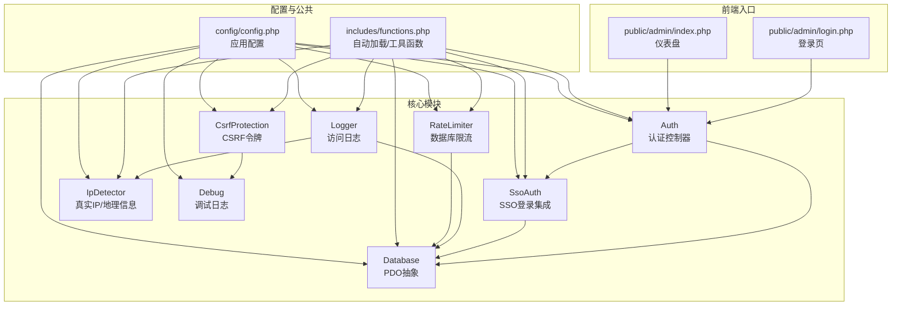
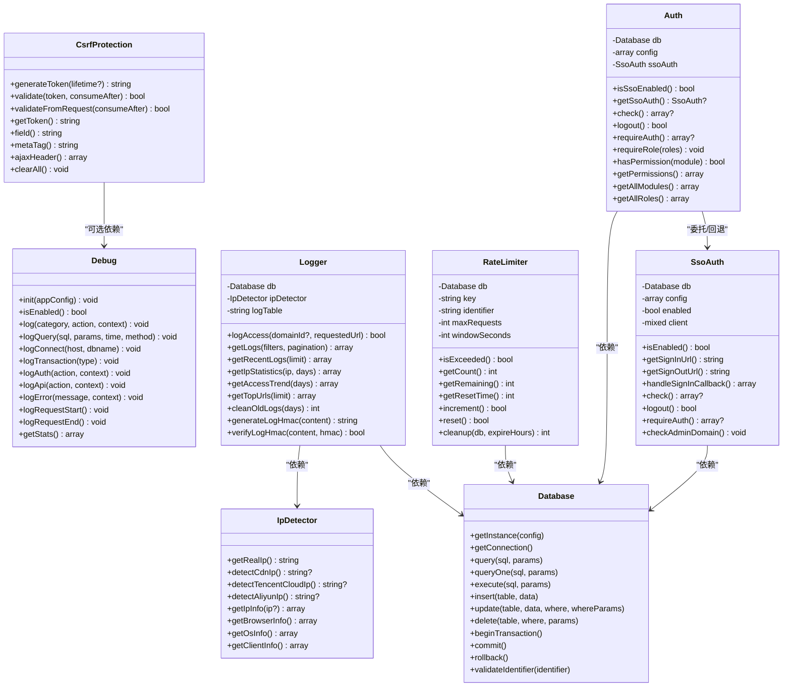
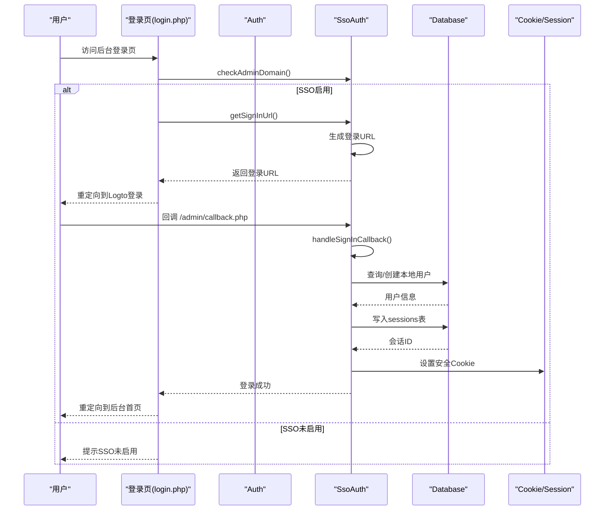
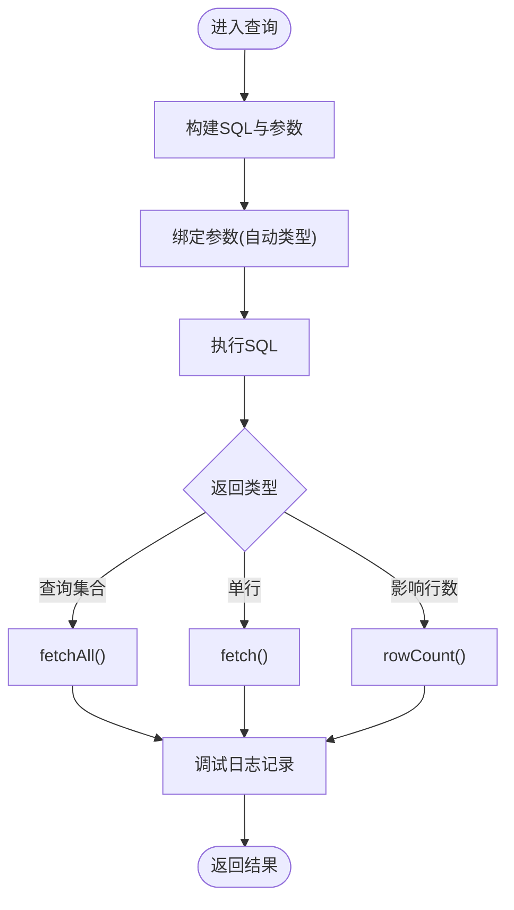
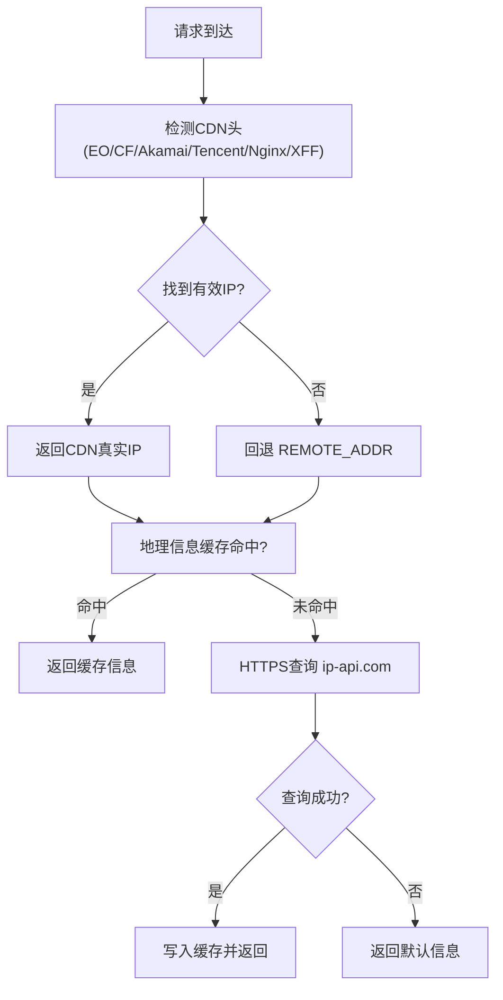
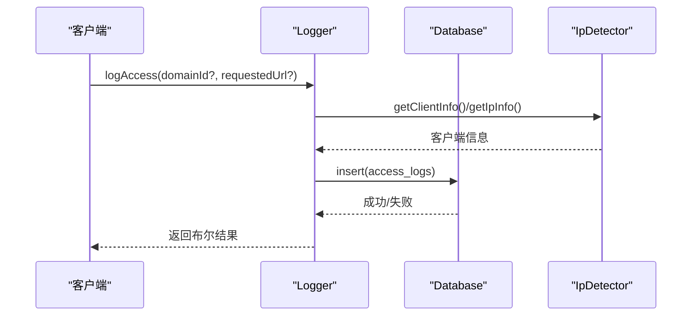
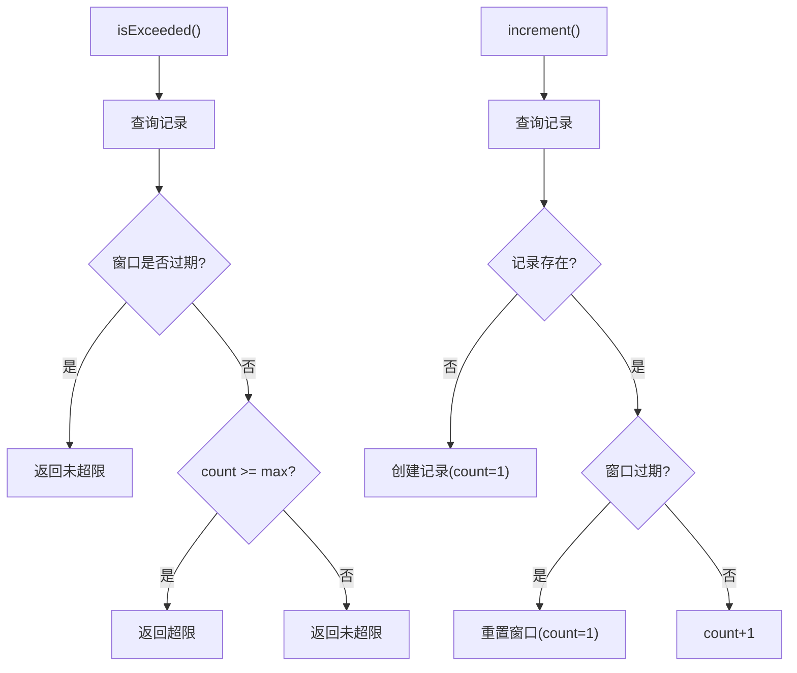
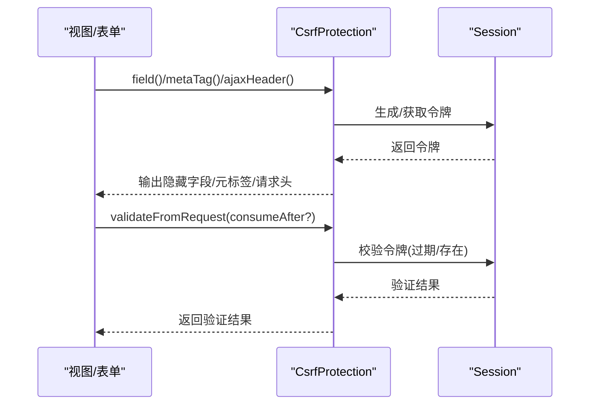
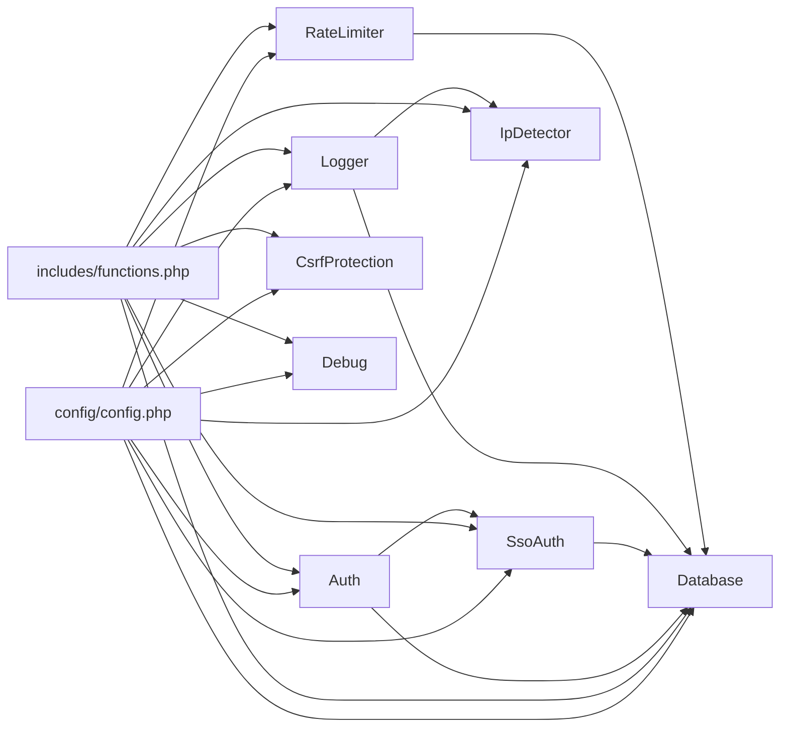

# 核心模块

<cite>
**本文引用的文件**
- [Auth.php](file://core/Auth.php)
- [SsoAuth.php](file://core/SsoAuth.php)
- [Database.php](file://core/Database.php)
- [IpDetector.php](file://core/IpDetector.php)
- [Logger.php](file://core/Logger.php)
- [RateLimiter.php](file://core/RateLimiter.php)
- [CsrfProtection.php](file://core/CsrfProtection.php)
- [Debug.php](file://core/Debug.php)
- [functions.php](file://includes/functions.php)
- [config.php](file://config/config.php)
- [login.php](file://public/admin/login.php)
- [index.php](file://public/admin/index.php)
</cite>

## 目录
1. [简介](#简介)
2. [项目结构](#项目结构)
3. [核心组件](#核心组件)
4. [架构总览](#架构总览)
5. [详细组件分析](#详细组件分析)
6. [依赖关系分析](#依赖关系分析)
7. [性能考量](#性能考量)
8. [故障排查指南](#故障排查指南)
9. [结论](#结论)
10. [附录](#附录)

## 简介
本文件面向DNS拦截响应平台的核心模块，系统性梳理认证系统（Auth、SsoAuth）、数据库抽象层（Database）、IP检测（IpDetector）、日志记录（Logger）、速率限制（RateLimiter）、CSRF防护（CsrfProtection）等关键组件的功能职责、实现原理与使用方法。文档同时解释模块间的依赖关系与协作机制，提供可操作的配置说明、扩展点与最佳实践，帮助开发者理解与维护系统。

## 项目结构
项目采用“核心模块 + 配置 + 公共函数 + 前端入口”的分层组织：
- 核心模块位于 core/，封装认证、数据库、IP检测、日志、限流、CSRF等能力
- 配置位于 config/，集中管理数据库、站点、会话、安全、日志、调试、SSO等配置
- includes/ 提供自动加载与公共函数（如输入清理、CSRF令牌、URL/文件工具）
- public/ 为前端入口与页面，如后台登录页、仪表盘等
- storage/ 用于安装锁与日志目录

图表来源
- [Auth.php:1-272](file://core/Auth.php#L1-L272)
- [SsoAuth.php:1-505](file://core/SsoAuth.php#L1-L505)
- [Database.php:1-400](file://core/Database.php#L1-L400)
- [IpDetector.php:1-651](file://core/IpDetector.php#L1-L651)
- [Logger.php:1-472](file://core/Logger.php#L1-L472)
- [RateLimiter.php:1-309](file://core/RateLimiter.php#L1-L309)
- [CsrfProtection.php:1-298](file://core/CsrfProtection.php#L1-L298)
- [Debug.php:1-336](file://core/Debug.php#L1-L336)
- [functions.php:1-800](file://includes/functions.php#L1-L800)
- [config.php:1-152](file://config/config.php#L1-L152)
- [login.php:1-337](file://public/admin/login.php#L1-L337)
- [index.php:1-374](file://public/admin/index.php#L1-L374)

章节来源
- [config.php:1-152](file://config/config.php#L1-L152)
- [functions.php:1-800](file://includes/functions.php#L1-L800)

## 核心组件
- 认证系统（Auth、SsoAuth）：负责管理员会话校验、角色权限、SSO登录/登出、后台域名白名单检查
- 数据库抽象层（Database）：单例PDO封装，提供查询、事务、参数绑定、标识符校验、调试日志
- IP检测（IpDetector）：多层CDN/IP头检测、真实IP识别、地理信息查询、浏览器/OS识别、SSRF防护
- 日志记录（Logger）：访问日志采集、查询/筛选/分页、统计与趋势、日志清理、日志完整性保护
- 速率限制（RateLimiter）：基于数据库的时间窗口限流，支持重置、剩余计算、清理过期记录
- CSRF防护（CsrfProtection）：基于Session的令牌生成/验证、多令牌管理、AJAX头支持、令牌消费
- 调试日志（Debug）：按分类记录请求、SQL、事务、认证、API、错误等，支持敏感信息脱敏与轮转

章节来源
- [Auth.php:1-272](file://core/Auth.php#L1-L272)
- [SsoAuth.php:1-505](file://core/SsoAuth.php#L1-L505)
- [Database.php:1-400](file://core/Database.php#L1-L400)
- [IpDetector.php:1-651](file://core/IpDetector.php#L1-L651)
- [Logger.php:1-472](file://core/Logger.php#L1-L472)
- [RateLimiter.php:1-309](file://core/RateLimiter.php#L1-L309)
- [CsrfProtection.php:1-298](file://core/CsrfProtection.php#L1-L298)
- [Debug.php:1-336](file://core/Debug.php#L1-L336)

## 架构总览
核心模块围绕“配置驱动 + 依赖注入 + 统一抽象”的设计原则构建：
- 配置集中于 config/config.php，核心模块通过构造函数接收配置数组
- Database 采用单例模式，避免重复连接；其他模块通过依赖注入获得实例
- Auth 作为门面，协调 SsoAuth 与本地会话；SsoAuth 与 Database 紧密耦合以完成用户同步与会话持久化
- Logger 依赖 Database 与 IpDetector，形成“采集-入库-查询-统计”的闭环
- RateLimiter 依赖 Database，提供跨进程/跨实例的强一致限流
- CsrfProtection 依赖 Session，提供表单与AJAX双重防护

图表来源
- [Auth.php:1-272](file://core/Auth.php#L1-L272)
- [SsoAuth.php:1-505](file://core/SsoAuth.php#L1-L505)
- [Database.php:1-400](file://core/Database.php#L1-L400)
- [IpDetector.php:1-651](file://core/IpDetector.php#L1-L651)
- [Logger.php:1-472](file://core/Logger.php#L1-L472)
- [RateLimiter.php:1-309](file://core/RateLimiter.php#L1-L309)
- [CsrfProtection.php:1-298](file://core/CsrfProtection.php#L1-L298)
- [Debug.php:1-336](file://core/Debug.php#L1-L336)

## 详细组件分析

### 认证系统（Auth、SsoAuth）
- Auth
  - 职责：管理员会话检查、角色权限校验、后台域名白名单检查、SSO开关与回退
  - 关键点：支持SSO启用时优先使用 SsoAuth，否则回退到本地逻辑；权限模型支持预设角色模板与自定义权限；提供模块级权限清单
  - 使用场景：后台页面 requireAuth()、requireRole()、hasPermission()、getPermissions()

- SsoAuth
  - 职责：Logto SDK集成，登录/登出URL生成，回调处理，用户同步与本地会话创建，SSO会话校验与清理
  - 关键点：SDK可用性检测、配置校验、自动创建/绑定用户、会话持久化与User-Agent校验、Cookie安全配置
  - 使用场景：登录页 getSignInUrl()、回调 handleSignInCallback()、check()/logout()、后台域名白名单检查

图表来源
- [login.php:1-337](file://public/admin/login.php#L1-L337)
- [Auth.php:1-272](file://core/Auth.php#L1-L272)
- [SsoAuth.php:1-505](file://core/SsoAuth.php#L1-L505)
- [Database.php:1-400](file://core/Database.php#L1-L400)

章节来源
- [Auth.php:1-272](file://core/Auth.php#L1-L272)
- [SsoAuth.php:1-505](file://core/SsoAuth.php#L1-L505)
- [login.php:1-337](file://public/admin/login.php#L1-L337)

### 数据库抽象层（Database）
- 职责：单例PDO连接、SQL执行、参数绑定、事务、标识符校验、调试日志
- 关键点：配置校验（用户名/密码必填）、PDO选项兼容（索引/关联数组）、SSL/TLS连接、参数自动类型绑定、SQL注入防护（标识符校验、WHERE白名单字符检查、命名参数转位置参数）
- 使用场景：所有模块的CRUD与事务操作

图表来源
- [Database.php:144-181](file://core/Database.php#L144-L181)
- [Database.php:189-206](file://core/Database.php#L189-L206)
- [Database.php:380-390](file://core/Database.php#L380-L390)

章节来源
- [Database.php:1-400](file://core/Database.php#L1-L400)

### IP检测（IpDetector）
- 职责：多层CDN/IP头检测、真实IP识别、地理信息查询、浏览器/OS识别、SSRF防护
- 关键点：严格IP验证、内网地址拒绝、HTTPS查询、DNS绑定防Rebinding、缓存降级（APCu/文件）
- 使用场景：Logger采集、访问日志记录、安全审计

图表来源
- [IpDetector.php:31-47](file://core/IpDetector.php#L31-L47)
- [IpDetector.php:62-121](file://core/IpDetector.php#L62-L121)
- [IpDetector.php:226-316](file://core/IpDetector.php#L226-L316)

章节来源
- [IpDetector.php:1-651](file://core/IpDetector.php#L1-L651)

### 日志记录（Logger）
- 职责：访问日志采集、查询/筛选/分页、统计与趋势、日志清理、日志完整性保护（HMAC）
- 关键点：客户端信息采集（真实IP/浏览器/OS/Referer/UA）、检测来源判定、关键词搜索、统计接口、日志完整性保护
- 使用场景：后台访问审计、运营分析、合规留存

图表来源
- [Logger.php:48-120](file://core/Logger.php#L48-L120)
- [Logger.php:144-249](file://core/Logger.php#L144-L249)
- [Logger.php:443-470](file://core/Logger.php#L443-L470)

章节来源
- [Logger.php:1-472](file://core/Logger.php#L1-L472)

### 速率限制（RateLimiter）
- 职责：基于数据库的时间窗口限流，支持跨进程/跨实例一致性
- 关键点：表自动创建、窗口重置、计数增加、剩余计算、清理过期记录
- 使用场景：API限流、验证码发送、聊天发送等高频操作

图表来源
- [RateLimiter.php:76-160](file://core/RateLimiter.php#L76-L160)
- [RateLimiter.php:178-252](file://core/RateLimiter.php#L178-L252)
- [RateLimiter.php:257-285](file://core/RateLimiter.php#L257-L285)

章节来源
- [RateLimiter.php:1-309](file://core/RateLimiter.php#L1-L309)

### CSRF防护（CsrfProtection）
- 职责：生成/验证CSRF令牌，支持多令牌、令牌消费、AJAX头传递
- 关键点：时间安全比较、令牌过期清理、向后兼容单令牌、AJAX请求令牌来源
- 使用场景：表单提交、状态变更API、会话清理

图表来源
- [CsrfProtection.php:204-233](file://core/CsrfProtection.php#L204-L233)
- [CsrfProtection.php:144-161](file://core/CsrfProtection.php#L144-L161)
- [CsrfProtection.php:78-123](file://core/CsrfProtection.php#L78-L123)

章节来源
- [CsrfProtection.php:1-298](file://core/CsrfProtection.php#L1-L298)

### 调试日志（Debug）
- 职责：按分类记录请求、SQL、事务、认证、API、错误等，支持敏感信息脱敏与轮转
- 关键点：IP白名单限制、分类开关、上下文脱敏、文件轮转、请求聚合统计
- 使用场景：开发调试、性能分析、问题定位

章节来源
- [Debug.php:1-336](file://core/Debug.php#L1-L336)

## 依赖关系分析
- 模块耦合
  - Auth 依赖 SsoAuth 与 Database；SsoAuth 依赖 Database
  - Logger 依赖 Database 与 IpDetector
  - RateLimiter 依赖 Database
  - CsrfProtection 依赖 Session（通过函数封装）
  - Debug 为横切关注点，被各模块有条件地使用
- 外部依赖
  - Logto SDK（可选）：SsoAuth 通过 class_exists 检测可用性
  - cURL：IpDetector 的HTTP请求与DNS绑定
  - APCu/文件缓存：IpDetector 的地理信息缓存降级
- 配置驱动
  - config/config.php 提供数据库、站点、会话、安全、日志、调试、SSO等配置
  - includes/functions.php 提供自动加载与公共函数（如 getDomainFromRequest、getCurrentAdminHost、getClientIp、jsonResponse 等）

图表来源
- [config.php:1-152](file://config/config.php#L1-L152)
- [functions.php:1-800](file://includes/functions.php#L1-L800)
- [Auth.php:1-272](file://core/Auth.php#L1-L272)
- [SsoAuth.php:1-505](file://core/SsoAuth.php#L1-L505)
- [Database.php:1-400](file://core/Database.php#L1-L400)
- [IpDetector.php:1-651](file://core/IpDetector.php#L1-L651)
- [Logger.php:1-472](file://core/Logger.php#L1-L472)
- [RateLimiter.php:1-309](file://core/RateLimiter.php#L1-L309)
- [CsrfProtection.php:1-298](file://core/CsrfProtection.php#L1-L298)
- [Debug.php:1-336](file://core/Debug.php#L1-L336)

章节来源
- [config.php:1-152](file://config/config.php#L1-L152)
- [functions.php:1-800](file://includes/functions.php#L1-L800)

## 性能考量
- 数据库层
  - 使用单例避免重复连接，合理设置 PDO 选项（禁用模拟预处理、设置字符集）
  - 参数绑定自动类型，避免字符串拼接引发的性能与安全问题
  - 事务批量操作，减少往返开销
- IP检测
  - CDN头优先检测，减少外部API调用；地理信息缓存1小时，降低重复查询成本
  - HTTPS查询与DNS绑定，兼顾安全性与性能
- 日志
  - 访问日志异步写入（由数据库插入承担），查询接口支持分页与白名单字段过滤
  - 日志完整性保护采用HMAC，避免额外CPU开销过大
- 限流
  - 基于数据库的强一致限流，适合高并发场景；定期清理过期记录，避免表膨胀
- CSRF
  - 多令牌管理与过期清理，避免令牌过多造成Session膨胀
- 调试
  - 调试模式按IP白名单限制，避免生产环境滥用；日志轮转与大小限制，控制磁盘占用

## 故障排查指南
- SSO登录失败
  - 检查 Logto SDK 是否可用（class_exists）、配置项是否齐全（endpoint/appId/appSecret/redirectUri/postLogoutUri）
  - 查看回调处理返回的错误信息，确认用户信息提取与本地用户同步是否成功
  - 确认 Cookie 安全配置与会话有效期
- 认证绕过或白名单失效
  - 检查后台域名白名单配置与 getCurrentAdminHost() 的严格格式验证
  - 确认 Auth::checkAdminDomain() 与 SsoAuth::checkAdminDomain() 的调用时机
- 数据库连接失败
  - 检查数据库配置（host/port/dbname/user/password）与环境变量
  - 确认 SSL/TLS 配置与 CA 文件路径
- IP检测异常
  - 检查CDN头是否被正确透传，确认 IpDetector::detectCdnIp() 的优先级
  - 确认地理信息查询是否走HTTPS，检查缓存可用性
- 日志记录失败
  - 检查数据库写入异常与 PDOException 捕获
  - 确认日志目录权限与轮转策略
- 限流不生效
  - 检查 rate_limits 表是否存在与索引
  - 确认 isExceeded()/increment() 的调用时机与窗口重置逻辑
- CSRF验证失败
  - 检查令牌来源（表单隐藏字段、AJAX头、POST参数）与 consumeAfter 参数
  - 确认 Session 启动与 Cookie 安全配置

章节来源
- [SsoAuth.php:100-167](file://core/SsoAuth.php#L100-L167)
- [Auth.php:103-131](file://core/Auth.php#L103-L131)
- [Database.php:104-122](file://core/Database.php#L104-L122)
- [IpDetector.php:131-167](file://core/IpDetector.php#L131-L167)
- [Logger.php:115-120](file://core/Logger.php#L115-L120)
- [RateLimiter.php:178-190](file://core/RateLimiter.php#L178-L190)
- [CsrfProtection.php:144-161](file://core/CsrfProtection.php#L144-L161)

## 结论
本平台通过模块化的安全与基础设施组件，实现了从认证、数据库、IP检测、日志、限流到CSRF防护的完整能力闭环。配置驱动的设计使得部署与扩展更加灵活；严格的输入校验、会话与Cookie安全、SSRF防护与HTTPS查询等措施提升了系统的安全性与稳定性。建议在生产环境中：
- 严格管理配置与密钥，启用调试白名单
- 合理设置会话与CSRF令牌生命周期
- 定期清理日志与限流表，监控数据库性能
- 使用CDN与WAF进一步增强边界安全

## 附录
- 配置项概览（摘自 config/config.php）
  - 数据库：host/port/dbname/user/password/prefix/charset/collation/options/ssl
  - 站点：name/description/logo_path/contact_email/admin_url/timezone/admin_allowed_domains/cdn_local
  - 上传：max_size/max_image_size/max_video_size/allowed_images/allowed_videos/allowed_files/chat_upload_dir/evidence_upload_dir
  - 会话：lifetime/cookie_name/cookie_path/cookie_domain/cookie_secure/cookie_httponly/cookie_samesite
  - 安全：csrf_enabled/csrf_token_name/csrf_token_expire/headers（CSP/X-Content-Type-Options/X-Frame-Options/X-XSS-Protection/Referrer-Policy/Permissions-Policy）
  - 日志：enabled/log_dir/log_level/max_log_days
  - 调试：enabled/allowed_ips/log_dir/log_queries/log_auth/log_api/log_errors/max_file_size/max_files
  - Logto SSO：enabled/endpoint/appId/appSecret/redirectUri/postLogoutUri/scopes/autoCreateUser/defaultRole

章节来源
- [config.php:15-152](file://config/config.php#L15-L152)