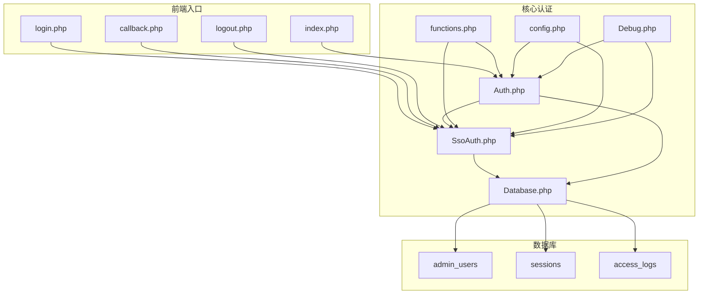
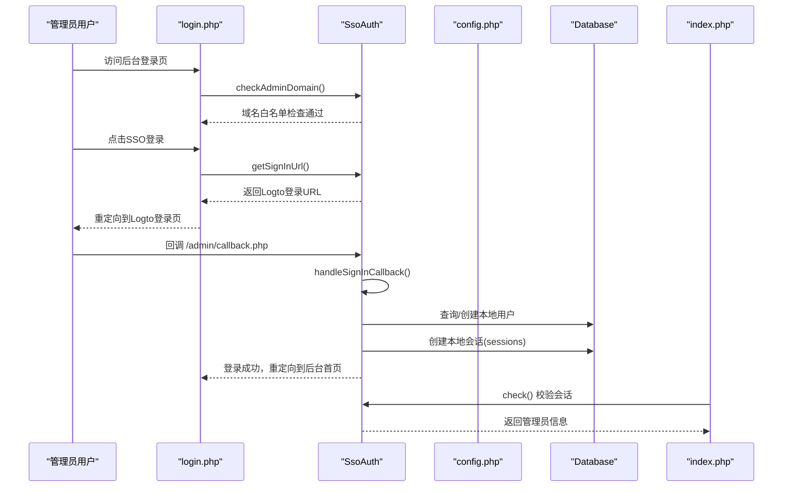
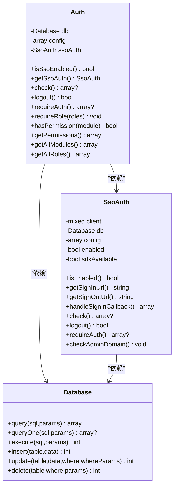
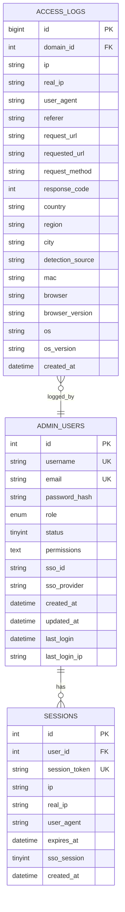

# 认证系统

<cite>
**本文引用的文件**
- [Auth.php](file://core/Auth.php)
- [SsoAuth.php](file://core/SsoAuth.php)
- [Database.php](file://core/Database.php)
- [config.php](file://config/config.php)
- [functions.php](file://includes/functions.php)
- [login.php](file://public/admin/login.php)
- [callback.php](file://public/admin/callback.php)
- [index.php](file://public/admin/index.php)
- [logout.php](file://public/admin/logout.php)
- [init.sql](file://sql/init.sql)
- [Debug.php](file://core/Debug.php)
</cite>

## 目录
1. [简介](#简介)
2. [项目结构](#项目结构)
3. [核心组件](#核心组件)
4. [架构总览](#架构总览)
5. [详细组件分析](#详细组件分析)
6. [依赖关系分析](#依赖关系分析)
7. [性能考量](#性能考量)
8. [故障排查指南](#故障排查指南)
9. [结论](#结论)
10. [附录](#附录)

## 简介
本文件面向DNS拦截响应平台的认证系统，重点围绕Auth类与SsoAuth类的设计与实现进行深入解析。内容涵盖：
- SSO单点登录集成机制与本地会话管理
- 权限验证流程、角色权限模型与模块权限控制
- 管理员认证检查、requireAuth()/requireRole()/hasPermission()等核心方法的使用方式
- 安全机制：域名白名单检查、会话管理、安全日志记录
- SSO启用/禁用配置与传统本地认证的区别
- 扩展点与自定义选项，帮助开发者理解如何修改与扩展认证功能

## 项目结构
认证系统主要分布在以下模块：
- 核心认证：core/Auth.php、core/SsoAuth.php
- 数据访问：core/Database.php
- 配置：config/config.php
- 公共工具：includes/functions.php（包含域名白名单检查、IP获取等）
- 前端入口：public/admin/login.php、public/admin/callback.php、public/admin/index.php、public/admin/logout.php
- 数据库初始化：sql/init.sql（包含admin_users、sessions等表）
- 调试日志：core/Debug.php

图表来源
- [login.php:1-337](file://public/admin/login.php#L1-L337)
- [callback.php:1-53](file://public/admin/callback.php#L1-L53)
- [index.php:1-374](file://public/admin/index.php#L1-L374)
- [logout.php:1-84](file://public/admin/logout.php#L1-L84)
- [Auth.php:1-272](file://core/Auth.php#L1-L272)
- [SsoAuth.php:1-505](file://core/SsoAuth.php#L1-L505)
- [Database.php:1-400](file://core/Database.php#L1-L400)
- [functions.php:1-998](file://includes/functions.php#L1-L998)
- [config.php:1-152](file://config/config.php#L1-L152)
- [init.sql:1-275](file://sql/init.sql#L1-L275)
- [Debug.php:1-336](file://core/Debug.php#L1-L336)

章节来源
- [Auth.php:1-272](file://core/Auth.php#L1-L272)
- [SsoAuth.php:1-505](file://core/SsoAuth.php#L1-L505)
- [Database.php:1-400](file://core/Database.php#L1-L400)
- [config.php:1-152](file://config/config.php#L1-L152)
- [functions.php:1-998](file://includes/functions.php#L1-L998)
- [login.php:1-337](file://public/admin/login.php#L1-L337)
- [callback.php:1-53](file://public/admin/callback.php#L1-L53)
- [index.php:1-374](file://public/admin/index.php#L1-L374)
- [logout.php:1-84](file://public/admin/logout.php#L1-L84)
- [init.sql:1-275](file://sql/init.sql#L1-L275)
- [Debug.php:1-336](file://core/Debug.php#L1-L336)

## 核心组件
- Auth类：统一认证入口，负责SSO开关、域名白名单检查、会话校验、权限判定、角色校验等。
- SsoAuth类：基于Logto SDK的SSO实现，负责登录回调处理、用户同步/创建、本地会话建立与校验、登出等。
- Database类：封装PDO连接与常用CRUD，为认证与权限提供数据支撑。
- functions.php：提供域名白名单检查、IP获取、CSRF令牌等公共工具函数。
- config.php：集中配置SSO、会话、安全、日志等参数。
- Debug类：调试日志记录，支持认证、SQL、API、错误等分类日志。

章节来源
- [Auth.php:11-272](file://core/Auth.php#L11-L272)
- [SsoAuth.php:10-505](file://core/SsoAuth.php#L10-L505)
- [Database.php:13-400](file://core/Database.php#L13-L400)
- [functions.php:27-998](file://includes/functions.php#L27-L998)
- [config.php:15-152](file://config/config.php#L15-L152)
- [Debug.php:17-336](file://core/Debug.php#L17-L336)

## 架构总览
认证系统采用“前端入口 + 核心认证 + 数据库”的分层设计：
- 前端入口负责渲染登录页、处理回调、展示后台首页、退出登录。
- Auth与SsoAuth协同工作：若启用SSO，则优先走SsoAuth；否则回退到Auth的域名白名单检查。
- Database提供统一的数据访问能力；functions.php提供安全工具；config.php提供集中配置；Debug提供调试日志。

图表来源
- [login.php:1-337](file://public/admin/login.php#L1-L337)
- [callback.php:1-53](file://public/admin/callback.php#L1-L53)
- [SsoAuth.php:74-167](file://core/SsoAuth.php#L74-L167)
- [SsoAuth.php:355-396](file://core/SsoAuth.php#L355-L396)
- [Database.php:144-181](file://core/Database.php#L144-L181)

## 详细组件分析

### Auth类设计与实现
- 设计要点
  - 依赖注入：接收Database与配置数组，便于测试与扩展。
  - SSO开关：通过配置判断是否启用SSO，动态创建SsoAuth实例。
  - 域名白名单：在requireAuth()中优先检查后台域名白名单，fail-safe策略。
  - 权限模型：支持角色权限与自定义权限（JSON数组），支持通配符“*”。
  - 角色模板：内置角色到模块权限的映射，覆盖常见后台模块。
  - 方法族：requireAuth()、requireRole()、hasPermission()、getPermissions()、getAllModules()、getAllRoles()。

- 关键流程
  - requireAuth()：先检查域名白名单，再检查会话，未登录则跳转登录页。
  - requireRole()：在requireAuth()基础上校验角色集合。
  - hasPermission()：支持super_admin直通、自定义权限优先、角色模板回退。
  - checkAdminDomain()：SSO启用时委托SsoAuth::checkAdminDomain()，否则使用Auth自身的白名单检查。

- 安全机制
  - 域名白名单：getCurrentAdminHost()对HTTP_HOST进行严格格式校验，防止Host头注入。
  - 会话校验：Auth::check()在SSO未启用时可复用，但主要逻辑在SsoAuth中。
  - 安全日志：Auth::checkAdminDomain()在拒绝访问时记录安全告警。

- 使用示例（方法路径）
  - requireAuth(): [Auth.php:79-94](file://core/Auth.php#L79-L94)
  - requireRole(): [Auth.php:138-145](file://core/Auth.php#L138-L145)
  - hasPermission(): [Auth.php:153-195](file://core/Auth.php#L153-L195)
  - getAllModules(): [Auth.php:240-252](file://core/Auth.php#L240-L252)
  - getAllRoles(): [Auth.php:259-270](file://core/Auth.php#L259-L270)

章节来源
- [Auth.php:11-272](file://core/Auth.php#L11-L272)
- [functions.php:356-379](file://includes/functions.php#L356-L379)

### SsoAuth类设计与实现
- 设计要点
  - SDK可用性检测：class_exists('Logto\\Sdk\\LogtoClient')确保SDK可用。
  - 配置校验：endpoint、appId、appSecret、redirectUri、postLogoutUri等必需项。
  - 登录回调：handleSignInCallback()完成用户信息提取、本地用户同步/创建、本地会话建立。
  - 本地会话：sessions表存储会话token、User-Agent校验、过期时间、SSO标记。
  - 域名白名单：checkAdminDomain()与Auth::checkAdminDomain()逻辑一致，fail-safe。
  - 登出：清除本地会话Cookie，支持SSO登出跳转。

- 关键流程
  - getSignInUrl()：生成登录URL并重定向。
  - handleSignInCallback()：处理回调、校验认证状态、同步用户、创建会话。
  - check()：校验本地会话有效性（token、过期、User-Agent一致性）。
  - logout()：删除会话记录、清除Cookie、SSO登出跳转。
  - checkAdminDomain()：域名白名单检查。

- 安全机制
  - User-Agent一致性校验：防止会话劫持。
  - 严格域名格式校验：getCurrentAdminHost()使用严格正则。
  - 会话生命周期：受config/session配置约束（等保2.0三级要求≤30分钟）。
  - 安全日志：拒绝访问时记录安全告警。

- 使用示例（方法路径）
  - getSignInUrl(): [SsoAuth.php:74-82](file://core/SsoAuth.php#L74-L82)
  - handleSignInCallback(): [SsoAuth.php:100-167](file://core/SsoAuth.php#L100-L167)
  - check(): [SsoAuth.php:355-396](file://core/SsoAuth.php#L355-L396)
  - logout(): [SsoAuth.php:401-423](file://core/SsoAuth.php#L401-L423)
  - checkAdminDomain(): [SsoAuth.php:480-503](file://core/SsoAuth.php#L480-L503)

章节来源
- [SsoAuth.php:10-505](file://core/SsoAuth.php#L10-L505)
- [functions.php:356-379](file://includes/functions.php#L356-L379)
- [config.php:68-80](file://config/config.php#L68-L80)

### 权限模型与角色模板
- 角色到模块权限映射
  - super_admin/admin：拥有所有模块权限（通配符“*”）。
  - operator：仪表盘、到期域名、审查域名、客服中心、访问记录、日志中心。
  - domain_admin：仪表盘、到期域名、审查域名。
  - support：仪表盘、客服中心。
  - security：仪表盘、IP封禁、访问记录、日志中心。
  - auditor：仪表盘、访问记录、日志中心。
- 自定义权限
  - admin_users.permissions为JSON数组，支持“*”通配符与具体模块名。
  - 若存在自定义权限，优先于角色模板。

- 使用示例（方法路径）
  - hasPermission(): [Auth.php:153-195](file://core/Auth.php#L153-L195)
  - getPermissions(): [Auth.php:202-233](file://core/Auth.php#L202-L233)
  - getAllModules(): [Auth.php:240-252](file://core/Auth.php#L240-L252)
  - getAllRoles(): [Auth.php:259-270](file://core/Auth.php#L259-L270)

章节来源
- [Auth.php:153-233](file://core/Auth.php#L153-L233)

### 会话管理与安全
- 会话存储
  - sessions表：存储user_id、session_token、ip、real_ip、user_agent、expires_at、sso_session等。
- 会话校验
  - SsoAuth::check()：校验token、过期时间、User-Agent一致性。
  - Auth::check()：在SSO未启用时可复用，但主要逻辑在SsoAuth中。
- Cookie配置
  - config/session：lifetime、cookie_name、cookie_path、cookie_domain、cookie_secure、cookie_httponly、cookie_samesite。
- 安全措施
  - User-Agent一致性校验，防止会话劫持。
  - 严格域名白名单检查，fail-safe策略。
  - 安全日志记录，便于审计。

- 使用示例（方法路径）
  - createLocalSession(): [SsoAuth.php:288-350](file://core/SsoAuth.php#L288-L350)
  - check(): [SsoAuth.php:355-396](file://core/SsoAuth.php#L355-L396)
  - logout(): [SsoAuth.php:401-423](file://core/SsoAuth.php#L401-L423)

章节来源
- [SsoAuth.php:288-396](file://core/SsoAuth.php#L288-L396)
- [config.php:68-80](file://config/config.php#L68-L80)
- [init.sql:255-272](file://sql/init.sql#L255-L272)

### SSO启用/禁用与配置
- 启用条件
  - config/logto.enabled=true
  - Logto SDK可用（class_exists）
  - endpoint、appId、appSecret、redirectUri、postLogoutUri等配置齐全
- 禁用策略
  - 任一条件不满足，Auth::isSsoEnabled()返回false，Auth::requireAuth()回退到Auth::checkAdminDomain()。
- 配置项
  - endpoint、appId、appSecret、redirectUri、postLogoutUri、scopes、autoCreateUser、defaultRole、autoBindByEmail等。
- 与传统本地认证的区别
  - 传统本地认证：Auth类可直接复用会话校验逻辑（在SSO未启用时）。
  - SSO认证：完全依赖Logto SDK，本地仅存会话token与User-Agent校验。

- 使用示例（方法路径）
  - isSsoEnabled(): [Auth.php:37-40](file://core/Auth.php#L37-L40)
  - isEnabled(): [SsoAuth.php:66-69](file://core/SsoAuth.php#L66-L69)
  - 配置项：[config.php:139-149](file://config/config.php#L139-L149)

章节来源
- [Auth.php:24-40](file://core/Auth.php#L24-L40)
- [SsoAuth.php:19-39](file://core/SsoAuth.php#L19-L39)
- [config.php:139-149](file://config/config.php#L139-L149)

### 域名白名单检查
- 作用
  - 防止非白名单域名访问后台，即使未登录也应被拒绝。
- 实现
  - Auth::checkAdminDomain()：在SSO未启用时使用。
  - SsoAuth::checkAdminDomain()：在SSO启用时使用。
  - getCurrentAdminHost()：严格校验HTTP_HOST，fail-safe策略。
- 安全日志
  - 拒绝访问时记录安全告警，包含域名、IP、URI等上下文。

- 使用示例（方法路径）
  - checkAdminDomain(): [Auth.php:103-131](file://core/Auth.php#L103-L131)
  - checkAdminDomain(): [SsoAuth.php:480-503](file://core/SsoAuth.php#L480-L503)
  - getCurrentAdminHost(): [functions.php:356-379](file://includes/functions.php#L356-L379)

章节来源
- [Auth.php:103-131](file://core/Auth.php#L103-L131)
- [SsoAuth.php:480-503](file://core/SsoAuth.php#L480-L503)
- [functions.php:356-379](file://includes/functions.php#L356-L379)

### 前端入口与认证流程
- 登录页(login.php)
  - 域名白名单检查
  - SSO启用时生成登录URL并重定向
  - 回调错误信息通过session传递
- 回调页(callback.php)
  - 域名白名单检查
  - 处理登录回调，成功则跳转后台首页，失败则回传错误信息
- 后台首页(index.php)
  - requireAuth()获取当前管理员信息
  - 展示统计与快捷操作
- 退出页(logout.php)
  - 清除本地会话
  - 若为SSO会话，尝试SSO登出
  - 跳转登录页

- 使用示例（方法路径）
  - 登录页：[login.php:30-64](file://public/admin/login.php#L30-L64)
  - 回调页：[callback.php:29-52](file://public/admin/callback.php#L29-L52)
  - 后台首页：[index.php:25-26](file://public/admin/index.php#L25-L26)
  - 退出页：[logout.php:33-83](file://public/admin/logout.php#L33-L83)

章节来源
- [login.php:1-337](file://public/admin/login.php#L1-L337)
- [callback.php:1-53](file://public/admin/callback.php#L1-L53)
- [index.php:1-374](file://public/admin/index.php#L1-L374)
- [logout.php:1-84](file://public/admin/logout.php#L1-L84)

## 依赖关系分析

图表来源
- [Auth.php:11-74](file://core/Auth.php#L11-L74)
- [SsoAuth.php:10-69](file://core/SsoAuth.php#L10-L69)
- [Database.php:13-400](file://core/Database.php#L13-L400)

章节来源
- [Auth.php:11-74](file://core/Auth.php#L11-L74)
- [SsoAuth.php:10-69](file://core/SsoAuth.php#L10-L69)
- [Database.php:13-400](file://core/Database.php#L13-L400)

## 性能考量
- 会话校验成本低：仅一次数据库查询与User-Agent字符串比较。
- 权限判定成本低：内存中的数组查找与字符串匹配。
- SSO回调处理：涉及远程SDK调用与数据库写入，注意网络延迟与数据库负载。
- 日志开销：调试模式下大量日志写入可能影响性能，生产环境建议关闭。

## 故障排查指南
- SSO未启用
  - 检查config/logto.enabled与SDK可用性
  - 参考：[Auth.php:24-40](file://core/Auth.php#L24-L40)、[SsoAuth.php:19-39](file://core/SsoAuth.php#L19-L39)
- 登录回调失败
  - 查看callback.php错误信息与日志
  - 参考：[callback.php:40-52](file://public/admin/callback.php#L40-L52)
- 会话失效
  - 检查Cookie是否存在、过期时间、User-Agent一致性
  - 参考：[SsoAuth.php:355-396](file://core/SsoAuth.php#L355-L396)
- 域名白名单拒绝
  - 检查config/site/admin_allowed_domains与getCurrentAdminHost()校验
  - 参考：[functions.php:356-379](file://includes/functions.php#L356-L379)
- 安全日志
  - 启用Debug并查看auth分类日志
  - 参考：[Debug.php:176-179](file://core/Debug.php#L176-L179)

章节来源
- [Auth.php:24-40](file://core/Auth.php#L24-L40)
- [SsoAuth.php:19-39](file://core/SsoAuth.php#L19-L39)
- [callback.php:40-52](file://public/admin/callback.php#L40-L52)
- [SsoAuth.php:355-396](file://core/SsoAuth.php#L355-L396)
- [functions.php:356-379](file://includes/functions.php#L356-L379)
- [Debug.php:176-179](file://core/Debug.php#L176-L179)

## 结论
本认证系统以Auth与SsoAuth为核心，结合严格域名白名单、会话校验与权限模型，提供了企业级的后台访问安全保障。SSO集成通过Logto SDK实现，具备良好的可扩展性；同时保留了传统本地认证的回退路径。通过配置化与模块化设计，开发者可以灵活调整SSO开关、会话策略与权限模板，满足不同部署场景的需求。

## 附录

### 常用方法使用示例（路径）
- requireAuth(): [Auth.php:79-94](file://core/Auth.php#L79-L94)
- requireRole(['admin','operator']): [Auth.php:138-145](file://core/Auth.php#L138-L145)
- hasPermission('domains_expired'): [Auth.php:153-195](file://core/Auth.php#L153-L195)
- getAllModules(): [Auth.php:240-252](file://core/Auth.php#L240-L252)
- getAllRoles(): [Auth.php:259-270](file://core/Auth.php#L259-L270)
- SsoAuth::getSignInUrl(): [SsoAuth.php:74-82](file://core/SsoAuth.php#L74-L82)
- SsoAuth::handleSignInCallback(): [SsoAuth.php:100-167](file://core/SsoAuth.php#L100-L167)
- SsoAuth::check(): [SsoAuth.php:355-396](file://core/SsoAuth.php#L355-L396)
- SsoAuth::logout(): [SsoAuth.php:401-423](file://core/SsoAuth.php#L401-L423)

### 数据模型（关键表）
- admin_users：管理员信息、角色、状态、SSO标识、权限等
- sessions：会话token、IP、User-Agent、过期时间、SSO标记
- access_logs：访问日志，用于审计与分析

图表来源
- [init.sql:12-31](file://sql/init.sql#L12-L31)
- [init.sql:257-272](file://sql/init.sql#L257-L272)
- [init.sql:94-121](file://sql/init.sql#L94-L121)