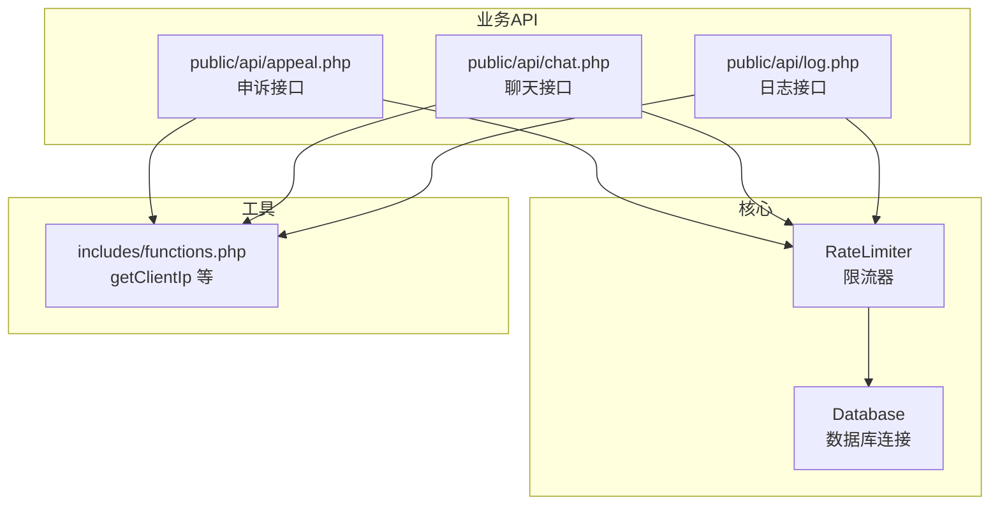
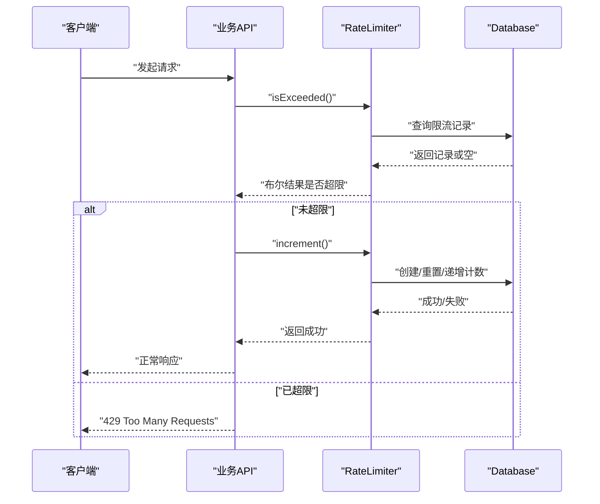
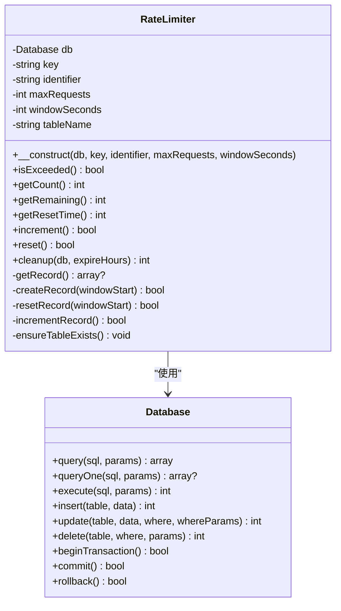
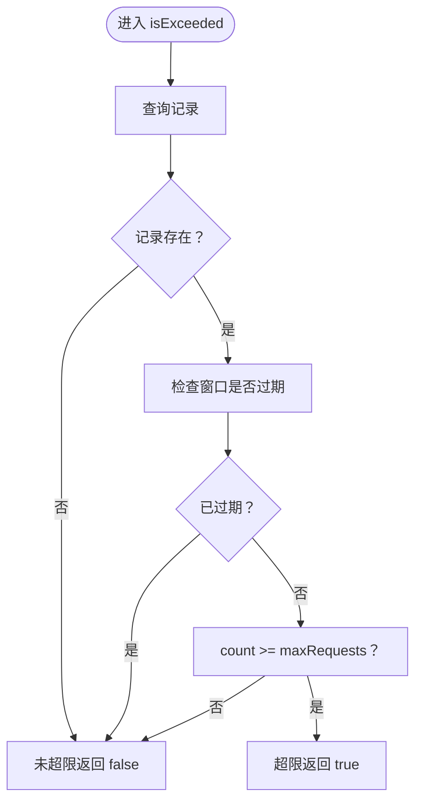
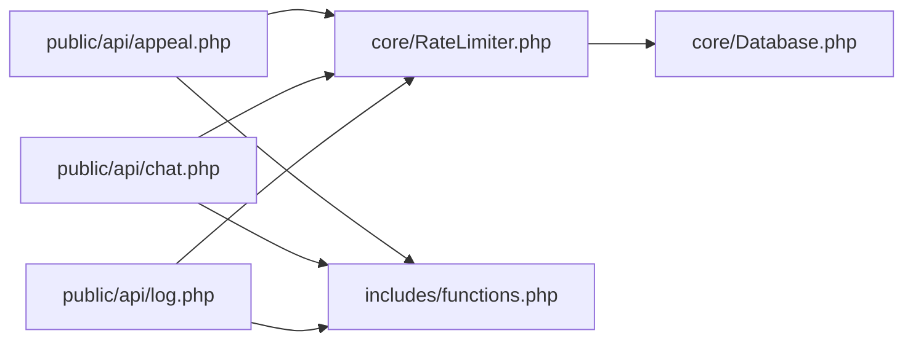

# 速率限制系统

<cite>
**本文引用的文件**
- [RateLimiter.php](file://core/RateLimiter.php)
- [Database.php](file://core/Database.php)
- [config.php](file://config/config.php)
- [appeal.php](file://public/api/appeal.php)
- [chat.php](file://public/api/chat.php)
- [log.php](file://public/api/log.php)
- [functions.php](file://includes/functions.php)
</cite>

## 目录
1. [简介](#简介)
2. [项目结构](#项目结构)
3. [核心组件](#核心组件)
4. [架构总览](#架构总览)
5. [详细组件分析](#详细组件分析)
6. [依赖关系分析](#依赖关系分析)
7. [性能考量](#性能考量)
8. [故障排查指南](#故障排查指南)
9. [结论](#结论)
10. [附录](#附录)

## 简介
本文件面向“DNS拦截响应平台”的速率限制系统，聚焦于基于数据库的限流器实现与在各业务模块中的集成实践。系统采用固定窗口（Fixed Window）策略，通过数据库表记录每个限流键（key）与标识（identifier）在时间窗口内的计数，实现跨会话、跨进程的稳定限流。文档涵盖设计原理、算法细节、配置参数、动态调整、统计与监控、性能影响与用户体验平衡，以及扩展与自定义策略的方法。

## 项目结构
- 核心限流器位于 core/RateLimiter.php，封装了限流逻辑与数据库持久化。
- 数据库连接位于 core/Database.php，为限流器提供统一的查询与写入能力。
- 业务API在 public/api 下，分别在申诉、聊天、日志等接口中集成限流。
- 通用工具函数 includes/functions.php 提供 getClientIp 等辅助方法，用于限流标识的生成与客户端识别。

图表来源
- [RateLimiter.php:1-309](file://core/RateLimiter.php#L1-L309)
- [Database.php:1-400](file://core/Database.php#L1-L400)
- [appeal.php:1-789](file://public/api/appeal.php#L1-L789)
- [chat.php:1-1161](file://public/api/chat.php#L1-L1161)
- [log.php:1-454](file://public/api/log.php#L1-L454)
- [functions.php:1-998](file://includes/functions.php#L1-L998)

章节来源
- [RateLimiter.php:1-309](file://core/RateLimiter.php#L1-L309)
- [Database.php:1-400](file://core/Database.php#L1-L400)
- [appeal.php:1-789](file://public/api/appeal.php#L1-L789)
- [chat.php:1-1161](file://public/api/chat.php#L1-L1161)
- [log.php:1-454](file://public/api/log.php#L1-L454)
- [functions.php:1-998](file://includes/functions.php#L1-L998)

## 核心组件
- RateLimiter：基于数据库的固定窗口限流器，提供 isExceeded、increment、getCount、getRemaining、getResetTime、reset、cleanup 等方法。
- Database：PDO 单例封装，提供 query、queryOne、execute、insert、update、delete、事务等数据库操作。
- 业务API：在申诉、聊天、日志等接口中按场景调用限流器，实现 IP 级、接口级、用户级等多维度限流。

章节来源
- [RateLimiter.php:25-309](file://core/RateLimiter.php#L25-L309)
- [Database.php:13-400](file://core/Database.php#L13-L400)

## 架构总览
限流系统采用“限流器 + 数据库 + 业务API”的三层架构：
- 限流器负责窗口判定、计数维护与阈值判断；
- 数据库负责持久化窗口状态；
- 业务API在关键入口处调用限流器，决定是否放行或返回限流错误。

图表来源
- [RateLimiter.php:76-160](file://core/RateLimiter.php#L76-L160)
- [Database.php:144-227](file://core/Database.php#L144-L227)
- [appeal.php:215-253](file://public/api/appeal.php#L215-L253)
- [chat.php:454-568](file://public/api/chat.php#L454-L568)
- [log.php:68-182](file://public/api/log.php#L68-L182)

## 详细组件分析

### RateLimiter 类设计与实现
- 设计要点
  - 固定窗口策略：以 windowSeconds 为窗口长度，记录窗口起始时间 window_start 与当前计数 count。
  - 唯一键约束：(limiter_key, identifier) 唯一，保证每个标识在每个限流键下独立计数。
  - 窗口过期判定：当当前时间减去 window_start 大于等于 windowSeconds 时，视为窗口过期，计数重置。
  - 原子性：创建、重置、递增均通过单条 SQL 完成，减少并发竞争风险。
  - 自动建表：首次使用时自动创建 rate_limits 表，包含索引优化查询性能。
  - 清理机制：提供静态 cleanup 方法，定期删除过期记录，避免表膨胀。

- 关键方法与行为
  - isExceeded：查询记录，判断窗口是否过期，若未过期则比较 count 与 maxRequests。
  - increment/reset/getCount/getRemaining/getResetTime：围绕记录的创建、重置、递增与读取。
  - ensureTableExists：检查并创建限流表。
  - cleanup：按时间阈值删除过期记录。

- 数据结构与复杂度
  - 表结构：包含 limiter_key、identifier、count、window_start、updated_at 等字段；唯一键与索引提升查询效率。
  - 时间复杂度：查询/更新均为 O(1)，受索引影响；清理为 O(n) 遍历删除。
  - 空间复杂度：随并发连接数与限流键数量线性增长。

- 错误处理
  - 数据库异常被捕获并记录，避免影响业务流程；查询失败返回空，计数视为 0。

- 配置参数
  - maxRequests：时间窗口内最大请求数。
  - windowSeconds：时间窗口（秒）。
  - identifier：限流标识（如 IP、用户ID、Token 等）。
  - limiter_key：限流键（如接口标识或业务域）。

图表来源
- [RateLimiter.php:25-309](file://core/RateLimiter.php#L25-L309)
- [Database.php:13-400](file://core/Database.php#L13-L400)

章节来源
- [RateLimiter.php:25-309](file://core/RateLimiter.php#L25-L309)
- [Database.php:13-400](file://core/Database.php#L13-L400)

### 限流算法实现细节
- 时间计算
  - 使用 time() 与记录的 window_start 比较，判断窗口是否过期。
- 计数器管理
  - 创建新记录时初始化 count=1，窗口过期时重置为 1；否则递增 1。
- 阈值判断
  - 未过期且 count >= maxRequests 视为超限，返回 429。

图表来源
- [RateLimiter.php:76-89](file://core/RateLimiter.php#L76-L89)

章节来源
- [RateLimiter.php:76-89](file://core/RateLimiter.php#L76-L89)

### 不同场景下的限流配置与集成

- 申诉验证码发送（IP+邮箱双维度）
  - 邮箱级限流：同一邮箱在 60 秒内最多 1 次，键为 appeal_email_{md5(email)}，标识为 getClientIp()。
  - IP 级限流：同一 IP 在 1 小时内最多 10 次，键为 appeal_verify_ip，标识为 getClientIp()。
  - 集成点：appeal.php 的 request_verification 接口。
  - 结果：超限时返回剩余秒数或分钟数，引导用户稍后再试。

- 申诉提交（IP 维度）
  - IP 级限流：同一 IP 在 1 天内最多 5 次，键为 appeal_submit_ip，标识为 getClientIp()。
  - 集成点：appeal.php 的 submit 接口。
  - 结果：超限时返回剩余小时数，引导用户稍后再试。

- 聊天消息发送（客户侧）
  - 客户消息限流：每分钟最多 5 条，键为 chat_customer + "_" + md5(token 或邮箱)，标识为 getClientIp() + "_" + md5(token 或邮箱)。
  - 集成点：chat.php 的 customer_send 接口。
  - 结果：超限时返回 429。

- 操作日志记录（IP 维度）
  - IP 级限流：每分钟最多 60 条，键为 log_record_ip，标识为 getClientIp()。
  - 集成点：log.php 的 record 接口。
  - 结果：超限时返回 429。

- 登录状态检查（建议）
  - 建议在生产环境为 check 接口添加限流，如 60 秒内最多 30 次，使用 Redis 实现滑动窗口或 APCu 实现固定窗口。
  - 集成点：auth.php 的 check 接口（注释中给出建议）。

章节来源
- [appeal.php:215-253](file://public/api/appeal.php#L215-L253)
- [appeal.php:394-399](file://public/api/appeal.php#L394-L399)
- [chat.php:454-568](file://public/api/chat.php#L454-L568)
- [log.php:68-182](file://public/api/log.php#L68-L182)
- [appeal.php:92-96](file://public/api/appeal.php#L92-L96)

### 限流系统的配置参数与动态调整
- 配置参数
  - maxRequests：时间窗口内最大请求数。
  - windowSeconds：时间窗口（秒）。
  - identifier：限流标识（如 IP、用户ID、Token 等）。
  - limiter_key：限流键（如接口标识或业务域）。
- 动态调整
  - 通过修改构造参数即可快速调整阈值与时长，无需停机。
  - 可根据业务峰值与 SLA 调整 maxRequests 与 windowSeconds。
- 统计与监控
  - RateLimiter 提供 getCount、getRemaining、getResetTime，可用于前端提示与后台统计。
  - 建议在业务层记录限流事件，结合日志系统进行趋势分析。

章节来源
- [RateLimiter.php:54-69](file://core/RateLimiter.php#L54-L69)
- [RateLimiter.php:96-135](file://core/RateLimiter.php#L96-L135)

### 性能影响与用户体验平衡
- 性能影响
  - 查询与更新均为单表单行操作，索引覆盖主要查询键，开销较小。
  - cleanup 定期清理过期记录，避免表膨胀。
- 用户体验
  - 通过 getRemaining 与 getResetTime 提示剩余次数与重置时间，提升透明度。
  - 对高频轮询场景（如登录状态检查）建议使用更细粒度的限流策略，避免误伤正常用户。

章节来源
- [RateLimiter.php:116-135](file://core/RateLimiter.php#L116-L135)
- [appeal.php:92-96](file://public/api/appeal.php#L92-L96)

### 限流系统的扩展与自定义策略
- 扩展方向
  - 滑动窗口：可在 RateLimiter 基础上引入明细计时表，按时间戳记录每次请求，实现更精确的滑动窗口。
  - 分布式缓存：结合 Redis/APCu 实现更高吞吐的限流，适合高并发场景。
  - 多维限流：在同一键下叠加用户ID、IP、UA 等维度，形成更精细的限流策略。
- 自定义策略
  - 可新增策略枚举与工厂方法，按策略类型选择不同实现（固定窗口、滑动窗口、令牌桶等）。
  - 通过配置文件集中管理策略参数，便于灰度与回滚。

[本节为概念性指导，不直接分析具体文件]

## 依赖关系分析
- RateLimiter 依赖 Database 提供的查询与写入能力。
- 业务API在请求入口处创建 RateLimiter 实例，调用 isExceeded 与 increment。
- includes/functions.php 提供 getClientIp 等工具，用于生成 identifier。

图表来源
- [appeal.php:1-789](file://public/api/appeal.php#L1-L789)
- [chat.php:1-1161](file://public/api/chat.php#L1-L1161)
- [log.php:1-454](file://public/api/log.php#L1-L454)
- [RateLimiter.php:1-309](file://core/RateLimiter.php#L1-L309)
- [Database.php:1-400](file://core/Database.php#L1-L400)
- [functions.php:1-998](file://includes/functions.php#L1-L998)

章节来源
- [RateLimiter.php:1-309](file://core/RateLimiter.php#L1-L309)
- [Database.php:1-400](file://core/Database.php#L1-L400)
- [appeal.php:1-789](file://public/api/appeal.php#L1-L789)
- [chat.php:1-1161](file://public/api/chat.php#L1-L1161)
- [log.php:1-454](file://public/api/log.php#L1-L454)
- [functions.php:1-998](file://includes/functions.php#L1-L998)

## 性能考量
- 数据库层面
  - 唯一键与索引确保查询高效；单行更新减少锁竞争。
  - 建议定期执行 cleanup，避免表过大影响性能。
- 业务层面
  - 对高频接口（如登录状态检查）建议采用更高效的限流策略（如 Redis 滑动窗口）。
  - 前端可利用 getRemaining 与 getResetTime 提示用户，减少无效重试。

[本节提供一般性建议，不直接分析具体文件]

## 故障排查指南
- 常见问题
  - 限流未生效：检查 limiter_key 与 identifier 是否正确生成；确认数据库连接正常。
  - 限流计数异常：检查窗口过期逻辑与时间同步；确认系统时间准确。
  - 性能瓶颈：观察 rate_limits 表规模，执行 cleanup；考虑引入缓存层。
- 日志与诊断
  - RateLimiter 在数据库异常时记录错误日志，便于定位问题。
  - 建议在业务层记录限流事件，结合日志系统进行趋势分析。

章节来源
- [RateLimiter.php:186-189](file://core/RateLimiter.php#L186-L189)
- [RateLimiter.php:294-307](file://core/RateLimiter.php#L294-L307)

## 结论
本速率限制系统以数据库为中心，采用固定窗口策略，具备实现简单、部署成本低、跨会话稳定的优点。通过在申诉、聊天、日志等关键接口中集成限流，有效缓解滥用与资源耗尽风险。建议在高并发场景引入缓存与滑动窗口策略，并结合统计与监控持续优化阈值与时长，实现性能与用户体验的平衡。

[本节为总结性内容，不直接分析具体文件]

## 附录

### 限流键与标识建议
- IP 级限流：identifier 为 getClientIp()，适用于对来源 IP 的统一限制。
- 接口级限流：identifier 为 getClientIp()，limiter_key 为接口标识（如 appeal_verify_ip、chat_customer、log_record_ip）。
- 用户级限流：identifier 为用户ID或 Token，适用于登录态下的精细化控制。

章节来源
- [appeal.php:215-253](file://public/api/appeal.php#L215-L253)
- [appeal.php:394-399](file://public/api/appeal.php#L394-L399)
- [chat.php:454-568](file://public/api/chat.php#L454-L568)
- [log.php:68-182](file://public/api/log.php#L68-L182)
- [functions.php:414-440](file://includes/functions.php#L414-L440)