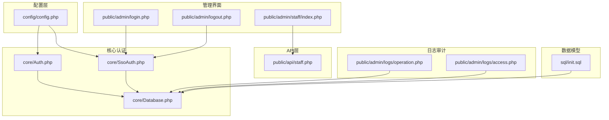
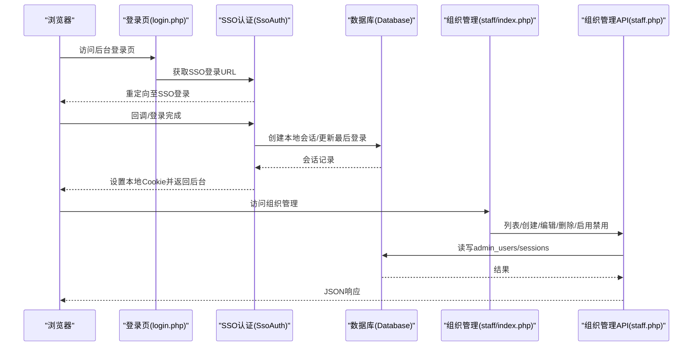
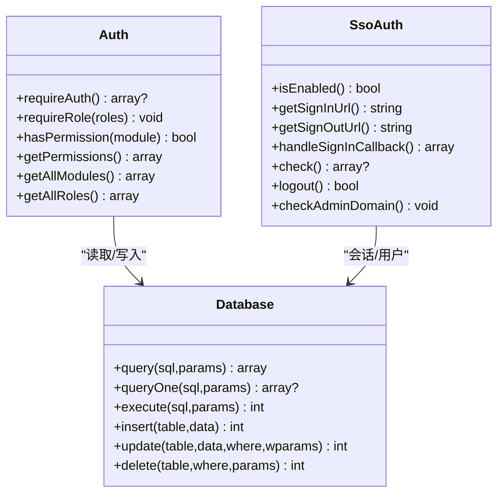
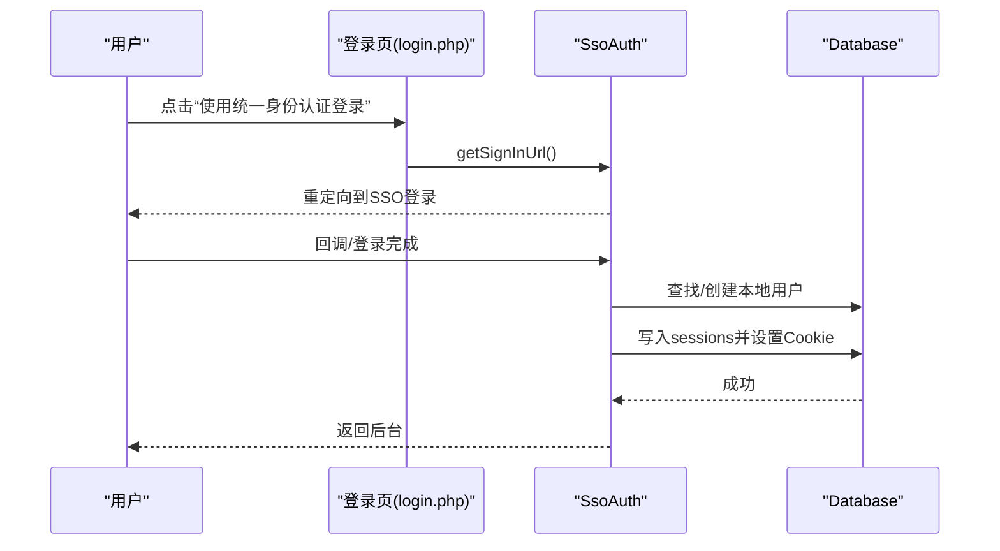
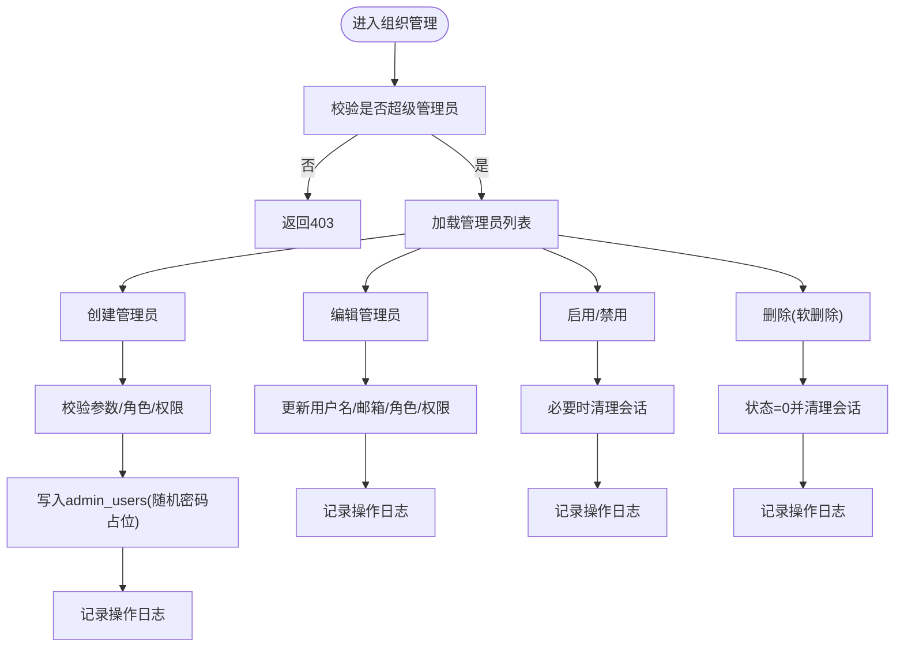
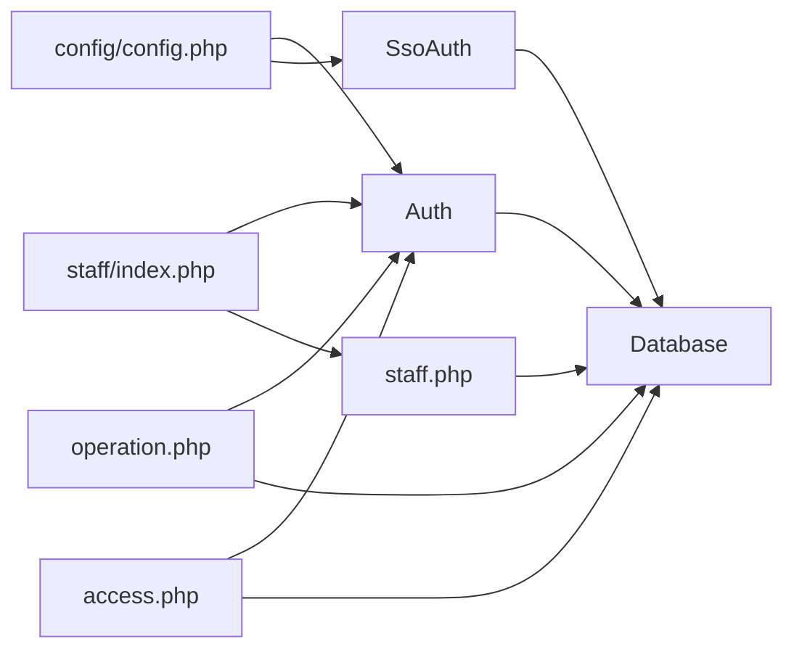

# 用户管理

<cite>
**本文引用的文件**
- [config.php](file://config/config.php)
- [Auth.php](file://core/Auth.php)
- [SsoAuth.php](file://core/SsoAuth.php)
- [Database.php](file://core/Database.php)
- [functions.php](file://includes/functions.php)
- [login.php](file://public/admin/login.php)
- [logout.php](file://public/admin/logout.php)
- [staff/index.php](file://public/admin/staff/index.php)
- [staff.php](file://public/api/staff.php)
- [operation.php](file://public/admin/logs/operation.php)
- [access.php](file://public/admin/logs/access.php)
- [init.sql](file://sql/init.sql)
</cite>

## 目录
1. [简介](#简介)
2. [项目结构](#项目结构)
3. [核心组件](#核心组件)
4. [架构总览](#架构总览)
5. [详细组件分析](#详细组件分析)
6. [依赖关系分析](#依赖关系分析)
7. [性能考量](#性能考量)
8. [故障排除指南](#故障排除指南)
9. [结论](#结论)
10. [附录](#附录)

## 简介
本文件面向“用户管理系统”的功能文档，聚焦于管理员用户的全生命周期管理与权限控制。系统采用基于角色的细粒度权限模型，结合统一身份认证（SSO）实现用户登录、会话管理、权限验证与审计日志。文档涵盖：
- 用户创建、编辑、删除、状态变更等组织管理能力
- 七种预定义角色及其权限范围与使用场景
- 权限继承机制与细粒度权限控制
- 用户生命周期管理（密码策略、会话管理、登录审计）
- SSO 集成对用户管理的影响（用户同步、权限继承）
- 最佳实践、安全考虑与批量用户管理指南

## 项目结构
围绕用户管理的关键目录与文件如下：
- 配置层：config/config.php 提供数据库、会话、安全、日志、SSO 等全局配置
- 核心认证：core/Auth.php（应用层权限）、core/SsoAuth.php（SSO 登录/会话）、core/Database.php（数据库抽象）
- 管理界面：public/admin/staff/index.php（组织管理页面）
- API 层：public/api/staff.php（组织管理接口）
- 登录/登出：public/admin/login.php、public/admin/logout.php
- 日志审计：public/admin/logs/operation.php（日志中心）、public/admin/logs/access.php（访问记录）
- 数据模型：sql/init.sql（admin_users、sessions、logzx 等）

**图表来源**
- [config.php:15-152](file://config/config.php#L15-L152)
- [Auth.php:11-272](file://core/Auth.php#L11-L272)
- [SsoAuth.php:10-505](file://core/SsoAuth.php#L10-L505)
- [Database.php:13-400](file://core/Database.php#L13-L400)
- [staff/index.php:1-788](file://public/admin/staff/index.php#L1-L788)
- [staff.php:1-442](file://public/api/staff.php#L1-L442)
- [login.php:1-337](file://public/admin/login.php#L1-L337)
- [logout.php:1-84](file://public/admin/logout.php#L1-L84)
- [operation.php:1-510](file://public/admin/logs/operation.php#L1-L510)
- [access.php:1-356](file://public/admin/logs/access.php#L1-L356)
- [init.sql:11-31](file://sql/init.sql#L11-L31)

**章节来源**
- [config.php:15-152](file://config/config.php#L15-L152)
- [Auth.php:11-272](file://core/Auth.php#L11-L272)
- [SsoAuth.php:10-505](file://core/SsoAuth.php#L10-L505)
- [Database.php:13-400](file://core/Database.php#L13-L400)
- [staff/index.php:1-788](file://public/admin/staff/index.php#L1-L788)
- [staff.php:1-442](file://public/api/staff.php#L1-L442)
- [login.php:1-337](file://public/admin/login.php#L1-L337)
- [logout.php:1-84](file://public/admin/logout.php#L1-L84)
- [operation.php:1-510](file://public/admin/logs/operation.php#L1-L510)
- [access.php:1-356](file://public/admin/logs/access.php#L1-L356)
- [init.sql:11-31](file://sql/init.sql#L11-L31)

## 核心组件
- 认证与授权（应用层）
  - 核心类：Core/Auth
  - 能力：角色校验、模块权限检查、权限集合获取、预设角色与模块映射
- SSO 认证与会话
  - 核心类：Core/SsoAuth
  - 能力：SSO 登录/登出、回调处理、本地会话创建、会话校验、域名白名单检查
- 数据库抽象
  - 核心类：Core/Database
  - 能力：PDO 连接、CRUD、事务、SQL 注入防护（标识符校验、参数绑定）
- 公共函数与工具
  - includes/functions.php：输入清理、CSRF、日志记录、IP 获取、响应工具等
- 组织管理页面与 API
  - UI：public/admin/staff/index.php
  - API：public/api/staff.php（仅超级管理员可操作）
- 登录/登出流程
  - public/admin/login.php（SSO 登录跳转）
  - public/admin/logout.php（本地会话清理与 SSO 登出）
- 日志与审计
  - 日志中心：public/admin/logs/operation.php
  - 访问记录：public/admin/logs/access.php
- 数据模型
  - admin_users（管理员表）、sessions（会话表）、logzx（操作日志表）

**章节来源**
- [Auth.php:11-272](file://core/Auth.php#L11-L272)
- [SsoAuth.php:10-505](file://core/SsoAuth.php#L10-L505)
- [Database.php:13-400](file://core/Database.php#L13-L400)
- [functions.php:1-998](file://includes/functions.php#L1-L998)
- [staff/index.php:1-788](file://public/admin/staff/index.php#L1-L788)
- [staff.php:1-442](file://public/api/staff.php#L1-L442)
- [login.php:1-337](file://public/admin/login.php#L1-L337)
- [logout.php:1-84](file://public/admin/logout.php#L1-L84)
- [operation.php:1-510](file://public/admin/logs/operation.php#L1-L510)
- [access.php:1-356](file://public/admin/logs/access.php#L1-L356)
- [init.sql:11-31](file://sql/init.sql#L11-L31)

## 架构总览
系统采用“SSO + 应用层权限”双层控制：
- SSO 层负责用户身份与会话生命周期（登录、登出、会话校验、域名白名单）
- 应用层权限负责模块级细粒度权限与角色继承

**图表来源**
- [login.php:44-58](file://public/admin/login.php#L44-L58)
- [SsoAuth.php:74-167](file://core/SsoAuth.php#L74-L167)
- [Database.php:211-227](file://core/Database.php#L211-L227)
- [staff/index.php:125-146](file://public/admin/staff/index.php#L125-L146)
- [staff.php:62-104](file://public/api/staff.php#L62-L104)

## 详细组件分析

### 角色与权限模型
- 预定义角色（按权限从高到低）：
  - 超级管理员：拥有全部权限
  - 管理员：拥有全部权限
  - 运维人员：仪表盘、到期域名、审查域名、客服中心、访问记录、日志中心
  - 域名管理员：仪表盘、到期域名、审查域名
  - 客服专员：仪表盘、客服中心
  - 安全专员：仪表盘、IP封禁、访问记录、日志中心
  - 审计员：仪表盘、访问记录、日志中心
- 权限继承机制：
  - 若用户角色为“超级管理员”或“管理员”，则模块权限为“全部”
  - 若用户具备自定义 permissions 字段，则以 JSON 数组为准；包含“*”表示全部
  - 否则根据角色模板映射模块权限
- 模块清单（用于前端展示与权限校验）：
  - 仪表盘、到期域名、审查域名、客服中心、访问记录、日志中心、IP封禁、组织管理

**图表来源**
- [Auth.php:11-272](file://core/Auth.php#L11-L272)
- [SsoAuth.php:10-505](file://core/SsoAuth.php#L10-L505)
- [Database.php:13-400](file://core/Database.php#L13-L400)

**章节来源**
- [Auth.php:179-233](file://core/Auth.php#L179-L233)
- [Auth.php:240-252](file://core/Auth.php#L240-L252)
- [Auth.php:259-270](file://core/Auth.php#L259-L270)

### SSO 集成与用户同步
- 登录流程
  - 登录页发起 SSO 登录，回调后由 SsoAuth 处理，创建本地会话并写入 sessions 表
  - 会话校验时对比 User-Agent，防止会话劫持
- 用户同步
  - 优先通过 sso_id 查找本地用户；若未找到且配置允许，可通过邮箱绑定
  - 默认启用自动创建用户，使用随机密码占位（SSO 登录为主）
- 角色继承
  - 新用户默认角色受配置约束，且在写入前进行白名单校验，防止非法角色注入
- 登出流程
  - 清理本地会话与 Cookie；若为 SSO 会话，跳转至 SSO 注销地址

**图表来源**
- [login.php:44-58](file://public/admin/login.php#L44-L58)
- [SsoAuth.php:74-167](file://core/SsoAuth.php#L74-L167)
- [SsoAuth.php:172-264](file://core/SsoAuth.php#L172-L264)
- [SsoAuth.php:288-350](file://core/SsoAuth.php#L288-L350)

**章节来源**
- [login.php:44-58](file://public/admin/login.php#L44-L58)
- [SsoAuth.php:172-264](file://core/SsoAuth.php#L172-L264)
- [SsoAuth.php:288-350](file://core/SsoAuth.php#L288-L350)

### 组织管理（创建/编辑/删除/状态变更）
- 访问控制
  - 仅超级管理员可访问组织管理页面与调用相关 API
- 主要操作
  - 列表：支持分页与权限字段探测
  - 创建：校验用户名/邮箱唯一性、角色合法性、权限模块合法性；生成随机密码占位
  - 更新：支持角色与权限变更；禁止修改自身角色与超级管理员角色
  - 状态变更：启用/禁用管理员；禁用时清理其会话
  - 删除：软删除（状态置为禁用），并清理会话
- 安全措施
  - CSRF 校验
  - 输入清理与参数绑定
  - 操作日志记录

**图表来源**
- [staff/index.php:29-34](file://public/admin/staff/index.php#L29-L34)
- [staff.php:49-52](file://public/api/staff.php#L49-L52)
- [staff.php:107-195](file://public/api/staff.php#L107-L195)
- [staff.php:198-316](file://public/api/staff.php#L198-L316)
- [staff.php:319-374](file://public/api/staff.php#L319-L374)
- [staff.php:377-436](file://public/api/staff.php#L377-L436)

**章节来源**
- [staff/index.php:29-34](file://public/admin/staff/index.php#L29-L34)
- [staff.php:49-52](file://public/api/staff.php#L49-L52)
- [staff.php:107-195](file://public/api/staff.php#L107-L195)
- [staff.php:198-316](file://public/api/staff.php#L198-L316)
- [staff.php:319-374](file://public/api/staff.php#L319-L374)
- [staff.php:377-436](file://public/api/staff.php#L377-L436)

### 用户生命周期管理
- 密码策略
  - 本平台使用 SSO 登录，创建用户时生成随机密码占位；不支持通过密码登录
- 会话管理
  - 会话存储于 sessions 表，包含 sso_session 标记；会话校验时比对 User-Agent
  - 会话超时遵循配置（等保三级要求：不超过30分钟）
- 登录审计
  - 每次登录成功后更新 admin_users 的 last_login/last_login_ip
  - 操作日志记录管理员行为（含模块、目标、结果、耗时等）
- 域名白名单
  - 后台访问域名白名单生效，未命中白名单将拒绝访问并记录安全日志

**章节来源**
- [SsoAuth.php:288-350](file://core/SsoAuth.php#L288-L350)
- [config.php:72-80](file://config/config.php#L72-L80)
- [init.sql:23-26](file://sql/init.sql#L23-L26)
- [operation.php:1-510](file://public/admin/logs/operation.php#L1-L510)
- [functions.php:949-998](file://includes/functions.php#L949-L998)

### 权限继承与细粒度控制
- 继承规则
  - 超级管理员与管理员拥有全部模块权限
  - 存在自定义 permissions 时优先使用 JSON 数组；包含“*”表示全部
  - 否则按角色模板映射模块权限
- 模块权限校验
  - 页面/接口通过 Auth::hasPermission/module 进行校验
  - 日志中心与访问记录页面分别校验对应模块权限

**章节来源**
- [Auth.php:153-195](file://core/Auth.php#L153-L195)
- [Auth.php:179-195](file://core/Auth.php#L179-L195)
- [operation.php:28-56](file://public/admin/logs/operation.php#L28-L56)
- [access.php:28-56](file://public/admin/logs/access.php#L28-L56)

### SSO 集成对用户管理的影响
- 用户同步
  - 通过 sso_id 优先匹配本地用户；支持邮箱绑定（可配置）
  - 默认自动创建新用户，赋予默认角色（白名单校验）
- 权限继承
  - 默认角色受配置约束；自定义权限字段由用户管理页面传入并持久化
- 会话与登出
  - 本地会话标记 sso_session；登出时区分本地与 SSO 会话并分别处理

**章节来源**
- [SsoAuth.php:172-264](file://core/SsoAuth.php#L172-L264)
- [SsoAuth.php:288-350](file://core/SsoAuth.php#L288-L350)
- [logout.php:32-84](file://public/admin/logout.php#L32-L84)

### 最佳实践与安全考虑
- 最佳实践
  - 仅授予最小权限：优先使用角色模板，必要时通过自定义权限精确授权
  - 定期审计：利用日志中心与访问记录进行行为追踪与异常监控
  - 会话安全：启用 HTTPS、SameSite、HttpOnly 等安全 Cookie 属性
  - 域名白名单：生产环境务必配置后台域名白名单，防止横向越权
- 安全考虑
  - CSRF：所有表单均进行 CSRF 校验
  - SQL 注入：Database 抽象层使用参数绑定与标识符校验
  - XSS：输出时进行 HTML 转义（前端模板中使用 escapeHtml）
  - 会话劫持：会话校验时比对 User-Agent
  - 等保合规：会话超时不超过30分钟

**章节来源**
- [config.php:72-80](file://config/config.php#L72-L80)
- [config.php:86-105](file://config/config.php#L86-L105)
- [Database.php:189-206](file://core/Database.php#L189-L206)
- [Database.php:369-375](file://core/Database.php#L369-L375)
- [staff/index.php:252-257](file://public/admin/staff/index.php#L252-L257)
- [logout.php:32-84](file://public/admin/logout.php#L32-L84)

### 批量用户管理操作指南
- 批量创建
  - 通过组织管理页面逐条创建；或在后端通过 API 批量导入（需自行开发）
- 批量状态变更
  - 通过“启用/禁用”操作逐条处理；或在后端通过 API 批量开关（需自行开发）
- 批量删除
  - 采用软删除策略（状态置为禁用），避免物理删除造成数据不可追溯
- 导出与审计
  - 访问记录支持 CSV/JSON 导出；日志中心支持筛选与导出

**章节来源**
- [staff.php:319-374](file://public/api/staff.php#L319-L374)
- [access.php:100-138](file://public/admin/logs/access.php#L100-L138)
- [operation.php:478-500](file://public/admin/logs/operation.php#L478-L500)

## 依赖关系分析
- 组件耦合
  - Auth 依赖 Database 与配置；SsoAuth 依赖 Database 与 Logto SDK
  - staff 页面与 API 通过 Auth 进行权限校验
  - 日志中心依赖 Database 与 Auth 权限校验
- 外部依赖
  - Logto SDK（可选）：用于 SSO 登录与回调处理
  - MySQL：存储 admin_users、sessions、logzx 等

**图表来源**
- [config.php:15-152](file://config/config.php#L15-L152)
- [Auth.php:11-272](file://core/Auth.php#L11-L272)
- [SsoAuth.php:10-505](file://core/SsoAuth.php#L10-L505)
- [staff/index.php:1-788](file://public/admin/staff/index.php#L1-L788)
- [staff.php:1-442](file://public/api/staff.php#L1-L442)
- [operation.php:1-510](file://public/admin/logs/operation.php#L1-L510)
- [access.php:1-356](file://public/admin/logs/access.php#L1-L356)

**章节来源**
- [config.php:15-152](file://config/config.php#L15-L152)
- [Auth.php:11-272](file://core/Auth.php#L11-L272)
- [SsoAuth.php:10-505](file://core/SsoAuth.php#L10-L505)
- [staff/index.php:1-788](file://public/admin/staff/index.php#L1-L788)
- [staff.php:1-442](file://public/api/staff.php#L1-L442)
- [operation.php:1-510](file://public/admin/logs/operation.php#L1-L510)
- [access.php:1-356](file://public/admin/logs/access.php#L1-L356)

## 性能考量
- 数据库层
  - 使用参数绑定与索引（admin_users.uk_username、uk_email、idx_sso_id；sessions.idx_user、idx_expires）
  - 事务封装与连接池优化（由 PDO 驱动管理）
- 前端交互
  - 组织管理页面采用异步加载与分页，减少一次性渲染压力
- 日志与审计
  - 操作日志与访问日志分表存储，支持按时间与模块筛选

**章节来源**
- [init.sql:27-31](file://sql/init.sql#L27-L31)
- [init.sql:268-272](file://sql/init.sql#L268-L272)
- [operation.php:104-122](file://public/admin/logs/operation.php#L104-L122)
- [access.php:140-155](file://public/admin/logs/access.php#L140-L155)

## 故障排除指南
- SSO 登录失败
  - 检查配置：endpoint、appId、appSecret、redirectUri、postLogoutUri
  - 确认 Logto SDK 可用与网络连通性
- 会话异常
  - 检查 Cookie 安全属性与 SameSite 设置
  - 确认 User-Agent 未被代理篡改
- 权限不足
  - 确认当前用户角色与模块权限映射
  - 若使用自定义权限，检查 JSON 数组是否包含“*”或目标模块
- 日志审计无数据
  - 确认 recordLog 调用与 logzx 表结构
  - 检查日志目录权限与存储空间

**章节来源**
- [SsoAuth.php:29-39](file://core/SsoAuth.php#L29-L39)
- [config.php:72-80](file://config/config.php#L72-L80)
- [Auth.php:153-195](file://core/Auth.php#L153-L195)
- [functions.php:949-998](file://includes/functions.php#L949-L998)

## 结论
本用户管理系统以“SSO + 应用层权限”为核心，实现了管理员用户的全生命周期管理与细粒度权限控制。通过预定义角色与自定义权限相结合，既能满足快速上线的标准化需求，又能灵活适配复杂业务场景。配合完善的日志审计与安全配置，系统在易用性与安全性之间取得良好平衡。

## 附录
- 数据模型概览
  - admin_users：存储管理员基本信息、角色、状态、自定义权限、SSO 标识
  - sessions：存储本地会话、IP、UA、过期时间、SSO 标记
  - logzx：存储操作日志，支持按用户类型、模块、结果等筛选

**章节来源**
- [init.sql:11-31](file://sql/init.sql#L11-L31)
- [init.sql:255-272](file://sql/init.sql#L255-L272)
- [init.sql:218-252](file://sql/init.sql#L218-L252)