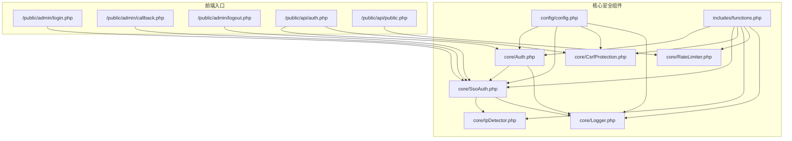
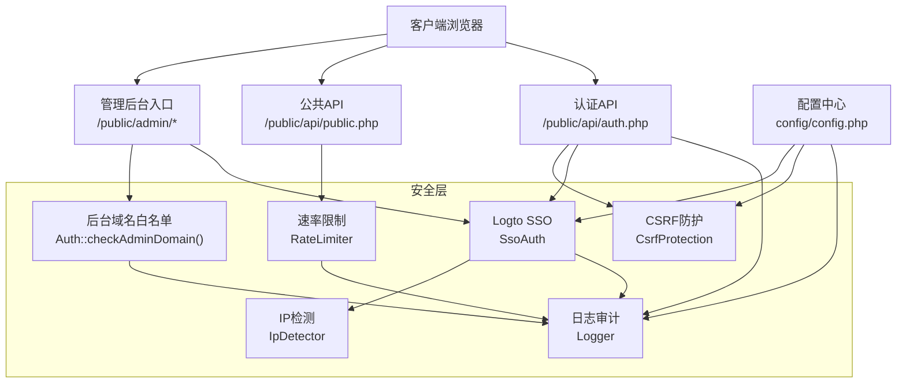
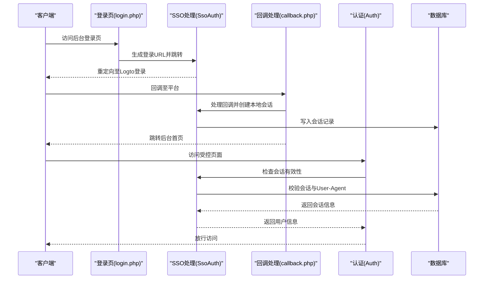
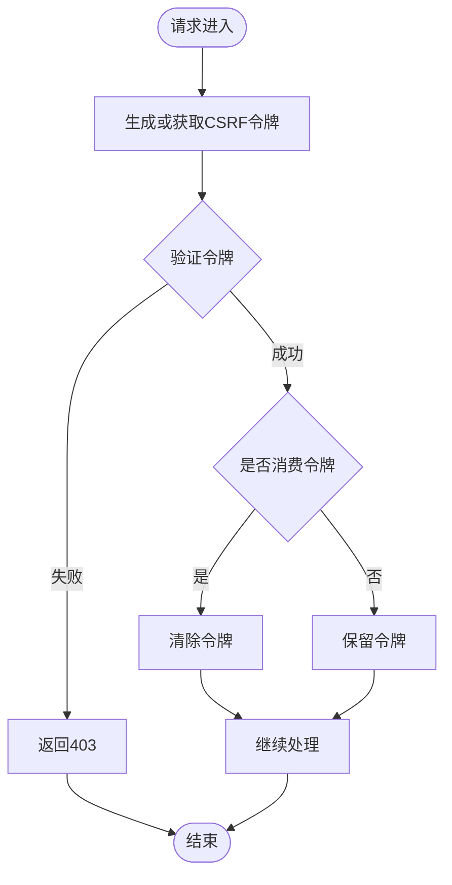
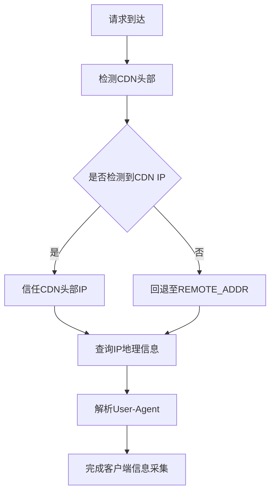
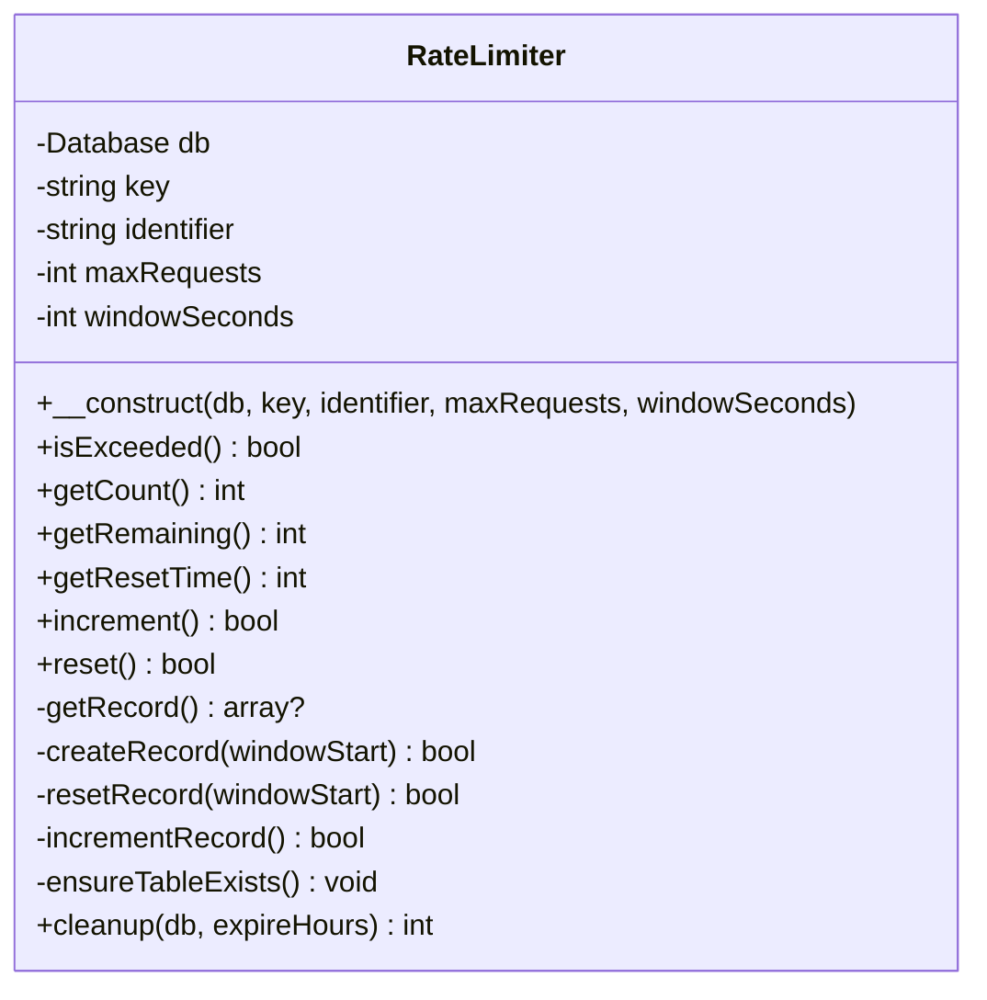
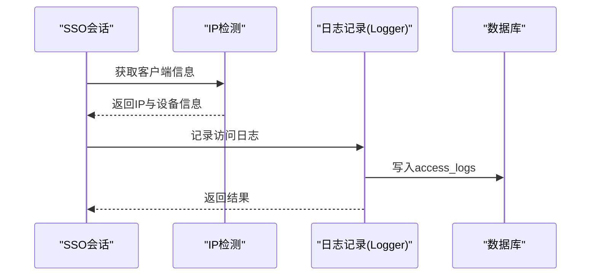
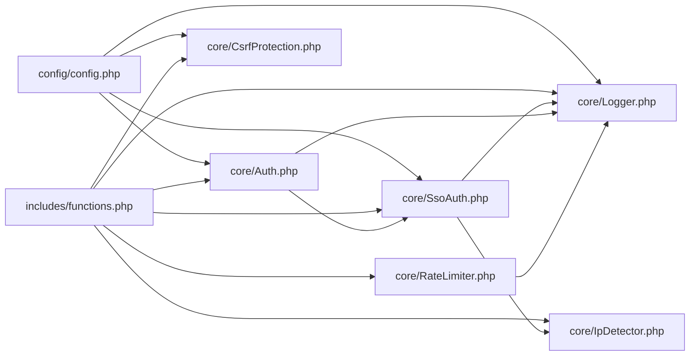

# 安全集成架构

<cite>
**本文档引用的文件**
- [config.php](file://config/config.php)
- [Auth.php](file://core/Auth.php)
- [SsoAuth.php](file://core/SsoAuth.php)
- [CsrfProtection.php](file://core/CsrfProtection.php)
- [IpDetector.php](file://core/IpDetector.php)
- [RateLimiter.php](file://core/RateLimiter.php)
- [Logger.php](file://core/Logger.php)
- [functions.php](file://includes/functions.php)
- [auth.php](file://public/api/auth.php)
- [public.php](file://public/api/public.php)
- [login.php](file://public/admin/login.php)
- [callback.php](file://public/admin/callback.php)
- [logout.php](file://public/admin/logout.php)
</cite>

## 目录
1. [引言](#引言)
2. [项目结构](#项目结构)
3. [核心组件](#核心组件)
4. [架构总览](#架构总览)
5. [详细组件分析](#详细组件分析)
6. [依赖关系分析](#依赖关系分析)
7. [性能考虑](#性能考虑)
8. [故障排除指南](#故障排除指南)
9. [结论](#结论)
10. [附录](#附录)

## 引言
本文件面向DNS拦截响应平台的安全集成架构，系统性阐述平台如何通过Logto SSO单点登录、CSRF防护、IP检测、速率限制、日志审计等安全机制协同工作，构建统一的安全层。文档重点说明：
- 安全层的架构设计与职责边界
- 认证授权流程与访问控制策略
- 安全事件处理与响应机制
- 安全组件的部署位置与调用时机（如IP检测在请求处理链中的位置、CSRF令牌验证的触发条件）
- 安全威胁模型与防护措施
- 安全配置最佳实践与监控机制

## 项目结构
平台采用分层架构，核心安全组件集中在core目录，前端入口位于public目录，配置集中于config目录，公共工具函数位于includes目录。

**图表来源**
- [login.php:1-337](file://public/admin/login.php#L1-L337)
- [callback.php:1-53](file://public/admin/callback.php#L1-L53)
- [logout.php:1-84](file://public/admin/logout.php#L1-L84)
- [auth.php:1-126](file://public/api/auth.php#L1-L126)
- [public.php:1-87](file://public/api/public.php#L1-L87)
- [Auth.php:1-272](file://core/Auth.php#L1-L272)
- [SsoAuth.php:1-505](file://core/SsoAuth.php#L1-L505)
- [CsrfProtection.php:1-298](file://core/CsrfProtection.php#L1-L298)
- [IpDetector.php:1-651](file://core/IpDetector.php#L1-L651)
- [RateLimiter.php:1-309](file://core/RateLimiter.php#L1-L309)
- [Logger.php:1-472](file://core/Logger.php#L1-L472)
- [functions.php:1-800](file://includes/functions.php#L1-L800)
- [config.php:1-152](file://config/config.php#L1-L152)

**章节来源**
- [config.php:1-152](file://config/config.php#L1-L152)
- [functions.php:1-800](file://includes/functions.php#L1-L800)

## 核心组件
- 认证授权层：负责管理员身份认证、会话管理、权限校验与访问控制。
- 单点登录（SSO）：基于Logto的统一身份认证，支持登录、回调处理、登出与会话同步。
- CSRF防护：基于Session的令牌生成与验证，防止跨站请求伪造。
- IP检测：多层CDN穿透与回源检测，获取真实客户端IP，支持地理信息与浏览器/操作系统识别。
- 速率限制：基于数据库的滑动窗口限流，抵御暴力破解与滥用。
- 日志审计：访问日志记录、查询与统计，支持日志完整性保护与定期清理。

**章节来源**
- [Auth.php:1-272](file://core/Auth.php#L1-L272)
- [SsoAuth.php:1-505](file://core/SsoAuth.php#L1-L505)
- [CsrfProtection.php:1-298](file://core/CsrfProtection.php#L1-L298)
- [IpDetector.php:1-651](file://core/IpDetector.php#L1-L651)
- [RateLimiter.php:1-309](file://core/RateLimiter.php#L1-L309)
- [Logger.php:1-472](file://core/Logger.php#L1-L472)

## 架构总览
平台安全架构围绕“入口控制—身份认证—访问控制—行为审计—异常处置”展开，形成闭环的安全体系。

**图表来源**
- [login.php:1-337](file://public/admin/login.php#L1-L337)
- [callback.php:1-53](file://public/admin/callback.php#L1-L53)
- [logout.php:1-84](file://public/admin/logout.php#L1-L84)
- [auth.php:1-126](file://public/api/auth.php#L1-L126)
- [public.php:1-87](file://public/api/public.php#L1-L87)
- [Auth.php:1-272](file://core/Auth.php#L1-L272)
- [SsoAuth.php:1-505](file://core/SsoAuth.php#L1-L505)
- [CsrfProtection.php:1-298](file://core/CsrfProtection.php#L1-L298)
- [IpDetector.php:1-651](file://core/IpDetector.php#L1-L651)
- [RateLimiter.php:1-309](file://core/RateLimiter.php#L1-L309)
- [Logger.php:1-472](file://core/Logger.php#L1-L472)
- [config.php:1-152](file://config/config.php#L1-L152)

## 详细组件分析

### 认证授权流程与访问控制策略
- 后台域名白名单：在登录、回调、登出等关键入口均执行域名白名单检查，使用严格格式验证的HTTP_HOST作为判断依据，fail-safe策略拒绝非法域名。
- SSO登录：支持登录跳转、回调处理、会话创建与登出；会话包含User-Agent校验，防止会话劫持。
- 权限模型：基于角色的权限矩阵，支持自定义权限覆盖；提供模块级权限检查与角色列表管理。
- 会话生命周期：基于数据库的会话表，支持SSO会话标记与Cookie安全属性配置。

**图表来源**
- [login.php:1-337](file://public/admin/login.php#L1-L337)
- [callback.php:1-53](file://public/admin/callback.php#L1-L53)
- [Auth.php:1-272](file://core/Auth.php#L1-L272)
- [SsoAuth.php:1-505](file://core/SsoAuth.php#L1-L505)

**章节来源**
- [Auth.php:76-131](file://core/Auth.php#L76-L131)
- [SsoAuth.php:352-396](file://core/SsoAuth.php#L352-L396)
- [login.php:28-58](file://public/admin/login.php#L28-L58)
- [callback.php:27-52](file://public/admin/callback.php#L27-L52)

### CSRF防护机制
- 令牌生成：基于加密安全随机数生成，支持多令牌与过期时间管理。
- 令牌验证：支持从多个位置获取令牌（HTTP头、POST参数），默认消费后清除，防止重放攻击。
- 触发条件：所有状态变更请求（如退出登录）必须携带有效令牌并通过验证。

**图表来源**
- [CsrfProtection.php:78-161](file://core/CsrfProtection.php#L78-L161)
- [auth.php:54-57](file://public/api/auth.php#L54-L57)

**章节来源**
- [CsrfProtection.php:40-123](file://core/CsrfProtection.php#L40-L123)
- [auth.php:54-57](file://public/api/auth.php#L54-L57)

### IP检测与地理信息
- 多层CDN穿透：优先检测主流CDN头部，直接信任可信来源IP。
- 回源检测：支持腾讯云与阿里云API回源检测，增强真实IP准确性。
- 地理与设备识别：提供IP地理信息、浏览器与操作系统识别，支持缓存与SSRF防护。
- 部署位置：SSO会话创建与日志记录阶段调用，确保审计与风控数据准确。

**图表来源**
- [IpDetector.php:31-47](file://core/IpDetector.php#L31-L47)
- [IpDetector.php:62-121](file://core/IpDetector.php#L62-L121)
- [SsoAuth.php:288-350](file://core/SsoAuth.php#L288-L350)
- [Logger.php:48-120](file://core/Logger.php#L48-L120)

**章节来源**
- [IpDetector.php:1-651](file://core/IpDetector.php#L1-L651)
- [SsoAuth.php:288-350](file://core/SsoAuth.php#L288-L350)
- [Logger.php:48-120](file://core/Logger.php#L48-L120)

### 速率限制（Rate Limiting）
- 实现方式：基于数据库的滑动窗口计数，解决Session绕过问题。
- 使用场景：公共API与认证API建议接入，防止暴力破解与滥用。
- 配置要点：根据接口敏感度设置窗口大小与阈值，结合IP与接口维度区分策略。

**图表来源**
- [RateLimiter.php:25-309](file://core/RateLimiter.php#L25-L309)

**章节来源**
- [RateLimiter.php:1-309](file://core/RateLimiter.php#L1-L309)
- [public.php:25-29](file://public/api/public.php#L25-L29)
- [auth.php:92-96](file://public/api/auth.php#L92-L96)

### 日志审计与完整性保护
- 访问日志：记录真实IP、浏览器、操作系统、请求URL、Referer等，支持查询、筛选与分页。
- 审计日志：认证登出等关键操作记录，便于追溯。
- 完整性保护：日志内容生成HMAC-SHA256签名，防止篡改。
- 清理策略：按配置保留天数定期清理，释放存储空间。

**图表来源**
- [Logger.php:48-120](file://core/Logger.php#L48-L120)
- [SsoAuth.php:288-350](file://core/SsoAuth.php#L288-L350)

**章节来源**
- [Logger.php:1-472](file://core/Logger.php#L1-L472)
- [SsoAuth.php:288-350](file://core/SsoAuth.php#L288-L350)

## 依赖关系分析
- 配置驱动：config/config.php集中定义数据库、站点、会话、安全响应头、日志、调试与Logto SSO配置，各组件通过依赖注入或全局函数读取。
- 函数库：includes/functions.php提供自动加载、调试初始化、CSRF令牌兼容函数、Host校验、IP获取、JSON响应等通用能力。
- 组件耦合：Auth与SsoAuth强关联，前者封装后者实例；Logger依赖IpDetector；RateLimiter独立但可被API层复用；CsrfProtection与API层紧密耦合。

**图表来源**
- [config.php:1-152](file://config/config.php#L1-L152)
- [functions.php:1-800](file://includes/functions.php#L1-L800)
- [Auth.php:1-272](file://core/Auth.php#L1-L272)
- [SsoAuth.php:1-505](file://core/SsoAuth.php#L1-L505)
- [CsrfProtection.php:1-298](file://core/CsrfProtection.php#L1-L298)
- [IpDetector.php:1-651](file://core/IpDetector.php#L1-L651)
- [RateLimiter.php:1-309](file://core/RateLimiter.php#L1-L309)
- [Logger.php:1-472](file://core/Logger.php#L1-L472)

**章节来源**
- [config.php:1-152](file://config/config.php#L1-L152)
- [functions.php:1-800](file://includes/functions.php#L1-L800)

## 性能考虑
- 会话与Cookie：会话有效期遵循等保2.0三级要求，Cookie设置HttpOnly与SameSite策略，平衡安全性与性能。
- 日志写入：数据库写入失败不阻断主流程，仅记录错误日志；建议生产环境开启异步日志或队列。
- IP查询：IP地理信息采用缓存（APCu/文件），避免重复查询；SSRF防护增加DNS解析验证，降低中间人风险。
- 速率限制：数据库计数器在高并发下需关注索引与事务隔离级别；建议结合Redis或APCu做热点优化。

[本节为通用指导，无需具体文件分析]

## 故障排除指南
- SSO登录失败
  - 检查Logto配置是否启用且SDK可用，必要时查看回调处理错误信息。
  - 确认回调地址与登出地址配置正确，域名白名单未拦截。
- CSRF验证失败
  - 确认表单中包含CSRF隐藏字段或AJAX请求头携带令牌；状态变更请求必须消费令牌。
- 会话失效
  - 检查User-Agent变化导致的会话校验失败；确认Cookie安全属性与HTTPS配置。
- IP识别异常
  - 确认CDN回源配置与API密钥设置；检查SSRF防护是否误判内网IP。
- 速率限制触发
  - 调整接口限流阈值或增加窗口时间；区分公共与私有接口策略。

**章节来源**
- [callback.php:33-52](file://public/admin/callback.php#L33-L52)
- [auth.php:54-57](file://public/api/auth.php#L54-L57)
- [SsoAuth.php:379-385](file://core/SsoAuth.php#L379-L385)
- [IpDetector.php:577-649](file://core/IpDetector.php#L577-L649)
- [RateLimiter.php:76-89](file://core/RateLimiter.php#L76-L89)

## 结论
平台通过Logto SSO统一身份认证、CSRF令牌、IP检测、速率限制与日志审计构成完整安全闭环。关键入口均执行域名白名单校验，SSO会话包含User-Agent校验与数据库持久化，API层结合CSRF与速率限制抵御常见攻击。配置中心集中管理安全参数，函数库提供统一工具能力。建议在生产环境进一步强化速率限制策略、完善安全监控与告警机制，并持续评估与优化安全配置。

[本节为总结性内容，无需具体文件分析]

## 附录

### 安全威胁模型与防护措施
- 主要威胁
  - 未授权访问：通过域名白名单与SSO强制认证防护。
  - 会话劫持：User-Agent校验与数据库会话存储。
  - CSRF攻击：多位置令牌验证与消费机制。
  - SSRF与DNS Rebinding：IP查询前DNS解析验证与HTTPS连接。
  - 暴力破解与滥用：数据库滑动窗口限流。
  - 日志篡改：HMAC完整性保护。
- 防护措施
  - 严格配置与最小权限原则；启用安全响应头；定期清理日志。
  - 建议引入WAF、DDoS防护与实时监控告警。

[本节为概念性内容，无需具体文件分析]

### 安全配置最佳实践
- 会话与Cookie
  - HTTPS部署；HttpOnly与SameSite=Lax；30分钟会话有效期。
- Logto SSO
  - 启用前完成SDK与配置；回调与登出地址与白名单一致。
- CSRF
  - 所有状态变更请求强制验证并消费令牌；AJAX请求设置X-CSRF-Token头。
- IP检测
  - 启用CDN回源检测；限制内网IP查询；HTTPS访问IP查询服务。
- 速率限制
  - 公共API与认证API分别设置阈值；结合IP与接口维度策略。
- 日志
  - 启用审计日志；定期清理；开启日志完整性保护。

**章节来源**
- [config.php:68-105](file://config/config.php#L68-L105)
- [config.php:135-149](file://config/config.php#L135-L149)
- [CsrfProtection.php:144-161](file://core/CsrfProtection.php#L144-L161)
- [IpDetector.php:577-649](file://core/IpDetector.php#L577-L649)
- [RateLimiter.php:76-89](file://core/RateLimiter.php#L76-L89)
- [Logger.php:443-470](file://core/Logger.php#L443-L470)