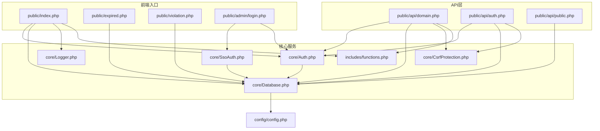
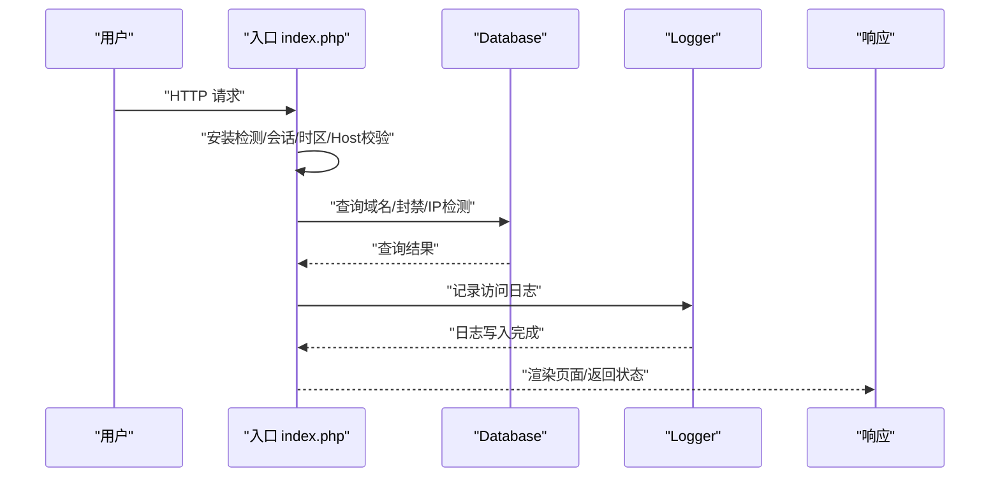
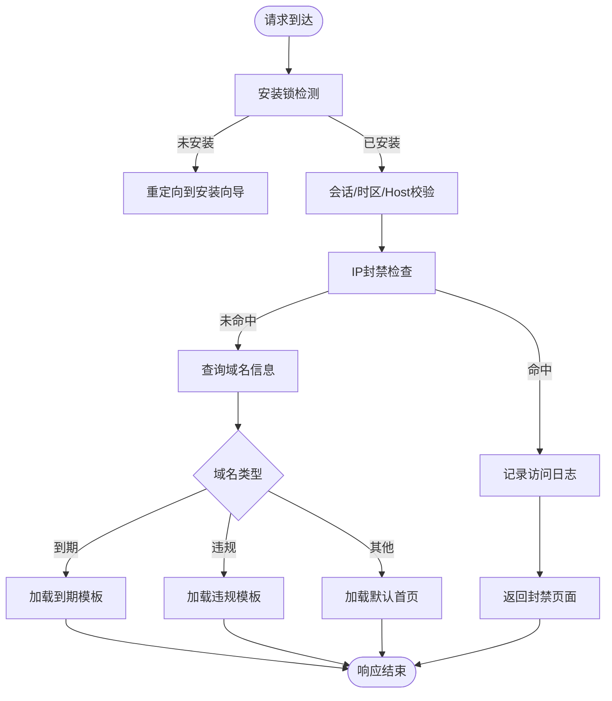
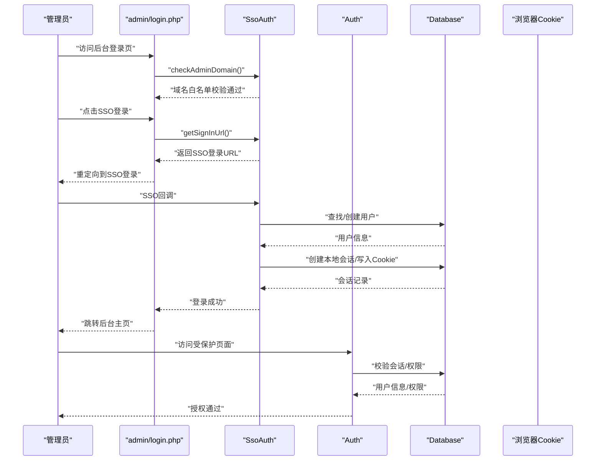
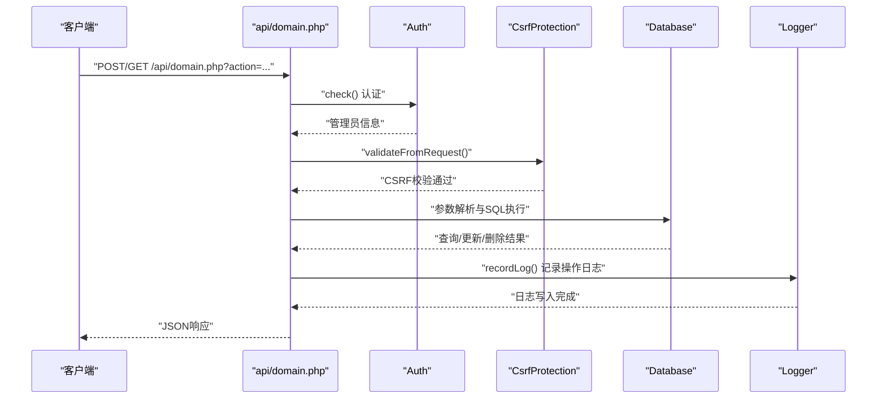
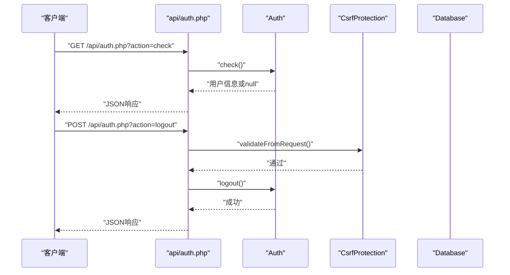
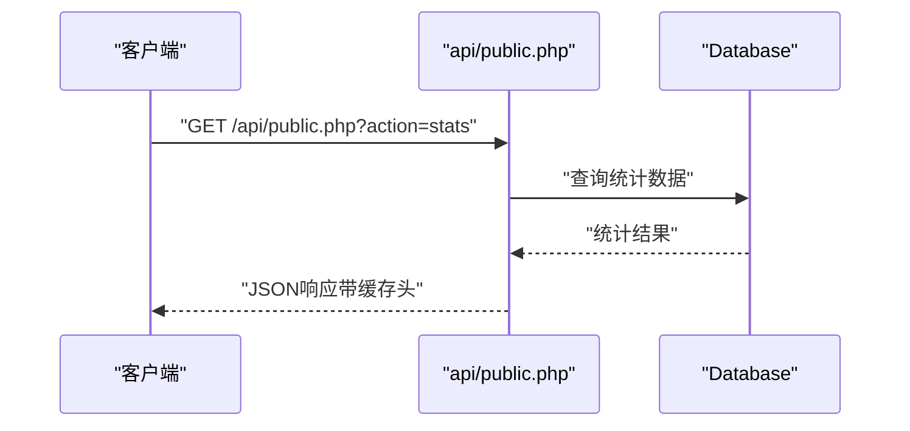
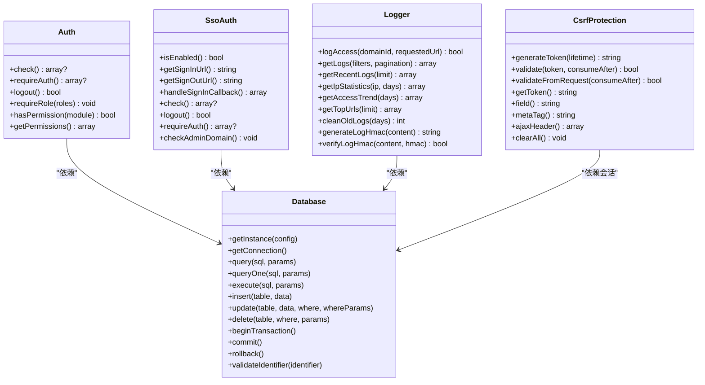
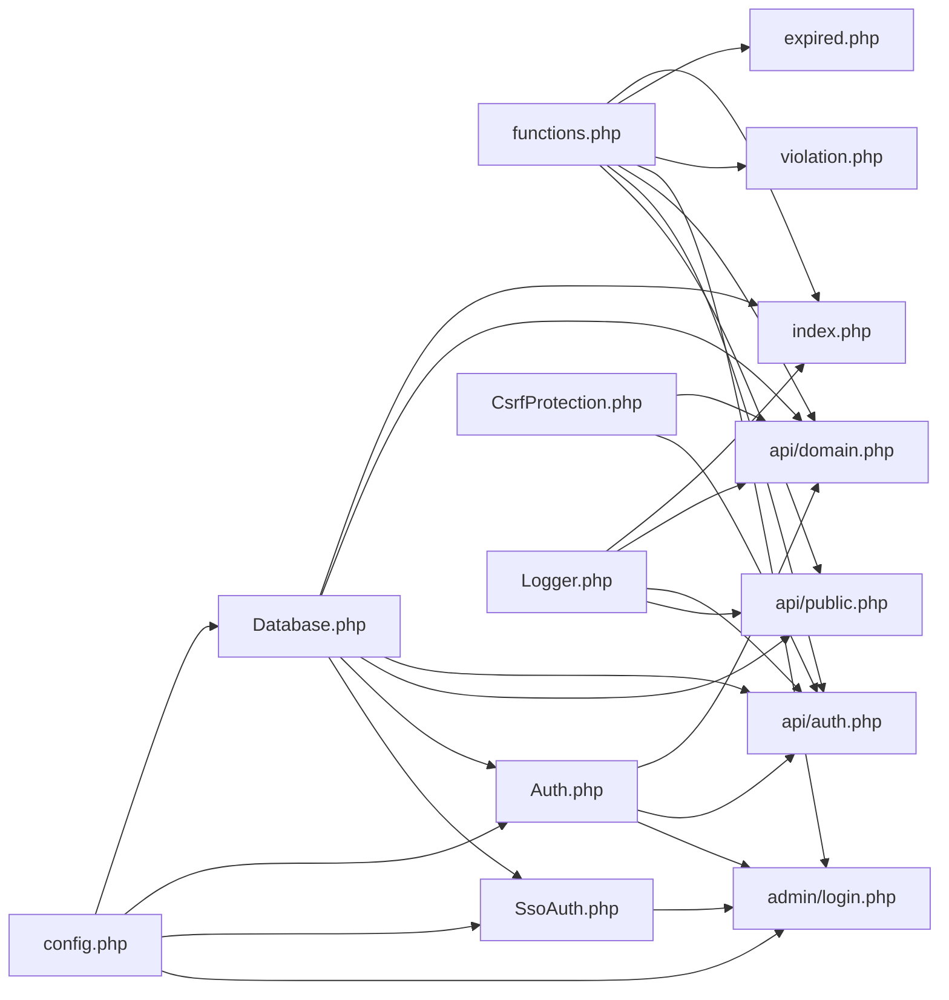

# 数据流分析

<cite>
**本文引用的文件**
- [config.php](file://config/config.php)
- [index.php](file://public/index.php)
- [expired.php](file://public/expired.php)
- [violation.php](file://public/violation.php)
- [Auth.php](file://core/Auth.php)
- [SsoAuth.php](file://core/SsoAuth.php)
- [Database.php](file://core/Database.php)
- [Logger.php](file://core/Logger.php)
- [functions.php](file://includes/functions.php)
- [domain.php](file://public/api/domain.php)
- [auth.php](file://public/api/auth.php)
- [public.php](file://public/api/public.php)
- [login.php](file://public/admin/login.php)
- [CsrfProtection.php](file://core/CsrfProtection.php)
- [init.sql](file://sql/init.sql)
</cite>

## 目录
1. [简介](#简介)
2. [项目结构](#项目结构)
3. [核心组件](#核心组件)
4. [架构总览](#架构总览)
5. [详细组件分析](#详细组件分析)
6. [依赖关系分析](#依赖关系分析)
7. [性能考量](#性能考量)
8. [故障排查指南](#故障排查指南)
9. [结论](#结论)
10. [附录](#附录)

## 简介
本文件针对“DNS拦截响应平台”进行系统化的数据流分析，覆盖从用户请求到系统响应的完整链路，重点说明以下方面：
- HTTP请求接收与参数解析
- 业务逻辑处理（域名查询、管理员登录、API调用）
- 数据库操作与日志记录
- 响应生成与安全机制（输入验证、SQL注入防护、XSS防护、CSRF防护、会话与SSO）

通过对入口文件、核心业务文件、数据库层、认证与会话、日志与安全组件的深入剖析，形成可操作、可追溯的数据流视图。

## 项目结构
项目采用“入口分发 + 核心业务 + 数据库 + 安全与日志”的分层组织方式：
- 入口与页面：public 目录下的 index.php、expired.php、violation.php 以及后台登录页 login.php
- API接口：public/api 下的 domain.php、auth.php、public.php 等
- 核心能力：core 目录下的 Auth、SsoAuth、Database、Logger、CsrfProtection 等
- 配置与初始化：config/config.php、sql/init.sql

图表来源
- [index.php:1-228](file://public/index.php#L1-L228)
- [expired.php:1-48](file://public/expired.php#L1-L48)
- [violation.php:1-48](file://public/violation.php#L1-L48)
- [login.php:1-337](file://public/admin/login.php#L1-L337)
- [domain.php:1-539](file://public/api/domain.php#L1-L539)
- [auth.php:1-126](file://public/api/auth.php#L1-L126)
- [public.php:1-87](file://public/api/public.php#L1-L87)
- [Auth.php:1-272](file://core/Auth.php#L1-L272)
- [SsoAuth.php:1-505](file://core/SsoAuth.php#L1-L505)
- [Database.php:1-400](file://core/Database.php#L1-L400)
- [Logger.php:1-472](file://core/Logger.php#L1-L472)
- [functions.php:1-998](file://includes/functions.php#L1-L998)
- [config.php:1-152](file://config/config.php#L1-L152)

章节来源
- [index.php:1-228](file://public/index.php#L1-L228)
- [expired.php:1-48](file://public/expired.php#L1-L48)
- [violation.php:1-48](file://public/violation.php#L1-L48)
- [login.php:1-337](file://public/admin/login.php#L1-L337)
- [domain.php:1-539](file://public/api/domain.php#L1-L539)
- [auth.php:1-126](file://public/api/auth.php#L1-L126)
- [public.php:1-87](file://public/api/public.php#L1-L87)
- [Auth.php:1-272](file://core/Auth.php#L1-L272)
- [SsoAuth.php:1-505](file://core/SsoAuth.php#L1-L505)
- [Database.php:1-400](file://core/Database.php#L1-L400)
- [Logger.php:1-472](file://core/Logger.php#L1-L472)
- [functions.php:1-998](file://includes/functions.php#L1-L998)
- [config.php:1-152](file://config/config.php#L1-L152)

## 核心组件
- 数据库层（Database）：封装PDO连接、参数绑定、SQL执行、事务、标识符校验与调试日志
- 认证与会话（Auth、SsoAuth）：支持SSO登录、会话校验、权限模型、后台域名白名单
- 日志（Logger）：访问日志采集、查询、统计与完整性保护（HMAC）
- 安全（CsrfProtection）：CSRF令牌生成、验证、多令牌管理与AJAX头注入
- 公共函数（functions）：输入清理、Host校验、JSON响应、文件上传、工具函数
- 配置（config）：数据库、站点、会话、安全响应头、日志、调试、SSO等配置

章节来源
- [Database.php:1-400](file://core/Database.php#L1-L400)
- [Auth.php:1-272](file://core/Auth.php#L1-L272)
- [SsoAuth.php:1-505](file://core/SsoAuth.php#L1-L505)
- [Logger.php:1-472](file://core/Logger.php#L1-L472)
- [CsrfProtection.php:1-298](file://core/CsrfProtection.php#L1-L298)
- [functions.php:1-998](file://includes/functions.php#L1-L998)
- [config.php:1-152](file://config/config.php#L1-L152)

## 架构总览
系统采用“入口分发 + API路由 + 业务处理 + 数据持久化 + 安全与日志”的架构模式。请求在入口文件完成基础校验与初始化后，根据请求类型进入相应处理分支；API层统一进行认证与CSRF校验；数据库层提供安全的SQL执行与事务支持；日志与安全组件贯穿全链路。

图表来源
- [index.php:1-228](file://public/index.php#L1-L228)
- [Database.php:1-400](file://core/Database.php#L1-L400)
- [Logger.php:1-472](file://core/Logger.php#L1-L472)

## 详细组件分析

### 入口与域名查询数据流（首页/到期/违规）
- 入口分发：index.php 负责安装检测、会话启动、时区设置、Host校验、IP封禁检查、域名查询与访问日志记录，并根据域名类型分发到到期/违规模板或默认首页
- 到期/违规入口：expired.php、violation.php 仅做Host校验与域名查询，随后加载对应模板
- 数据库查询：使用安全的参数化查询，避免SQL注入
- 日志记录：统一记录访问日志，包含UA、来源、请求URL、检测来源等

图表来源
- [index.php:1-228](file://public/index.php#L1-L228)
- [expired.php:1-48](file://public/expired.php#L1-L48)
- [violation.php:1-48](file://public/violation.php#L1-L48)

章节来源
- [index.php:1-228](file://public/index.php#L1-L228)
- [expired.php:1-48](file://public/expired.php#L1-L48)
- [violation.php:1-48](file://public/violation.php#L1-L48)

### 管理员登录与会话数据流（SSO）
- 登录页：login.php 进行安装检测、SSO启用检查、域名白名单校验、SSO跳转
- SSO回调：Auth/SsoAuth 负责登录回调处理、用户查找/创建、本地会话建立、Cookie设置、User-Agent校验
- 会话校验：Auth::check/requireAuth 统一校验管理员登录状态与权限
- 安全策略：后台域名白名单、SSO会话User-Agent一致性校验、会话令牌过期与清理

图表来源
- [login.php:1-337](file://public/admin/login.php#L1-L337)
- [SsoAuth.php:1-505](file://core/SsoAuth.php#L1-L505)
- [Auth.php:1-272](file://core/Auth.php#L1-L272)
- [Database.php:1-400](file://core/Database.php#L1-L400)

章节来源
- [login.php:1-337](file://public/admin/login.php#L1-L337)
- [SsoAuth.php:1-505](file://core/SsoAuth.php#L1-L505)
- [Auth.php:1-272](file://core/Auth.php#L1-L272)

### 域名管理API数据流
- 路由与认证：domain.php 根据 action 分发到 list/create/update/delete/batch_delete/stats，统一进行管理员认证与CSRF校验
- 参数解析与验证：sanitize/sanitizeArray 进行输入清理；正则/枚举/格式校验保证参数合法性
- 数据库操作：使用参数化查询与ORM式封装（query/queryOne/execute/insert/update/delete），并进行标识符白名单校验
- 日志记录：recordLog 记录操作日志，便于审计与追踪
- 响应生成：jsonSuccess/jsonError 统一JSON响应格式

图表来源
- [domain.php:1-539](file://public/api/domain.php#L1-L539)
- [Auth.php:1-272](file://core/Auth.php#L1-L272)
- [CsrfProtection.php:1-298](file://core/CsrfProtection.php#L1-L298)
- [Database.php:1-400](file://core/Database.php#L1-L400)
- [functions.php:1-998](file://includes/functions.php#L1-L998)

章节来源
- [domain.php:1-539](file://public/api/domain.php#L1-L539)
- [functions.php:1-998](file://includes/functions.php#L1-L998)

### 认证API数据流
- 状态检查：auth.php 提供 /api/auth.php?action=check，返回登录状态与用户信息
- 退出登录：提供 /api/auth.php?action=logout，进行CSRF校验、清理会话与CSRF令牌
- 统一响应：jsonSuccess/jsonError 统一响应格式

图表来源
- [auth.php:1-126](file://public/api/auth.php#L1-L126)
- [Auth.php:1-272](file://core/Auth.php#L1-L272)
- [CsrfProtection.php:1-298](file://core/CsrfProtection.php#L1-L298)

章节来源
- [auth.php:1-126](file://public/api/auth.php#L1-L126)

### 公共API数据流
- 公共统计：public.php 提供 /api/public.php?action=stats，返回域名、封禁、日志等公共统计数据
- 缓存控制：设置 Cache-Control: public, max-age=60，减轻后端压力
- 统一响应：jsonSuccess/jsonError

图表来源
- [public.php:1-87](file://public/api/public.php#L1-L87)
- [Database.php:1-400](file://core/Database.php#L1-L400)

章节来源
- [public.php:1-87](file://public/api/public.php#L1-L87)

### 数据库层与安全机制
- 数据库连接：Database 单例，使用PDO选项严格配置，启用异常模式、非模拟预处理、UTF-8字符集
- SQL执行：query/queryOne/execute/insert/update/delete 统一封装，bindParams 自动识别整数/布尔/NULL绑定
- 标识符校验：validateIdentifier 防止表名/列名注入
- 事务：beginTransaction/commit/rollback 支持
- 安全响应头：config 中集中配置 CSP、X-Content-Type-Options、X-Frame-Options、X-XSS-Protection、Referrer-Policy、Permissions-Policy
- CSRF：Core\CsrfProtection 提供令牌生成、验证、多令牌管理与AJAX头注入
- 输入清理：functions::sanitize/sanitizeArray 在入库前进行清理，输出时再进行转义（遵循“输出时转义”原则）

图表来源
- [Database.php:1-400](file://core/Database.php#L1-L400)
- [Auth.php:1-272](file://core/Auth.php#L1-L272)
- [SsoAuth.php:1-505](file://core/SsoAuth.php#L1-L505)
- [Logger.php:1-472](file://core/Logger.php#L1-L472)
- [CsrfProtection.php:1-298](file://core/CsrfProtection.php#L1-L298)

章节来源
- [Database.php:1-400](file://core/Database.php#L1-L400)
- [Auth.php:1-272](file://core/Auth.php#L1-L272)
- [SsoAuth.php:1-505](file://core/SsoAuth.php#L1-L505)
- [Logger.php:1-472](file://core/Logger.php#L1-L472)
- [CsrfProtection.php:1-298](file://core/CsrfProtection.php#L1-L298)
- [config.php:1-152](file://config/config.php#L1-L152)

## 依赖关系分析
- 入口与页面依赖公共函数库（functions）进行输入清理、Host校验、JSON响应等
- API层依赖 Auth、Database、CsrfProtection、Logger、functions
- 认证层依赖 Database 与配置（config），SsoAuth 依赖 Logto SDK（可选）
- 日志层依赖 Database 与 IpDetector（未在本仓库中出现，但接口可见）
- 配置集中于 config/config.php，贯穿所有组件

图表来源
- [functions.php:1-998](file://includes/functions.php#L1-L998)
- [index.php:1-228](file://public/index.php#L1-L228)
- [expired.php:1-48](file://public/expired.php#L1-L48)
- [violation.php:1-48](file://public/violation.php#L1-L48)
- [login.php:1-337](file://public/admin/login.php#L1-L337)
- [domain.php:1-539](file://public/api/domain.php#L1-L539)
- [auth.php:1-126](file://public/api/auth.php#L1-L126)
- [public.php:1-87](file://public/api/public.php#L1-L87)
- [Auth.php:1-272](file://core/Auth.php#L1-L272)
- [SsoAuth.php:1-505](file://core/SsoAuth.php#L1-L505)
- [Database.php:1-400](file://core/Database.php#L1-L400)
- [Logger.php:1-472](file://core/Logger.php#L1-L472)
- [CsrfProtection.php:1-298](file://core/CsrfProtection.php#L1-L298)
- [config.php:1-152](file://config/config.php#L1-L152)

章节来源
- [functions.php:1-998](file://includes/functions.php#L1-L998)
- [index.php:1-228](file://public/index.php#L1-L228)
- [login.php:1-337](file://public/admin/login.php#L1-L337)
- [domain.php:1-539](file://public/api/domain.php#L1-L539)
- [auth.php:1-126](file://public/api/auth.php#L1-L126)
- [public.php:1-87](file://public/api/public.php#L1-L87)
- [Auth.php:1-272](file://core/Auth.php#L1-L272)
- [SsoAuth.php:1-505](file://core/SsoAuth.php#L1-L505)
- [Database.php:1-400](file://core/Database.php#L1-L400)
- [Logger.php:1-472](file://core/Logger.php#L1-L472)
- [CsrfProtection.php:1-298](file://core/CsrfProtection.php#L1-L298)
- [config.php:1-152](file://config/config.php#L1-L152)

## 性能考量
- 数据库连接与调试：Database 在调试模式下记录连接与查询日志，生产环境建议关闭调试或限制日志级别
- SQL执行：统一使用参数化查询与非模拟预处理，避免SQL注入同时提升执行效率
- 日志写入：访问日志与操作日志写入可能成为瓶颈，建议结合异步队列或批量写入策略
- 缓存：公共API设置了短时缓存头，减少重复查询压力
- 会话与Cookie：会话生命周期与安全属性在配置中集中管理，避免频繁重建会话

## 故障排查指南
- 安装锁缺失：入口文件检测 storage/install.lock，未安装将重定向到安装向导
- Host校验失败：validateHost 对 HTTP_HOST 进行严格正则校验，失败返回空字符串并返回400
- IP封禁：若命中封禁规则，记录访问日志并返回403封禁页面
- 数据库连接失败：Database 在连接失败时记录错误日志并抛出异常
- CSRF校验失败：API层对CSRF进行严格校验，失败返回403
- SSO登录异常：SsoAuth 在回调处理中捕获异常并返回错误信息，同时记录日志
- 日志完整性：Logger 提供HMAC签名生成与校验，用于检测日志篡改

章节来源
- [index.php:1-228](file://public/index.php#L1-L228)
- [functions.php:1-998](file://includes/functions.php#L1-L998)
- [Database.php:1-400](file://core/Database.php#L1-L400)
- [CsrfProtection.php:1-298](file://core/CsrfProtection.php#L1-L298)
- [SsoAuth.php:1-505](file://core/SsoAuth.php#L1-L505)
- [Logger.php:1-472](file://core/Logger.php#L1-L472)

## 结论
本平台通过清晰的入口分发、严格的输入清理与Host校验、参数化SQL与标识符白名单、完善的会话与SSO机制、以及统一的CSRF与安全响应头策略，构建了安全、可维护、可扩展的数据流体系。API层统一认证与响应格式，数据库层提供安全可靠的执行与事务支持，日志与安全组件贯穿全链路，满足生产环境的合规与安全要求。

## 附录
- 数据库表结构概览（关键表）
  - admin_users：管理员表，包含角色、权限、SSO标识等
  - domains：域名表，包含类型、状态、过期/违规信息
  - ip_bans：IP封禁表
  - access_logs：访问日志表
  - appeals：申诉表
  - chat_conversations / chat_messages：聊天会话与消息
  - logzx：操作日志表
  - sessions：会话表

章节来源
- [init.sql:1-275](file://sql/init.sql#L1-L275)