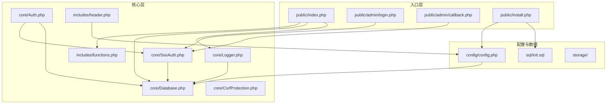
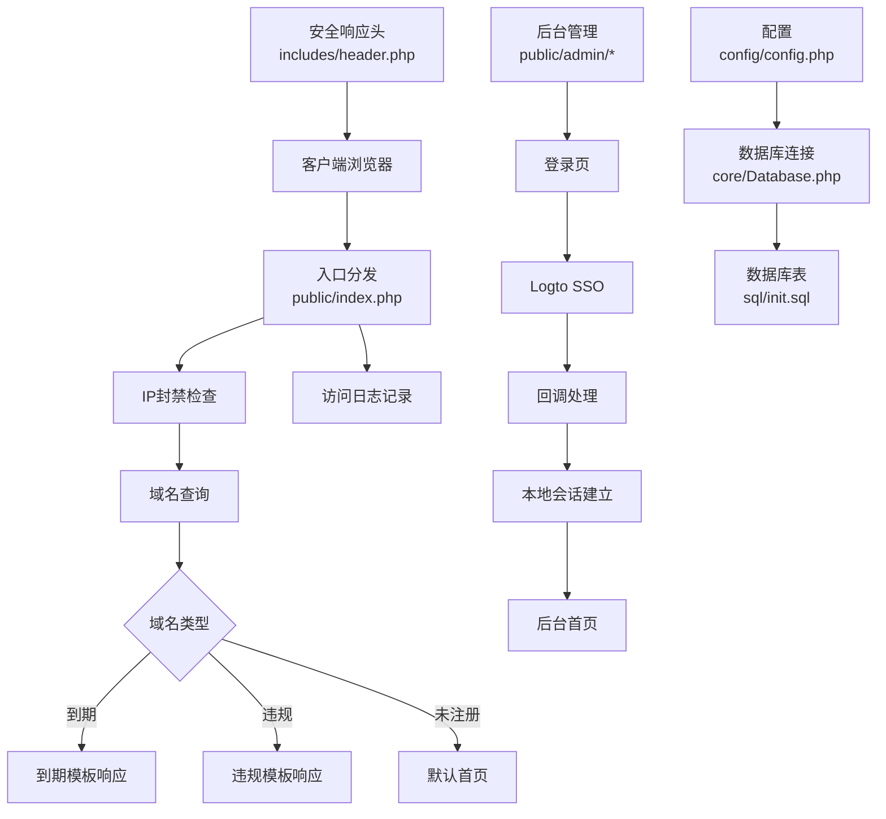
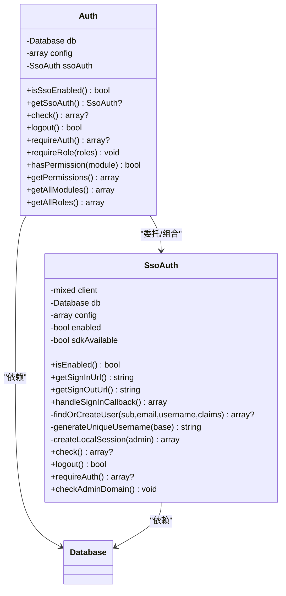
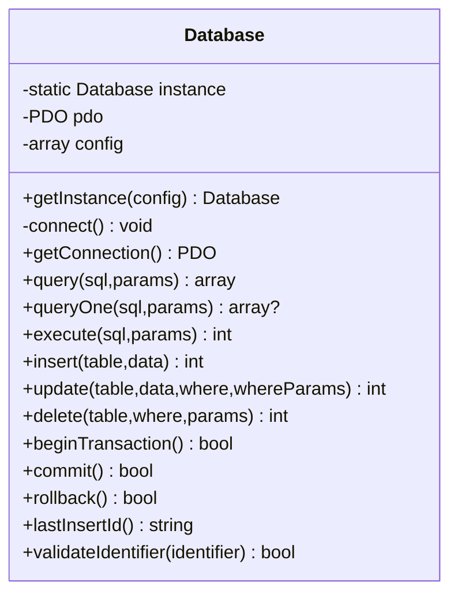
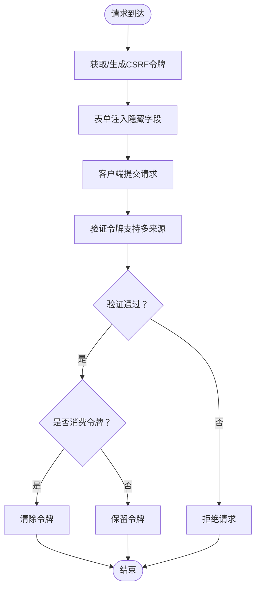
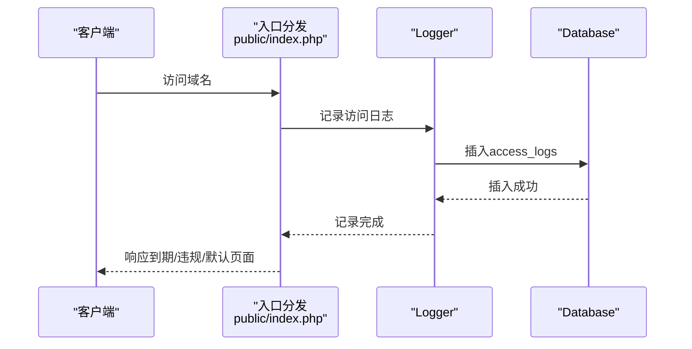
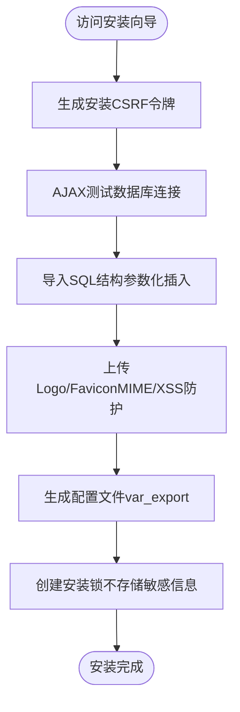
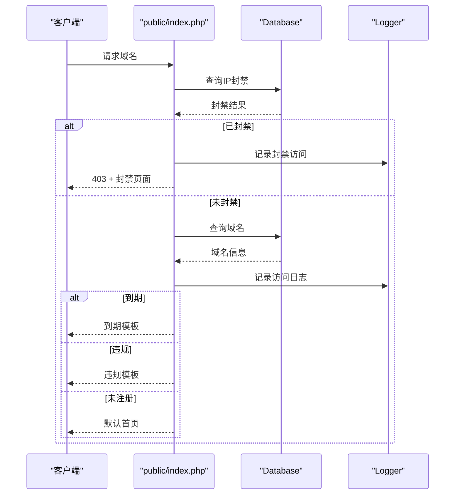
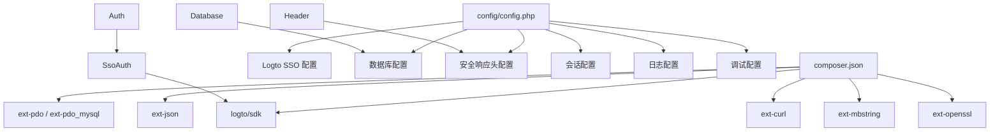
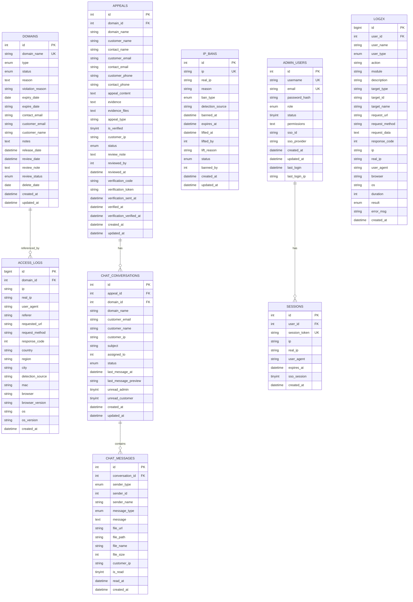

# 整体设计

<cite>
**本文引用的文件**
- [config/config.php](file://config/config.php)
- [composer.json](file://composer.json)
- [core/Auth.php](file://core/Auth.php)
- [core/SsoAuth.php](file://core/SsoAuth.php)
- [core/Database.php](file://core/Database.php)
- [core/CsrfProtection.php](file://core/CsrfProtection.php)
- [core/Logger.php](file://core/Logger.php)
- [includes/functions.php](file://includes/functions.php)
- [includes/header.php](file://includes/header.php)
- [public/index.php](file://public/index.php)
- [public/admin/login.php](file://public/admin/login.php)
- [public/admin/callback.php](file://public/admin/callback.php)
- [public/install.php](file://public/install.php)
- [sql/init.sql](file://sql/init.sql)
</cite>

## 目录
1. [简介](#简介)
2. [项目结构](#项目结构)
3. [核心组件](#核心组件)
4. [架构总览](#架构总览)
5. [详细组件分析](#详细组件分析)
6. [依赖关系分析](#依赖关系分析)
7. [性能考量](#性能考量)
8. [故障排查指南](#故障排查指南)
9. [结论](#结论)
10. [附录](#附录)

## 简介
本设计文档面向“DNS拦截响应平台”，系统通过域名解析拦截与响应机制，结合统一身份认证（Logto SSO）、数据库抽象层（PDO）、安全防护（CSRF、安全响应头、会话管理）与日志体系，构建出一套可维护、可扩展、满足等保2.0三级要求的后台管理与前端响应系统。系统采用模块化与分层架构，入口文件负责路由与拦截判定，核心模块负责认证、数据库、CSRF与日志，公共函数库提供工具能力，安装向导完成部署与配置生成。

## 项目结构
系统采用典型的Web应用分层与模块化组织：
- config：集中配置管理，包含数据库、站点、上传、会话、安全、日志、调试、Logto SSO等配置项
- core：核心业务与基础设施模块（认证、数据库、CSRF、日志、工具）
- includes：公共模板与工具函数（自动加载、安全响应头、全局函数）
- public：对外公开的入口与静态资源（入口分发、后台管理、API、静态资源、上传目录）
- sql：数据库初始化脚本
- storage：运行时日志与安装锁
- vendor：Composer依赖（Logto SDK等）

图表来源
- [public/index.php:1-228](file://public/index.php#L1-L228)
- [public/admin/login.php:1-337](file://public/admin/login.php#L1-L337)
- [public/admin/callback.php:1-53](file://public/admin/callback.php#L1-L53)
- [public/install.php:1-800](file://public/install.php#L1-L800)
- [core/Auth.php:1-272](file://core/Auth.php#L1-L272)
- [core/SsoAuth.php:1-505](file://core/SsoAuth.php#L1-L505)
- [core/Database.php:1-400](file://core/Database.php#L1-L400)
- [core/CsrfProtection.php:1-298](file://core/CsrfProtection.php#L1-L298)
- [core/Logger.php:1-472](file://core/Logger.php#L1-L472)
- [includes/functions.php:1-800](file://includes/functions.php#L1-L800)
- [includes/header.php:1-171](file://includes/header.php#L1-L171)
- [config/config.php:1-152](file://config/config.php#L1-L152)
- [sql/init.sql:1-275](file://sql/init.sql#L1-L275)

章节来源
- [public/index.php:1-228](file://public/index.php#L1-L228)
- [public/admin/login.php:1-337](file://public/admin/login.php#L1-L337)
- [public/admin/callback.php:1-53](file://public/admin/callback.php#L1-L53)
- [public/install.php:1-800](file://public/install.php#L1-L800)
- [core/Auth.php:1-272](file://core/Auth.php#L1-L272)
- [core/SsoAuth.php:1-505](file://core/SsoAuth.php#L1-L505)
- [core/Database.php:1-400](file://core/Database.php#L1-L400)
- [core/CsrfProtection.php:1-298](file://core/CsrfProtection.php#L1-L298)
- [core/Logger.php:1-472](file://core/Logger.php#L1-L472)
- [includes/functions.php:1-800](file://includes/functions.php#L1-L800)
- [includes/header.php:1-171](file://includes/header.php#L1-L171)
- [config/config.php:1-152](file://config/config.php#L1-L152)
- [sql/init.sql:1-275](file://sql/init.sql#L1-L275)

## 核心组件
- 认证与权限控制：Auth与SsoAuth负责后台登录、会话校验、角色与模块权限判定、域名白名单访问控制
- 数据库抽象：Database封装PDO连接、查询、事务、参数绑定与SQL注入防护
- CSRF防护：CsrfProtection提供令牌生成、验证、多令牌管理与AJAX头支持
- 日志与审计：Logger负责访问日志采集、查询、统计与清理；配合安全响应头与调试配置
- 入口与拦截：public/index.php根据域名类型分发到期/违规响应页面，同时进行IP封禁检查与访问日志记录
- 安装向导：install.php完成数据库连接测试、表结构导入、配置生成、安装锁创建与文件上传处理

章节来源
- [core/Auth.php:1-272](file://core/Auth.php#L1-L272)
- [core/SsoAuth.php:1-505](file://core/SsoAuth.php#L1-L505)
- [core/Database.php:1-400](file://core/Database.php#L1-L400)
- [core/CsrfProtection.php:1-298](file://core/CsrfProtection.php#L1-L298)
- [core/Logger.php:1-472](file://core/Logger.php#L1-L472)
- [public/index.php:1-228](file://public/index.php#L1-L228)
- [public/install.php:1-800](file://public/install.php#L1-L800)

## 架构总览
系统采用分层与模块化混合架构：
- 分层架构：入口层（public）、核心层（core）、配置与数据层（config/sql/storage）
- MVC雏形：入口层承担控制器职责，视图由模板与静态资源组成，模型由Database与表结构构成
- 模块化设计：认证、数据库、CSRF、日志、工具等以独立类/模块提供能力，降低耦合
- 外部服务集成：Logto SSO、MySQL、CDN代理头、第三方IP检测服务

图表来源
- [public/index.php:1-228](file://public/index.php#L1-L228)
- [public/admin/login.php:1-337](file://public/admin/login.php#L1-L337)
- [public/admin/callback.php:1-53](file://public/admin/callback.php#L1-L53)
- [includes/header.php:1-171](file://includes/header.php#L1-L171)
- [config/config.php:1-152](file://config/config.php#L1-L152)
- [sql/init.sql:1-275](file://sql/init.sql#L1-L275)

## 详细组件分析

### 认证与权限控制（Auth/SsoAuth）
- Auth：统一管理后台认证与权限，支持SSO登录、域名白名单检查、角色与模块权限判定、会话要求与登出
- SsoAuth：集成Logto SDK，负责登录URL生成、回调处理、用户查找/创建、本地会话建立与校验、登出与域名白名单检查

图表来源
- [core/Auth.php:1-272](file://core/Auth.php#L1-L272)
- [core/SsoAuth.php:1-505](file://core/SsoAuth.php#L1-L505)

章节来源
- [core/Auth.php:1-272](file://core/Auth.php#L1-L272)
- [core/SsoAuth.php:1-505](file://core/SsoAuth.php#L1-L505)

### 数据库抽象层（Database）
- 单例模式提供PDO连接，支持SSL/TLS、选项转换、调试日志
- 提供查询、执行、插入、更新、删除、事务、参数绑定与标识符校验
- 防注入：位置参数绑定、WHERE条件白名单、命名参数转位置参数、标识符合法性校验

图表来源
- [core/Database.php:1-400](file://core/Database.php#L1-L400)

章节来源
- [core/Database.php:1-400](file://core/Database.php#L1-L400)

### CSRF防护（CsrfProtection）
- 基于Session的令牌生成与验证，支持多令牌、过期清理、AJAX头与消费性验证
- 严格限制令牌来源，避免GET参数泄露

图表来源
- [core/CsrfProtection.php:1-298](file://core/CsrfProtection.php#L1-L298)

章节来源
- [core/CsrfProtection.php:1-298](file://core/CsrfProtection.php#L1-L298)

### 日志与审计（Logger）
- 访问日志采集：真实IP、UA、浏览器/OS、来源URL、检测来源等
- 查询与统计：支持关键词、时间范围、浏览器/OS筛选，提供最近日志、IP统计、访问趋势、热门URL排行
- 清理策略：按天数清理过期日志，释放空间

图表来源
- [public/index.php:1-228](file://public/index.php#L1-L228)
- [core/Logger.php:1-472](file://core/Logger.php#L1-L472)
- [core/Database.php:1-400](file://core/Database.php#L1-L400)

章节来源
- [public/index.php:1-228](file://public/index.php#L1-L228)
- [core/Logger.php:1-472](file://core/Logger.php#L1-L472)
- [core/Database.php:1-400](file://core/Database.php#L1-L400)

### 安装向导（install.php）
- 安全：安装过程CSRF保护、参数白名单与正则校验、SQL注入防护、敏感信息不落盘
- 流程：目录创建、数据库连接测试、SQL导入（含表前缀替换与参数化插入）、文件上传（Logo/Favicon）、配置生成、安装锁创建

图表来源
- [public/install.php:1-800](file://public/install.php#L1-L800)
- [sql/init.sql:1-275](file://sql/init.sql#L1-L275)

章节来源
- [public/install.php:1-800](file://public/install.php#L1-L800)
- [sql/init.sql:1-275](file://sql/init.sql#L1-L275)

### 入口分发与拦截（public/index.php）
- 安装锁检查、调试初始化、会话启动、时区设置
- IP封禁检查（支持CDN真实IP检测）、域名查询、访问日志记录、到期/违规页面分发、默认首页渲染

图表来源
- [public/index.php:1-228](file://public/index.php#L1-L228)
- [core/Database.php:1-400](file://core/Database.php#L1-L400)
- [core/Logger.php:1-472](file://core/Logger.php#L1-L472)

章节来源
- [public/index.php:1-228](file://public/index.php#L1-L228)
- [core/Database.php:1-400](file://core/Database.php#L1-L400)
- [core/Logger.php:1-472](file://core/Logger.php#L1-L472)

## 依赖关系分析
- 技术栈与依赖
  - PHP 8.0+、PDO扩展、Logto SDK、Composer自动加载
  - 安全响应头、CSRF、会话、日志、安装向导均在配置中集中管理
- 外部集成
  - Logto SSO：统一身份认证，支持自动创建用户、默认角色、回调与登出
  - CDN与代理：支持多种CDN真实IP头，增强IP检测准确性
  - MySQL：通过PDO连接，支持SSL/TLS与字符集配置

图表来源
- [composer.json:1-37](file://composer.json#L1-L37)
- [config/config.php:1-152](file://config/config.php#L1-L152)
- [core/Auth.php:1-272](file://core/Auth.php#L1-L272)
- [core/SsoAuth.php:1-505](file://core/SsoAuth.php#L1-L505)
- [core/Database.php:1-400](file://core/Database.php#L1-L400)
- [includes/header.php:1-171](file://includes/header.php#L1-L171)

章节来源
- [composer.json:1-37](file://composer.json#L1-L37)
- [config/config.php:1-152](file://config/config.php#L1-L152)
- [core/Auth.php:1-272](file://core/Auth.php#L1-L272)
- [core/SsoAuth.php:1-505](file://core/SsoAuth.php#L1-L505)
- [core/Database.php:1-400](file://core/Database.php#L1-L400)
- [includes/header.php:1-171](file://includes/header.php#L1-L171)

## 性能考量
- 数据库层
  - PDO预处理与参数绑定，避免拼接SQL带来的性能与安全问题
  - 事务封装与连接池友好（单例连接），减少频繁连接开销
- 日志与审计
  - 访问日志异步化与清理策略（按天数），避免无限增长
  - 查询接口支持分页与白名单字段排序，避免全表扫描
- 安全与稳定性
  - 安全响应头与CSRF双重防护，降低攻击面
  - 安装向导参数白名单与正则校验，避免注入与越权
- 可维护性
  - 模块化设计，职责清晰，便于单元测试与重构

## 故障排查指南
- 安装失败
  - 检查数据库连接（主机、端口、库名、用户、密码）与权限
  - 确认SQL文件存在且可读，表前缀合法
  - 查看安装锁创建与配置文件生成日志
- 登录失败（SSO）
  - 确认Logto服务端点、应用ID、密钥配置正确
  - 检查回调地址与登出地址配置
  - 查看回调处理日志与错误信息
- 访问异常
  - 检查IP封禁表与CDN真实IP头
  - 查看访问日志与审计日志，定位异常来源
- 性能问题
  - 优化日志查询索引与分页参数
  - 合理设置日志清理周期，避免日志表过大

章节来源
- [public/install.php:1-800](file://public/install.php#L1-L800)
- [public/admin/callback.php:1-53](file://public/admin/callback.php#L1-L53)
- [core/Logger.php:1-472](file://core/Logger.php#L1-L472)

## 结论
本系统通过分层与模块化设计，结合Logto SSO、PDO数据库抽象、CSRF与安全响应头、完善的日志与审计体系，实现了DNS拦截响应平台的高安全性、可维护性与可扩展性。技术选型兼顾性能与合规（等保2.0三级），在保证功能完整性的同时，提供了清晰的边界与集成点，便于后续迭代与运维。

## 附录
- 系统边界与范围
  - 内部实现：域名拦截响应、后台登录与权限、日志与审计、安装向导、CSRF防护、安全响应头
  - 外部集成：Logto SSO、MySQL、CDN代理头、第三方IP检测服务
- 数据模型概览（核心表）
  - admin_users：管理员表（含SSO标识与角色）
  - domains：域名表（到期/违规类型）
  - ip_bans：IP封禁表
  - access_logs：访问日志表
  - appeals：申诉表
  - chat_conversations / chat_messages：聊天会话与消息
  - logzx：操作日志表
  - sessions：会话表

图表来源
- [sql/init.sql:1-275](file://sql/init.sql#L1-L275)