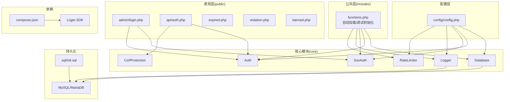
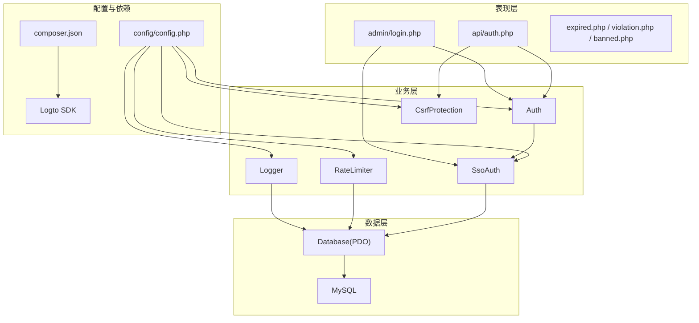
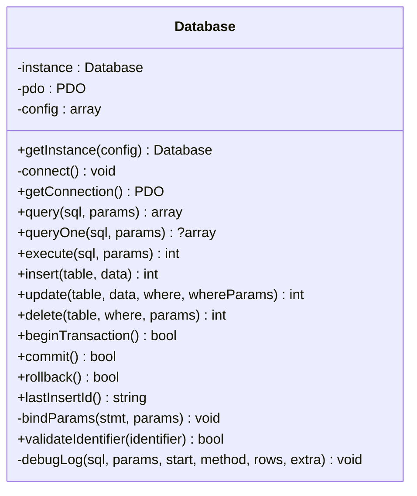
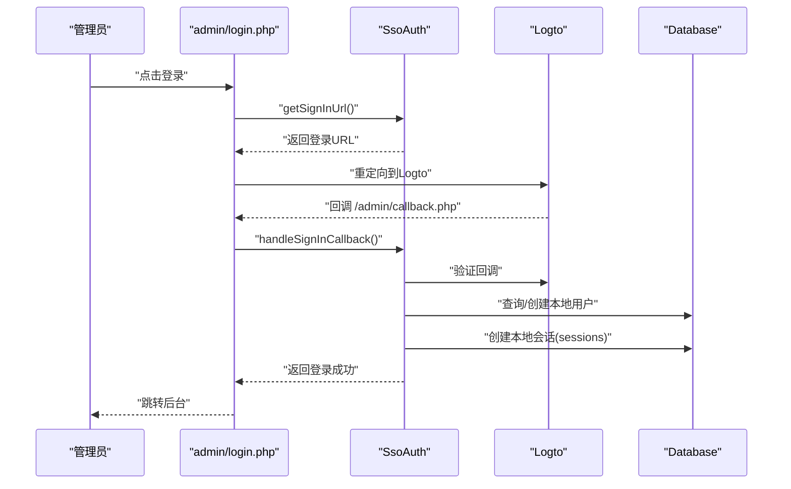
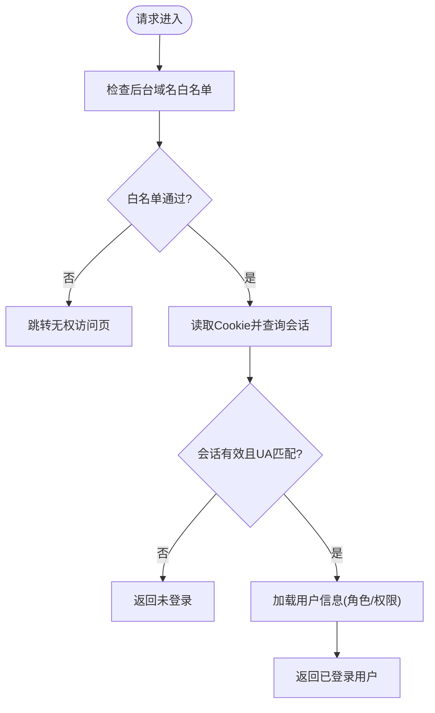
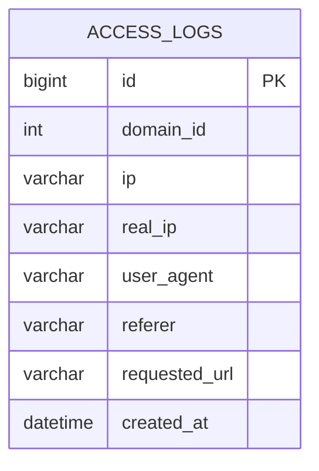
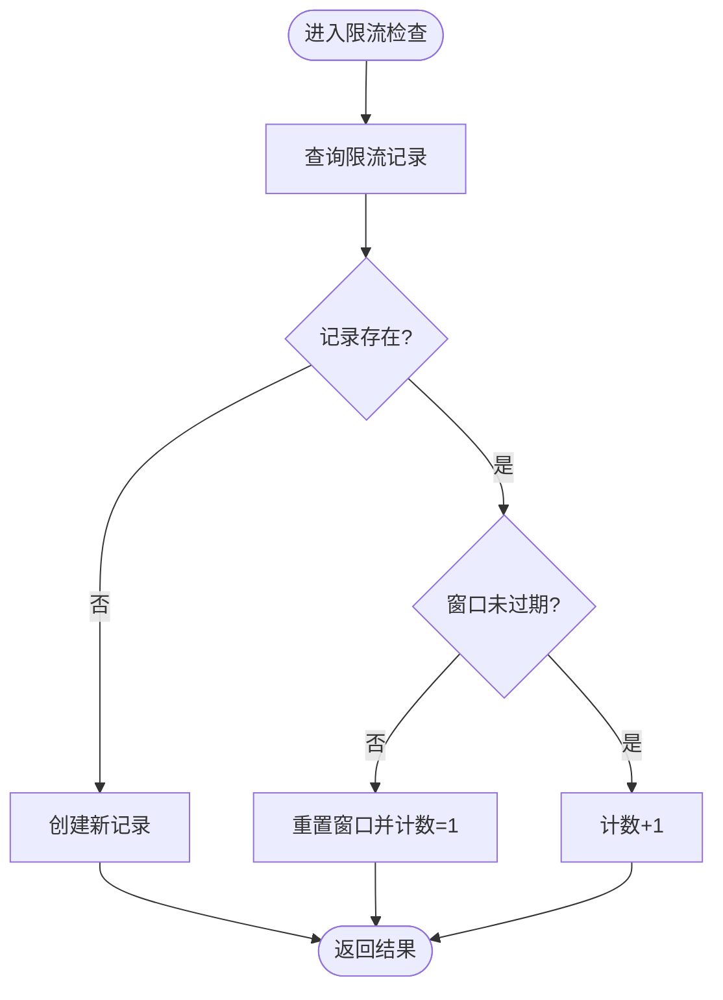
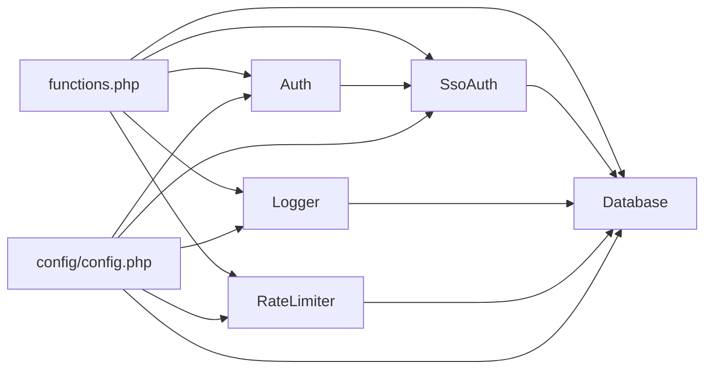

# 系统架构

<cite>
**本文引用的文件**
- [config/config.php](file://config/config.php)
- [core/Database.php](file://core/Database.php)
- [core/Auth.php](file://core/Auth.php)
- [core/SsoAuth.php](file://core/SsoAuth.php)
- [core/CsrfProtection.php](file://core/CsrfProtection.php)
- [core/Logger.php](file://core/Logger.php)
- [core/RateLimiter.php](file://core/RateLimiter.php)
- [includes/functions.php](file://includes/functions.php)
- [public/admin/login.php](file://public/admin/login.php)
- [public/api/auth.php](file://public/api/auth.php)
- [sql/init.sql](file://sql/init.sql)
- [DEPLOY.md](file://DEPLOY.md)
- [composer.json](file://composer.json)
- [README.md](file://README.md)
</cite>

## 目录
1. [简介](#简介)
2. [项目结构](#项目结构)
3. [核心组件](#核心组件)
4. [架构总览](#架构总览)
5. [详细组件分析](#详细组件分析)
6. [依赖分析](#依赖分析)
7. [性能考量](#性能考量)
8. [故障排查指南](#故障排查指南)
9. [结论](#结论)
10. [附录](#附录)

## 简介
本系统为“DNS拦截响应平台”，面向域名过期与违规拦截场景，提供拦截页面展示、后台管理、日志审计、申诉与客服、以及基于Logto的SSO认证能力。系统采用模块化设计，围绕核心模块（Database、Auth、SsoAuth、Logger、RateLimiter、CsrfProtection）构建，遵循MVC与分层架构思想，强调安全与合规（满足等保2.0三级要求），并通过API与前端页面协同工作。

## 项目结构
系统采用典型的Web应用分层与模块化组织：
- config：集中式配置（数据库、站点、会话、安全、日志、调试、SSO等）
- core：核心业务与基础设施模块（数据库、认证、SSO、CSRF、日志、限流等）
- includes：公共函数与自动加载、调试初始化等
- public：Web根目录，包含后台管理、前台拦截页、API接口、静态资源与上传目录
- sql：数据库初始化脚本
- storage：运行时日志与缓存目录
- vendor：Composer依赖（含Logto SDK）

**图表来源**
- [config/config.php:15-152](file://config/config.php#L15-L152)
- [core/Database.php:13-400](file://core/Database.php#L13-L400)
- [core/Auth.php:11-272](file://core/Auth.php#L11-L272)
- [core/SsoAuth.php:10-505](file://core/SsoAuth.php#L10-L505)
- [core/CsrfProtection.php:17-298](file://core/CsrfProtection.php#L17-L298)
- [core/Logger.php:14-472](file://core/Logger.php#L14-L472)
- [core/RateLimiter.php:25-309](file://core/RateLimiter.php#L25-L309)
- [includes/functions.php:17-70](file://includes/functions.php#L17-L70)
- [public/admin/login.php:1-337](file://public/admin/login.php#L1-L337)
- [public/api/auth.php:1-126](file://public/api/auth.php#L1-L126)
- [sql/init.sql:1-275](file://sql/init.sql#L1-L275)
- [composer.json:1-37](file://composer.json#L1-L37)

**章节来源**
- [README.md:25-68](file://README.md#L25-L68)
- [DEPLOY.md:136-171](file://DEPLOY.md#L136-L171)

## 核心组件
- Database：基于PDO的单例数据库连接与查询封装，内置SQL注入防护、参数绑定、事务与调试日志。
- Auth：后台认证门面，统一调用SsoAuth；支持域名白名单、角色权限与模块权限校验。
- SsoAuth：Logto集成的SSO登录、回调处理、用户同步/创建、本地会话建立与校验、登出。
- Logger：访问日志采集与查询，支持CDN真实IP检测、地理与UA识别、日志清理与完整性保护。
- RateLimiter：基于数据库的滑动/固定窗口限流，满足等保2.0对访问频率限制的要求。
- CsrfProtection：基于Session的CSRF令牌生成、验证与AJAX头注入，支持多令牌与过期清理。
- includes/functions.php：PSR-4自动加载、调试初始化、公共工具函数（URL、IP、响应、上传等）。

**章节来源**
- [core/Database.php:13-400](file://core/Database.php#L13-L400)
- [core/Auth.php:11-272](file://core/Auth.php#L11-L272)
- [core/SsoAuth.php:10-505](file://core/SsoAuth.php#L10-L505)
- [core/Logger.php:14-472](file://core/Logger.php#L14-L472)
- [core/RateLimiter.php:25-309](file://core/RateLimiter.php#L25-L309)
- [core/CsrfProtection.php:17-298](file://core/CsrfProtection.php#L17-L298)
- [includes/functions.php:17-70](file://includes/functions.php#L17-L70)

## 架构总览
系统采用“表现层-业务层-数据层”的分层架构，结合MVC思想：
- MVC层面：public下的页面与API作为控制器，调用core模块处理业务，core模块通过Database访问MySQL。
- 分层架构：配置层（config）提供统一配置；核心模块（core）封装业务与基础设施；公共层（includes）提供通用能力；表现层（public）承载UI与API。
- 模块化设计：各核心模块职责清晰，耦合度低，便于扩展与维护。

**图表来源**
- [public/admin/login.php:26-58](file://public/admin/login.php#L26-L58)
- [public/api/auth.php:32-84](file://public/api/auth.php#L32-L84)
- [core/Auth.php:17-86](file://core/Auth.php#L17-L86)
- [core/SsoAuth.php:19-61](file://core/SsoAuth.php#L19-L61)
- [core/Logger.php:31-36](file://core/Logger.php#L31-L36)
- [core/RateLimiter.php:54-69](file://core/RateLimiter.php#L54-L69)
- [core/CsrfProtection.php:40-66](file://core/CsrfProtection.php#L40-L66)
- [core/Database.php:36-46](file://core/Database.php#L36-L46)
- [config/config.php:15-152](file://config/config.php#L15-L152)
- [composer.json:15-15](file://composer.json#L15-L15)

## 详细组件分析

### Database 模块
- 设计要点
  - 单例模式，延迟连接，支持SSL/TLS配置
  - 参数绑定自动识别整数/布尔/NULL，避免类型错误
  - 标识符白名单校验，防止SQL注入
  - 内置调试日志（连接、查询、事务）
- 数据结构与复杂度
  - 查询/更新/删除均为O(1)预处理+执行，复杂度取决于SQL本身
  - 事务封装保证一致性
- 优化与安全
  - PDO选项配置化，支持禁用模拟预处理
  - SSL配置项支持证书校验
- 错误处理
  - 连接失败抛出异常并记录调试日志
  - 参数绑定失败时明确报错

**图表来源**
- [core/Database.php:13-400](file://core/Database.php#L13-L400)

**章节来源**
- [core/Database.php:13-400](file://core/Database.php#L13-L400)

### Auth 与 SsoAuth 模块
- 设计要点
  - Auth作为门面，统一对外提供认证与权限校验
  - SsoAuth封装Logto SDK，负责登录URL生成、回调处理、用户同步/创建、本地会话与登出
  - 域名白名单检查，支持fail-safe策略
- 数据流
  - 登录：admin/login.php -> SsoAuth.getSignInUrl -> Logto登录 -> 回调处理 -> findOrCreateUser -> createLocalSession -> 写入sessions表 -> 设置Cookie
  - 校验：SsoAuth.check -> 读取Cookie -> 查询sessions表 -> User-Agent校验 -> 返回用户信息
  - 权限：Auth.hasPermission -> 角色模板/自定义权限 -> 返回授权结果
- 安全性
  - 会话存储在数据库，支持User-Agent校验
  - 未启用SSO时，Auth回退到域名白名单检查
  - 自动创建用户时进行角色白名单校验

**图表来源**
- [public/admin/login.php:45-58](file://public/admin/login.php#L45-L58)
- [core/SsoAuth.php:74-167](file://core/SsoAuth.php#L74-L167)
- [core/Database.php:314-345](file://core/Database.php#L314-L345)

**图表来源**
- [core/Auth.php:79-94](file://core/Auth.php#L79-L94)
- [core/SsoAuth.php:355-396](file://core/SsoAuth.php#L355-L396)

**章节来源**
- [core/Auth.php:11-272](file://core/Auth.php#L11-L272)
- [core/SsoAuth.php:10-505](file://core/SsoAuth.php#L10-L505)
- [public/admin/login.php:26-58](file://public/admin/login.php#L26-L58)

### Logger 模块
- 设计要点
  - 自动采集客户端信息（IP、UA、浏览器、OS、Referer、Requested URL等）
  - 支持CDN真实IP检测（Cloudflare、腾讯云、阿里云等）
  - 提供日志查询、筛选、分页、统计与清理
  - HMAC签名保护日志完整性
- 数据模型
  - access_logs表：记录每次访问的关键信息，支持按IP、UA、URL、时间等筛选

**图表来源**
- [sql/init.sql:94-121](file://sql/init.sql#L94-L121)

**章节来源**
- [core/Logger.php:14-472](file://core/Logger.php#L14-L472)
- [sql/init.sql:94-121](file://sql/init.sql#L94-L121)

### RateLimiter 模块
- 设计要点
  - 基于数据库的限流表，支持滑动/固定窗口
  - 提供isExceeded/getCount/getRemaining/getResetTime/increment/reset/cleanup
- 使用场景
  - API限流、申诉验证等高频操作

**图表来源**
- [core/RateLimiter.php:76-160](file://core/RateLimiter.php#L76-L160)

**章节来源**
- [core/RateLimiter.php:25-309](file://core/RateLimiter.php#L25-L309)

### CsrfProtection 模块
- 设计要点
  - 生成与验证CSRF令牌，支持多令牌与过期清理
  - 支持从请求头与表单参数获取令牌
  - 提供表单隐藏域与meta标签注入
- 安全性
  - 使用hash_equals防时序攻击
  - 令牌过期后自动清理

**章节来源**
- [core/CsrfProtection.php:17-298](file://core/CsrfProtection.php#L17-L298)

### 配置与部署
- 配置中心
  - config/config.php集中管理数据库、站点、上传、会话、安全、日志、调试、Logto SSO等配置
- 依赖与安装
  - composer.json声明Logto SDK等依赖，安装后自动创建storage/logs目录
- 伪静态与目录权限
  - 提供Nginx/Apache伪静态配置与目录权限要求

**章节来源**
- [config/config.php:15-152](file://config/config.php#L15-L152)
- [composer.json:15-15](file://composer.json#L15-L15)
- [DEPLOY.md:136-194](file://DEPLOY.md#L136-L194)

## 依赖分析
- 组件耦合
  - Auth依赖SsoAuth与Database；SsoAuth依赖Database与Logto SDK；Logger与RateLimiter依赖Database
  - includes/functions.php提供自动加载与调试初始化，被所有入口文件调用
- 外部依赖
  - Logto SDK（composer.json引入），用于SSO登录与回调处理
- 潜在循环依赖
  - 未发现直接循环依赖；模块间通过接口（配置）与方法调用解耦

**图表来源**
- [includes/functions.php:17-70](file://includes/functions.php#L17-L70)
- [core/Database.php:36-46](file://core/Database.php#L36-L46)
- [core/Auth.php:17-32](file://core/Auth.php#L17-L32)
- [core/SsoAuth.php:19-39](file://core/SsoAuth.php#L19-L39)
- [core/Logger.php:31-36](file://core/Logger.php#L31-L36)
- [core/RateLimiter.php:61-69](file://core/RateLimiter.php#L61-L69)
- [config/config.php:15-152](file://config/config.php#L15-L152)

**章节来源**
- [includes/functions.php:17-70](file://includes/functions.php#L17-L70)
- [composer.json:15-15](file://composer.json#L15-L15)

## 性能考量
- 数据库层
  - 使用PDO预处理语句与参数绑定，减少SQL解析与注入风险
  - 事务封装与连接池化（由PDO驱动管理）提升并发稳定性
- 会话与缓存
  - 会话存储在数据库，避免Session文件IO开销；建议配合Redis实现更高效会话存储（可在后续扩展）
- 日志与审计
  - Logger提供日志清理与统计接口，建议定期清理过期日志，控制表规模
- 限流与安全
  - RateLimiter基于数据库实现，适合多实例部署；若对性能要求更高，可引入Redis实现分布式限流
- CDN与真实IP
  - Logger支持多种CDN真实IP检测，减少误判与绕过

[本节为通用指导，无需具体文件引用]

## 故障排查指南
- 安装与伪静态
  - 确认Web根目录指向public/，伪静态规则正确，Apache已启用rewrite模块
- SSO登录
  - 检查Logto应用回调URL与登出重定向配置；确认config中endpoint、appId、appSecret正确；服务器可访问Logto服务
- 数据库连接
  - 检查DB_USER/DB_PASSWORD环境变量或安装向导配置；确认主机、端口、数据库名与字符集配置
- CSRF与会话
  - 确认Session已启动；CSRF令牌生成与验证逻辑正常；Cookie安全属性（Secure/HttpOnly/SameSite）符合当前协议
- 日志与调试
  - 生产环境关闭调试模式；调试日志位于storage/logs/debug/；可通过config开启调试并观察请求链路

**章节来源**
- [DEPLOY.md:136-194](file://DEPLOY.md#L136-L194)
- [README.md:286-308](file://README.md#L286-L308)
- [config/config.php:15-152](file://config/config.php#L15-L152)

## 结论
本系统通过清晰的模块划分与分层架构，实现了从认证、日志、限流到数据库访问的完整闭环。SSO集成与安全加固满足等保2.0三级要求，API与页面协同提供良好的用户体验。建议在高并发场景引入Redis实现会话与限流的分布式方案，并持续完善监控与日志审计能力。

## 附录
- API接口清单（位于public/api/）
  - 认证：/api/auth.php?action=logout、/api/auth.php?action=check
- 数据库表清单（参考sql/init.sql）
  - admin_users、domains、ip_bans、access_logs、appeals、chat_conversations、chat_messages、logzx、sessions

**章节来源**
- [README.md:252-264](file://README.md#L252-L264)
- [sql/init.sql:1-275](file://sql/init.sql#L1-L275)