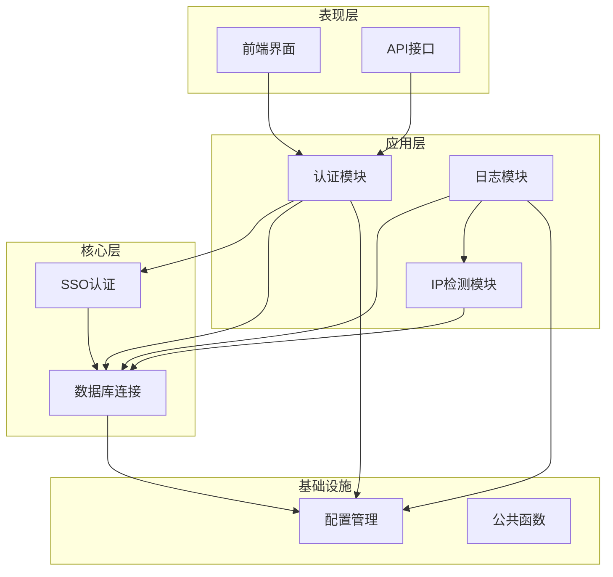
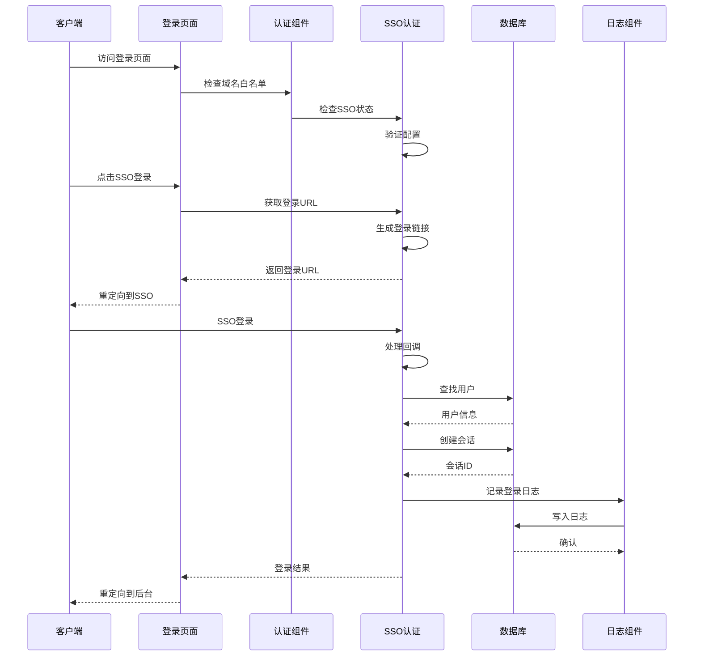
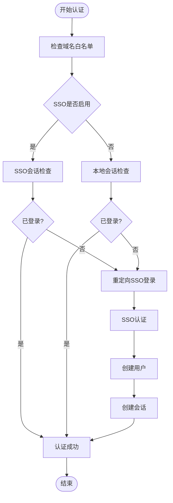
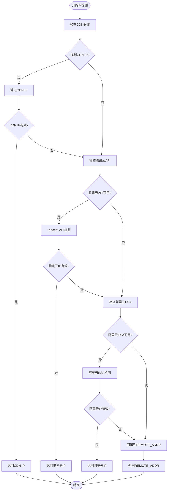
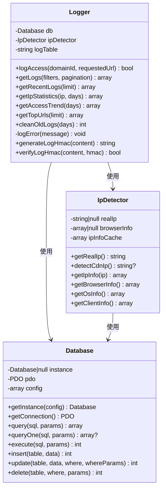
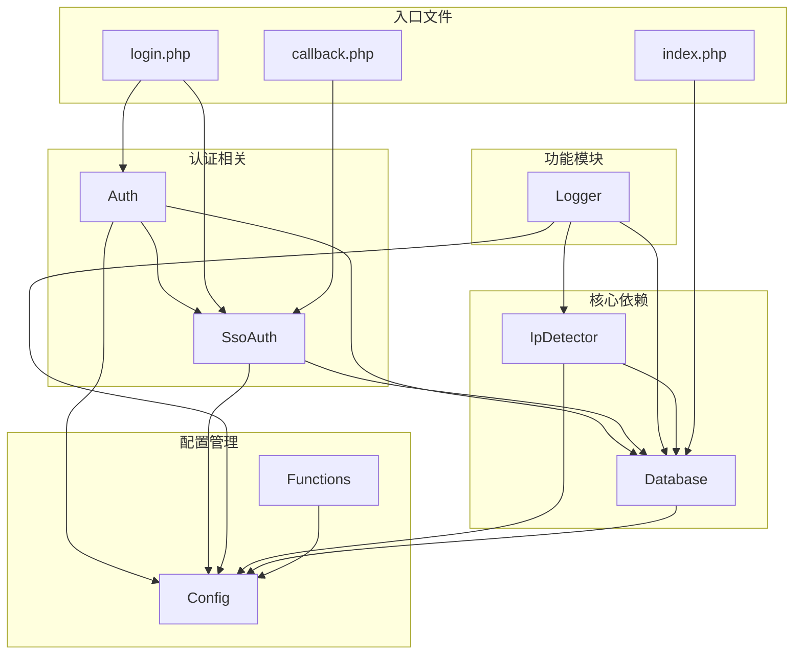

# 组件交互关系

<cite>
**本文档引用的文件**
- [Database.php](file://core/Database.php)
- [Auth.php](file://core/Auth.php)
- [SsoAuth.php](file://core/SsoAuth.php)
- [IpDetector.php](file://core/IpDetector.php)
- [Logger.php](file://core/Logger.php)
- [config.php](file://config/config.php)
- [functions.php](file://includes/functions.php)
- [login.php](file://public/admin/login.php)
- [callback.php](file://public/admin/callback.php)
- [index.php](file://public/index.php)
</cite>

## 目录
1. [简介](#简介)
2. [项目结构](#项目结构)
3. [核心组件](#核心组件)
4. [架构概览](#架构概览)
5. [详细组件分析](#详细组件分析)
6. [依赖关系分析](#依赖关系分析)
7. [性能考虑](#性能考虑)
8. [故障排除指南](#故障排除指南)
9. [结论](#结论)

## 简介

DNS拦截响应平台是一个基于PHP开发的企业级安全管理系统，主要负责DNS域名拦截响应的管理和监控。该平台采用模块化设计，通过多个核心组件协同工作，实现了完整的认证授权、IP检测、日志记录等功能。

平台的核心特性包括：
- 基于Logto的SSO单点登录集成
- 多层CDN代理IP检测机制
- 完整的访问日志记录和分析
- 域名状态管理和拦截响应
- 安全的会话管理和权限控制

## 项目结构

平台采用清晰的分层架构，主要分为以下几个层次：

**图表来源**
- [Database.php:1-400](file://core/Database.php#L1-L400)
- [Auth.php:1-272](file://core/Auth.php#L1-L272)
- [SsoAuth.php:1-505](file://core/SsoAuth.php#L1-L505)
- [IpDetector.php:1-651](file://core/IpDetector.php#L1-L651)
- [Logger.php:1-472](file://core/Logger.php#L1-L472)

**章节来源**
- [config.php:1-152](file://config/config.php#L1-L152)
- [functions.php:1-800](file://includes/functions.php#L1-L800)

## 核心组件

### 数据库连接组件 (Database)

Database组件是整个系统的基础，提供了统一的数据库连接管理和查询接口。其核心特点包括：

- **单例模式**：确保全局只有一个数据库连接实例
- **PDO封装**：提供安全的数据库操作接口
- **SQL注入防护**：使用预处理语句和参数绑定
- **配置管理**：支持多种数据库配置选项
- **事务支持**：提供完整的事务管理功能

### 认证组件 (Auth)

Auth组件负责管理管理员的认证和授权流程。它采用委托模式，将具体的认证逻辑委托给SSO认证组件：

- **SSO集成**：支持Logto单点登录
- **权限控制**：基于角色的权限管理系统
- **域名白名单**：后台访问域名安全控制
- **会话管理**：本地会话创建和验证

### SSO认证组件 (SsoAuth)

SsoAuth组件实现了完整的单点登录功能，与Logto服务集成：

- **SDK集成**：动态检测和使用Logto SDK
- **用户同步**：自动创建和同步用户信息
- **会话管理**：本地会话创建和维护
- **回调处理**：处理登录回调和错误情况

### IP检测组件 (IpDetector)

IpDetector组件提供了多层IP检测能力，能够准确识别客户端的真实IP：

- **CDN检测**：支持多种CDN提供商的IP检测
- **API回源**：腾讯云和阿里云API回源检测
- **地理信息**：IP地理位置和ISP信息查询
- **浏览器检测**：User-Agent解析和识别

### 日志组件 (Logger)

Logger组件负责记录所有访问和操作日志：

- **访问日志**：完整的访问记录和分析
- **IP检测**：集成IP检测功能
- **统计分析**：访问趋势和统计信息
- **日志清理**：自动清理过期日志

**章节来源**
- [Database.php:13-400](file://core/Database.php#L13-L400)
- [Auth.php:11-272](file://core/Auth.php#L11-L272)
- [SsoAuth.php:10-505](file://core/SsoAuth.php#L10-L505)
- [IpDetector.php:13-651](file://core/IpDetector.php#L13-L651)
- [Logger.php:14-472](file://core/Logger.php#L14-L472)

## 架构概览

平台采用模块化架构，各组件之间通过清晰的接口进行交互：

**图表来源**
- [login.php:26-58](file://public/admin/login.php#L26-L58)
- [callback.php:25-52](file://public/admin/callback.php#L25-L52)
- [Auth.php:55-94](file://core/Auth.php#L55-L94)
- [SsoAuth.php:100-167](file://core/SsoAuth.php#L100-L167)

## 详细组件分析

### 认证流程组件交互

认证流程是平台的核心，涉及多个组件的协同工作：

**图表来源**
- [Auth.php:55-94](file://core/Auth.php#L55-L94)
- [SsoAuth.php:355-396](file://core/SsoAuth.php#L355-L396)
- [SsoAuth.php:462-473](file://core/SsoAuth.php#L462-L473)

### IP检测算法流程

IP检测组件采用了多层检测策略：

**图表来源**
- [IpDetector.php:31-47](file://core/IpDetector.php#L31-L47)
- [IpDetector.php:62-121](file://core/IpDetector.php#L62-L121)
- [IpDetector.php:131-167](file://core/IpDetector.php#L131-L167)
- [IpDetector.php:177-215](file://core/IpDetector.php#L177-L215)

### 日志记录组件交互

日志记录组件集成了多个数据源的信息：

**图表来源**
- [Logger.php:14-472](file://core/Logger.php#L14-L472)
- [IpDetector.php:13-651](file://core/IpDetector.php#L13-L651)
- [Database.php:13-400](file://core/Database.php#L13-L400)

**章节来源**
- [Auth.php:17-94](file://core/Auth.php#L17-L94)
- [SsoAuth.php:19-39](file://core/SsoAuth.php#L19-L39)
- [IpDetector.php:31-448](file://core/IpDetector.php#L31-L448)
- [Logger.php:48-472](file://core/Logger.php#L48-L472)

## 依赖关系分析

平台的组件依赖关系体现了良好的解耦设计：

**图表来源**
- [Auth.php:13-48](file://core/Auth.php#L13-L48)
- [SsoAuth.php:14-39](file://core/SsoAuth.php#L14-L39)
- [Logger.php:16-36](file://core/Logger.php#L16-L36)
- [IpDetector.php:15-22](file://core/IpDetector.php#L15-L22)

### 依赖注入机制

平台采用了多种依赖注入模式：

1. **构造函数注入**：核心组件通过构造函数接收依赖
2. **工厂模式**：Database组件使用单例工厂模式
3. **配置注入**：所有组件都接收配置数组作为参数
4. **自动加载**：通过Composer和自定义自动加载器管理依赖

### 组件解耦策略

- **接口隔离**：每个组件都有明确的职责边界
- **依赖倒置**：高层模块不依赖低层模块的具体实现
- **抽象工厂**：通过抽象工厂创建具体实例
- **事件驱动**：组件间通过事件进行松散耦合

**章节来源**
- [Database.php:36-46](file://core/Database.php#L36-L46)
- [functions.php:27-41](file://includes/functions.php#L27-L41)
- [config.php:15-152](file://config/config.php#L15-L152)

## 性能考虑

平台在设计时充分考虑了性能优化：

### 数据库性能优化

- **连接池管理**：Database组件使用单例模式避免重复连接
- **预处理语句**：所有查询都使用预处理语句提高安全性
- **参数绑定**：自动检测参数类型，优化查询性能
- **事务管理**：支持事务批量操作，减少数据库往返

### 缓存策略

- **IP信息缓存**：IpDetector组件实现APCu和文件双重缓存
- **日志签名缓存**：Logger组件缓存HMAC密钥
- **配置缓存**：Config组件缓存配置信息

### 网络优化

- **CDN检测优化**：优先检查常见CDN头部，减少API调用
- **HTTPS强制**：IP查询使用HTTPS协议，提高安全性
- **超时控制**：所有网络请求都有合理的超时设置

## 故障排除指南

### 常见问题及解决方案

#### SSO认证问题

**问题**：SSO登录失败
**原因**：
- Logto SDK未安装
- 配置参数错误
- 网络连接问题

**解决方案**：
1. 检查Logto SDK是否正确安装
2. 验证配置文件中的Logto参数
3. 确认网络连接正常

#### IP检测问题

**问题**：IP检测不准确
**原因**：
- CDN配置错误
- API密钥缺失
- 网络环境复杂

**解决方案**：
1. 检查CDN相关配置
2. 验证API密钥设置
3. 简化网络环境测试

#### 日志记录问题

**问题**：日志记录失败
**原因**：
- 数据库连接问题
- 磁盘空间不足
- 权限不足

**解决方案**：
1. 检查数据库连接状态
2. 清理磁盘空间
3. 验证文件权限

**章节来源**
- [SsoAuth.php:160-167](file://core/SsoAuth.php#L160-L167)
- [IpDetector.php:577-649](file://core/IpDetector.php#L577-L649)
- [Logger.php:115-120](file://core/Logger.php#L115-L120)

## 结论

DNS拦截响应平台通过精心设计的组件交互关系，实现了高度模块化的架构。各个组件职责明确，依赖关系清晰，既保证了功能的完整性，又确保了系统的可维护性和可扩展性。

平台的主要优势包括：

1. **模块化设计**：每个组件都有明确的职责和接口
2. **安全优先**：内置多种安全机制和防护措施
3. **性能优化**：通过缓存和优化策略提升系统性能
4. **易于扩展**：清晰的架构便于功能扩展和定制

通过本文档的分析，开发者可以更好地理解组件间的协作机制，为系统的进一步开发和维护提供指导。