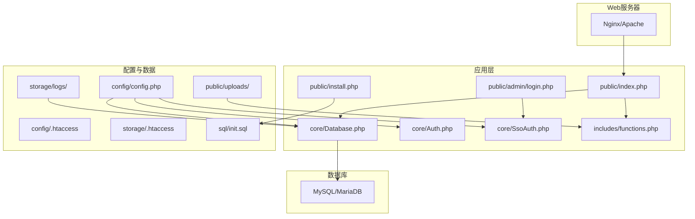
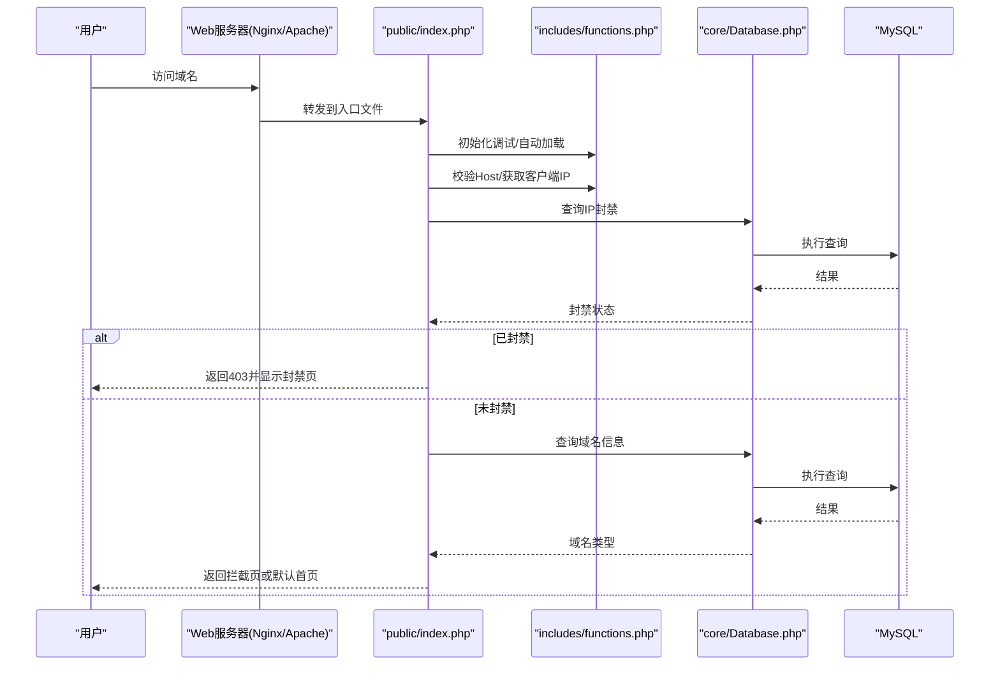
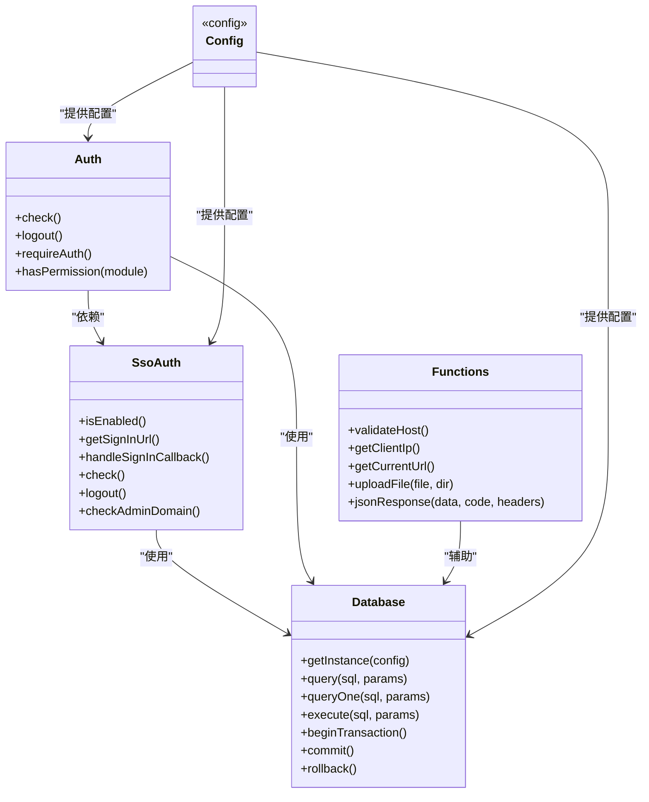

# 部署指南

<cite>
**本文引用的文件**
- [DEPLOY.md](file://DEPLOY.md)
- [README.md](file://README.md)
- [composer.json](file://composer.json)
- [config/config.php](file://config/config.php)
- [config/.htaccess](file://config/.htaccess)
- [storage/.htaccess](file://storage/.htaccess)
- [public/index.php](file://public/index.php)
- [public/install.php](file://public/install.php)
- [public/admin/login.php](file://public/admin/login.php)
- [core/Database.php](file://core/Database.php)
- [core/Auth.php](file://core/Auth.php)
- [core/SsoAuth.php](file://core/SsoAuth.php)
- [includes/functions.php](file://includes/functions.php)
- [sql/init.sql](file://sql/init.sql)
</cite>

## 目录
1. [简介](#简介)
2. [项目结构](#项目结构)
3. [核心组件](#核心组件)
4. [架构总览](#架构总览)
5. [详细组件分析](#详细组件分析)
6. [依赖关系分析](#依赖关系分析)
7. [性能考虑](#性能考虑)
8. [故障排查指南](#故障排查指南)
9. [结论](#结论)
10. [附录](#附录)

## 简介
本指南面向生产环境部署“DNS拦截响应平台”，涵盖服务器准备、环境配置、依赖安装、Web服务器伪静态与重写规则、目录权限与安全配置、CDN集成方案、SSL与HTTPS安全、性能优化、监控与维护以及常见问题排查。文档基于仓库现有配置与源码进行梳理，确保部署流程与代码实现一致。

## 项目结构
项目采用典型的PHP MVC风格，核心目录与职责如下：
- config：运行时配置文件（安装向导生成）
- core：核心类库（数据库、认证、CSRF、日志、IP检测、速率限制等）
- includes：公共函数与模板片段
- public：Web根目录，包含前台入口、后台管理、API接口、静态资源与上传目录
- sql：数据库初始化脚本
- storage：日志与安装锁等运行时数据
- vendor：Composer依赖（Logto SDK等）

图示来源
- [public/index.php:1-228](file://public/index.php#L1-L228)
- [public/admin/login.php:1-337](file://public/admin/login.php#L1-L337)
- [public/install.php:1-800](file://public/install.php#L1-L800)
- [core/Database.php:1-400](file://core/Database.php#L1-L400)
- [core/Auth.php:1-272](file://core/Auth.php#L1-L272)
- [core/SsoAuth.php:1-505](file://core/SsoAuth.php#L1-L505)
- [includes/functions.php:1-800](file://includes/functions.php#L1-L800)
- [config/config.php:1-152](file://config/config.php#L1-L152)
- [config/.htaccess:1-12](file://config/.htaccess#L1-L12)
- [storage/.htaccess:1-12](file://storage/.htaccess#L1-L12)
- [sql/init.sql:1-275](file://sql/init.sql#L1-L275)

章节来源
- [README.md:25-68](file://README.md#L25-L68)

## 核心组件
- 数据库连接与查询封装：提供单例连接、参数绑定、事务、调试日志与SQL注入防护。
- 认证与会话：支持SSO登录（Logto），后台域名白名单校验，Cookie安全属性配置。
- 安装向导：一键安装，创建目录、导入SQL、生成配置、创建安装锁。
- 公共函数库：输入清理、CSRF、文件上传、JSON响应、IP检测、URL构建等。
- 配置系统：集中管理数据库、站点、上传、会话、安全、日志、SSO等配置。

章节来源
- [core/Database.php:1-400](file://core/Database.php#L1-L400)
- [core/Auth.php:1-272](file://core/Auth.php#L1-L272)
- [core/SsoAuth.php:1-505](file://core/SsoAuth.php#L1-L505)
- [includes/functions.php:1-800](file://includes/functions.php#L1-L800)
- [config/config.php:1-152](file://config/config.php#L1-L152)

## 架构总览
系统入口为public/index.php，根据请求域名查询数据库并分发到相应拦截页面；后台登录采用SSO（Logto），支持域名白名单与会话持久化；安装向导负责初始化数据库与配置。

图示来源
- [public/index.php:1-228](file://public/index.php#L1-L228)
- [includes/functions.php:280-380](file://includes/functions.php#L280-L380)
- [core/Database.php:140-181](file://core/Database.php#L140-L181)

## 详细组件分析

### 1. 服务器与环境准备
- 操作系统：Linux（推荐Ubuntu/CentOS）
- Web服务器：Nginx或Apache
- PHP版本：≥8.0（推荐8.1+）
- 数据库：MySQL/MariaDB ≥5.7（推荐8.0+）
- 必需PHP扩展：pdo、pdo_mysql、json、curl、mbstring、openssl、fileinfo、session
- Composer：用于安装Logto SDK等依赖

章节来源
- [DEPLOY.md:18-26](file://DEPLOY.md#L18-L26)
- [README.md:72-86](file://README.md#L72-L86)
- [composer.json:7-16](file://composer.json#L7-L16)

### 2. 依赖安装与Composer配置
- 安装Composer（Linux/Mac）
- 在项目根目录执行安装命令，生产环境使用--no-dev与优化autoloader
- 依赖包：logto/sdk（SSO认证SDK）

章节来源
- [DEPLOY.md:104-134](file://DEPLOY.md#L104-L134)
- [composer.json:15-16](file://composer.json#L15-L16)

### 3. Web服务器伪静态与重写规则
- Nginx：使用try_files将请求转发到index.php
- Apache：在public/目录创建.htaccess，禁止访问敏感目录并重写到index.php

章节来源
- [DEPLOY.md:136-172](file://DEPLOY.md#L136-L172)
- [README.md:113-136](file://README.md#L113-L136)

### 4. 目录权限与安全配置
- 写权限目录：storage/、public/uploads/及其子目录
- Apache安全：config/与storage/目录禁止Web直接访问
- 目录所有权：www-data用户组（Linux）
- 重启服务：Nginx+PHP-FPM或Apache

章节来源
- [DEPLOY.md:174-195](file://DEPLOY.md#L174-L195)
- [config/.htaccess:1-12](file://config/.htaccess#L1-L12)
- [storage/.htaccess:1-12](file://storage/.htaccess#L1-L12)

### 5. 安装向导与数据库初始化
- 访问/install.php，按步骤完成数据库连接测试、导入SQL、生成配置文件、创建安装锁
- 安装锁文件不存储敏感信息，安装完成后可禁用安装脚本
- 数据库初始化脚本包含admin_users、domains、ip_bans、access_logs、appeals、chat_conversations、chat_messages、logzx、sessions等表

章节来源
- [public/install.php:1-411](file://public/install.php#L1-L411)
- [sql/init.sql:1-275](file://sql/init.sql#L1-L275)

### 6. SSO登录与后台安全
- 后台登录采用Logto SSO，支持域名白名单限制访问
- 会话持久化：数据库存储会话，Cookie安全属性（Secure、HttpOnly、SameSite）
- 登录回调与登出重定向URL需与系统配置一致

章节来源
- [core/Auth.php:1-272](file://core/Auth.php#L1-L272)
- [core/SsoAuth.php:1-505](file://core/SsoAuth.php#L1-L505)
- [public/admin/login.php:1-337](file://public/admin/login.php#L1-L337)
- [config/config.php:139-149](file://config/config.php#L139-L149)

### 7. 入口分发与拦截逻辑
- 入口文件public/index.php：安装检测、会话启动、时区设置、Host校验、IP封禁检查、域名查询、访问日志记录、页面分发
- 支持CDN真实IP检测（Cloudflare、Akamai、腾讯云等常见头）

章节来源
- [public/index.php:1-228](file://public/index.php#L1-L228)
- [includes/functions.php:414-440](file://includes/functions.php#L414-L440)

### 8. 配置文件与运行时设置
- config/config.php：数据库、站点、上传、会话、安全、日志、调试、SSO等配置
- 安全响应头：CSP、X-Frame-Options、X-Content-Type-Options、X-XSS-Protection、Referrer-Policy、Permissions-Policy
- 会话安全：30分钟生命周期（等保2.0三级要求）、Secure、HttpOnly、SameSite=Lax

章节来源
- [config/config.php:1-152](file://config/config.php#L1-L152)

### 9. CDN集成方案
- IP检测与可信代理：支持Cloudflare、腾讯云、阿里云等CDN真实IP头
- CDN服务商选择：可结合业务流量分布与成本选择（如Cloudflare、腾讯云、阿里云）
- 配置项：trusted_proxies、detection_order、cdn_headers

章节来源
- [public/install.php:469-495](file://public/install.php#L469-L495)
- [includes/functions.php:414-440](file://includes/functions.php#L414-L440)

### 10. SSL证书与HTTPS安全
- HTTPS自动检测：会话Cookie Secure属性根据HTTPS环境自动设置
- 建议：使用Let’s Encrypt免费证书或商业CA，启用TLS 1.2/1.3，禁用弱加密套件
- 安全响应头：已在配置中启用多项安全头，建议配合HSTS与OCSP Stapling

章节来源
- [config/config.php:72-80](file://config/config.php#L72-L80)
- [core/SsoAuth.php:290-299](file://core/SsoAuth.php#L290-L299)

## 依赖关系分析

图示来源
- [core/Database.php:1-400](file://core/Database.php#L1-L400)
- [core/Auth.php:1-272](file://core/Auth.php#L1-L272)
- [core/SsoAuth.php:1-505](file://core/SsoAuth.php#L1-L505)
- [includes/functions.php:1-800](file://includes/functions.php#L1-L800)
- [config/config.php:1-152](file://config/config.php#L1-L152)

章节来源
- [core/Database.php:1-400](file://core/Database.php#L1-L400)
- [core/Auth.php:1-272](file://core/Auth.php#L1-L272)
- [core/SsoAuth.php:1-505](file://core/SsoAuth.php#L1-L505)
- [includes/functions.php:1-800](file://includes/functions.php#L1-L800)
- [config/config.php:1-152](file://config/config.php#L1-L152)

## 性能考虑
- PHP-FPM：合理设置进程数、内存限制与慢日志，结合Nginx worker进程数
- 数据库：使用连接池、索引优化（access_logs、domains、ip_bans等高频表），开启查询缓存（视MySQL版本）
- 缓存策略：对热点页面与API响应进行Redis或APCu缓存（需在应用层扩展）
- 上传与静态资源：CDN加速静态资源，压缩传输（Gzip/HTTP2）
- 日志轮转：storage/logs按天滚动，定期清理历史日志

## 故障排查指南
- 安装后访问404：确认Web根目录指向public/，伪静态规则生效，Apache已启用mod_rewrite
- SSO登录失败：检查Logto应用回调URL与postLogoutUri配置，确认网络可达性
- 文件上传失败：检查public/uploads/写权限、php.ini upload_max_filesize/post_max_size、禁用函数
- 数据库连接失败：检查DB_USER/DB_PASSWORD环境变量或安装向导配置，确认主机、端口、字符集
- 访问被封禁：检查ip_bans表封禁状态与过期时间，确认CDN真实IP头是否正确传递

章节来源
- [README.md:286-308](file://README.md#L286-L308)
- [DEPLOY.md:136-195](file://DEPLOY.md#L136-L195)
- [public/install.php:50-100](file://public/install.php#L50-L100)
- [core/Database.php:104-122](file://core/Database.php#L104-L122)

## 结论
本部署指南基于仓库现有配置与源码，提供了从环境准备到生产上线的完整流程。建议在生产环境中启用HTTPS、安全响应头、SSO与后台域名白名单，并结合CDN与数据库优化提升性能与安全性。

## 附录
- 目录权限设置示例：chown -R www-data:www-data /path/to/project；chmod -R 755 storage/、public/uploads/
- 重启服务：systemctl restart php8.1-fpm；systemctl restart nginx；或systemctl restart apache2
- 安全加固：生产环境关闭调试模式，限制Composer相关禁用函数，定期更新依赖与系统补丁

章节来源
- [DEPLOY.md:174-195](file://DEPLOY.md#L174-L195)
- [config/config.php:123-133](file://config/config.php#L123-L133)