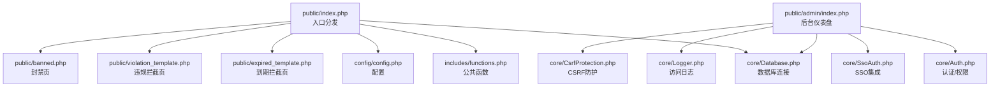
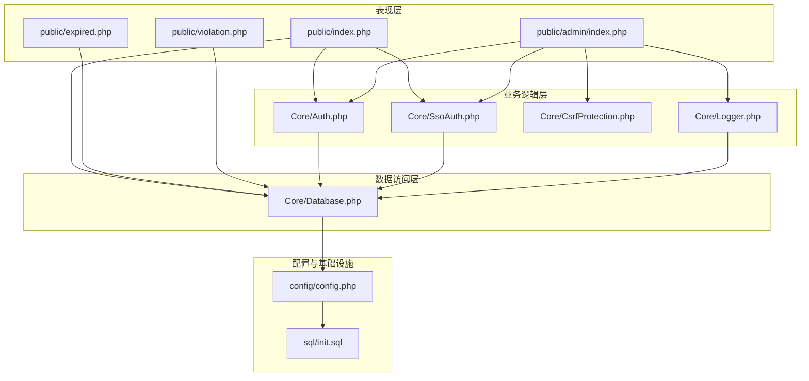
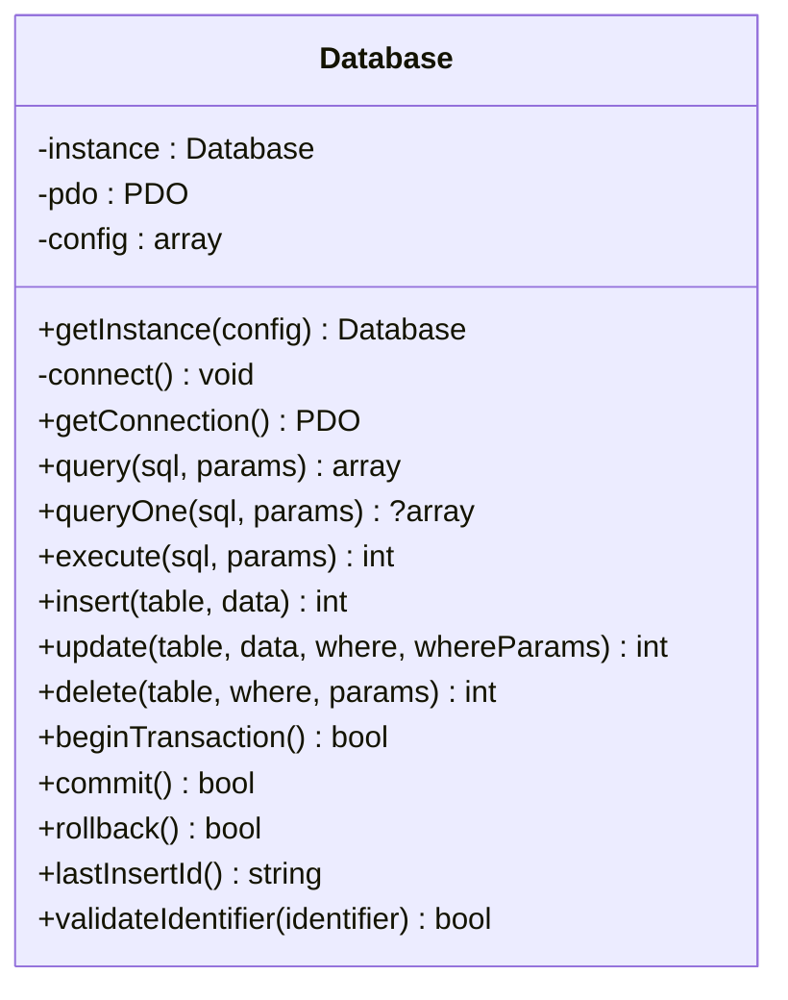
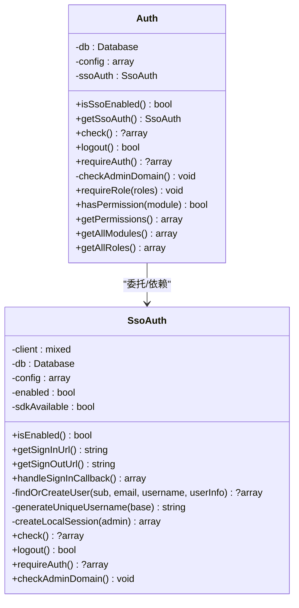
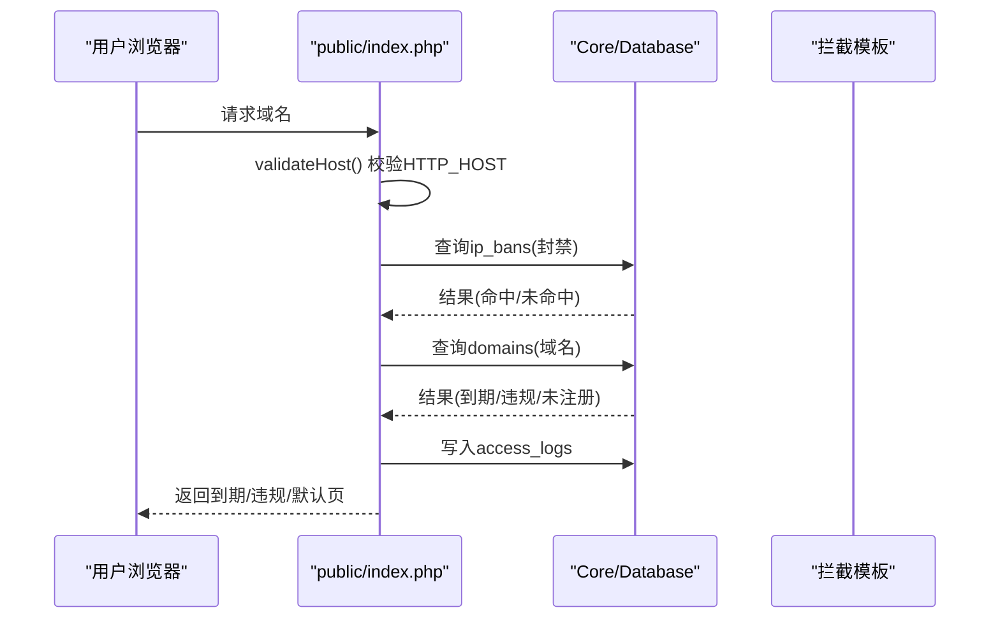
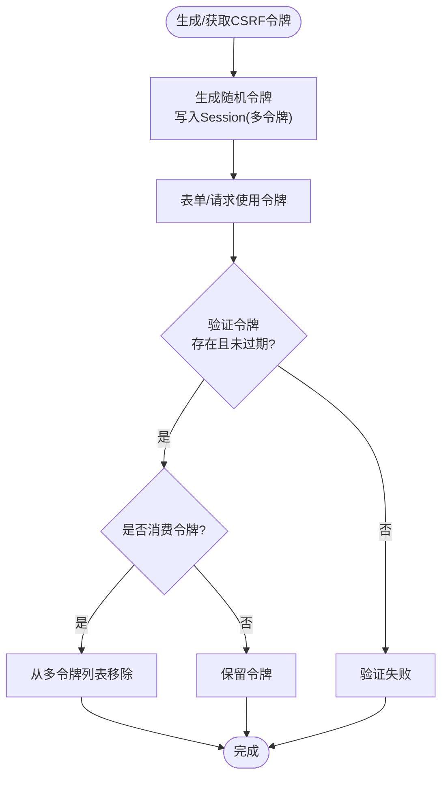
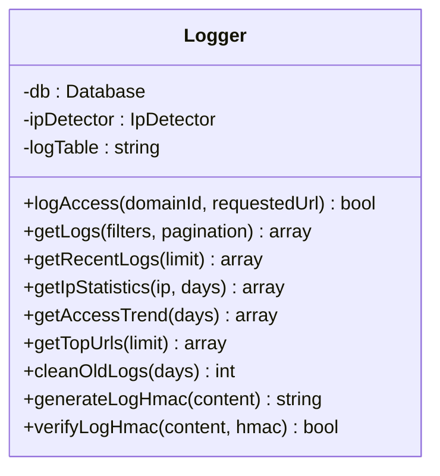
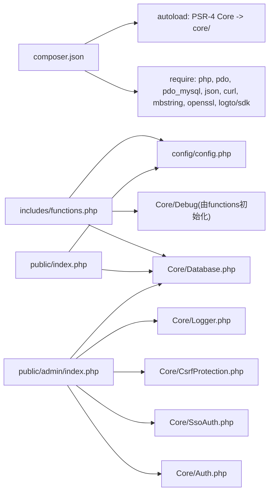

# 项目概述

<cite>
**本文引用的文件**
- [composer.json](file://composer.json)
- [DEPLOY.md](file://DEPLOY.md)
- [init.sql](file://sql/init.sql)
- [config.php](file://config/config.php)
- [index.php](file://public/index.php)
- [Database.php](file://core/Database.php)
- [Auth.php](file://core/Auth.php)
- [SsoAuth.php](file://core/SsoAuth.php)
- [functions.php](file://includes/functions.php)
- [admin/index.php](file://public/admin/index.php)
- [CsrfProtection.php](file://core/CsrfProtection.php)
- [Logger.php](file://core/Logger.php)
- [expired.php](file://public/expired.php)
- [violation.php](file://public/violation.php)
- [2026-05-25_001_fix_admin_domain_whitelist_server_name_fallback.md](file://lsjl/2026-05/2026-05-25_001_fix_admin_domain_whitelist_server_name_fallback.md)
</cite>

## 目录
1. [简介](#简介)
2. [项目结构](#项目结构)
3. [核心组件](#核心组件)
4. [架构总览](#架构总览)
5. [详细组件分析](#详细组件分析)
6. [依赖关系分析](#依赖关系分析)
7. [性能考虑](#性能考虑)
8. [故障排除指南](#故障排除指南)
9. [结论](#结论)
10. [附录](#附录)

## 简介
灯塔DNS拦截响应平台是一个面向域名拦截与违规处置的综合管理平台，核心目标是为域名过期与违规域名提供统一的拦截展示与后台治理能力。平台围绕“域名拦截响应”这一主线，提供到期域名与审查域名两类拦截页面，配套后台管理、日志审计、IP封禁、工单与申诉、SSO认证等能力，满足等保2.0三级安全标准下的访问控制、日志留存与安全防护要求。

业务价值与应用场景：
- 域名拦截：根据域名类型（到期/违规）向访问者展示相应拦截页面，引导申诉与处理流程。
- 违规处置：对违规域名进行集中拦截与状态管理，支持审核、释放与日志追踪。
- 等保2.0三级：通过严格的会话超时、安全响应头、后台域名白名单、CSRF防护、日志完整性等机制，满足合规要求。
- 后台治理：提供仪表盘、域名管理、IP封禁、聊天工单、访问日志与审计日志等管理功能。

## 项目结构
项目采用前后端分离的入口分发模式与模块化的PHP架构：
- 入口分发：public/index.php负责域名解析、IP封禁检查、访问日志记录与页面分发。
- 核心库：core目录封装数据库、认证、SSO、CSRF、日志等通用能力。
- 配置：config/config.php集中管理数据库、站点、上传、会话、安全、日志、调试与SSO等配置。
- 前端：public目录包含拦截页面、后台管理界面与静态资源。
- 数据库：sql/init.sql定义管理员、域名、IP封禁、访问日志、申诉、聊天等核心表结构。
- 部署：DEPLOY.md提供环境要求、PHP扩展、伪静态、目录权限与SSO依赖安装说明。

图表来源
- [index.php:1-228](file://public/index.php#L1-L228)
- [admin/index.php:1-374](file://public/admin/index.php#L1-L374)
- [Database.php:1-400](file://core/Database.php#L1-L400)
- [functions.php:1-998](file://includes/functions.php#L1-L998)
- [config.php:1-152](file://config/config.php#L1-L152)
- [Auth.php:1-272](file://core/Auth.php#L1-L272)
- [SsoAuth.php:1-505](file://core/SsoAuth.php#L1-L505)
- [Logger.php:1-472](file://core/Logger.php#L1-L472)
- [CsrfProtection.php:1-298](file://core/CsrfProtection.php#L1-L298)

章节来源
- [index.php:1-228](file://public/index.php#L1-L228)
- [admin/index.php:1-374](file://public/admin/index.php#L1-L374)
- [Database.php:1-400](file://core/Database.php#L1-L400)
- [functions.php:1-998](file://includes/functions.php#L1-L998)
- [config.php:1-152](file://config/config.php#L1-L152)
- [Auth.php:1-272](file://core/Auth.php#L1-L272)
- [SsoAuth.php:1-505](file://core/SsoAuth.php#L1-L505)
- [Logger.php:1-472](file://core/Logger.php#L1-L472)
- [CsrfProtection.php:1-298](file://core/CsrfProtection.php#L1-L298)

## 核心组件
- 数据库层（Core\Database）：单例PDO封装，提供查询、执行、事务与标识符校验，内置SSL/TLS连接与调试日志。
- 认证与权限（Core\Auth + Core\SsoAuth）：支持SSO登录（Logto），后台域名白名单控制，角色与模块权限矩阵，会话管理与安全审计。
- 入口分发与拦截（public/index.php + expired.php/violation.php）：域名解析与格式验证、IP封禁检测、访问日志记录、拦截页面分发。
- 安全防护（Core\CsrfProtection）：基于Session的多令牌CSRF机制，支持AJAX头部传递与令牌回收。
- 日志与审计（Core\Logger）：访问日志采集、查询、统计与清理，支持HMAC完整性保护。
- 配置中心（config/config.php）：数据库、站点、上传、会话、安全响应头、调试与SSO配置，遵循等保2.0三级要求。

章节来源
- [Database.php:1-400](file://core/Database.php#L1-L400)
- [Auth.php:1-272](file://core/Auth.php#L1-L272)
- [SsoAuth.php:1-505](file://core/SsoAuth.php#L1-L505)
- [index.php:1-228](file://public/index.php#L1-L228)
- [expired.php:1-48](file://public/expired.php#L1-L48)
- [violation.php:1-48](file://public/violation.php#L1-L48)
- [CsrfProtection.php:1-298](file://core/CsrfProtection.php#L1-L298)
- [Logger.php:1-472](file://core/Logger.php#L1-L472)
- [config.php:1-152](file://config/config.php#L1-L152)

## 架构总览
系统采用“入口分发 + 核心库 + 配置中心”的分层架构，结合模块化设计与MVC思想（控制器为入口与后台路由，模型为Core\Database与各业务实体，视图为模板与静态资源）。前端通过public目录暴露拦截页面与后台UI，后台通过admin路由访问管理功能。

图表来源
- [index.php:1-228](file://public/index.php#L1-L228)
- [expired.php:1-48](file://public/expired.php#L1-L48)
- [violation.php:1-48](file://public/violation.php#L1-L48)
- [admin/index.php:1-374](file://public/admin/index.php#L1-L374)
- [Auth.php:1-272](file://core/Auth.php#L1-L272)
- [SsoAuth.php:1-505](file://core/SsoAuth.php#L1-L505)
- [CsrfProtection.php:1-298](file://core/CsrfProtection.php#L1-L298)
- [Logger.php:1-472](file://core/Logger.php#L1-L472)
- [Database.php:1-400](file://core/Database.php#L1-L400)
- [config.php:1-152](file://config/config.php#L1-L152)
- [init.sql:1-275](file://sql/init.sql#L1-L275)

## 详细组件分析

### 数据库层（Core\Database）
- 设计要点：单例模式、PDO封装、参数绑定与标识符校验、事务支持、调试日志与SSL/TLS连接。
- 安全特性：参数绑定自动识别整数类型，防止LIMIT/OFFSET参数类型错误；标识符白名单校验防止注入；配置选项支持防SQL注入的WHERE条件规范化。
- 性能与复杂度：查询/执行/事务均为O(1)额外开销，调试日志按需开启；连接建立包含微秒级耗时记录。

图表来源
- [Database.php:1-400](file://core/Database.php#L1-L400)

章节来源
- [Database.php:1-400](file://core/Database.php#L1-L400)

### 认证与SSO（Core\Auth + Core\SsoAuth）
- 设计要点：Auth统一管理认证与权限，优先委托SsoAuth；SsoAuth集成Logto SDK，支持登录回调、会话创建、登出与域名白名单检查。
- 安全特性：后台域名白名单（admin_allowed_domains）强制生效，严格校验HTTP_HOST格式，防止Host头注入；会话UA一致性校验；Cookie安全属性配置。
- 差异化优势：SSO与本地会话双轨制，支持自动创建用户与默认角色；白名单逻辑在Nginx默认配置下仍可正确回退。

图表来源
- [Auth.php:1-272](file://core/Auth.php#L1-L272)
- [SsoAuth.php:1-505](file://core/SsoAuth.php#L1-L505)

章节来源
- [Auth.php:1-272](file://core/Auth.php#L1-L272)
- [SsoAuth.php:1-505](file://core/SsoAuth.php#L1-L505)
- [2026-05-25_001_fix_admin_domain_whitelist_server_name_fallback.md:1-73](file://lsjl/2026-05/2026-05-25_001_fix_admin_domain_whitelist_server_name_fallback.md#L1-L73)

### 入口分发与拦截（public/index.php + expired.php/violation.php）
- 设计要点：validateHost严格校验HTTP_HOST格式；检查IP封禁（含CDN真实IP检测）；记录访问日志；根据域名类型分发到期/违规拦截页。
- 安全特性：对User-Agent与Referer等字段进行长度截断；封禁命中返回403并记录日志；域名白名单在后台生效，前台页面受白名单限制。
- 处理流程：入口分发 → IP封禁检查 → 域名查询 → 访问日志 → 页面分发。

图表来源
- [index.php:1-228](file://public/index.php#L1-L228)
- [expired.php:1-48](file://public/expired.php#L1-L48)
- [violation.php:1-48](file://public/violation.php#L1-L48)
- [Database.php:1-400](file://core/Database.php#L1-L400)

章节来源
- [index.php:1-228](file://public/index.php#L1-L228)
- [expired.php:1-48](file://public/expired.php#L1-L48)
- [violation.php:1-48](file://public/violation.php#L1-L48)

### 安全防护（Core\CsrfProtection）
- 设计要点：多令牌机制（最多5个）、过期时间管理、时间安全比较、AJAX头部传递、令牌回收。
- 安全特性：禁止从GET参数获取CSRF令牌；支持consumeAfter=true防止重放；向后兼容单令牌存储。
- 使用建议：状态变更接口建议consumeAfter=true，查询类接口可保持默认。

图表来源
- [CsrfProtection.php:1-298](file://core/CsrfProtection.php#L1-L298)

章节来源
- [CsrfProtection.php:1-298](file://core/CsrfProtection.php#L1-L298)

### 日志与审计（Core\Logger）
- 设计要点：访问日志采集（IP、UA、浏览器、OS、地理位置、来源页面、请求URL等），支持关键词检索、分页、统计与清理。
- 安全特性：HMAC-SHA256日志完整性保护，密钥自动生成与持久化；日志查询白名单字段过滤。
- 运维特性：支持按天趋势、热门URL排行、IP统计等报表。

图表来源
- [Logger.php:1-472](file://core/Logger.php#L1-L472)

章节来源
- [Logger.php:1-472](file://core/Logger.php#L1-L472)

### 配置中心（config/config.php）
- 设计要点：集中管理数据库、站点、上传、会话、安全响应头、日志、调试与SSO配置。
- 等保2.0三级要求：会话有效期≤30分钟；安全响应头（CSP、X-Content-Type-Options、X-Frame-Options、X-XSS-Protection、Referrer-Policy、Permissions-Policy）。
- 部署要求：DEPLOY.md提供环境、扩展、伪静态与目录权限说明。

章节来源
- [config.php:1-152](file://config/config.php#L1-L152)
- [DEPLOY.md:1-198](file://DEPLOY.md#L1-L198)

## 依赖关系分析
- 技术栈：PHP 8.0+、PDO扩展、MySQL/MariaDB、Logto SSO SDK、Composer。
- 自动加载：PSR-4命名空间Core\映射core目录。
- 外部依赖：Logto SDK用于SSO集成；数据库连接通过PDO；日志与调试通过Core\Debug（由functions.php初始化）。

图表来源
- [composer.json:1-37](file://composer.json#L1-L37)
- [functions.php:1-998](file://includes/functions.php#L1-L998)
- [index.php:1-228](file://public/index.php#L1-L228)
- [admin/index.php:1-374](file://public/admin/index.php#L1-L374)
- [Database.php:1-400](file://core/Database.php#L1-L400)
- [Auth.php:1-272](file://core/Auth.php#L1-L272)
- [SsoAuth.php:1-505](file://core/SsoAuth.php#L1-L505)
- [CsrfProtection.php:1-298](file://core/CsrfProtection.php#L1-L298)
- [Logger.php:1-472](file://core/Logger.php#L1-L472)
- [config.php:1-152](file://config/config.php#L1-L152)

章节来源
- [composer.json:1-37](file://composer.json#L1-L37)
- [functions.php:1-998](file://includes/functions.php#L1-L998)

## 性能考虑
- 数据库连接：单例模式避免重复连接；PDO预处理语句减少SQL解析开销；调试日志按需开启。
- 日志写入：访问日志写入失败不影响主流程；HMAC签名与清理任务按需执行。
- 会话与CSRF：多令牌机制限制令牌数量，定期清理过期令牌；CSRF令牌回收降低重放风险。
- 建议：生产环境关闭调试模式；合理设置日志保留天数；对高频查询建立索引（如access_logs的ip、domain_id、created_at）。

## 故障排除指南
常见问题与定位：
- 安装锁缺失：入口分发检测storage/install.lock，未安装将重定向到安装向导。
- 会话超时：等保2.0三级要求会话有效期≤30分钟，检查config/session配置与Cookie安全属性。
- 后台无法访问：检查后台域名白名单admin_allowed_domains与当前HTTP_HOST格式验证；参考域名白名单修复记录。
- SSO登录失败：确认Logto SDK可用、endpoint/appId/appSecret配置正确；检查回调地址与postLogoutUri。
- 日志写入失败：检查storage/logs目录权限与磁盘空间；确认PDO连接与表结构正确。

章节来源
- [index.php:1-228](file://public/index.php#L1-L228)
- [config.php:68-105](file://config/config.php#L68-L105)
- [2026-05-25_001_fix_admin_domain_whitelist_server_name_fallback.md:1-73](file://lsjl/2026-05/2026-05-25_001_fix_admin_domain_whitelist_server_name_fallback.md#L1-L73)
- [SsoAuth.php:1-505](file://core/SsoAuth.php#L1-L505)
- [Logger.php:1-472](file://core/Logger.php#L1-L472)

## 结论
灯塔DNS拦截响应平台以清晰的分层架构与模块化设计，实现了域名拦截、后台治理与合规安全的统一。通过严格的会话与响应头策略、后台域名白名单、CSRF防护与日志完整性保护，平台满足等保2.0三级要求。SSO集成与完善的权限体系提升了运维效率与安全性。建议在生产环境完善监控与日志轮转策略，持续优化数据库索引与缓存，保障高并发下的稳定性与可审计性。

## 附录
- 版本与发布：项目版本信息与部署文档参见composer.json与DEPLOY.md。
- 数据库初始化：使用sql/init.sql创建管理员、域名、IP封禁、访问日志、申诉、聊天等表。
- 历史修复：域名白名单回退逻辑修复记录详见lsjl/2026-05/2026-05-25_001_fix_admin_domain_whitelist_server_name_fallback.md。

章节来源
- [composer.json:1-37](file://composer.json#L1-L37)
- [DEPLOY.md:1-198](file://DEPLOY.md#L1-L198)
- [init.sql:1-275](file://sql/init.sql#L1-L275)
- [2026-05-25_001_fix_admin_domain_whitelist_server_name_fallback.md:1-73](file://lsjl/2026-05/2026-05-25_001_fix_admin_domain_whitelist_server_name_fallback.md#L1-L73)